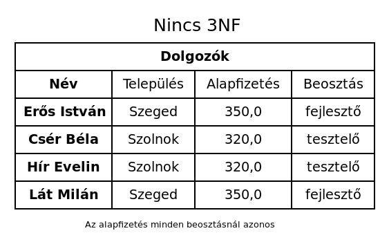
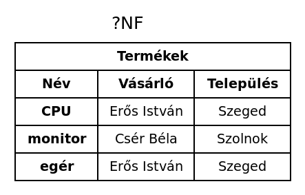

# Adatbázis-kezelés I

* **Szerző:** Sallai András
* Copyright (c) 2022, Sallai András
* Licenc: [CC Attribution-Share Alike 4.0 International](https://creativecommons.org/licenses/by-sa/4.0/)
* Web: [https://szit.hu](https://szit.hu)

## Tervezés

Az adatbázis az adatok rendszerezett gyűjteménye, amely valamilyen céllal történik.

A hagyományos adatbázisok, mint a könyvtárak hátránya:

* nagy helyigény
* a karbantartás lassú

Az adatbázisok a következő módon osztályozhatók:

* relációs
* hálós
* hierachikus
* objektumorientált
* objektumrelációs

## A relációs adatbázis

A relációs adatbázisokban valamilyen egyedekről szeretnénk információt tárolni. Egy egyedről többfélre információt tárolunk. A tárolás táblázatban történik. Minden táblázatnak van neve, vannak oszlopai és sorai. Minden oszlop rendelkezik egy névvel.

Az oszlopokat mezőknek, a sorokat rekordoknak nevezzük. Az oszlopok neveit mezőnéven használjuk.

## Kulcsok

Minden táblázatban szükség van egy olyan mezőre, ami egyértelműen azonosítja az egyedet. Legyen például dolgozókat tartalmazó tábla. Ha van két dolgozónk, és mindkettő neve Szabó János, nem tudhatjuk melyik dolgozóról van szó.

Dolgozók
| Név |
|-|
| Szabó János |
| Szabó János |

Szükség van egy olyan mezőre, ami egyértelműen azonosítja a dolgozókat. Lehet például a személyi számuk:

Dolgozók
| Név | Személyi szám |
|-|-|
| Szabó János | 120050715-2324 |
| Szabó János | 120030107-7423 |

Felmerülehet a személyi igazolvány használata. Ez azonban nem alkalmas, mivel egy ember élete során ez változik. Az egyedi azonosítók követelményei:

* nem ismétlődhet
* az egyed egész élete során változatlan kell legyen

Az is előfordulhat, hogy nemtalálunk alkalmas mezőt egyedi azonsítónak. Ilyenkor felveszünk egy újabb mezőt, ahol egyszerűen azonosítót rendelünk minden egyedhez. A dolgozók esetén például lehet a következő:

Dolgozók
| Név | Azonosító |
|-|-|
| Szabó János | 1 |
| Szabó János | 2 |

Az azonosító mezők kulcsfontosságú szerepet játszanaka a táblázatunkban, ezért kulcsmezőnek is szoktuk nevezni. Azokat a kulcsmezőket, amelyek egyedi azonosítóként használunk **elsődleges kulcsnak** nevezzük.

Tegyük fel, hogy dolgozóink projektekben vesznek részt. A **projekt** ezek szerint egy olyan egyed, amiről információt akarunk tárolni. Akkor készítünk egy Projektek nevű táblázatot.

Projektek
| Azonosító | Megnevezés | Befejezve |
|-|-|-|
| 1 | Számlázó program | igen |
| 2 | Raktár nyilvántartás | nem |
| 3 | Jármű nyilvántartás | nem |

Minden dolgozó visz egy projektet. Hogyan tároljuk ezt az információt? Vegyünk fel egy újabb mezőt, ahova beírjuk a dolgozó azonosítóját:

Projektek

| Azonosító | Megnevezés | Befejezve | Dolgozó azonosító |
|-|-|-|-|
| 1 | Számlázó program | igen | 1 |
| 2 | Raktár nyilvántartás | nem | 2 |
| 3 | Jármű nyilvántartás | nem | 1 |

A **Dolgozó azonosító** mező a táblázatban kulcsmező, mivel ez mutatja meg a másik táblázatban melyik dolgozóról van szó. Úgyis mondhatnánk, ez a mező a másik táblában elsődleges kulcs. Az ilyen mezőt idegenkulcs-mezőnek nevezzük.

Az idegenkulcs egy másik táblában elsődleges kulcs. Az elsődleges kulcs mutatja a két tábla közötti kapcsolatot.

## NULL érték

A NULL érték azt jelenti valamiről nincs ismeretünk. Nem egyenlő a 0 számmal. Ha egy hőmérséklet 0, az egy ismert érték. Ha hőmérsékelt NULL, nem tudjuk mi az érték.

Termékek

| Azonosító | Termék | Egységár (SOL) |
|-|-|-|
| 1 | paradicsom | 0,034 |
| 2 | paprika | 0 |
| 3 | káposzta | NULL |
| 4 | sárgarépa | 0,032 |

Megjegyzés: A SOL a Solana fő kriptovalutája.

## Kapcsolatok

A táblák között tehát kapcsolat van. Háromféle kapcsolat lehetséges:

* egy az egyhez
* egy a többhöz
* több a többhöz

Esetünkben egy dolgozóhoz több projekt is tartozhat, de egy projekt csak egy dolgozóhoz tartozik. Ilyenkor egy a többhöz kapcsolatról beszélünk. Az adatbázis tervezése során mindig ilyen kapcsolatokat keresünk.

Mikor lenne egy az egyhez kapcsolat? Ha egy dolgozóhoz csakis egyetlen projekt tartozhat, és egy projekthez csak egyetlen dolgozó tartozhat, akkor egy az egyhez kapcsolatról beszélnénk.

Ha két táblak között egy az egyhez kapcsolat van, akkor valúszínűleg az egyik tábla nem entitást ír le, vagyis a két tábla összevonható egyetlen táblává, mivel egyetlen táblában tárolható az infomráció.

A több a többhöz kapcsolatról akkor beszélünk, ha például minden dolgozónak több projekje is lehet, és minden projekthez több dolgozó tartozhat. Az ilyen kapcsolatokat is meg kell szüntetni. Át kell alakítani az adatbázisunkat. A több a többhöz kapcsolat általában arra utal, hogy létre kell hoznunk még egy táblát.

Ha legalább három táblánk van, előfordulhat, hogy a táblák átrendezésével megszüntethető a több a többhöz kapcsolat. Ha ez nem működik, akkor egy kapcsolótáblát kell beszúrni. Esetünkben a kapcsolótáblában írnán le, hogy melyik dolgozó, milyen projektben van benne.


Dolgozó/Projekt

| Dolgozó azonosító | Projekt azonosító |
|-|-|
| 1 | 1 |
| 1 | 3 |

Ebbe a táblába is tehetünk más mezőket is. Például tárolhatjuk mikor kezdett a dolgozó az adott projektben dolgozni:

| Azonosító | Dolgozó azonosító | Projekt azonosító | Kezdés |
|-|-|-|-|
| 1 | 1 | 1 | 2023-03-01 |
| 2 | 1 | 3 | 2023-05-24 |

További információ és példák az adatbázis-tervezésről:

* [https://szit.hu/doku.php?id=oktatas:adatbazis-kezeles:tananyag](https://szit.hu/doku.php?id=oktatas:adatbazis-kezeles:tananyag)

## Adatbázis-diagramok

### Adatmodell


### E-R diagram/modell

Az **E-R** az angol **Entity-Relationship** rövidítése, magyarul **egyed-kapcsolat**, de a diagram szóval használjuk: egyed-kapcsolat digaram.

Az E-R modellt, **dr. Peter Chan** pulikálta 1976-ban.

A következő alakzatokat használjuk:

* téglalap - egyedekhez
* ellipszis - tulajdonságokhoz
* rombusz - kapcsolatokhoz
* vonalak - összekötéshez


Az egyed és a gyenge egyed közötti különbség:

* egyed - van olyan tulajdonság, amely egyértelműen meghatároz egy egyedet
* gyenge egyed - a tulajdonságai nem határozzák meg egyértelműen az egyedet

#### Dolgozók és projektek E-R diagrammal


### Relációs sémák

```txt
Dolgozók(Név, Település, Fizetés)
Projektek(Név, Kezdés)
```

## Anomáliák

### Bővítési anomália

Tegyük fel, hogy egy Dolgozók táblában összetett kulcsunk van, a név és a nyelvtudás:


Ha fel kell venni egy új dolgozót és nem tudjuk, hogy milyen nyelvet tud, vagy nincs is idegennyelv tudása, ez problémát okozhat, mivel a kulcs egyik része hiányzik. Ez egy bővíétési anomália.

### Törlési anomália

Törléskor a nem hozzátartozó információk is elvesznek.

Vegyük a következő dolgozók táblát:


Ha szeretnénk törölni egy dolgozót, de a telefonszámot szeretnénk megőrízni, akkor törlési anomáliáról beszélünk.

### Módosítási anomália

A projektek táblában, ha változik a név, több helyen át kell írni. A település is ugyanilyen, ha változik, akkor több helyen is át kell írni.


## Normalizálás

A normalizálás az adatbázis rendundanciáinak megszüntetését jelenti átalakíátssal.

### Normál formák

* 1NF
* 2NF
* 3NF

### Funkcionális függőség

A tábla egy mezőjének értéke meghatározza egy másik mező értékét.

Vegyünk egy táblát, amelyben dolgozók adatait tároljuk:


A Település mező függ a Név mezőtől, mivel ha a név mezőt változtatjuk, a település is valószínűleg változik. Egy dolgozónak egy lakcíme lehet. Ezt a függőséget így írhatjuk fel:

```txt
Név -> Település
```

Így olvassuk: A Név meghatározza a Települést.

A táblázatban a névtől függ a fizetés is, amit így írhatunk fel:

```txt
Név -> Fizetés
```

Összesítve:

```txt
Név -> Település, Fizetés
```

A fizetés és a település között nincs függés, ezt így írhatjuk fel:

```txt
Fizetés <-/-> Település
```

A kölcsönös függőséget így ábrázoljuk:

```text
<->
```

például:

```text
Teljesnév <-> Becenév
Felhasználónév <-> E-mail_cím
FelhasználóId <-> Teljesnév
```

A függőség általában egyirányú. Ha Települést meghatározza a Név, de fordítva nem igaz, Település nem határozza meg a nevet, ezt így írhatjuk fel:

```txt
Település -/-> Név
```

#### Összetett függőség

A település két vagy több tulajdonságtól is függhet:


```txt
Név + Anyja neve -> Település
```

```txt
Név + Anyja neve -> Település, Fizetés
```

#### A függőségek osztályozása

Erős függőség:

Minden baloldali értékhez kell, hogy tartozzon jobboldalon is érték.

Gyenge függőség:

A baloldali értékhez nem kötelező, hogy tartozzon jobboldali érték.

Vegyük a következő függőséget:

```txt
Név -> Település
```

Ha a Települést nem kötelező megadni, akkor gyenge függőségről beszélünk. Ha kötelező megadni, akkor erős függőségről.

Teljes függés:

Ha a függő a teljes összetett meghatározótól függ, akkor teljes függésről beszélünk. Vagyis, ha az egyik meghatározót megszüntetem, akkor a függés már nem áll fenn.

Részleges függés:

Ha az összetett meghatározó egyik részét elhagyom, és a függés továbbra is fennáll, akkor részleges függésről beszélünk.

### Kezdeti adatbázis

A 0NF az az állapot, amikor még nincs normalizálva a séma. Itt valójában még nem beszélünk rendundancia megszüntetésről vagy normálizálásról.


A Telefon mezőben nem atomi értékek is szereplenek.

### 1NF

Megoldás:


Ha egy relációs séma attribútum-értékei atomiak, akkor 1NF-ben van.

### 2NF

Egy egyed 2NF formában van, ha minden nem-kulcs tulajdonsága teljes függőséggel függ az azonsítójától.

Tegyük fel, hogy szeretnénk tárolni melyik dolgozó melyik projektben vesz részt, és mikor kezdődött a projekt. Elsőre a következő táblát hozzuk össze:


Írjuk fel a függőségeket:

```txt
Név -> Település, Fizetés
Projekt név -> Projekt kezdés
```

A "Projekt kezdés" mező függ a "Projekt név" mezőtől, ami nem a tábla fő kulcsmezője, így **részleges függésről** beszélünk.

Megoldás:


### Tranzitív függőség

Ha egy C nem-kulcs tulajdonság függ A kulcstól, de a B kulcstól is, ami szintén az azonosítótól függ, akkor tranzitív függésről beszélünk.

```txt
Azonosító -> A, B
A -> C
B -> C
```

### 3NF

Ha a nem-kulcs tulajdonságok függnek a teljes azonosítótól, de csakis attól függnek, akkor az egyed 3NF formában van.

Vegyük a következő Dolgozók táblát:



A Név meghatározza a Települést és az Alapfizetést. De a Beosztás önmagában is meghatározza az alapfizetést.

```txt
Név -> Alapfizetés, Beosztás
Beosztás -> Alapfizetés
```

Ez traniztív függőség.

Megoldás:


### Logikai tervezés gyakorlat

#### Logikai tervezés gyakorlat 1

Adott a következő táblázat:


A Település mező a dolgozó lakhelyét jelöli.

Oldjuk meg a következő feladatokat:

* Állaptísuk meg, hogy 1NF-ben van-e.
* Állaptísuk meg, hogy 2NF-ben van-e.
* Állaptísuk meg, hogy 3NF-ben van-e.
* Ha szükséges oldjuk meg a problémát.

#### Logikai tervezés gyakorlat 2

Adott a következő táblázat:



A Település mező a vásárló lakhelyét jelöli.

Oldjuk meg a következő feladatokat:

* Állaptísuk meg, hogy 1NF-ben van-e.
* Állaptísuk meg, hogy 2NF-ben van-e.
* Állaptísuk meg, hogy 3NF-ben van-e.
* Ha szükséges oldjuk meg a problémát.

#### Logikai tervezés gyakorlat 3

Adott a következő táblázat:


A Település mező a vásárló lakhelyét jelöli.

Oldjuk meg a következő feladatokat:

* Állaptísuk meg, hogy 1NF-ben van-e.
* Állaptísuk meg, hogy 2NF-ben van-e.
* Állaptísuk meg, hogy 3NF-ben van-e.
* Ha szükséges oldjuk meg a problémát.

## Fizikai tervezés

Dolgozók és projektek.


Azonostó hozzáadása:


### Típusok

* egész
* valós
* szöveg
* dátum
* logikai

### Mariadb típusok

| Típus | Leírás |
|-|-|
| int | egész |
| double | valós |
| varchar | variálható méretű karakterlánc |
| char | karakterlánc |
| date | dátum |
| boolean | logikai érték |


## Gyakorlás

1.) Mit jelent a NULL?

* Például 0 darab van valamiből.
* Nincs adat, nem ismerjük az értéket.
* A táblának nincs kapcsolata másik táblával.
* A végtelen értéket jelezzük így.

2.) Mi az összetett kulcs?

* A kulcs több rekordból tevődik össze.
* Az idegenkulcs szinonímája.
* Két vagy több mezőt használunk kulcsnak.
* Olyan mező, amely számított értéket tartalmaz.

3.) Mi a rekord?

* Egy függőleges oszlop.
* Egy mező, ami egyértelműen azonosít egy egyedet.
* Egy egyed összes tulajdonsága.
* A tábla szinonimája.

4.) Mi a mező?

* A táblázat egy sora.
* A táblázat nevét, mezőnek is nevezzük.
* A táblázat egy oszlopa.
* Az adatbázis-kezelésben nem használunk ilyen szót.

5.) Minek kell szerepelnie egy relációs adatbázis táblájában?

* objektumok, osztályok, változók, felsorolások
* táblanév, mezők, rekordok, kulcsok, kapcsolatok
* számított mezők, JSON formában adatok
* számított mezők, XML formában adatok

6.) Mi az egyed?

* Valami, amiről információt akarunk tárolni.
* A táblázat egy oszlopa.
* Egy adatbázis egy állománya.
* Az adatbázis-kezelő rendszer portja.

7.) Mi az idegenkulcs?

* A tábla egy sora.
* Az adatbázis rendszer egy állománya.
* Egy másik táblában elsődleges kulcs.
* Csak hálózati-adatmodellekben használjuk.

8.) Milyen kapcsolatok lehetnek egy relációs adatbázisban?

* egy a többhöz
* laza kapcsolatok
* erős kapcsolatok
* költséges kapcsolatok

9.) Milyen kapcsolatra kell törekedni egy relációs adatbázis tervezése során?

* több a többhöz
* erős kötésű kapcsolatokra
* stabil kötésű kapcsolatokra
* egy a többhöz

10.) Mit értünk az adatbázis-kezelésben attribútum alatt?

* A táblázat neve.
* Az egyed egy tulajdonsága.
* A táblázatok közötti kapcsolat módja.
* Az adatbázis egy állománya.

11.) Mit értünk az adatbázis-kezelésben normalizálás alatt?

* A rendundancia megszüntetése.
* Egy mező nevének meghatározása.
* Lekérdezések tervezése.
* Lekérdezések végrehajtása.

12.) Mikor van első normálformán egy adatbázis?

* Ha minden táblája csak atomi értékeket tartalmaz.
* Ha csak egyetlen táblázatot tartalmaz.
* Ha csak egyeteln rekordot tartalmaz egy táblázat.
* Ha csak egy az egyhez kapcsolatokat tartalmaz.

13.) Melyik típust nem tudjuk beállítani a MariaDB adatbázis-kezelőben?

* double
* varchar
* char
* class

14.) Mire használjuk az ER diagramot?

* Számított mezők ábrázolása diagramon.
* Adatbázis táblák tervezése.
* NULL érték meghatározása.
* Bármilyen érték ábrázolása egy táblázatból.

15.) Adott a Termékek tábla: termekek(id, name, article_number, price). Ha az article_number mezőtől függ a price, akkor azt hogyan ábrozolom?

* article_number -/-> price
* article_number <-> price
* article_number <- price
* article_number -> price
