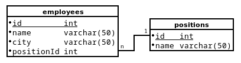

# Adatbázis-kezelés I - Létrehozás

* **Szerző:** Sallai András
* Copyright (c) 2022, Sallai András
* Licenc: [CC Attribution-Share Alike 4.0 International](https://creativecommons.org/licenses/by-sa/4.0/)
* Web: [https://szit.hu](https://szit.hu)

## A MariaDB

Az alkalmazások többsége manapság webes alkalmazásként készül. Webes alkalmazások legelterjedtebb adatbázis-kezelő rendszere a MariaDB, ami egy MySQL elágazásból jött létre.

A webfejlesztők egyik gyakran használt fejelsztői szervermegoldása az XAMPP. Az XAMPP már 5.5.30 és 5.6.14 verziók óta MariaDB-t csomagolnak a MySQL helyett.

A kész termékek általában linuxos rendszeren futnak, ahol általában szintén MariaDB található.

A MariaDB azonban teljesen kompatibilis a MySQL adatbázis-kezelő rendszerrel, így általában nem is vesszük észre a különbséget.

## PhpMyAdmin

A MariaDB és MySQL adatbázis-szervereket leggyakrabban a PhpMyAdmin webes felületen keresztül kezeljük. Ha telepítjük az XAMPP fejlesztői szervert, akkor indítsuk el az Apache webszervert és a MySQL adatbázis-kezelőt feliratú szervereket. Ezek után a PhpMyAdmin felület eléréshez a böngészőbe írjuk be:

```url
http://localhost/phpmyadmin/
```

A PhpMyAdmin felületen az adatábzisok néhány kattintásal létrehozhatók, vagy használhatunk SQL parancsokat is. Az SQL parancsok használata alkalmasabb, mivel ezek menthetők egy .sql kiterjesztésű fájlba, így a használt utasítások dokumentálhatók, újrafelhasználhatók.

## MariaDB kliens

A kompatibilitás miatt a MariaDB kliens neve mysql. A mysql egy kis parancssoros program, amit a PhpMyAdmin helyett használhatunk. Az XAMPP mysql/bin könyvtárában találjuk. Ha ez a könyvtár útvonalban van, akkor bárhol futtatható. Ellenőrzésképpen kéredezzük le a verzióját:

```cmd
mysql --version
```

A továbbiakban dolgozhatunk a PhpMyAdmin felületen vagy a MariaDB kliensben.

## Adatbázis létrehozása

A következhő parancsok működnek a PhpMyAdmin felületen és a MariaDB kliensben is.

```sql
create database dbnev;
```

Ha szeretnénk beállítani az adatbázis alapértelmezett karakterkódolását, és rendezési nyelvét, akkor használjuk a következő parancsot:

```sql
create database dbnev
default character set utf8
default collate utf8_hungarian_ci;
```

Ha az adatábzis már létezik, és nem szeretnénk hibazüzenetet kapni, akkor egy "if not exists" beszúrásával megmondhatjuk, hogy csak akkor szeretnénk az utasítást végrehajtani, ha az adatbázis még nem létezik.

```sql
create database if not exists dbnev;
```

A PhpMyAdmin felületen a ; pontosvesszőnek akkor van jelentősége, ha egyszerre több parancsot is megadunk. A MariaDB kliensben viszont mindig használnunk kell, mert ez jelzi a parancs végét, mert a parancs több sorban is bevihető.

Gyakorlásként hozzunk létre egy tudas nevű adatbázist:

```sql
create database tudas;
```

Most ellenőrizzük a létező adatbázisok között:

```sql
show databases;
```

## Adatbázis felhasználó létrehozása

Az XAMPP MariaDB  adatbázisát alapértelmezetten a root felhasználóval használjuk. Éles környezetben, azonban mindig egyedi felhasználóval dolgozunk.

A grant parancsot eredetileg arra találták ki, hogy jogokat biztosíthassunk egy felhasználónak. Ha a grant parnacsnak van "identified by" záradéka, és a felhasználó még nem létezik, akkor az automatikusan létrejön.

```sql
grant all privileges
on dbnev.*
to valaki@localhost
identified by 'titok';
```

Ellenőrzésképpen nézzük meg az adatbázis felhasználókat:

```sql
select User from mysql.user;
```

Megjegyzés: Ez az információ a mysql táblában van. Ha olyan felhasználóval léptünk be, aki nem fér hozzá a mysql táblához, akkor nem tudjuk megjelenítetni.

## Tábla létrehozása

Tábla létrehozása egyetlen mezővel:

```sql
create table dolgozok(
    name varchar(50)
)
```

Ellenőrzés:

```sql
describe dolgozok;
```

Vagy csak röviden:

```sql
desc dolgozok;
```

A táblák esetén is megmondhatjuk, hogy csak akkor hozza létre, ha az még nem létezik:

```sql
create table if not exists dolgozok(    
    name varchar(50)
)
```

Tábla létrehozása elsődleges kulccsal:

```sql
create table dolgozok(
    id int not null primary key auto_increment,
    name varchar(50)
)
```

## Tábla átnevezése

Először tájékozódjunk milyen tábláink vannak, és azoknak milyen a felépítésük.

Milyen táblák vannak:

```sql
show tables;
```

A dolgozok tábla lekérdezése;

```sql
desc dolgozok;
```

Táblázat átnevezése:

```sql
rename table dolgozok to employees;
```

Ellenőrzés:

```sql
show tables;
```

## Mező hozzáadása

```sql
alter table employees add id int first;
alter table employees add city varchar(50);
alter table employees add salary double;
desc employees;
```

## Mező törlése

Adjunk a táblához egy valami nevű oszlopot:

```sql
alter table employees add valami double;
```

Töröljük a valami nevű mezőt a táblából:

```sql
alter table employees drop valami;
```

## Mező módosítás

```sql
alter table employees modify cim varchar(50);
```

Ha már van elsődleges kulcs, de nincs beállítva az automatikus növekedés, állítsuk be:

```sqlj
alter table employees modify id int auto_increment;
```

Ettől a beállítástól megmarad a not null és primary key beállítás.

## Elsődleges kulcs módosítása

Ha szeretnénk törölni az elsődleges kulcsot, előbb törölni kell az auto_increment beállítást. Vegyük a következő utasítást:

```sql
alter table employees modify id int;
```

Az auto_increment beállítást törli, de megmarad a "not null", és a "primary key";

Elsődleges kulcs törlése:

```sql
alter table employees drop primary key;
```

Ha most újra kiadjuk az alter módosító utasát, ahol csak "id int" van beállítva, akkor "not null" bejegyzés is törlődik.

A kulcs beállítása utólag:

```sql
alter table employee
add primary key(id);
```

## Mező átnevezése

A "cim" nevű mezőt "address" névre módosítjuk:

```sql
alter table employees change cim address varchar(50);
```

Ilyenkor meg kell adni a célnévhez típust is.

## Hivatkozási integritás

Hivatkozási integritást az idegenkulccsal állítunk. A következő lehetőségek vannak:

* új rekord csak akkor vehető fel, ha a kapcsolt táblában létezik az azonosító
* az elsődleges kulcs nem módosítható, ha hivatkoznak rá kapcsolt táblában
* nem törölhetünk olyan rekordot, aminek az elsődleges kulcsa kapcsolt táblában hivatkozva van

Lassunk két táblát:

* employees(id, name, city, positionId)
* positions(id, name)



Ilyen esetben, először mindig azt a táblát hozzuk létre, amiben nincs idegenkulcs:

```sql
create table positions(
    id int not null primary key auto_increment,
    name varchar(50)
);
```

Majd jöhet az a tábla amiben idegenkulcs van.

```sql
create table employees(
    id int not null primary key auto_increment,
    name varchar(50),
    city varchar(50),
    positionId int,

    foreign key(positionId)
    references positions(id)
);
```

Próbáljunk meg felvenni egy úgy dolgozót, ahol a postionId is be van állítva 1-re, de a position táblában még nem szerepel ilyen beosztás:

```sql
insert into employees
set
name="Erős István",
city="Szeged",
positionId=1
;
```

Hibát kapunk, mivel egy olyan pozíciót adunk meg, ami nincs a positions táblában. Ehhez hasonló hibaüzenet kapunk:

```sql
ERROR 1452 (23000): Cannot add or update a child row:
 a foreign key constraint fails (`test`.`employees`,
 CONSTRAINT `employees_ibfk_1` FOREIGN KEY 
 (`positionId`) REFERENCES `positions` (`id`))
```

Ha nem adjuk meg a positionId értékét, akkor
a dolgozó felvehető:

```sql
insert into employees
set
name="Erős István",
city="Szeged"
;
```

Kérdezzük le a dolgozókat:

```sql
select * from employees;
```

A kimenet ehhez hasonló lesz:

```txt
MariaDB [test]> select * from employees;
+----+---------------+--------+------------+
| id | name          | city   | positionId |
+----+---------------+--------+------------+
|  2 | Erős István   | Szeged |       NULL |
+----+---------------+--------+------------+
1 row in set (0,001 sec)
```

Ha szeretnénk, megtudni, hogy be van-e állítva idegen kulcs a táblában, kérdezzük le, a táblalétrehozó utasítást:

```sql
show create table employees;
```

Az idegenkulcsok kapnak egy alapértelmezett nevet. Az előbb utasítás kimenetében például ilyesmit látunk:

```txt
CONSTRAINT `employees_ibfk_1` FOREIGN KEY ...
```

Az "employees_ibfk_1" az idegenkulcs neve. Az idegenkulcs létrehozásakor magunk is megadhatunk tetszőleges nevet.

Most nézzük utlólag hogyan adhatunk meg idegenkulcsot:

```sql
alter table employees
add
foreign key(positionId)
references positions(id);
```

## Kapcsolt frissítés

A kapcsolt frissítést idegen szóval kaszkádolt frissítésnek hívjuk. A kapcsolt frissíté azt jeleni, hogy egyszerre változtatjuk a mindkét táblában az értéket. Ezt a következő kiegészítssel állíthatjuk be:

```sql
on delete cascade on update cascade
```

A beállításra egy példa:

```sql
alter table employees
add
foreign key(positionId)
references positions(id)
on delete cascade on update cascade
;
```

Ha nem létezik a 1-es számú pozíció, továbbra sem vehető fel, de ha változtatjuk az egyszerre változik mindkét táblában. A változtatást csak az elsődleges kulcson tudjuk megtenni, vagyis a positions tábla id mezőjét kell változtatni.

## Lásd még

* [https://szit.hu/doku.php?id=oktatas:adatbazis-kezeles:mariadb:sql:ddl](https://szit.hu/doku.php?id=oktatas:adatbazis-kezeles:mariadb:sql:ddl)

* [https://mariadb.com/kb/en/foreign-keys/](https://mariadb.com/kb/en/foreign-keys/)
