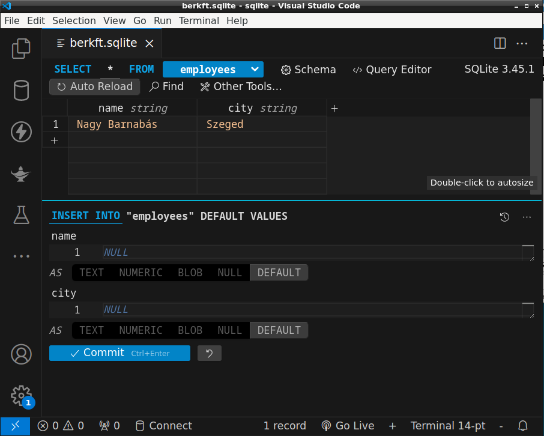

# Adatbázis-kezelés I - Java SQLite

* **Szerző:** Sallai András
* Copyright (c) 2024, Sallai András
* Licenc: [CC Attribution-Share Alike 4.0 International](https://creativecommons.org/licenses/by-sa/4.0/)
* Web: [https://szit.hu](https://szit.hu)

## SQLite

SQLite adatbázis használatához jól jöhet a sqlite.shell telepítése:

```cmd
choco install sqlite.shell
```

A program indítása:

```cmd
sqlite
```

De megadható neki fájl név is. Például:

```cmd
sqlite database.db
```

Táblák lekérdezése és egy egszerű tábla létrehozása:

```cmd
.tables
create table szemelyek(az int, nev varchar(50));
.tables
```

### VSCode bővítmény

Megkönnyíti az SQLite adatbázisok kezelését VSCode-ban a következő bővítmény:

* SQLite3 Editor

A bővítmény feltöltője: "yy0931"



## Kapcsolódás

```csharp


import java.sql.Connection;
import java.sql.DriverManager;

import org.sqlite.SQLiteException;

public class App {
    public static void main(String[] args) throws Exception {
        String url = "jdbc:sqlite:database.sqlite";
        try {
            Connection conn = DriverManager.getConnection(url);
            System.out.println("Ok");
        } catch (SQLiteException e) {
            System.err.println("Hiba! A fájl nem nyitható meg!");
            System.err.println(e.getMessage());
        }
    }
}
```

A program létrehozza a database.sqlite fájlt.

## Tábla létrehozása

```sqlite
create table employees(
    id integer not null primary key autoincrement,
    name text,
    city text,
    salary real
);
```

## Adat beszúrása

```sqlite

import java.sql.Connection;
import java.sql.DriverManager;
import java.sql.PreparedStatement;

import org.sqlite.SQLiteException;

public class App {
    public static void main(String[] args) throws Exception {
        String url = "jdbc:sqlite:database.sqlite";
        try {
            Connection conn = DriverManager.getConnection(url);
            System.out.println("Ok");
            String sql = """
                    insert into employees
                    (name, city, salary)
                    values
                    (?, ?, ?)
                    """;
            PreparedStatement ps = conn.prepareStatement(sql);
            ps.setString(1, "Beri Aladár");
            ps.setString(2, "Székesfehérvár");
            ps.setDouble(3, 394);
            ps.execute();

        } catch (SQLiteException e) {
            System.err.println("Hiba! A fájl nem nyitható meg!");
            System.err.println(e.getMessage());
        }
    }
}
```

## Adatok lekérése

```csharp
import java.sql.Connection;
import java.sql.DriverManager;
import java.sql.ResultSet;
import java.sql.Statement;

import org.sqlite.SQLiteException;

public class App {
    public static void main(String[] args) throws Exception {
        String url = "jdbc:sqlite:database.sqlite";
        try {
            Connection conn = DriverManager.getConnection(url);
            System.out.println("Ok");
            String sql = """
                    select * from employees
                    """;
            Statement ps = conn.createStatement();            
            ResultSet rs = ps.executeQuery(sql);
            while(rs.next()) {
                System.err.printf(
                    "%15s %15s %.2f\n",
                    rs.getString("name"),
                    rs.getString("city"),
                    rs.getDouble("salary")
                );                
            }
        } catch (SQLiteException e) {
            System.err.println("Hiba! A fájl nem nyitható meg!");
            System.err.println(e.getMessage());
        }
    }
}
```

## Linkek

* [https://github.com/xerial/sqlite-jdbc](https://github.com/xerial/sqlite-jdbc)
