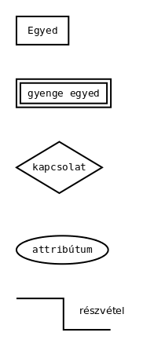
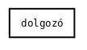
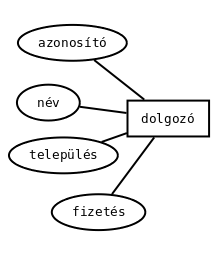
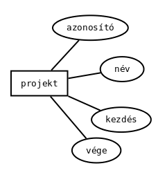
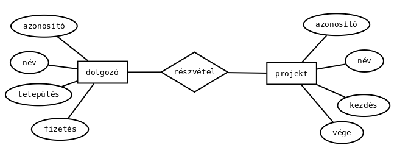

# Adatbázis-kezelés II - Adatbázis tervezés

* **Szerző:** Sallai András
* Copyright (c) Sallai András, 2022
* Licenc: [CC Attribution-Share Alike 4.0 International](https://creativecommons.org/licenses/by-sa/4.0/)
* Web: [https://szit.hu](https://szit.hu)

## Előzmények

Legyen egy Tend Kft. nevű cég, aminek a dolgozóit, és a hozzájuk tartozó projekteket szeretnénk tárolni.

A dolgozónak következő adatait szeretnénk tárolni:

* név
* település
* fizetés

A projekt adatai, amit tárolni szeretnénk:

* név
* kezdés
* vége

### Fogalmak

#### Egyed

Olyan valami, amiről információt akarunk tárolni. A dolgozó például esetünkben egyed, mivel szeretnénk tárolni a nevét, települését és fizetését.

## ER-modell

Az E-R modellben az E-R rész az Entity-Relationship szavakból lett rövidítve, magyarul egyed-kapcsolat diagram vagy modell. 

Az E-R modellben a következő alakzatokat használjuk:

* téglalap - egyedekhez
* ellipszis - tulajdonságokhoz
* rombusz - kapcsolatokhoz
* vonalak

A következő ábra bemutatja ezeket az ábrákat.

A téglalapból kétféle van, egyvonalas és kétvonalas. A kétvonalas téglalapot olyan egyedeknél használjuk, amelyeknek nincs olyan tulajdonsága, ami egyedi lenne.

A téglalapban írjuk az egyed nevét. Esetünkben ez a dolgozó.

Az előző fejezetben szereplő Tend Kft. nevű cég dolgozóiról tárolandó tulajdonságokat ábrázoljuk E-R diagrammal:

A projekt egyed ábrázolása tulajdonságokkal:

Kössük össze a kettőt. Tegyük fel a kérdést: mi a kapcsolat a kettő között?

