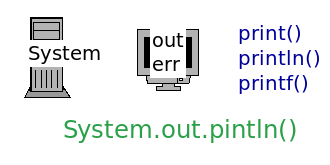
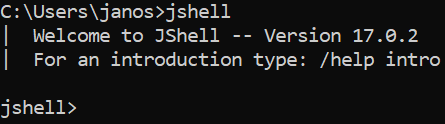
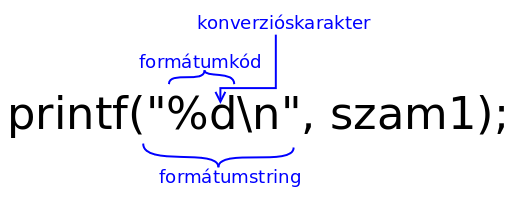
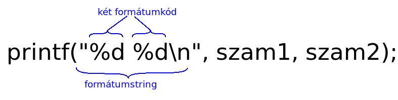
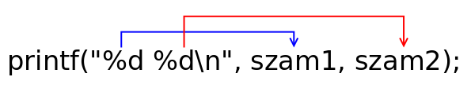

# Asztali alkalmazások fejlesztése - Bevezetés a Java nyelvbe

* **Szerző:** Sallai András
* Copyright (c) 2022, Sallai András
* Szerkesztve: 2024
* Licenc: [CC Attribution-Share Alike 4.0 International](https://creativecommons.org/licenses/by-sa/4.0/)
* Web: [https://szit.hu](https://szit.hu)

## Tartalomjegyzék

* [Tartalomjegyzék](#tartalomjegyzék)
* [Megjegyzések](#megjegyzések)
* [Kivitel](#kivitel)
* [Operátorok és kifejezések](#operátorok-és-kifejezések)
* [Különleges karakterek](#különleges-karakterek)
* [Típusok és változók](#típusok-és-változók)
* [Változók](#változók)
* [Állandók](#állandók)
* [Típuskonverzió](#típuskonverzió)
* [Formázott kivitel](#formázott-kivitel)
* [Gyakorlatok](#gyakorlatok)

## Megjegyzések

A forráskódban megjegyzéseket írhatunk, amiket a fordító nem vesz figyelembe. A Java nyelvben megjegyzések lehetnek egy vagy több sorosak.

Egysoros megjegyzéseket két darab perjel segítségével állíthatunk be:

```java
// egysoros megjegyzés
```

Több soros megjegyzések:

```java
/* 
több
soros
megjegyzés
*/
```

## Kivitel

A képernyőre a System osztályon keresztül szokás írni. A System osztálynak két mezőjét használjuk a kiíratásra:

* out
* err

Valójában mindegyik a képernyőt jelképezi. Tehát bármelyik mezővel íratunk ki, az a képernyőn jelenik meg. Az **out** mezővel a **szabványos kimenetre** írunk, az **err** mezővel a **szabványos hibakimenetre**. Az alkalmazás használói kétféle kimenetet, így szét tudják választani.

A kiíratásra következő metódusokat használhatjuk:

* print()
* println()
* printf()



Ezeknek a metódusoknak többféle aláírása [^1] is olvasható a dokumentációban.

[^1]: Az aláírás alatt egy függvény bemenő paramétereit értjük.

Ha a println() metódussal szeretnénk a képernyőre írni, így rakjuk össze:

```java
System.out.println("bármi");
```

Írjunk programot, amiben kipróbáljuk az utasítást. Készítsünk egy **App.java** nevű fájlt. A Java nyelven írt forráskódok .java kiterjesztést kapnak. Készítsük el az állományt a következő tartalommal:

App.java:

```java
class App {
    public static void main(String[] args) {
        System.out.println("bármi");
    } 
}
```

A forráskódból bájtkódot kell fordítanunk:

```cmd
javac App.java
```

Létre jön egy **App.class** fájl. Futtassuk a fájlt:

```cmd
java App
```

A futtatáskor nem adjuk meg a kiterjesztést, csak annak nevét. A kimenet ehhez hasonló:

```cmd
bármi
```

Az utasítások kipróbálásához, használhatjuk a **JShell**-t is. Parancssorban indítsuk el:

```cmd
jshell
```

Indulás után a következőt látjuk:



Nézzük meg a kiíratást **JShell**-ben is.

```cmd
System.out.println("bármi");
```

Nézzük meg, mit csinál egy számmal:

```cmd
System.out.println(3);
```

## Operátorok és kifejezések

Ha leírom 3, ez önmagában egy állandó, literális állandó. Ha leírom 3 + 4, van két állandónk és egy operátorunk a "+". A 3-s és 4-s számokat operandusnak hívjuk. Ha van legalább egy operandus és egy operátor, akkor kifejezésről beszélünk. Nézzük meg mit csinál a println() metódus a kifejezéssekkel.

A println() metódus megadott kifejezéseket kiértékeli:

```java
System.out.println(3 + 4);
```

A kimenet:

```cmd
7
```

Most nézzünk egy kivonást:

```java
System.out.println(3 - 4);
```

A kimenet:

```cmd
-1
```

A szorzást a "*" karakter jelképezi:

```java
System.out.println(3 * 4);
```

A kimenet:

```cmd
12
```

Osztás esetén "/" karakter használható:

```java
System.out.println(4 / 3);
```

A kimenet:

```cmd
1
```

Mivel az operandusok egész számok, egész osztás történik. Ha az egyik operandus valós szám, akkor valós osztás történik:

```java
System.out.println(4.0 / 3);
```

A kimenet:

```cmd
1.3333333333333333
```

A 4.0 esetén a "0" elhagyható.

```java
System.out.println(4. / 3);
```

Néha, szeretnénk az egész osztás maradékát megkapni. Erre a "%" operátor használható:

```java
System.out.println( 5 % 3);
```

Eredmény:

```cmd
2
```

A +, -, *, / és a % aritmetikai operátorok.

### Zárójelek

A kifejezések tartalmazhatnak zárójel operátort is.

Vegyük a következő kifejezést:

```java
System.out.println( 3 * 4 + 2);
```

Eredmény:

```cmd
14
```

Ha szeretnénk előbb az összeadást elvégezni, akkor zárójelbe tesszük:

```java
System.out.println( 3 * (4 + 2));
```

Eredmény:

```cmd
18
```

### Összehasonlítás

Megvizsgálhatjuk, hogy egyik szám nagyobb-e a másiknál.

```java
System.out.println(5 > 3);
```

Az eredmény true, mivel igaz az állítás:

```cmd
true
```

Most fordítsuk meg a relációs jelet:

```java
System.out.println(5 < 3);
```

Mivel az állítás hamis, false íródik a képernyőre:

```cmd
false
```

Egyenlőség vizsgálata:

```java
System.out.println(5 == 3);
```

Ha az egyenlőtlenésget szeretnénk vizsgálni, az első karaktert cseréljük ! jel karakraterre.

```java
System.out.println(5 != 3);
```

Ezeket nevezzük összehasonlító operátoroknak. Összes:

```txt
>, <, >=, <=, ==, !=
```

## Különleges karakterek

Néhány karakternek lehet különleges viselkedése. Ezt a viselkedést a "\\" visszaperjel karakter segítségével válthatjuk ki. Vegyük például az "n" betűt, és írassuk ki egy szóban:

```java
System.out.println("mentés");
```

A képernyőn megjelenik a "mentés" szó:

```cmd
mentés
```

Most adjuk az "n" betűnek speciálist jelentést:

```java
System.out.println("me\ntés");
```

A speciális jelentést a "\" jel karakter elé írásával váltjuk ki. A "\" perjel mindig az utána következő karakterre vonatkozik.

Készítsünk egy programot, futtassuk és nézzük meg az eredményt. Az eredmény ehhez hasonló lesz:

```cmd
me
tés
```

Az "n" betű sortörésként viselkedik. Ilyen speciális viselkedése lehet a "t" betűnek is. Nézzük meg ugyanezt "t" betűvel. Most tegyük a "t" betűt specálissá:

```java
System.out.println("men\tés");
```

Nézzük meg az eredményt:

```cmd
men        és
```

A "t" betű helyett egy tabulátor hely íródik a képernyőre.

Ezeket a speciális karaktereket **escape szekvenciáknak** is nevezzük. Az Java nyelvben használható escape szekvenciák táblázatát látjuk:

| Escape szekvencia | Leírás  |
|-|-|
| \n | új sor |
| \t | tabulátor |
| \' | felső vessző kiíratása |
| \" | idézőjel kiíratása |
| \\\\ | visszaperjel kiíratása |
| \r | kocsi vissza (A kiíratás a sor elejen folytatódik) |
| \f | lapdobás (nyomtatóknál) |
| \b | visszatörlés (előtte lévő karaktert törli) |
| \uxxxx | Unicode karakterek kiíratása hexedecimális számmal (xxxx) |

## Típusok és változók

### Egész típusok

A programozás során dolgozunk egész és valós számokkal, karakterekkel, karakterláncokkal és logikai típussal (igaz/hamis). A Java nyelvben megadható milyen típust szeretnénk tárolni. A memória helynek adunk egy nevet, például "szam1":

```java
int szam1;
```

Egy változót hoztunk létre, ahol megmondtuk, hogy egész számot szeretnénk tárolni.

Egész és valós számból is többféle van. Egészek tárolására következő típusok állnak rendelkezésre:

* byte
* short
* int
* long

Mindegyik egész típus más méretű helyet foglal a memóriában:

* byte - 1 byte
* short - 2 byte
* int - 4 byte
* long - 8 byte

Ennek megfelelően a byte típusban tárolhatjuk a legkisebb számot, a long típusban a legnagyobbat. A következő táblázat megmutatja, melyik típus esetén milyen számtartományból tárolhatunk számokat:

| Típus | Méret | Tartomány |
|-|-|-|
| byte | 1 byte | -128 – 127 |
| short | 2 bytes | -32 768 – 32 767 |
| int | 4 bytes | -2 147 483 648 – 2 147 483 647 |
| long | 8 bytes | -9 223 372 036 854 775 808 – 9 223 372 036 854 775 807 |

Vegyünk egy byte típusú változót, tegyünk bele a 127-es számot, majd írassuk ki:

```java
byte szam1;
szam1 = 127;
System.out.println(szam1);
```

A program fordul és fut. Ha most 128 értéket tesszük bele, fordítási hibát kapunk:

```java
byte szam1;
szam1 = 128; //Hibás!
System.out.println(szam1);
```

Az egyenlőség jel jobboldalára írt számnak mindig int méretű hely lesz lefoglalva. A legnagyobb méret int esetén: 2 147 483 647.

```java
long szam;
szam = 2_147_483_647;
System.out.println(szam);
```

Így a következő kód hibás:

```java
long szam;
szam = 2_147_483_648; //Hibás!
System.out.println(szam);
```

A megoldás, ha a szám végén jelezzük egy "L" betűvel, hogy long típus számára foglaljon helyet. Lehet kis "l" vagy nagy "L".

```java
long szam;
szam = 2_147_483_648L;
System.out.println(szam);
```

Vegyük észre, hogy a forráskódban ezredes tagolást használtunk az alsóvonallal, amit a Java nyelv megenged.

### Valós típusok

Valós számok esetén kétféle típust adhatunk meg:

* float
* double

A két típus, szintén a szám számára foglalt memória méretében különbözik:

* float - 4 bytes
* double - 8 bytes

Nézzük mekkora számok tárolhatók:

| Típus | Méret | Tartomány |
|-|-|-|
| float | 4 byte | 1.4e-45 – 3.4028235e+38 |
| double | 8 byte | 4.9e-324 – 1.7976931348623157e+308 |

Mivel nagy számokról van szó, a tartományt tudományos alakban [^2] írtam fel.

[^2]: A tudományos alak, a számábrázolás lebegőpontos alakja egyszerűsítve. A lebegőpontos számábrázolásról a következő helyen olvashat: [https://szit.hu/doku.php?id=oktatas:szamitastechnika:szamabrazolas](https://szit.hu/doku.php?id=oktatas:szamitastechnika:szamabrazolas)

Példa a valós számra:

```java
double szam;
szam = 45.123;
```

A float típus használatával:

```java
float szam;
szam = 45.123F;
```

Az adott szám végére egy "F" betűvel jeleztük, hogy csak egy float típus szeretnénk leírni.

Egy értékadás során, az egyenlőségjel jobb oldalára írt valós szám számára double típusnak megfelelő hely lesz lefoglalva. Ezért szükséges float típus esetén jelezni az "F" vagy "f" betűvel, hogy float méretű számmal dolgozunk.

### Karakterek

Karaktereket a char típusban tárolhatunk:

```java
char karakter1 = 'a';
```

Figyeljük meg, hogy a karaktert aposztrófok közzé tettem.

### Logikai érték

Logikai érték igaz vagy hamis lehet. Java nyelvben:

* true
* false

A logikai értéket a boolean típusban tárolhatunk:

```java
boolean van_hely = true;
```

### Primitív típusok és burkolóosztályok

Az int, byte, short, long, float, double, boolean, char, mind primitív típus. Minden primitív típushoz tartozik egy burkoló osztály. Ez annyit jelent, hogy a típusokat osztállyal is létrehozhatom. Például egy egész típus burkolóosztállyal:

```java
Integer szam1 = 45;
```

Egy byte típus esetén:

```java
Byte szam1 = 45;
```

Nézzük meg a primítv típusok helyett milyen osztályokat használhatunk, a következő táblázatban:

| Primtív | Érték | Burkoló (csomagoló) osztály | Tartomány |
|-|-|-|-|
| boolean | true, false | Boolean | true vagy false |
| char | 16 bit-es Unicode | Character | \u0000 – \uFFFF |
| byte | 8 bit-es előjeles egész | Byte | -128 – 127  |
| short | 16 bit-es előjeles egész | Short | -32768 – 32767 |
| int | 32 bit-es előjeles egész | Integer | -2147483648 – 2147483647 |
| long | 64 bit-es előjeles egész | Long | -9223372036854775808 – 9223372036854775807 |
| float | 32 bit-es lebegőpontos | Float | 1.4E-45 – 3.4028235E+38 |
| double | 64 bit-es lebegőpontos | Double | 439E-324 – 1.7976931348623157E+308 |

A Java nyelvben csak előjeles típusok vannak, angolul signed. Nincs előjel nélküli, angolul unsigned típus.

A primitív és burkoló osztállyal létrehozott változók esetén különbség, hogy a burkoló osztállyal létrehozott változókon futtathatók metódusok, de több helyet is foglalnak a memóriában.

### Karakterláncok

Karakterláncok számára nincs primitív típus, ezeket a String osztállyal hozzuk létre:

```java
String nev = "Pala Ferenc";
```

A fenti kódsor valójában egy rövidítés, ami a Java nyelv megenged. Az eredeti forma:

```java
String nev = new String("Pala Ferenc");
```

## Változók

A változókat deklarálással hozzuk létre:

```java
int szam1;
```

A változónak ekkor még nincs definiálva az értéke.

Most tegyünk bele a 45 értéket:

```java
int szam1;
szam1 = 45;
```

Amikor értéket rendelünk a "szam1" nevű változóhoz, ezt nevezzük definiálásnak. Defináltuk az értékét.

A Java nyelvben az értékadás "=" opetrátorral történik. A változók a deklaráció során is kaphatnak értéket:

```java
int szam1 = 45;
```

A változók értékét lekérhetjük és új változóban tárolhatjuk azt, vagy éppen kiírathatjuk:

```java
int szam1 = 45;
int szam2 = szam1;
System.out.println(szam1);
```

A kiíratás során nem a változó neve, hanem annak értéke íródik ki.

A változók, később kaphatnak új értéket, ezért változók:

```java
int szam1 = 45;
System.out.println(szam1);
szam1 = 91;
System.out.println(szam1);
```

## Állandók

Vegyük a szam1 nevű egész típusú változót:

```java
int szam1 = 45;
```

Amikor leírom ezt az utasítást, futtatáskor a memóriában tárolásra kerül ez az utasítás, ahol szerepel a 45, és egy másik memória helyen is tárolódik a 45 érték. Az első az utasítások memóriaterületére kerül, utóbbi az adatok memóraterületére.

Java nyelvben kétféle állandó van:

* literális - az utasítások memóriaterületén
* nevesített - az adatok memóriaterületén

Vegyünk egy egész típust újra:

```java
int szam1 = 45;
```

Amikor leírom, hogy 45, ez is egy állandó. Állandó, mert azt a memóriahelyet ahol ez az utasítás tárolódik, ahol a 45 is szerepl, a program futása során nem tudom megváltoztatni. Most csak az egyenlőség jel jobboldaláról beszéltünk. Az egyenlőségjel bal oldalán egy változó van, azon a memóriaterületen is megjelenik a 45, ez a változó memóriaterülete.

Az egyenlőségjel jobb oldalán szerplő 45-t **literális állandó**nak nevezem.

A változóknak megadhatunk egy módosítót, amelynek hatására azt nem lehet megváltoztatni. Így kapunk egy nevesített állandót. Az állandó deklarációt, úgy kezdjük mint a változókat, de teszünk eléjük egy "final" módosítót:

```java
final int szam1 = 45;
```

A módosító hatására az egyenlőség baloldalán szereplő szam1 is állandó lesz. A továbbiakban nem kaphat új értéket. A következő program hibát generál:

```java
final int szam1 = 45;
szam1 = 70; //Hiba!
```

## Típuskonverzió

### Konverzió szélesítéssel

Ha létrehozok egy byte típusú változót, bele tehetem egy short típusú változóba. Ezt nevezik szélesítésnek, angolul: automatic promotion.

```java
byte num1 = 30;
short num2 = num1;
```

### Konverzió szűkítéssel

Ha létrehozunk egy short típusú változót, egyszerű értékadással nem tudjuk egy byte típusú változóba tenni.

```java
short num1 = 30;
byte num2 = num1; //Hiba!
```

A megoldás a típus kasztolás (type casting; kényszerítés):

```java
short num1 = 30;
byte num2 = (byte) num1;
```

A num1 nevű változó elé zárójelbe írtam milyen típussá szeretném "erőltetni, kényszeríteni".

## Formázott kivitel

A formázott kimenetet a printf() metódussal készíthetünk. Nézzük egy egyszerű változó kiíratást:

```java
int szam1 = 45;
System.out.printf("%d\n", szam1);
```

A printf() metódusnak az első paramétere a formátumsztring. A formátumsztring írja le, hogy a következő paramétereket milyen formában jelenítsük meg. Ha futtatjuk a fenti utasítást, egyszerűen kiíródik a 45, ezt megtehettük volna egy println() utasítással is.

Nézzük meg a formátumstringet közelebbről. Egy formátumsztring egy vagy több formátumkódot tartalmazhat. Minden formátumsztring utáni paraméternek szükség van egy formátumkódra. A fenti program a formátumsztring után egyetlen változót szerepeltet a "szam1". Az ehhez tartozó formátukód %d. A formátumkódot mindig "%" **százalékjellel** kezdjük, és egy **konverziós karakterrel** zárjuk. A konverziós karakter mindig függ a kiíratni kívánt típustól. A "szam1" változó jelenleg egész típusú, ilyen esetben a konverziós karakter egy "d" betű.

A "d" betű után a "\n" csak a sortörés miatt van, mivel a printf() utasítás nem ír sörtörést, ellentétben a println() metódussal.



Minden formátumstring után írt paraméternek meg kell adnunk egy formátumkódot:



Az első formátumkód az első változóhoz tartozik, a második a formátumkód a második váltzóhoz:



A formátumkód "%" jele és a konverzióskarakter közzé újabb formázó utasításokat írhatok a következő szintaxis szerint:

```text
%[argumentum_index$][jelzők][szélesség][.pontosság]konverziós_karakter
```

A "[]" szögletes zárójelek mutatják, hogy melyek a nem kötelező elemek. Láthatjuk, hogy a "%" jel és a konverziós karakter megadása kötelező, a többi nem.

### Szélesség

Ábrázoljuk a számot 20 szélességen:

```java
int szam1 = 45;
System.out.printf("%20d\n", szam1);
```

A program a számot 20 szélességben írja ki:

```cmd
                  45
```

A formátumsztring a kiírt értékhez tartalmazhat egyéb információkat, mint például a mértékegység, pénznem, bármi:

```java
int szam1 = 45;
System.out.printf("Egységár: %20d Ft\n", szam1);
```

A program a végrehajtás után a következőt írja a képernyőre:

```cmd
Egységár:                   45 Ft
```

```java
int szam1 = 45;
int szam2 = 25;
System.out.printf("Egységár: %5d Ft Tömeg: %5d kg\n", szam1, szam2);
```

Kimenet:

```cmd
Egységár:   45 Ft Tömeg:   25 kg
```

### Pontosság

Valós számok esetén beállíthatjuk a pontosságot. Vegyük szemügyre újból a szintaxist:

```text
%[argumentum_index$][jelzők][szélesség][.pontosság]konverziós_karakter
```

A pontosság megadását mindig egy "." karakter vezeti be, ezt követi a pontosság, számmal megadva.

```java
double valos1 = 45.12345678;
System.out.printf("%.2f\n", valos1);
```

Kimenet:

```cmd
45.12
```

A szélesség és pontosság használható együtt. A szélességet, mindig a pontosság elé írjuk:

```java
double valos1 = 45.12345678;
System.out.printf("%10.2f\n", valos1);
```

Kimenet:

```cmd
     45.12
```

### Jelzők

A szélesség előtt megadhatunk jelzőket. A következő táblázat mutatja milyen jelzők használhatók.

| Jelző | Leírás (milyen konverziós karakter esetén) |
|-|-|
| + | előjel előírása |
| - | balra igazítás |
| 0 | vezető nullák megjelenítése |
| , | ezeredes elválasztás |
| # | alternatív formátum megjelenítése (csak o, x és X konverziós karakternél) |
| ' ' | egy vezető szóköz pozitív számok számára (csak d, o, x és X esetén ) |
| ( | negatív számok zárójelbe kerülnek csak e, E , f, g, és G esetén |

### Előjel előírása

Alapestben az előjel csak negatív számok esetén jelenik meg. A "+" jelzővel, előírhatjuk pozitív számok számára is.

```java
System.out.printf("%+d\n", 45);
```

Kimenet:

```cmd
+45
```

Ha szélességet is megadjuk, a "+" jelző a szélesség baloldalán szerepel:

```java
System.out.printf("%+5d\n", 45);
```

A kimenet így:

```cmd
  +45
```

### Balra igazítás

A "-" jelzővel adott szélességen belül balra igazíthatom az érték megjelenítését. A következő példában "|" pipe karaktert írunk a formátumkód elé és utuán, hogy jól látható legyen a megadott szélesség.

```java
System.out.printf("|%-10d|\n", 45);
```

Kimenet:

```cmd
|45        |
```

### Vezető nullák

Ha az üres helyeket szeretnénk 0 értékkel feltölteni a "0" jelzővel tehetjük meg:

```java
System.out.printf("|%010d|\n", 45);
```

Kimenet:

```cmd
|0000000045|
```

### Ezredes elválasztás

Hosszú számokat könnyebb olvasni, ha ezredeselválasztást használunk a kiíratás során:

```java
System.out.printf("%,d\n", 2247589824L);
```

Nagyobb számok esetén egy kicsi vagy egy nagy "L" betűt kell a szám után írnunk.

Kimenet:

```cmd
2 247 589 824
```

Nagy számokat a forráskóban is tagolhatunk alsóvonallal:

```java
System.out.printf("%,d\n", 2_247_589_824L);
```

Az "L" betű nélkül a Java a leírt számot int típusúnak gondolja. A memóriában csak egy int típus számára foglal helyet, de ebbe a szám nem fér bele, ezért megmondtuk, hogy kezelje long típusként.

### Konverziós karakterek

| Konverziós karakter | Leírás |
|-|-|
| B, B | Ha az argumentum null, akkor visszatérés „false”. Az argumentum boolden vagy Booldan, akkor a visszatérés String.valueOf(). Ellenkező esetben a vissztérés „false”. |
| h, H | Ha az argumentum null, akkor a visszatérés is null. Egyébként a visszatérés Integer.toHexString(arg.hashCode(). |
| s, S | Ha az argumentum null, akkor a visszatérés is null. Ha az argumentum formázást valósít meg akkor a formázás érvényesül. Minden más esetben az argumentumon karaktersorozattá alakul toString(). |
| c, C | Visszatér egy Unicode karaterrel. |
| d | Visszatér egy formázott decimális egésszel. |
| o | Visszatér egy formázott oktális egésszel. |
| x, X | Visszatér egy formázott hexadecimlási egésszel. |
| e, E | Visszatér egy formázott decimális számmal, todmányos alakban. |
| f | Visszatér egy formázott decimális számmal. |
| g, G | Visszatér egy formázott tudományos formával vagy decimális formával, a kerekítési érték pontosságától függően. |
| a, A | Visszatér egy formázott hexadecimális lebegőpontos számmal, alappal és kitevővel. |
| t, T | Dátum és konverziós karakterek előtagja. Lásd a dátum és időkonverziót. |
| % | Visszad egy % literálist (\u0025). |
| n | Visszatér egy platformspecifikus sortöréssel. |

## Gyakorlatok

### Kérdések

* Mi a Java nyelvben az egysoros megjegyzések szintaxisa?
* Milyen típusú megjegyzésket lehet írni Java nyelvben?
* Hogyan jelöljük a többsoros megjegyzést a Java nyelvben?
* Írjon egy lebegőpontos típust
* Írjon két egész típust
* Írjon programot, ami kiértékeli a következő kifejezést: 35+7*2
* Melyik System osztálybeli mezőt használjuk a szabványos kimenetre íráshoz?
* Milyen kiterjesztést kapnak a Java nyelven írt forráskódok?
* Melyik paranccsal fordítjuk le a Java forráskódot bájtkóddá?

### Feleletválasztós kérdések

1. Hogyan jelöljük az egysoros megjegyzéseket Java-ban?
    * a) /\* megjegyzés \*/
    * b) // megjegyzés
    * c) # megjegyzés
    * d) { megjgyzés }

2. Melyik szintaxis helyes a több soros megjegyzéshez Java-ban?
    * a) /\* több soros megjegyzés \*/
    * b) // több soros megjegyzés
    * c) <!-- több soros megjegyzés -->
    * d) { megjgyzés }

3. A megjegyzéseket a Java fordító hogyan kezeli?
    * a) Figyelmen kívül hagyja őket
    * b) Fordítja őket
    * c) Hibaüzenetet ad, ha megjegyzést talál
    * d) Nem lehet megjegyzést írni.

4. Melyik metódus NEM használható a képernyőre történő írásra a System osztályon keresztül?
    * a) print()
    * b) println()
    * c) printf()
    * d) output()

5. Mi a különbség az out és az err mező között?
    * a) Az out a szabványos kimenetre, az err a szabványos hibakimenetre ír.
    * b) Az out számokat, az err szöveget ír ki.
    * c) Az out a képernyőre, az err egy fájlba ír.
    * d) Nincs különbség a kettő között.

6. Melyik paranccsal indíthatjuk el a JShell-t?
    * a) java JShell
    * b) javac JShell
    * c) jshell
    * d) shell

7. Melyik állítás HAMIS a println() metódusról?
    * a) Új sorba viszi a kurzort.
    * b) Bármilyen típusú adatot ki tudunk vele írni.
    * c) Csak szöveget tudunk vele kiírni.
    * d) A System.out objektumhoz tartozik.

8. Mi történik, ha a következő kódot futtatjuk: System.err.println("Hiba történt!");
    * a) A "Hiba történt!" üzenet a szabványos kimenetre kerül.
    * b) A "Hiba történt!" üzenet a szabványos hibakimenetre kerül.
    * c) A program leáll.
    * d) Semmi nem történik.

9. Miért hasznos a printf() metódus?
    * a) Mert formázott kimenetet tudunk vele létrehozni.
    * b) Mert gyorsabb, mint a println() metódus.
    * c) Mert csak számokat tudunk vele kiírni.
    * d) Mert automatikusan új sorba viszi a kurzort.

10. Melyik állítás igaz a JShell-ről?
    * a) Csak teljes Java programokat lehet benne futtatni.
    * b) Interaktív módban lehet Java kódot írni és futtatni.
    * c) Csak a fordításra szolgál.
    * d) Nem támogatja a System.out.println() metódust.

11. Mi a szerepe az aláírásnak egy metódus esetén?
    * a) Meghatározza a metódus nevét.
    * b) Meghatározza a metódus visszatérési típusát.
    * c) Meghatározza a metódus bemenő paramétereit.
    * d) Mindhárom előző állítás igaz.

12. Melyik kódrészlet írja ki a képernyőre a "Hello, World!" szöveget?
    * a) System.out.println("Hello, World!");
    * b) print("Hello, World!");
    * c) System.println("Hello, World!");
    * d) Console.WriteLine("Hello, World!");

13. Melyik kódrészlet számolja ki és írja ki a 5 és 3 összegét?
    * a) int osszeg = 5 + 3; System.out.println(osszeg);
    * b) System.out.println(5 + 3);
    * c) int osszeg = 5; osszeg = osszeg + 3; System.out.println(osszeg);
    * d) Mindegyik helyes.

14. Hogyan írhatjuk ki a π értékét 3 tizedesjegy pontossággal a printf() metódus segítségével?
    * a) System.out.printf("Pi értéke: %f", Math.PI);
    * b) System.out.printf("Pi értéke: %.3f", Math.PI);
    * c) System.out.printf("Pi értéke: %3f", Math.PI);
    * d) System.out.println("Pi értéke: " + Math.PI);

15. Mi a kimenete a következő kifejezésnek: System.out.println(3 + 4);?
    * A) 3
    * B) 4
    * C) 7
    * D) 8

16. Hogyan hívjuk a 3 és 4 számokat a következő kifejezésben: (3 + 4);? Több jó választ is lehetséges.
    * A) Operátorok
    * B) Operandusok
    * C) Literálisok
    * D) Kifejezések

17. Mi a kimenete a következő utasításnak: System.out.println(3 - 4);?
    * A) 1
    * B) -1
    * C) 0
    * D) 4

18. Milyen operátort használunk a szorzáshoz?
    * A) +
    * B) -
    * C) *
    * D) /

19. Mi a kimenete a következő kifejezésnek: System.out.println(4 / 3);?
    * A) 1
    * B) 1.0
    * C) 1.3333333333333333
    * D) 0

20. Milyen operátor található a következő kifejezésben: System.out.println(5 % 3);?
    * A) Plusz
    * B) Osztás
    * C) Maradékos osztás
    * D) Kivonás

21. Mi a kimenete a következő kifejezésnek: System.out.println(3 * (4 + 2));?
    * A) 12
    * B) 14
    * C) 18
    * D) 24

22. Melyik operátor használatával ellenőrizhetjük, hogy egy szám nagyobb-e a másiknál?
    * A) ==
    * B) >
    * C) <
    * D) !=

23. Mi a kimenete a következő kifejezésnek: System.out.println(5 < 3);?
    * A) true
    * B) false
    * C) 0
    * D) 1

24. Hogyan ellenőrizzük, hogy két szám egyenlő-e?
    * A) =
    * B) ==
    * C) !=
    * D) <>

25. Milyen jel a megfelelő az egyenlőtlenség vizsgálatához?
    * A) =
    * B) ==
    * C) !=
    * D) <>

26. Melyik kifejezés eredményezi a 2 kimenetet?
    * A) System.out.println(5 % 3);
    * B) System.out.println(5 - 3);
    * C) System.out.println(3 - 1);
    * D) System.out.println(1 + 1);

27. Mi a kimenete a kifejezésnek: System.out.println(2 + 3 * 4);?
    * A) 14
    * B) 20
    * C) 14
    * D) 26

28. A következő kifejezésnél: System.out.println(4.0 / 3); hogyan tér el az eredmény az egész osztástól?
    * A) Nincs eltérés
    * B) Az eredmény egy egész szám
    * C) Az eredmény valós szám
    * D) Az eredmény hibát ad

29. Melyik karakter jelképezi a kivonást?
    * A) +
    * B) -
    * C) *
    * D) /

30. Milyen típusú operátor a %?
    * A) Logikai operátor
    * B) Aritmetikai operátor
    * C) Összehasonlító operátor
    * D) Bitwise operátor

31. Melyik a nem összehasonlító operátor a következő listából?
    * A) >
    * B) ==
    * C) &&
    * D) !=

32. Melyik értelemmel bír a kifejezés: System.out.println(5 != 3);?
    * A) Hamis
    * B) Igaz
    * C) 0
    * D) 1

33. Mi a kimenete a kifejezésnek: System.out.println(0 / 3);?
    * A) 0
    * B) 1
    * C) 0.0
    * D) Hiba

34. Melyik kifejezést kéne zárójelbe tenni, hogy először az összeadást végezze el?
    * A) System.out.println(3 + 4 * 2);
    * B) System.out.println(3 * 4 + 2);
    * C) System.out.println((3 + 4) * 2);
    * D) System.out.println(3 * (4 + 2));

    **Itt kezdődnek az escape szekvencákhoz tartozó kérdések.**

35. Milyen karaktert használunk a speciális viselkedés kiváltására?
    * A) /
    * B) \
    * C) :
    * D) |

36. Mi történik, ha az "n" betűnek speciális jelentést adunk a programban?
    * A) Megjelenik az "n" betű
    * B) Sortörés történik
    * C) A program leáll
    * D) Üres sor jelenik meg

37. Milyen nyelven készült a példában szereplő kód? System.out.printf("Er\nő")
    * A) C++
    * B) Python
    * C) Java
    * D) JavaScript

38. Mit ír ki a System.out.println("me\ntés"); sor?
    * A) mentés
    * B) me        tés
    * C) "me" majd "tés" új sorban jelenik meg
    * D) mentésnélkül

39. Milyen speciális karakter lép működésbe, ha a "t" betűt System.out.println("men\tés"); formában használjuk?
    * A) Új sor
    * B) Tabulátor hely
    * C) Felső vessző
    * D) Visszaperjel

40. Mi az escape szekvenciák másik elnevezése?
    * A) Erőteljes karakterek
    * B) Speciális karakterek
    * C) Alternatív karakterek
    * D) Rejtett karakterek

41. Mi az eredménye a következő kódnak: System.out.println("jav\tak");?
    * A) jav akt
    * B) jav        ak
    * C) javak
    * D) javaak

42. Milyen escape szekvenciát használunk a felső vessző kiírásához?
    * A) '
    * B) "
    * C) \
    * D) \n

43. Mi történik, ha a \\ karaktert kiíratunk?
    * A) Egy visszaperjel jelenik meg
    * B) Két visszaperjel jelenik meg
    * C) Üres sor jelenik meg
    * D) Hibaüzenet jelenik meg

44. Mikkel lehet sortörést végezni az escape szekvenciák között?
    * A) \u
    * B) \n
    * C) \b
    * D) \f

45. Mit jelent a \r escape szekvencia?
    * A) Új sor
    * B) Kocsi vissza
    * C) Tabulátor
    * D) Felső vessző

46. Milyen helyet foglal el a \t escape szekvencia a kimeneti szövegben?
    * A) Néhány szóköz
    * B) Új sor
    * C) Tabulátorhely
    * D) Semmit

47. Mi a következő karakter, ami Unicode karakterek kiíratásához használható?
    * A) \b
    * B) \f
    * C) \uxxxx
    * D) \r

48. Mi az \n escape szekvencia eredménye a kimenetben?
    * A) Visszaperjel
    * B) Sorvége
    * C) Tabulátor
    * D) Felső vessző

49. Mi történik a kimeneten, ha a System.out.println("Jó\nreggelt!"); sor végrehajtásra kerül?
    * A) Jóreggelt! - egyetlen sorban
    * B) Jó reggelt! - A "reggelt!" külön sorban
    * C) Jó reggelt! - A "reggelt!" 8 szóközzel jobbra jelenik meg.
    * D) Jó reggelt! - egyetlen sorban jelnik meg az egész szöveg

50. A \f escape szekvencia mit jelképez?
    * A) Visszaperjelt
    * B) Tabulátort
    * C) Lapdobást
    * D) Kocsi visszatérést

51. Mikor használjuk a \b escape szekvenciát?
    * A) Sor típusú karakterekhez
    * B) Karakterek törlésére
    * C) Új sor készítésére
    * D) Tabulátor létrehozására

52. Mi a hatása a System.out.println("Hello World!"); kódnak?
    * A) "Hello World!" kiírása
    * B) Üres sor
    * C) Hibaüzenet
    * D) Két sorra válik

53. Melyik escape szekvencia nemlétezik?
    * A) \n
    * B) \u
    * C) \t
    * D) \x

54. Melyik escape szekvenciával írathatunk ki idézőjelet?
    * A) "
    * B) '
    * C) \n
    * D) \
  
    **Típusok és változók**

55. Melyik típus foglal 1 byte memóriát?
    * a) short  
    * b) int  
    * c) byte  
    * d) long  

56. Melyik egész típus tartomány kezdete -9 223 372 036 854 775 808?
    * a) int  
    * b) long  
    * c) short  
    * d) byte  

57. Milyen tartományt tárolhatunk egy short típusú változóban?
    * a) -32 768 – 32 767  
    * b) -128 – 127  
    * c) -2 147 483 648 – 2 147 483 647  
    * d) -9 223 372 036 854 775 808 – 9 223 372 036 854 775 807  

58. Melyik kód fog hibát eredményezni a fordítás során?
    * a) byte szam = 127;
    * b) byte szam = 128;
    * c) long szam = 2_147_483_648L;
    * d) int szam = 100;

59. Mikor kell "L" betűt használni a Java-ban?
    * a) float típusnál  
    * b) byte típusnál  
    * c) long típusnál  
    * d) short típusnál  

60. Mekkora memóriahelyet foglal el a float típus?
    * a) 2 bytes  
    * b) 4 bytes  
    * c) 8 bytes  
    * d) 16 bytes  

61. Mi a karaktersorozatok primtív típusa Java-ban?
    * a) String  
    * b) char  
    * c) Character  
    * d) literal  

62. Melyik példában van helyes karakter változó deklaráció?
    * a) char c = "a";
    * b) char c = 'a';
    * c) char c = a;
    * d) char c = `a`;

63. Milyen érték típust tárol a boolean változó?
    * a) 0 vagy 1  
    * b) true vagy false  
    * c) 'a' vagy 'b'  
    * d) 1.0 vagy 0.0  

64. Melyik burkolóosztály tartozik a boolean primitív típushoz?
    * a) Bool  
    * b) Boolean  
    * c) booleaner  
    * d) BoolType  

65. Milyen tartományban tárolhatunk double típusú számokat?
    * a) 1.4e-45 – 3.4028235e+38  
    * b) 4.9e-324 – 1.7976931348623157e+308  
    * c) -128 – 127  
    * d) -9 223 372 036 854 775 808 – 9 223 372 036 854 775 807  

66. Hogyan alakítjuk float típusúvá a 45.123 értéket? Több jó választ is lehetséges.
    * a) float szam = 45.123;
    * b) float szam = 45.123F;
    * c) float szam = (float) 45.123;
    * d) float szam = 45.123L;

67. Mi a helyes módja az Integer burkolóosztály használatának? Elavult formátum is elfogadható. Több jó válasz is lehetséges.
    * a) Integer szam = 45;
    * b) int szam = new Integer(45);
    * c) Integer szam = new Integer(45);
    * d) Integer szam = (Integer) 45;

68. Mi a Java nyelvben a String osztály primitív megfelelője?
    * a) karakter  
    * b) nincs primitív megfelelője  
    * c) char  
    * d) Character  

69. Melyik típus nem tud pozitív számokat tárolni?
    * a) byte  
    * b) short  
    * c) boolean  
    * d) int  

70. Mekkora a long típus memóriafoglalása?
    * a) 2 bytes
    * b) 4 bytes
    * c) 8 bytes
    * d) 16 bytes

71. Melyik utasítás hoz létre egy String objektumot? Több jó választás is lehetséges.
    * a) String szam = "Pala Ferenc";
    * b) String szam = 'Pala Ferenc';
    * c) String szam = new String("Pala Ferenc");
    * d) String szam = new String['Pala Ferenc'];

72. Hogyan jelöljük, ha float típust szeretnénk egy kifejezésben?
    * a) suffix 'f' és nincs más lehetőség  
    * b) suffix 'F' és nincs más lehetőség
    * c) suffix 'Fl'  
    * d) a és b is helyes  

73. Melyik utasítást eredményez fordítási hibát? Több jó válasz is lehetséges.
    * a) boolean x = true;
    * b) boolean x = false;
    * c) boolean x = 1;
    * d) boolean x = 0;

74. Melyik változódeklaráció nem érvényes a Java-ban?
    * a) int x = 10;
    * b) long y = 10000000000;
    * c) byte z = 127;
    * d) float w = 3.14;

    **Változók és állandók**

75. Mi az első lépés a változó létrehozásában?
    * A) Értékadás
    * B) Deklarálás
    * C) Kiíratás
    * D) Módosítás

76. Melyik utasítás hozza létre a "szam1" nevű változót és rendeli hozzá az értéket is?
    * A) int szam1 = 45;
    * B) szam1 = 45;
    * C) System.out.println(szam1);
    * D) int szam1;

77. Mi történik a változó kiíratásakor a `System.out.println(szam1);` utasítással?
    * A) A változó neve íródik ki
    * B) A változó értéke íródik ki
    * C) A memóriacím íródik ki
    * D) Hibaüzenet jelenik meg

78. Hogyan lehet állandót deklarálni a Java nyelvben?
    * A) final int szam1 = 45;
    * B) int final szam1 = 45;
    * C) constant int szam1 = 45;
    * D) var szam1 = 45;

79. Mi a helyes meghatározása a literális állandónak?
    * A) Olyan változó, amely folyamatosan változhat
    * B) Olyan, az utasítások memóriaterületén tárolt érték, amit a program futásakor nem lehet megváltoztatni
    * C) Olyan változó, amely új értéket kaphat
    * D) Olyan módosított változó, amelynek új értéket adhatunk

80. Mi történik, ha megpróbálunk új értéket rendelni egy már `final` módosítóval deklarált változónak?
    * A) Az új érték sikeresen eltárolódik
    * B) A program futása során figyelmeztetést kapunk
    * C) A program leáll egy hibaüzenettel
    * D) Az új érték nem tudja felülírni a régit, de a program tovább fut

    **Konvertálás**

81. Mi a neve annak a folyamatnak, amikor egy kisebb típusú változó értékét egy nagyobb típusú változóba helyezzük anélkül, hogy kényszerítenünk kellene?
    * A) Típus szűkítés
    * B) Típus konverzió
    * C) Szélesítés
    * D) Kényszerített kasztolás

82. Milyen hiba lép fel az alábbi kódrészletben?

      ```java
      short num1 = 30;
      byte num2 = num1; // Hiba!
      ```

    * A) A num1 változó típusa helytelen
    * B) A byte típus kicsi a short típusú számhoz
    * C) Nincs hiba, a kód helyes
    * D) A num2 változó nem névjegyzett

83. Melyik kódrészlet mutatja be a szűkítést (type casting) helyesen?
    * A) `short num1 = 30; byte num2 = num1;`
    * B) `byte num2 = (short) num1;`
    * C) `byte num2 = (byte) num1;`
    * D) `int num1 = 30; short num2 = num1;`
