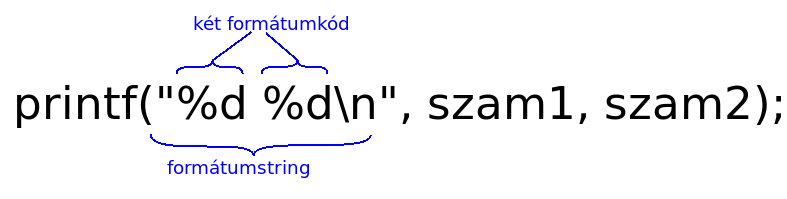

# Asztali alkalmazások fejlesztése - Változók

* **Szerző:** Sallai András
* Copyright (c) Sallai András, 2022
* Licenc: [CC Attribution-Share Alike 4.0 International](https://creativecommons.org/licenses/by-sa/4.0/)
* Web: [https://szit.hu](https://szit.hu)

## Megjegyzések

A forráskódban megjegyzéseket írhatunk, amiket a fordító nem vesz figyelembe. A Java nyelvben megjegyzések lehetnek egy vagy több sorosak.

Egy soros megjegyzéseket két darab perjel segítségével állíthatunk be:

```java
// egy soros megjegyzés
```

Több soros megjeygzések

```java
/* 
több
soros
megjegyzés
*/
```

## Kivitel

A képernyőre a System osztályon keresztül szokás írni. A System osztálynak két mezőjét használjuk a kiíratásra:

* out
* err

Valójában mindegyik a képernyőt jelképezi. Tehát bármelyik mezővel íratunk ki, az a képernyőn jelenik meg. De tartsuk magunkat a következőhöz: A normál kimenetet írjuk az out mezővel, a hibakimenetet az err mezővel. A hozzáértők a program futtatásakor ezt szét tudják választani.

A kiíratásra következő metódusokat használhatjuk:

* print()
* println()
* printf()

Ezeknek a metódusoknak többféle aláírása [^1] is olvashatóa dokumentációban.

[^1]: Az aláírás alatt egy függvény bemenő paramétereit értjük. A bemenőparamétereket szokás még formális paramétereknek is nevezni.

Ha a println() metódust szeretnénk a képernyőre írni, így rakjuk össze:

```java
System.out.println("bármi");
```

## Operátorok és kifejezések

Ha leírom 3, ez önmagában egy állandó. Ha leírom 3 + 4, van két állandónk és egy operátorunk, a "+". A 3-s és 4-s számokat operandusnak hívjuk. Ha van legalább egy operandus és egy operátor, akkor kifejezésről beszélünk. A println() metódus megadott kifejezéseket kiértékeli:

```java
System.out.println(3 + 4);
```

A kimenet:

```cmd
7
```

Most nézzünk egy kivonást:

```java
System.out.println(3 - 4);
```

A kimenet:

```cmd
-1
```

A szorzást a "*" karakter jelképezi:

```java
System.out.println(3 * 4);
```

A kimenet:

```cmd
12
```

Osztás esetén "/" karakter használható:

```java
System.out.println(4 / 3);
```

A kimenet:

```cmd
1
```

Mivel az operandusok egész számok, egész osztás történik. Ha az egyik operandus valós szám, akkor valós osztás történik:

```java
System.out.println(4.0 / 3);
```

A kimenet:

```cmd
1.3333333333333333
```

A 4.0 esetén a "0" elhagyható.

```java
System.out.println(4. / 3);
```

Néha, szeretnénk az egész osztás maradékát megkapni. Erre a "%" operátor használható:

```java
System.out.println( 5 % 3);
```

Eredmény:

```cmd
2
```

A +, -, *, / és a % aritmetikai operátorok.

### Zárójelek

A kifejezések tartalmazhatnak zárójel operátort is.

Vegyük a következő kifejezést:

```java
System.out.println( 3 * 4 + 2);
```

Eredmény:

```cmd
14
```

Ha szeretnénk előbb az összeadást elvégezni, akkor zárójelbe tesszük:

```java
System.out.println( 3 * (4 + 2));
```

Eredmény:

```cmd
18
```

### Összehasonlítás

Megvizsgálhatjuk, hogy egyik szám nagyobb-e a másiknál.

```java
System.out.println(5 > 3);
```

Az eredmény true, mivel igaz az állítás:

```cmd
true
```

Most fordítsuk meg a relációs jelet:

```java
System.out.println(5 < 3);
```

Mivel az állítás hamis, fals íródik a képernyőre:

```cmd
false
```

Egyelőség vizsgálata:

```java
System.out.println(5 == 3);
```

Azt vizsgáljuk: "nem egyenlő?":

```java
System.out.println(5 != 3);
```

Ezeket nevezzük összehasonlító operátoroknak. Összes:

```txt
>, <, >=, <=, ==, !=
```

## Különleges karakterek

Néhány karakternek lehet különleges viselkedése. Ezt a viselkedést a "\\" visszaperjel karakter segítségével válthatjuk ki. Vegyük például az "n" betüt, és írassuk ki egy szóban:

```java
System.out.println("banán");
```

A képernyőn megjelenik a banán szó:

```cmd
banán
```

Most adjuk az első "n" betűnek speciálist jelentést:

```java
System.out.println("ba\nán");
```

A speciális jelentést a "\" jel karakter elé írásával váltjuk ki. A "\" perjel mindig az utána következő karakterre vonatkozik.

Készítsünk egy programot, futtassuk és nézzük meg az eredményt. Az eredmény ehhez hasonló lesz:

```cmd
ba
án
```

Az "n" betű sortörésként viselkedik. Ilyen speciális viselkedése lehet a "t" betűnek is. Nézzük meg ugyanezt "t" betűvel. Javítsuk a szót "mentés"-re:

```java
System.out.println("mentés");
```

Most tegyük a "t" betűt specálissá:

```java
System.out.println("men\tés");
```

Nézzük meg az eredményt:

```cmd
men        és
```

A "t" betű helyett egy tabulátor hely íródik a képernyőre.

Ezeket a speciális karaktereket escape szekvenciáknak is nevezzük. Az Java nyelvben használható escape szekvenciák táblázatát látjuk:

| Escape szekvencia | Leírás  |
|-|-|
| \n | új sor |
| \t | tabulátor |
| \' | felső vessző kiíratása |
| \" | idézőjel kiíratása |
| \\\\ | visszaperjel kiíratása |
| \r | kocsi vissza (A kiíratás a sor elejen folytatódik) |
| \f | lapdobás (nyomtatóknál) |
| \b | visszatörlés (előtte lévő karaktert törli) |
| \uxxxx | Unicode karakterek kiíratása hexedecimális számmal (xxxx) |

## Típusok és változók

### Egészek típusok

A programozás során dolgozunk egész és valós számokkal, karakterekkel, karakterláncokkal és logikai típussal (igaz/hamis). A Java nyelvben megadható milyen típust szeretnénk tárolni. A memória helynek adunk egy nevet, például "szam1":

```java
int szam1;
```

Egy változót hoztunk létre, ahol megmondtuk, hogy egész számot szeretnénk tárolni.

Egész és valós számból is többféle van. Egészek tárolására következő típusok állnak rendelkezésre:

* byte
* short
* int
* long

Mindegyik egész típus más méretű helyet foglal a memóriában:

* byte - 1 byte
* short - 2 byte
* int - 4 byte
* long - 8 byte

Ennek megfelelően a byte típusban tárolhatjuk a legkisebb számot, a longban a legnagyobbat. A következő táblázat megmutatja, melyik típus esetén milyen számtartományból tárolhatunk számokat:

| Típus | Méret | Tartomány |
|-|-|-|
| byte | 1 byte | -128 – 127 |
| short | 2 bytes | -32 768 – 32 767 |
| int | 4 bytes | -2 147 483 648 – 2 147 483 647 |
| long | 8 bytes | -9 223 372 036 854 775 808 – 9 223 372 036 854 775 807 |

Vegyünk egy byte típusú változót, tegyünk bele a 127-es számot, majd írassuk ki:

```java
byte szam1;
szam1 = 127;
System.out.println(szam1);
```

A program fordul és fut. Ha most 128 értéket tesszük bele, fordítási hibát kapunk:

```java
byte szam1;
szam1 = 128; //Hibás!
System.out.println(szam1);
```

Az egyenlőség jel jobboldalára írt számnak mindig int méretű hely lesz lefoglalva. A legnagyobb méret int esetén: 2 147 483 647.

```java
long szam;
szam = 2_147_483_647;
System.out.println(szam);
```

Így a következő kód hibás:

```java
long szam;
szam = 2_147_483_648; //Hibás!
System.out.println(szam);
```

A megoldás, ha a szám végén jelezzük egy "L" betűvel, hogy long típus számára foglaljon helyet. Lehet kis "l" vagy nagy "L".

Vegyük észre, hogy a forráskódban ezredest tagolást használtunk a alsóvonással, amit a Java nyelv megenged.

### Valós típusok

Valós számok esetén a double típust használhatjuk:

```java
double szam2;
```

Kétféel valós típust adhatunk meg:

* float
* double

A két típus, szintén a szám számára foglalt memróai méretében különbözik:

* float - 4 bytes
* double - 8 bytes

Nézzük mekkora számok tárolhatók:

| Típus | Méret | Tartomány |
|-|-|-|
| float | 4 byte | 1.4e-45 – 3.4028235e+38 |
| double | 8 byte | 4.9e-324 – 1.7976931348623157e+308 |

Mivel nagy számokról van szó, a tartományt tudományos alakban [^2] írtam fel.

[^2]: A tudományos alak, a számábrázolás lebegőpontos alakja egyszerűsítve. A lebegőpontos számábrázolásról a következő helyen olvashat: [https://szit.hu/doku.php?id=oktatas:szamitastechnika:szamabrazolas](https://szit.hu/doku.php?id=oktatas:szamitastechnika:szamabrazolas)

Példa a valós számra:

```java
double szam;
szam = 45.123;
```

A float típus használatával:

```java
float szam;
szam = 45.123F;
```

Az adott szám végére egy "F" betűvel jeleztük, hogy csak egy float típus szeretnénk leírni.

### Karakterek

Karaktereket a char típusban tárolhatunk:

```java
char karakter1 = 'a';
```

Figyeljük meg, hogy a karaktert aposztrófok közzé tettem.

### Logikai érték

Logikai érték igaz vagy hamis lehet. Java nyelvben:

* true
* false

A logikai értéket a boolean típusban tárolhatunk:

```java
boolean van_hely = true;
```

### Primitív típusok és burkolóosztályok

Az int, byte, short, long, float, double, boolean, char, mind primitív típus. Minden primitív típusuhoz tartozik egy burkoló osztály. Ez annyit jelent, hogy a típusokat osztállyal is létrehozhatom. Például egy egész típus burkolóosztállyal:

```java
Integer szam1 = 45;
```

Egy byte típus esetén:

```java
Byte szam1 = 45;
```

Nézzük meg a primítv típusok helyett milyen osztályokat használhatunk, a következő táblázatban:

| Primtív | Érték | Burkoló (csomagoló) osztály | Tartomány |
|-|-|-|-|
| boolean | true, false | Boolean | true vagy false |
| char | 16 bit-es Unicode | Character | \u0000 – \uFFFF |
| byte | 8 bit-es előjeles egész | Byte | -128 – 127  |
| short | 16 bit-es előjeles egész | Short | -32768 – 32767 |
| int | 32 bit-es előjeles egész | Integer | -2147483648 – 2147483647 |
| long | 64 bit-es előjeles egész | Long | -9223372036854775808 – 9223372036854775807 |
| float | 32 bit-es lebegőpontos | Float | 1.4E-45 – 3.4028235E+38 |
| double | 64 bit-es lebegőpontos | Double | 439E-324 – 1.7976931348623157E+308 |

A Java nyelvben csak előjeles típusok vannak, angolul signed. Nincs előjel nélküli, angolul unsigned típus.

A primitív és burkoló osztállyal létrehozott változók esetén különbség, hogy a burkoló osztállyal létrehozott változókon futtathatók metódusok, de több helyet is foglalnak a memóriában.

### Karakterláncok

Karakterláncok számára nincs primitív típus, ezeket a String osztállyal hozzuk létre:

```java
String nev = "Pala Ferenc";
```

## Változók

A változókat deklarálással hozzuk létre:

```java
int szam1;
```

A változónak ekkor még nincs definiálva az értéke.

Most tegyünk bele a 45 értéket:

```java
int szam1;
szam1 = 45;
```

Amikor értéket rendelünk a "szam1" nevű változóhoz, ezt nevezzük definiálásnak.

A Java nyelvben az értékadás "=" opetrátorral történik. A változók a deklaráció során is kaphatnak értéket:

```java
int szam1 = 45;
```

A változók értékét lekérhetjük és új változóban tárolhatjuk azt, vagy éppen kiírathatjuk:

```java
int szam1 = 45;
int szam2 = szam1;
System.out.println(szam1);
```

A kiíratás során nem a változó neve, hanem annak értéke íródik ki.

A változók, később kaphatnak új értéket, ezért változók:

```java
int szam1 = 45;
System.out.println(szam1);
szam1 = 91;
System.out.println(szam1);
```

## Állandók

Vegyük a szam1 nevű egész típusú változót:

```java
int szam1 = 45;
```

Amikor leírom ezt az utasítást, futtatáskor a memóriában tárolásra kerül ez az utasítás, ahol szerepel a 45, és egy másik memória helyen is tárolódik a 45 érték. Az első az utasítások memóriaterületére kerül, utóbbi a változók memóraterületére.

Java nyelvben kétféle állandó van:

* literális
* nevesített

Vegyünk egy egész típust újra:

```java
int szam1 = 45;
```

Amikor leírom, hogy 45, ez is egy állandó. Állandó, mert azt a memóriahelyet ahol ez az utasítás tárolódik, ahol a 45 is szerepl, a program futása során nem tudom megváltoztatni. Most csak az egyenlőség jel jobboldaláról beszéltünk. Az egyenlőségjel bal oldalán egy változó van, azon a memóriaterületen is megjelenik a 45, ez a változó memóriaterülete.

Az egyenlőségjel jobb oldalán szerplő 45-t **literális állandó**nak nevezem.

A változóknak adhatunk neveket is, így kapunk nevesített állandót. Az állandó deklarációt, úgy kezdjük mint a változókat, de teszünk eléjük egy "final" módosítót:

```java
final int szam1 = 45;
```

A módosító hatására az egyenlőség baloldalán szereplő szam1 is állandó lesz. A továbbiakban nem kaphat új értéket. A következő program hibát generál:

```java
final int szam1 = 45;
szam1 = 70; //Hiba!
```

## Típuskonverzió

### Konverzió szélesítéssel

Ha létrehozok egy byte típusú változót, bele tehetem egy short típusú változóba. Ezt nevezik szélesítésnek, angolul: automatic promotion.

```java
byte num1 = 30;
short num2 = num1;
```

### Konverzió szűkítéssel

Ha létrehozunk egy short típusú változót, egyszerű értékadással nem tudjuk egy byte típusú változóba tenni.

```java
short num1 = 30;
byte num2 = num1; //Hiba!
```

A megoldás a típus kasztolás (type casting):

```java
short num1 = 30;
byte num2 = (byte) num1;
```

A num1 nevű változó elé zárójelbe írtam milyen típussá szeretném "erőltetni".

## Formázott kivitel

A formázott kimenetet a printf() metódussal készíthetünk. Nézzük egy egyszerű változó kiíratást:

```java
int szam1 = 45;
System.out.printf("%d\n", szam1);
```

A printf() metódusnak az első paramétere a formátumstring. A formátumstring írja le, hogy a következő paramétereket milyen formában jelenítsük meg. Ha futtatjuk a fenti utasítást, egyszerűen kiíródik a 45, ezt megtehettük volna egy println() utasítással is.

Nézzük meg a formátumstringet közelebbről. Egy formátumsztring egy vagy több formátumkódot tartalmazhat. Minden formátumsztring utáni paraméternek szükség van egy formátumkódra. A fenti program a formátumsztring után egyetlen változót szerepeltet a "szam1". Az ehhez tartozó formátukód %d. A formátumkódot mindig "%" százalékjellel kezdjük, és egy konverziós karakterrel zárjuk. A konverziós karakter mindig függ a kiíratni kívánt típustól. A "szam1" változó jelenleg egész típusú, ilyen esetben a konverziós karakter egy "d" betű.

A "d" betű után a "\n" csak a sortörést miatt van, mivel a print() utasítás nem ír sörtörést, ellentétben a println() metódussal.


Minden formátumstring után írt paraméternek meg kell adnunk egy formátumkódot:



Az első formátumkód az első változóhoz tartozik, a második a formátumkód a második váltzóhoz:


A formátumkód "%" jele és a konverzióskarakter közzé újabb formázó utasításokat írhatok a következő szintaxis szerint:

```text
%[argumentum_index$][jelzők][szélesség][.pontosság]konverziós_karakter
```

A "[]" szögletes zárójelek mutatják, hogy melyek a nem kötelező elemek. Láthatjuk, hogy a "%" jel és a konverziós karakter megadása kötelező, a többi nem.

### Szélesség

Ábrázoljuk a számot 20 szélességen:

```java
int szam1 = 45;
System.out.printf("%20d\n", szam1);
```

A program a számot 20 szélességben írja ki:

```cmd
                  45
```

A formátumstring a kiírt értékhez tartalmazhat egyéb információkat, mint például a mértékegység, pénznem, bármi:

```java
int szam1 = 45;
System.out.printf("Egységár: %20d Ft\n", szam1);
```

A program a végrehajtás után a következőt írja a képernyőre:

```cmd
Egységár:                   45 Ft
```

```java
int szam1 = 45;
int szam2 = 25;
System.out.printf("Egységár: %5d Ft Tömeg: %5d kg\n", szam1, szam2);
```

Kimenet:

```cmd
Egységár:   45 Ft Tömeg:   25 kg
```

### Pontosság

Valós számok esetén beállíthatjuk a pontosságot. Vegyük szemügyre újból a szintaxist:

```text
%[argumentum_index$][jelzők][szélesség][.pontosság]konverziós_karakter
```

A pontosság megadását mindig egy "." karakter vezeti, be ezt követi a pontosság, számmal megadva.

```java
double valos1 = 45.12345678;
System.out.printf("%.2f\n", valos1);
```

Kimenet:

```cmd
45.12
```

A szélesség és pontosság használható együtt. A szélességet, mindig a pontosság elé írjuk:

```java
double valos1 = 45.12345678;
System.out.printf("%10.2f\n", valos1);
```

Kimenet:

```cmd
     45.12
```

### Jelzők

A szélesség előtt megadhatunk jelzőket. A következő táblázat mutatja milyen jelzők használhatók.

| Jelző | Leírás (milyen konverziós karakter esetén) |
|-|-|
| + | előjel előírása |
| - | balra igazítás |
| 0 | vezető nullák megjelenítése |
| , | ezeredes elválasztás |
| # | alternatív formátum megjelenítése (csak o, x és X konverziós karakternél) |
| ' ' | egy vezető szóköz pozitív számok számára (csak d, o, x és X esetén ) |
| ( | negatív számok zárójelbe kerülnek csak e, E , f, g, és G esetén |

### Előjel előrírása

Alapestben az előjel csak negatív számok esetén jelenik meg. A "+" jelzővel, előírhatjuk pozitív számok számára is.

```java
System.out.printf("%+d\n", 45);
```

Kimenet:

```cmd
+45
```

Ha szélességet is megadjuk, a "+" jelző a szélesség baloldalán szerepel:

```java
System.out.printf("%+5d\n", 45);
```

A kimenet így:

```cmd
  +45
```

### Balra igazítás

A "-" jelzővel adott szélességen belül balra igazíthatom az érték megjelenítését. A következő példában "|" pipe karaktert írunk a formátumkód elé és utuán, hogy jól látható legyen a megadott szélesség.

```java
System.out.printf("|%-10d|\n", 45);
```

Kimenet:

```cmd
|45        |
```

### Vezető nullák

Ha az üres helyeket szeretnénk 0 értékkel feltölteni a "0" jelzővel tehetjük meg:

```java
System.out.printf("|%010d|\n", 45);
```

Kimenet:

```cmd
|0000000045|
```

### Ezredes elválasztás

Hosszú számokat könnyebb olvasni, ha ezredeselválasztást használunk a kiíratás során:

```java
System.out.printf("%,d\n", 2247589824L);
```

Nagyobb számok esetén egy kicsi vagy egy nagy "L" betűt kell a szám után írnunk.

Kimenet:

```cmd
2 247 589 824
```

Nagy számokat a forráskóban is tagolhatunk alsóvonallal:

```java
System.out.printf("%,d\n", 2_247_589_824L);
```

Az "L" betű nélkül a Java a leírt számot int típusúnak gondolja. A memóriában csak egy int típus számára foglal helyet, de ebbe a szám nem fére bele, ezért megmondtuk, hogy kezelje long típusként.

### Konverziós karakterek

| Konverziós karakter | Leírás |
|-|-|
| B, B | Ha az argumentum null, akkor visszatérés „false”. Az argumentum boolden vagy Booldan, akkor a visszatérés String.valueOf(). Ellenkező esetben a vissztérés „false”. |
| h, H | Ha az argumentum null, akkor a visszatérés is null. Egyébként a visszatérés Integer.toHexString(arg.hashCode(). |
| s, S | Ha az argumentum null, akkor a visszatérés is null. Ha az argumentum formázást valósít meg akkor a formázás érvényesül. Minden más esetben az argumentumon karaktersorozattá alakul toString(). |
| c, C | Visszatér egy Unicode karaterrel. |
| d | Visszatér egy formázott decimális egésszel. |
| o | Visszatér egy formázott oktális egésszel. |
| x, X | Visszatér egy formázott hexadecimlási egésszel. |
| e, E | Visszatér egy formázott decimális számmal, todmányos alakban. |
| f | Visszatér egy formázott decimális számmal. |
| g, G | Visszatér egy formázott tudományos formával vagy decimális formával, a kerekítési érték pontosságától függően. |
| a, A | Visszatér egy formázott hexadecimális lebegőpontos számmal, alappal és kitevővel. |
| t, T | Dátum és konverziós karakterek előtagja. Lásd a dátum és időkonverziót. |
| % | Visszad egy % literálist (\u0025). |
| n | Visszatér egy platformspecifikus sortöréssel. |

## Gyakorlatok Változók témakörben

### Kérdések

* Írjon egy lebegőpontos típust
* Írjon két egész típust
