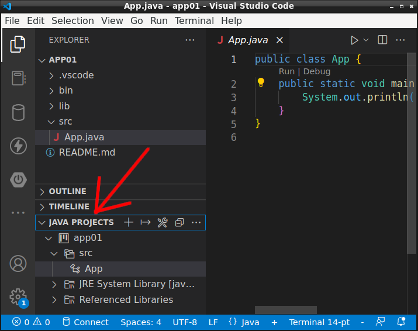
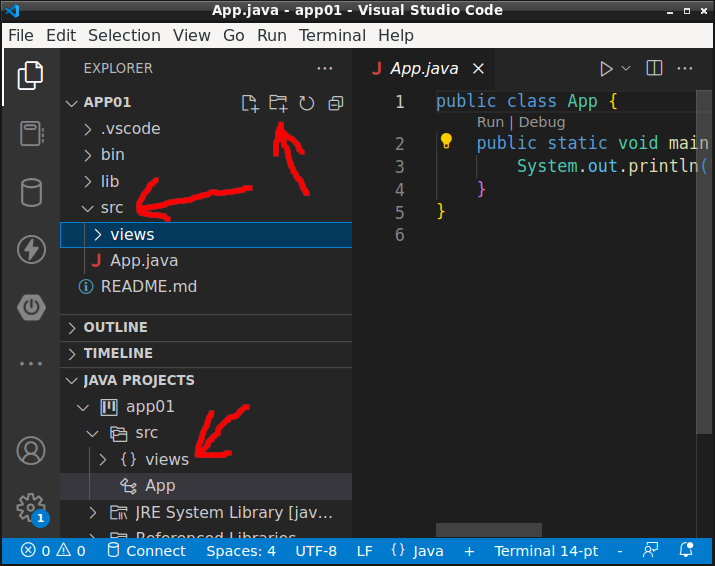
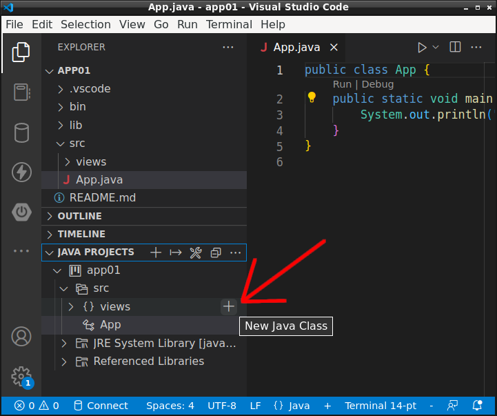
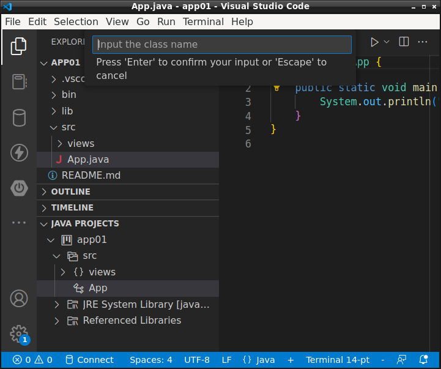
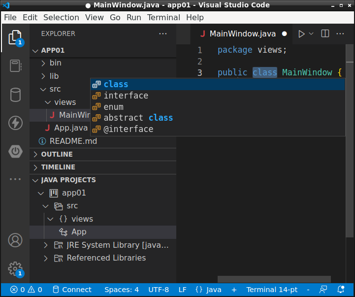

# Asztali alkalmazások fejlesztése - Objektumorientált fejlesztés

* **Szerző:** Sallai András
* Copyright (c) Sallai András, 2022
* Licenc: [CC Attribution-Share Alike 4.0 International](https://creativecommons.org/licenses/by-sa/4.0/)
* Web: [https://szit.hu](https://szit.hu)

## Osztályok IDE segítségével

Visual Studio Code-ban az osztályokat az oldalsáv JAVA PROJECTS nézetén hozzuk létre. Ha nem látszik a nézet, nyissuk meg az egyik .java kiterjesztésű fájlt, például az App.java. Az oldalsávon megjelenik JAVA PROJECTS nézet.



A csomagokat (könyvtárakat) fent a app01 (a projekt neve) nézetben hozzuk létre. Például views csomag.



A csomag lent a JAVA PROJECTS nézetben is megjelenik.

A nézetben vigyük az egeret arra csomagnévre (könyvtárnév) ahol szeretnénk létrehozni az osztályt. A csomagnévtől jobbra megjelenik egy "+" jel ikon.



A kattintás hatására megnyílik egy bevitelimező, ahol beírhatjuk az osztály, interface, enum, abstract osztály vagy annotáció nevét.



A név megadása után ki kell választanunk mit szeretnénk:

* osztály
* interface
* enum
* abstract
* @interface (annotáció)



Választhatunk a le és fel billentyűkket. A választást Enter lenyomásával véglegesítjük.

## Scope

A változókat létrehozhatjuk osztályon belül mezőként (adattag), vagy létrehozhatjuk valamelyik metóduson belül. A metóduson belül létrehozott változó csak az adott metódusban érhető el. Az osztály mezőjeként létrehozott változó, azonban minden metódusban elérhető.

```java
class Valami {
    String mezo1;
    public void metodus1(String valtozo1) {
        String valtozo2;
    }
}
```

## Példányosítás

```java
Random random = new Random();
Employee employee = new Emplyoee();
```

## Konstruktorok

A Java nyelvben a konstruktorok nev megyegyezik az osztály nevével és sosincs visszatérési értékük. A következő példában van egy Employee osztályunk, amiben találunk egy konstruktort Employee néven. Vegyük észre a public és az Employee szavak között nincs visszatérési érték.

```java
class Employee {
    String name;
    public Employee() {
        this.name = "Névtelen";
    }
}
```

A konstruktorok az osztály mezőinek előkészítésére használható.
A konstruktorok fogadhatnak paramétert, mint a következő példában is:

```java
class Employee {
    String name;
    public Employee(String name) {
        this.name = name;
    }
}

//...

Employee employee = new Employee("Pele Ferenc");
```

Többalakú konstruktor:

```java
class Employee {
    String name;
    public Employee() {
        this.name = "Névtelen";
    }
    public Employee(String name) {
        this.name = name;
    }
}

//...

//Hívható így:
Emplyoee employee = new Emplyoee();

//Így is hívható:
Emplyoee employee = new Emplyoee("Tenge Albert");
```
