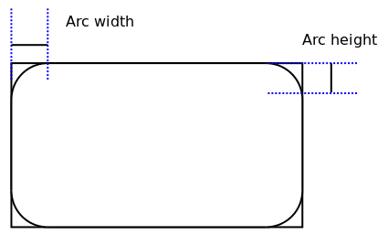

# Asztali alkalmazások fejlesztése - Grafikus programozás

* **Szerző:** Sallai András
* Copyright (c) 2022, Sallai András
* Licenc: [CC Attribution-Share Alike 4.0 International](https://creativecommons.org/licenses/by-sa/4.0/)
* Web: [https://szit.hu](https://szit.hu)

## GUI programozási alapok

A GUI programok a következő elemekből állnak:

* ablak
* konténerek
* komponensek - kontrollok
* menü
* alakzatok
* diagramok
* 3D alakzatok
* egyéb

A GUI programok eseményvezérelten működnek. A legtöbb elem esetén figyelhetünk valamilyen komponenst.

## JavaFX kezdés

Dokumentáció (19):

* [https://openjfx.io/javadoc/19/](https://openjfx.io/javadoc/19/)

## JavaFX program szerkezete

App.java tartalma:

```java
import javafx.application.Application;
import javafx.scene.Scene;
import javafx.scene.layout.StackPane;
import javafx.stage.Stage;

public class App extends Application {
    
    public static void main(String[] args) throws Exception {
        launch(args);
    }

    @Override
    public void start(Stage stage) throws Exception {
        StackPane stackPane = new StackPane();
        Scene scene = new Scene(stackPane);
        stage.setScene(scene);
        stage.setTitle("Helló Világ");
        stage.show();
    }
}
```

## JavaFX komponensek

### Kontrollok listája

* Button
* CheckBox
* ChoiceBox
* ColorPicker
* ComboBox
* DatePicker
* HTMLEditor
* Hyperlink
* ImageView
* Label
* ListView
* MediaView
* MenuBar
* MenuButton
* Pagination
* PasswordField
* ProgressBar
* ProgressIndicator
* RadioButton
* ScrollBar (horizontal)
* ScrollBar (vertical)
* Separator (horizontal)
* Separator (vertical)
* Slider (horizontal)
* Slider (vertical)
* SplitMenuButton
* TableColumn
* TableView
* TextArea
* TextField
* ToggleButton
* TreeTableColumn
* TreeTableView
* TreeView
* WebView

### Text komponens elhelyezése

```java
import javafx.application.Application;
import javafx.scene.Scene;
import javafx.scene.layout.StackPane;
import javafx.scene.text.Text;
import javafx.stage.Stage;

public class App extends Application {
    public static void main(String[] args) throws Exception {
        launch(args);
    }

    @Override
    public void start(Stage primaryStage) throws Exception {
        StackPane root = new StackPane();
        Text text = new Text("alma");
        root.getChildren().add(text);
        primaryStage.setTitle("Text komponens");
        primaryStage.setScene(new Scene(root, 400, 300));
        primaryStage.show();
    }
}
```

## JavaFX színkezelés

```java
Text text = new Text("alma");
text.setStroke(Color.BLUE);
```

Teljes program App.java:

```java
import javafx.application.Application;
import javafx.scene.Scene;
import javafx.scene.layout.StackPane;
import javafx.scene.paint.Color;
import javafx.scene.text.Text;
import javafx.stage.Stage;

public class App extends Application {
    public static void main(String[] args) throws Exception {
        launch(args);
    }

    @Override
    public void start(Stage primaryStage) throws Exception {
        StackPane root = new StackPane();
        Text text = new Text("alma");
        text.setStroke(Color.BLUE);
        root.getChildren().add(text);
        primaryStage.setTitle("Text komponens");
        primaryStage.setScene(new Scene(root, 400, 300));
        primaryStage.show();
    }
}
```

### Beépített színek

* Color.ALICEBLUE
* Color.ANTIQUEWHITE
* Color.AQUA
* Color.AQUAMARINE
* Color.AZURE
* Color.BEIGE
* Color.BISQUE
* Color.BLACK
* Color.BLANCHEDALMOND
* stb.

Próbáljuk ki több színnel az előző programot.

### RGBA színkód

Színek megadhatók számokkal is RGBA színkódolással. A számok 0.0 - 1.0 közötti értékek lehetnek.

Piros szín:

```java
Color color = new Color(1.0, 0.0, 0.0, 1.0);
```

Zöld szín:

```java
Color color = new Color(0.0, 1.0, 0.0, 1.0);
```

Kék szín:

```java
Color color = new Color(0.0, 0.0, 1.0, 1.0);
```

## JavaFX alakzatok

### Szöveg

A szöveg vagy más alakzat elhelyezése x, y koordinátával hatástalan StackPane komponensen. Helyette használjuk a Group osztályt:

```java
Group group = new Group();
```

A szövegnek állíthatjuk a fontméretét, az elhelyezését, a vonalvastagságát, a szöveg színét.

```java
Text text = new Text("alma");
text.setFont(Font.font(32));
text.setX(30.0);
text.setY(30.0);
text.setStrokeWidth(4);
text.setStroke(Color.BLUE);
```

A text objektum a group objektumhoz adható getChilcren() metóduson keresztül:

```java
Group group = new Group();
group.getChildren().add(text);
```

Vagy paraméterként megadható a csoport számára:

```java
Group group = new Group(text);
```

### Vonal

Vonal esetén a kezdőpontot és a végpontot kell megadni, x, y koordinátával.

```java
import javafx.scene.shape.Line;
//...
Line line = new Line();
line.setStartX(50.0);
line.setStartY(50.0);
line.setEndX(100.0);
line.setEndY(100.0);
```

```java
Group group = new Group(line);
```

Vagy lehet így is:

```java
Group group = new Group();
group.getChildren().add(line);
```

Teljes kód:

```java
import javafx.application.Application;
import javafx.scene.Group;
import javafx.scene.Scene;
import javafx.scene.shape.Line;
import javafx.stage.Stage;

public class App extends Application {
    
    public static void main(String[] args) throws Exception {
        launch(args);
    }

    @Override
    public void start(Stage stage) throws Exception {
        Line line = new Line();
        line.setStartX(50.0);
        line.setStartY(50.0);
        line.setEndX(100.0);
        line.setEndY(100.0);
        Group group = new Group();
        group.getChildren().add(line);
        Scene scene = new Scene(group, 300, 250);
        stage.setScene(scene);
        stage.setTitle("Helló Világ");
        stage.show();
    }
}
```

### Téglalap

```java
Rectangle rectangle = new Rectangle(x, y, width, height);
```

De használhatunk beállító metódusokat is:

```java
rectangle.setX(50.0);
rectangle.setY(50.0);
rectangle.setWidth(100.0);
rectangle.setHeight(100.0);
```

Színezés:

```java
rectangle.setFill(Color.BLUE);
```

Lekerekített téglalap:

```java
Rectangle rectangle = new Rectangle(150, 150, 60, 60);
rectangle.setArcWidth(15.0);
rectangle.setArcHeight(15.0);
```



### Kör

```java
Circle circle = new Circle(50.0, 50.0, 25.0);
circle.setFill(Color.BLUEVIOLET);
```

### Ellipszis

```java
Ellipse ellipse = new Ellipse(50.0, 50.0, 25.0, 15.0);
ellipse.setFill(Color.BLUEVIOLET);
```

## JavaFX képek

A képet a forrásfájl mellé kell tenni, vagy onnan relatívan megadni.

```java
Image image = new Image("kep01.png");
ImageView imageView = new ImageView(image);
imageView.setX(50.0);
imageView.setY(50.0);

Group group = new Group();
group.getChildren().add(imageView);
```

## JavaFX Label

```java
import javafx.scene.control.Label;
//...

Label label1 = new Label();
```

Háttérszín:

```java
this.label1.setBackground(
    new Background(new BackgroundFill(Color.BLUE, null, null))        
);
```

Szöveg színe:

```java
this.label1.setTextFill(Color.WHITE);
```

## JavaFX gomb és bevitelimező

```java
Button button = new Button("Mehet");
```

```java
Button button = new Button("Mehet");
button.setLayoutX(50.0);
button.setLayoutY(50);

Group group = new Group();
group.getChildren().addAll(button);
```

Komplett kód:

```java

import javafx.application.Application;
import javafx.scene.Group;
import javafx.scene.Scene;
import javafx.scene.control.Button;
import javafx.stage.Stage;

public class App extends Application {
    
    public static void main(String[] args) throws Exception {
        launch(args);
    }

    @Override
    public void start(Stage stage) throws Exception {
        Button button = new Button("Mehet");
        button.setLayoutX(50.0);
        button.setLayoutY(50);
        
        Group group = new Group();
        group.getChildren().addAll(button);

        Scene scene = new Scene(group, 300, 250);
        stage.setScene(scene);
        stage.setTitle("Helló Világ");
        stage.show();
    }
}
```

## Eseményfigyelés

Az eseményfigyelést a nyomógombon egy setOnAction() metódussal állítható be. Lambad kifejezés használatával csak meg kell hívni a metódust, ami reagál az eseményre.

```java
button.setOnAction(e -> onClickButton());
```

Teljes kód:

```java

import javafx.application.Application;
import javafx.scene.Group;
import javafx.scene.Scene;
import javafx.scene.control.Button;
import javafx.stage.Stage;

public class App extends Application {
    
    public static void main(String[] args) throws Exception {
        launch(args);
    }

    @Override
    public void start(Stage stage) throws Exception {
        Button button = new Button("Mehet");
        button.setLayoutX(50.0);
        button.setLayoutY(50);
        
        button.setOnAction(e -> onClickButton());

        Group group = new Group();
        group.getChildren().addAll(button);

        Scene scene = new Scene(group, 300, 250);
        stage.setScene(scene);
        stage.setTitle("Helló Világ");
        stage.show();
    }
    private void onClickButton() {
        System.out.println("működik");
    }
}
```

## Aszinkronkód

Van egy aszinkron folyamat amire várakozni kell:

```java

import javafx.application.Application;
import javafx.scene.Group;
import javafx.scene.Scene;
import javafx.scene.control.Button;
import javafx.stage.Stage;

public class App extends Application {
    
    public static void main(String[] args) throws Exception {
        launch(args);
    }

    @Override
    public void start(Stage stage) throws Exception {
        Button asyncButton = new Button("Aszinkron folyamat indítása");

        asyncButton.setLayoutX(50.0);
        asyncButton.setLayoutY(50);
        
        asyncButton.setOnAction(e -> onClickAsyncButton());

        Group group = new Group();
        group.getChildren().addAll(asyncButton);

        Scene scene = new Scene(group, 300, 250);
        stage.setScene(scene);
        stage.setTitle("Helló Világ");
        stage.show();
    }
    private void onClickAsyncButton() {
        doAsyncProcess();
        System.out.println("működik");
    }
    private void doAsyncProcess() {
        try {
            this.tryDoAsyncProcess();
        } catch (InterruptedException e) {
            System.err.println("Hiba! Az aszinkron futtatás sikertelen!");
        }
    }
    private void tryDoAsyncProcess() throws InterruptedException{
        Thread.sleep(10000);
        System.out.println("Az aszinkron folyamat véget ért");
    }
}
```

Nyomjuk meg a gombot, majd kattintsunk az ablak bezárására, majd figyeljük mi történik. A program nem záródik be, amíg az aszinkron folyamat véget nem ér.

Most az onClickAsyncButton() metódusban hívjuk aszinkron folyamatként a doAsyncProcess() metódust:

```java

import javafx.application.Application;
import javafx.scene.Group;
import javafx.scene.Scene;
import javafx.scene.control.Button;
import javafx.stage.Stage;

public class App extends Application {
    
    public static void main(String[] args) throws Exception {
        launch(args);
    }

    @Override
    public void start(Stage stage) throws Exception {
        Button asyncButton = new Button("Aszinkron folyamat indítása");

        asyncButton.setLayoutX(50.0);
        asyncButton.setLayoutY(50);
        
        asyncButton.setOnAction(e -> onClickAsyncButton());

        Group group = new Group();
        group.getChildren().addAll(asyncButton);

        Scene scene = new Scene(group, 300, 250);
        stage.setScene(scene);
        stage.setTitle("Helló Világ");
        stage.show();
    }
    private void onClickAsyncButton() {
        new Thread(() -> doAsyncProcess()).start();
        System.out.println("működik");
    }
    private void doAsyncProcess() {
        try {
            this.tryDoAsyncProcess();
        } catch (InterruptedException e) {
            System.err.println("Hiba! Az aszinkron futtatás sikertelen!");
        }
    }
    private void tryDoAsyncProcess() throws InterruptedException{
        Thread.sleep(4000);
        System.out.println("Az aszinkron folyamat véget ért");
    }
}
```

A program ablaka most már reagál, bezáródik a kattinitásra, az aszinkron folyamat bezárása előtt.

További információk:

* [https://docs.oracle.com/javase/tutorial/essential/concurrency/runthread.html](https://docs.oracle.com/javase/tutorial/essential/concurrency/runthread.html)

* [https://docs.oracle.com/javase/7/docs/api/java/util/concurrent/ExecutorService.html](https://docs.oracle.com/javase/7/docs/api/java/util/concurrent/ExecutorService.html)

* [https://docs.oracle.com/javase/8/docs/api/java/util/concurrent/CompletableFuture.html](https://docs.oracle.com/javase/8/docs/api/java/util/concurrent/CompletableFuture.html)
