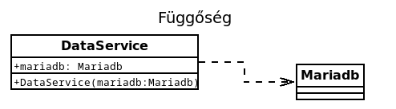
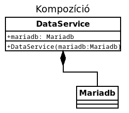
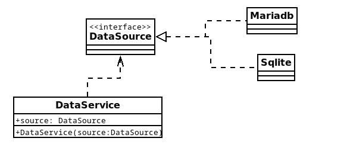
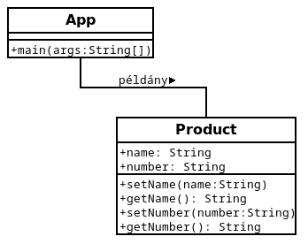

# Haladó Objektum Orientált Programozás

* **Szerző:** Sallai András
* Copyright (c) 2022, Sallai András
* Licenc: [CC Attribution-Share Alike 4.0 International](https://creativecommons.org/licenses/by-sa/4.0/)
* Web: [https://szit.hu](https://szit.hu)

## Ismétlő gyakorlatok

1. Kérdezze meg az egyik AI-t, mi a különbség a VSCode és a Netbeans között.

2. Készítsen a VSCode-ban Maven projektet, amiben megold egy programozási feladatot.

3. Készítsen VSCode-ban "no build tools" módban projektet, oldjon meg vele egy programozási feladatot. [Feladatgyűjtemény](https://szit.hu/doku.php?id=oktatas:programozas:feladatok:altalanos)

4. Készítsen Netbeans-ben konzolos programot. Oldjon meg egy bekérős programozási feladatot.

5. Készítsen Netbeans-ben GUI alkalmazást, amely egy bekérős feladatot old meg.

## Interfész

Az interfészek **metódusok és állandók egy halmazát** adják meg. Az osztályok, amikor implementálnak egy ilyen interfészt, a benne található metódusokat kötelesek megvalósítani.

Legyen például egy Jarmu interfész, amiben előírjuk milyen viselkedéseket kell egy járműnek megvalósítani adott programban.

```java
interface Jarmu {
    public void halad();
}
```

Írjunk programot, ami megvalósítja a Jarmu nevű interfészt.

```txt
app01/
  |-bin/
  |-lib/
  |-src/
  |  |-App.java
  |  |-Jarmu.java
  |  `-Szemelygepkocsi.java
  `-README.md
```

A program állományai:

Jarmu.java fájl:

```java
public interface Jarmu {
    public void halad();
}

```

App.java fájl

```java
public class App {
    public static void main(String[] args) throws Exception {
        System.out.println("Interfész");

        Szemelygepkocsi lada1 = new Szemelygepkocsi();
        lada1.halad();
    }
}
```

Szemelygepkocsi.java fájl:

```java
public class Szemelygepkocsi implements Jarmu {
    public void halad() {
        System.out.println("x");
    }
}
```

### Gyakorlás 1

1.) Írjon programot, ahol egy idegsejtet szimulál. A szimulátorban használjon interfészt, amiben meghatározza a sejt egy tevékenységét. A program valósítsa meg az interfészt. A program fő osztálya külön állományban legyen.

Vegyünk egy egyszerű esetet: Az idegsejtek ingerületet fogadnak és ingerültete küldenek.

2.) Írjon programot, ami egy járművet szimulál. A szimulátorban interfésszel határozza meg a jármű mozgásait. A programban valósítsa meg az elkészített interfészt.

## Laza függőség létrehozása

Vegyünk egy osztályt, ami a konstruktorán keresztül paraméterként fogadott objektumot, amivel beállítja egyik adattagját.

Példánkban, a DataService osztály függ a Mariadb osztálytól:

```java
class DataService {
    Mariadb mariadb;
    public DataService(Mariadb mariadb) {
        this.mariadb = mariadb;
    }
}
```

A függőség ábrázolása UML ábrán:



A kapcsolat a két osztály között UML ábrán:



A DataService erőteljesen függ a Mariadb osztálytól, mivel más osztály nem adható meg.

Egy **interfésszel lazafüggőséget** alakíthatunk ki. A következő példákban üres interfész és osztályt használunk, mert most nem fontos mi van benne:

```java
interface DataSource {

}

class Mariadb implements DataSource {

}

class DataService {
    DataSource source;
    public DataService(DataSource source) {
        this.source = source;
    }
}
```

De mitől laza? Amikor példányosítjuk DataService osztályt paraméterként megadhatjuk a Mariadb osztályt:

```java
DataService service = new DataSercie(new Mariadb());
```

Azért adhatjuk meg, mert implementálta a DataSrouce osztályt, és DataService esetén ezt adtuk bemenő paraméternek. Ezzel együtt bármely osztály ami implementálja a DataSource osztályt, az megadható paraméterként. Legyen például egy Sqlite osztályt is:

```java
interface DataSource {}

class Mariadb implements DataSource {}

class Sqlite implements DataSource {}

class DataService {
    DataSource source;
    public DataService(DataSource source) {
        this.source = source;
    }
}
```

A DataService példányosítása során megadható a Mariadb osztály és az Sqlite osztály is:

```java
DataService service1 = new DataSercie(new Mariadb());
DataService service2 = new DataSercie(new Sqlite());
```

A DataService ezért lazán függ a Mariadb és az Sqlite osztályoktól.

A DataService számára befecskendztük a függőséget, ezért szokás függőség befecskendezésről beszélni a fenti példánkban.



### Beszélő emberek példa

Egy programot szeretnénk írni, ahol embereket szimulálunk. Minden ember más-más nyelvet beszélhet. A példány létrehozása helyén dől el, milyen nyelvet fog beszélni.

A projekt szerkezete:

```txt
app01/
  |-bin/
  |-lib/
  |-src/
  |  |-Angol.java
  |  |-App.java
  |  |-Beszed.java
  |  |-Ember.java
  |  `-Magyar.java
  `-README.md
```

Angol.java fájl:

```java
public class Angol implements Beszed {
    public void beszel() {
        System.out.println("yes");
    }
}
```

App.java fájl:

```java
public class App {
    public static void main(String[] args) throws Exception {
        System.out.println("Interfész");

        Ember dani = new Ember(new Angol());
        dani.beszed.beszel();
        Ember jani = new Ember(new Magyar());
        jani.beszed.beszel();
    }
}
```

Beszed.java fájl:

```java
public interface Beszed {
    public void beszel();
}
```

Ember.java fájl:

```java
public class Ember {
    Beszed beszed;
    public Ember(Beszed beszed) {
        this.beszed = beszed;
    }
}
```

Magyar.java fájl:

```java
public class Magyar implements Beszed {
    public void beszel() {
        System.out.println("igen");
    }
}
```

## OOP feladat

### Feladat 001

Adott a következő UML ábra:



Készítse el azt a programot, ami teljesíti az UML ábrán látható osztályokat.
