# Algoritmusok és adatszerkezetek

* **Szerző:** Sallai András
* Copyright (c) 2022, Sallai András
* Licenc: [CC Attribution-Share Alike 4.0 International](https://creativecommons.org/licenses/by-sa/4.0/)
* Web: [https://szit.hu](https://szit.hu)

## Algoritmusok bonyolultsága

### Bonyolultság

Az algoritmus bonyolultságával azt mérjük, hogy n méretű bemenetet mennyi ideig tart feldolgozni, vagy hány utasítást kellett végrehajtani. A bonyolultságot általában időben vagy utasítás számban mérjük, de néha a memóriaigény az érdeklődésünk köre.

Az elméleti számítástechnika egyik ága ezzel foglalkozik, ezt nevezzük komplexitás elméletnek. Valójában az elemzések során fontosabb az algoritmus összetettségének vizsgálata, szemben az idővel.

A jó bonyolultság vizsgálathoz, az idő mérése helyett érdemesebb a végrehajtott utasítások számolása.

#### Példák

Ha egy rendezetlen tömbben keresünk egy elemet, a keresési idő arányosan nő a lista méretével. Ekkor azt mondhatjuk, hogy a keresési idő lineáris.

Ha rendezett tömbben keresünk, a keresés gyorsabb lesz. Ez egy logaritmikus bonyolultság.

Ha egy tömbben az első elem a keresett érték, konstanst idő, a bonyolultság.

Keressünk egy rendezetlen listában minden ismétlődést. A bonyolultság ekkor négyzetes.

Egyetlen elem bonyolultságnak ellenőrzése lineáris bonyolultságú.

#### A bonyolultságok jelölése

A bonyolultságot átlagos esetben a nagy θ betűvel jelöljük.

Jelölések:

* legrosszabb eset: O(n)
* legjobb eset: Ω(n)
* átlagos eset: θ(n)


Néhány algoritmus bonyolultsága a legrosszabb esetben:

* beszúró rendezés O(n2)
* buborék rendezés O(n2)
* gyors rendezés O(n2)
* shell-rendezés O(n log2 n) - függ a használt sorozattól
* összefésülő rendezés O(n log n)

A legrosszabb eset jelölőit látjuk a következő ábrán:

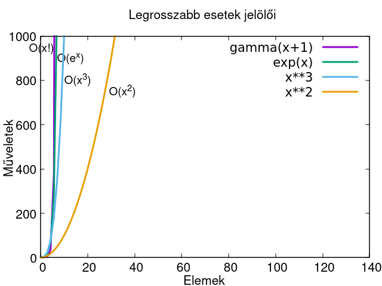

A bemenetet tengelyét 1000-re növeltem, amin látszik, hogy a legrosszabb esetet a faktoriális mutatja be.

#### Összehasonlítás

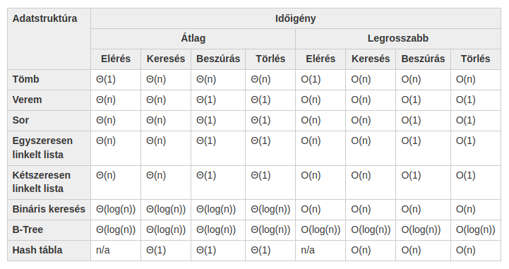

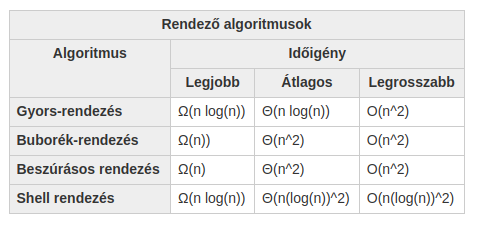

Forrás: [https://www.bigocheatsheet.com/](https://www.bigocheatsheet.com/)

#### Forrás

* [https://devopedia.org/algorithmic-complexity](https://devopedia.org/algorithmic-complexity)

### Tömb

Öt egész szám tárolására alkalmas tömb:

```java
int[] szamok = new int[5];
a[0] = 35;
a[1] = 22;
a[2] = 72;
a[3] = 14;
a[4] = 28;
```

```java
int[] szamok = {35, 22, 72, 14, 28};
```

```java
import java.util.ArrayList;
//...

ArrayList<Integer> szamLista = new ArrayList<>();

szamLista.add(35);
szamLista.add(22);
szamLista.add(72);
szamLista.add(14);
szamLista.add(28);
```

```java
import java.util.ArrayList;
import java.util.Arrays;
//...

Integer[] szamok = {35, 22, 72, 14, 28}
ArrayList<Integer> szamLista = new ArrayList<>(Arrays.asList(b));

//bejárás:
for(Integer szam : szamLista) {
    System.out.println(szam);
}
```

```java
import java.util.LinkedList;
//...

LinkedList<Integer> szamLista = new LinkedList<>();

szamLista.add(35);
szamLista.add(22);
szamLista.add(72);
szamLista.add(14);
szamLista.add(28);
```

Teljes kód:

```java
import java.util.LinkedList;

public class App {
    public static void main(String[] args) throws Exception {
        System.out.println("LinkedList használata");

        LinkedList<Integer> szamLista = new LinkedList<>();
        szamLista.add(35);
        szamLista.add(22);
        szamLista.add(72);
        szamLista.add(14);
        szamLista.add(28);
        for(Integer szam : szamLista) {
            System.out.println(szam);
        }
    }
}
```

### Lista műveletek

Bejárás:

```java
for(Integer szam : szamokLista) {
    System.out.println(szam);
}
```

Tartalmazás:

```java
boolean tartalmaz = szamokLista.contains(5);
```

Elem index alapján:

```java
Integer szam = szamokLista.get(2);
```

Index keresése:

```java
int index = szamokLista.indexOf(5);
```

Visszaadja milyen indexnél található a keresett elem. Ha az elem nincs a listában, akkor -1 értéket kapjuk.

Törlés index alapján:

```java
Integer szam = szamok.remove(0);
```

Törli az adott indexű elemet, majd visszatér az elemmel.

### Elemi adatszerkezetek

#### Verem

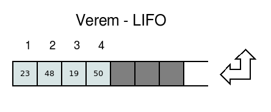

#### Sor

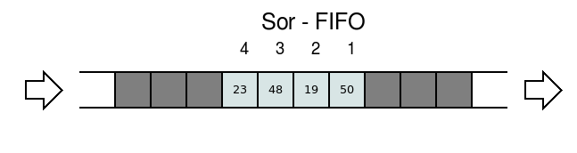

#### Láncolt lista

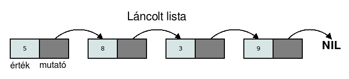

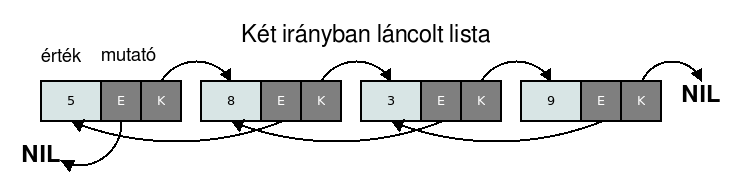

#### Fák

A gráfok olyan pontok halmaza, amelyeket vonalakkal kötünk össze.

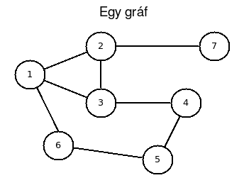

A fa egy speciális gráf. Fa adatszerkezetben a bejárás gyorsabb, szemben a listákkal.

A gráfelmélet alapján a fák meghatározása:

* körmentes (két elem között csak egyetlen út létezik)
* összefüggő egyszerű gráfok

Fa esetén létezik egy kiemelt csomópont, a gyökérelem.

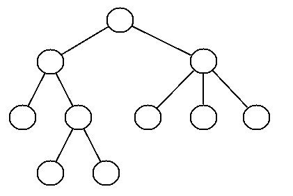

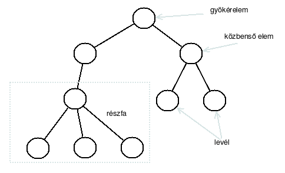

A bináris fák, speciális fák, mivel minden elemnek legfeljebb két gyermekeleme lehet.

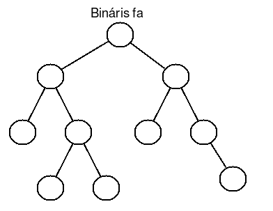

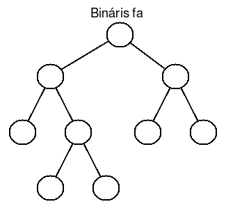

### Hashmap

A HashMap kulcs-értékpárok tárolására alkalmas lista.

```java
import java.util.HashMap;
import java.util.Map;
import java.util.Set;
import java.util.Iterator;
class Program03
{
    public static void main(String args[])
    {
        HashMap<String, String> m = new HashMap<String, String>();
        m.put("alma", "apple");
        m.put("asztal", "table");
        m.put("szék", "chair");
 
        System.out.println(m.get("asztal"));
 
        System.out.println(m.containsKey("alma"));
        System.out.println(m.containsValue("apple"));
 
        Set<Map.Entry<String, String>> h = m.entrySet();
        System.out.println("------------------");        
        Iterator<Map.Entry<String, String>> i = h.iterator();
        while(i.hasNext())
        {
            Map.Entry<String, String> elem = i.next();
            System.out.println("Kulcs: "+elem.getKey()+
                "\térték: "+ elem.getValue());
        }
        System.out.println("------------------");
 
        System.out.println("------------------");        
        for (Map.Entry<String, String> entry : m.entrySet())
        {
            System.out.println(entry.getKey() + "\t" + entry.getValue());
        }
        System.out.println("------------------");
 
        String magyar = m.get("alma");
        System.out.println("Az alma jelentése: " + magyar);
 
        Set h2 = m.keySet();
        System.out.println("Van-e alma: " + h2.contains("alma"));
 
        String s = m.remove("asztal");
        System.out.println("Töröleve ez: " + s); //Eredmény: table
 
        m.clear();
        System.out.println(m.size());
    }
}
```

* [https://docs.oracle.com/javase/8/docs/api/java/util/HashMap.html](https://docs.oracle.com/javase/8/docs/api/java/util/HashMap.html)

### Rekurzió

Ha egy függvény vagy egy metódus önmagát hívja, akkor rekurzióról beszélünk. Ciklikusan újra és újra önmagát hívja, ezért alkalmas ciklus kiváltására is. A rekurzió írásánál ügyelnünk arra, hogy gondoskodni kell annak megszakításáról, különben végtelen ciklust kapunk.

A következő példa visszafele írja ki a számokat 9-től, és minden szám után a Joe szót írja szóközzel.

```java
class Program {
    static void ki(int i) {
        System.out.println(i + " Joe");     
 
        if(i>0)
            ki(i-1);
    }   
 
    public static void main(String args[]) {
        ki(9);
    }
}
```

A rekurzió megszakításáról az if állítás gondoskodik.

A következő program bekéri a számokat 0 végjelig:

```java
import java.util.Scanner;
 
class Program { 
    static void szamok() {
        Scanner input = new Scanner(System.in); 
        System.out.print("Szam: ");
        int szam = input.nextInt();
        input = null;
        if(szam != 0)
            szamok();
    }   
 
    public static void main(String args[]) {
        szamok();
    }
}
```

### Nevezetes algoritmusok

#### Buborék rendezés

A buborékrendezés pszeudókódja:

```txt
ciklus i = n-1 .. 1
  ciklus j = 0 .. i-1
    ha t[j] > t[j+1] akkor 
      b = t[j+1]
      t[j+1] = t[j]
      t[j] = b
    ha vége
  ciklus vége
ciklus vége
```

Java megvalósítás:

```java
class Program
{
    public static void main(String args[])
    {
        int[] tomb = {4, 8, 1, 3, 5, 2, 6};
        int n = 7; // A tömb elemeinek száma
 
        for(int i= n-1; i>0; i--)
            for(int j=0; j<i; j++)
                if(tomb[j] > tomb[j+1])
                {
                    int tmp = tomb[j];
                    tomb[j] = tomb[j+1];
                    tomb[j+1] = tmp;
                }
 
        for(int i=0; i<n; i++)
            System.out.print(tomb[i] + " ");
        System.out.println();
    }
}
```

#### Rendezés beszúrással

```txt
ciklus i = 0 .. n-1
  kulcs = t[i]
  j = i - 1
  ciklus amíg j >= 0 és t[j] > kulcs
    t[j+1] = t[j]
    j = j - 1
  ciklus vége
  t[j+1] = kulcs
ciklus vége
```

Java megvalósítás:

```java
public class App {
    public static void main(String[] args) throws Exception {
        System.out.println("Rendezés beszúrással");

        int[] t = {4, 8, 1, 3, 5, 2, 6};
        int n = 7; // A tömb elemeinek száma

        for (int i = 0; i < n; i++) {
            int kulcs = t[i];
            int j = i - 1;
            while(j>=0 && t[j]>kulcs) {
                t[j+1] = t[j];
                j = j - 1;                
            }
            t[j+1] = kulcs;
        }

        for(int i=0; i<n; i++)
            System.out.print(t[i] + " ");
        System.out.println();        
    }
}
```

#### Gyorsrendezés

A gyorsrendezés átlagos bonyolultsága: θ( n log n)

A gyorsrendezést két módon szokták megvalósítani:

* tömbbel
* helyben (helyére vivő eljárással)

A gyorsrendezést általában rekurzívan valósítják meg.

##### Tömbbel megvalósított változat

A következő pszeudokód tömbbel megvalósított változatot mutatja be:

```txt
function quicksort(list) 
    if meret(list) <= 1 akkor
        return list
    var list less, equal, greater
    pivot = list[meret(list)-1]
    for each x in lista 
        if x<pivot then append x to less
        if x==pivot then append x to equal
        if x>pivot then append x to greater
    return concatenate(quicksort(less), equal, quicksort(greater))
```

A var list less, equal, greater sor azt jelenti, három listát (tömböt) hozok létre.

A Java nyelven szimpla tömbök összefűzése nem egyszerű,
öszetettebb kódot kapunk mint a helyben-rendezés,
ezért ArrayList használatával látunk egy példát.

Java megvalósítás:

```java
import java.util.ArrayList;
import java.util.Arrays;

public class App {
    public static ArrayList<Integer> quicksort(ArrayList<Integer> list) {
        if (list.size() <= 1) {
            return list;
        }
        ArrayList<Integer> less = new ArrayList<>();
        ArrayList<Integer> equal = new ArrayList<>();
        ArrayList<Integer> greater = new ArrayList<>();        

        Integer pivot = list.get(list.size()-1);
        for(Integer x: list) {
            if (x<pivot) { less.add(x); }
            if (x==pivot) { equal.add(x); }
            if (x>pivot) { greater.add(x); }
        }
        ArrayList<Integer> fullList = new ArrayList<>();
        fullList.addAll(quicksort(less));
        fullList.addAll(quicksort(equal));
        fullList.addAll(quicksort(greater));
        return fullList;
    }
    public static void main(String[] args) throws Exception {
        System.out.println("Gyors-rendezés");

        Integer[] t = {4, 8, 1, 3, 5, 2, 6};
        ArrayList<Integer> list = new ArrayList<>(Arrays.asList(t));
        list = quicksort(list);

        for(Integer num: list)
            System.out.print(num + " ");
        System.out.println();        
    }
}
```

##### Helybenrendező változat

A helyben rendező változat pszeudokódja:

```txt
quicksort(array, balIndex, jobbIndex)
    if (balindex < jobbindex>)
        pivotIndex = partition(array, balIndex, jobbIndex)
        quicksort(array, balindex, pivotIndex-1)
        quicksort(array, pivotIndex, jobbIndex)

partition(array, balindex, jobbindex)
    pivot = jobbindex
    i = balIndex - 1
    ciklus j= balIndex .. jobbindex
        ha (array[j] <= pivot)
            i = i + 1
            csere(array[i], array[j])
    csere(array[i+1], array[jobbIndex])
    visszatérünk i + 1
```

```java
public class App {
    public static int partition(int[] array, int low, int high) {
        int pivot = array[high];
        int i = low - 1;
        for (int j = low; j < high; j++) {
            if (array[j] <= pivot) {
                i++;
                int swap = array[i];
                array[i] = array[j];
                array[j] = swap;
            }
        }
        int swap = array[i + 1];
        array[i+1] = array[high];
        array[high] = swap;
        return i + 1;
    }
    public static void quicksort(int[] array, int low, int high) {
        if (low < high) {
            int pivot = partition(array, low, high);
            quicksort(array, low, pivot - 1);
            quicksort(array, pivot + 1, high);
        }
    }
    public static void main(String[] args) throws Exception {
        System.out.println("Gyors-rendezés");

        int[] t = {4, 8, 1, 3, 5, 2, 6};
        int n = 7;
        
        quicksort(t, 0, n-1);

        for(Integer num: t)
            System.out.print(num + " ");
        System.out.println();        
    }
}
```

#### Bináris keresés

A bináris keresés többféle néven ismert:

* bináris keresés
* logaritmikus keresés
* felezéses keresés

Ha már rendezett a tömbünk, használhatjuk a bináris keresést.

Vesszük a középső elemet. Ha ez a keresett szám, vége a keresésnek. Ha nem, akkor megnézzük, hogy a keresett szám a tömb alsó vagy felső részében van-e. Amelyikben van, abban megismétlem az előbbi felosztást. A ciklus lépésszáma körülbelül log(n), amit néha így írnunk: log<sub>2</sub>n.

```txt
első = 0
utolsó = n-1
ciklus amíg  első <= utolsó
  Középső :=  (Első + Utolsó)  Div 2
  Ha keresett = t[középső] akkor 
    van := igaz
    utolso := középső - 1
  ellenben ha Keresett < t[középső] akkor 
          utolsó := Középső - 1
      Ellenben ha Keresett > t[középső] akkor 
          Első := Középső + 1
      Ha vége
ciklus vége
```

A végén a "van" logikai változó mutatja, hogy van-e ilyen elem.

Java megvalósítás:

```java

public class App {
    public static void main(String[] args) throws Exception {
        System.out.println("Bináris keresés");

        int[] t = {1, 2, 3, 4, 5, 6, 8};
        int n = 7;
        
        int keresett = 5;
        boolean van = false;
        int elso = 0;
        int utolso = n-1;
        while(elso <= utolso) {
            int kozep = (elso + utolso) / 2;
            if (keresett == t[kozep]) {
                van = true;
                utolso = kozep - 1;
            }else if (keresett < t[kozep]) {
                utolso = kozep - 1;
            }else if (keresett > t[kozep]) {
                elso = kozep + 1;
            }
        }        

        System.out.println(van);
    }
}
```
