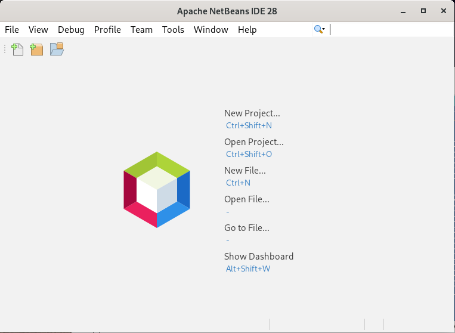
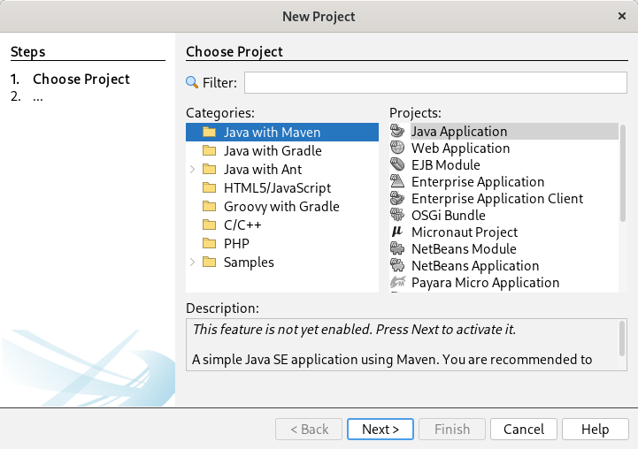
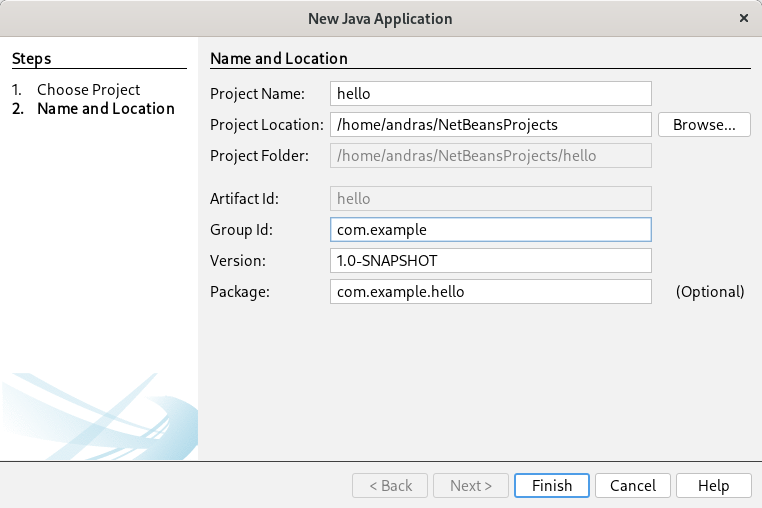
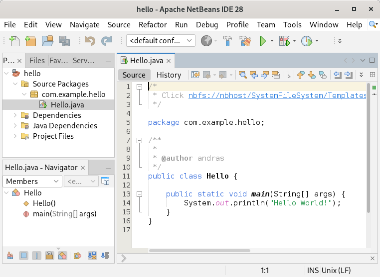
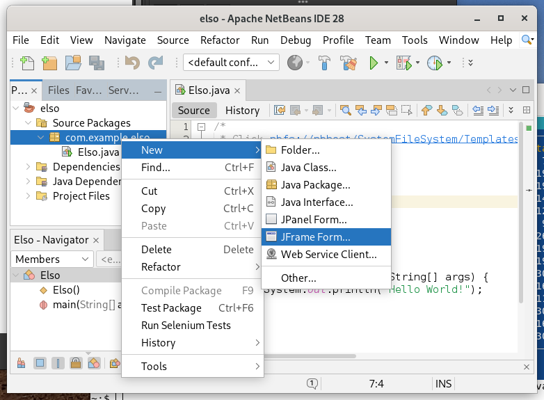
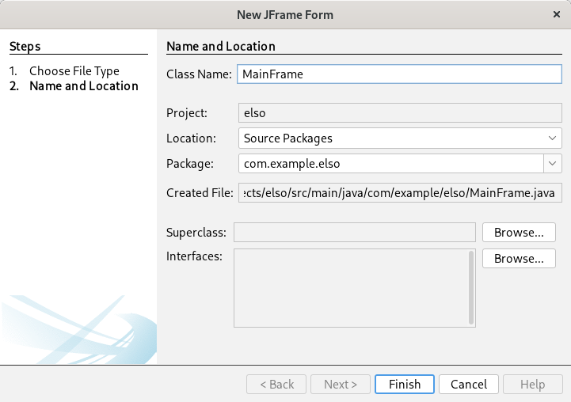
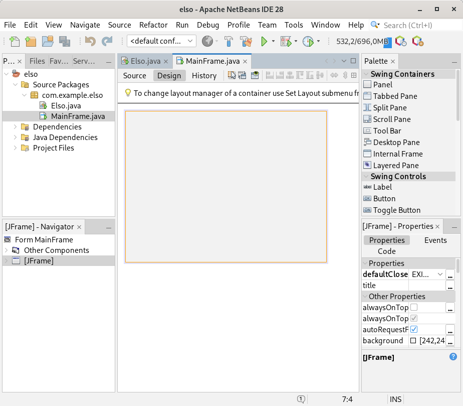
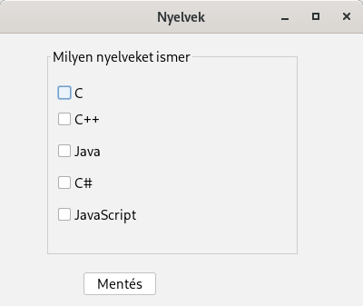

# Java Swing NetBeans

* **Szerző:** Sallai András
* Copyright (c) 2026, Sallai András
* Licenc: [CC Attribution-Share Alike 4.0 International](https://creativecommons.org/licenses/by-sa/4.0/)
* Web: [https://szit.hu](https://szit.hu)

## Tartalomjegyzék

* [Tartalomjegyzék](#tartalomjegyzék)
* [Az Apache Netbeans](#az-apache-netbeans)
* [Konzolos projekt](#konzolos-projekt)
* [Swing projekt készítése](#swing-projekt-készítése)
* [Konténerek](#konténerek)
* [Komponensek](#komponensek)
* [Párbeszédablak](#párbeszédablak)
* [CheckBox](#checkbox)
* [RadioButton](#radiobutton)
* [ComboBox](#combobox)
* [List](#list)
* [Table](#table)

## Az Apache Netbeans

Az Apache NetBeans egy nyílt forráskódú integrált fejlesztőkörnyezet (IDE), amely
elsősoran Java fejlesztésre készült, de más nyelveket is támogat mint a PHP,
C++ és a HTML5. A projekt az Apache Software Foundation tulajdona. Korábban a
Oracle tulajdona volt, NetBeans IDE néven fejlesztették.

Jellemzők:

* felhasználóbarát felület
* kódgenerálás
* integrált verziókezelő rendszer
* az adatbázis és más szerverek könnyen integrálhatók

Webhely:

* [https://netbeans.apache.org/](https://netbeans.apache.org/)

A letöltéshez kattintsunk a **Download** gombra. Letölthetünk egy kicsomagoható
bináris terjesztést is: Binary (Platform Independent): netbeans-28-bin.zip
(SHA-512, PGP ASC).

Kattinthatunk az **Installers and Packages** részben a **Codelerity packages**
linkre, a Windowsos telepítőért.

Linuxos rendszeren a beállítások a felhasználó könyvtárában, egy .netbeans nevű
könyvtárba kerülnek.

## Konzolos projekt

Első indítás után:









## Swing projekt készítése

A Swing projektet ugyanúgy kezdjük mint a konzolst. A fő kiinduló állományunk mellé készítünk egy MainWindow nevű
állományt is.

Készítsünk egy **elso** nevű projektet.

* Elso.java - belépésipont
* MainWindow.java - A főablak megjelenítése

Hozzuuk létre a főablakot.







## Konténerek

A JFrame osztállyal létrehozott ablak is egy konténer.
A konténerek újabb komponenseket vagy konténereket tartalmazhatnak.

Az egyeik gyakran használt konténer a Panel. A Swingben a JPanel osztályon keresztül érhető el.

## Komponensek

Leggyakrabban használt komponensek:

* Label - JLabel - felirat
* TextField - JTextField - bevitelimező
* Button - JButton - gomb

A feliratokat Label néven helyeezük el a tervezőfelületen, amit
a JLabel osztály valósít meg.

Számok és szövegek bekérésére bevitelimezőket használunk, ami tervezéskor
TextField néven jelenik meg, és a JTextField osztály valósítja meg.

A nyomógombok a leggyakrabban használt komponensek, felhasználói
események indítására. A tervező felületen Button, az osztály ami
megvalósítja: JButton.

Minden konténerhez és komponenshez tartoznak tulajdonságok, események és
a kódgenerálással kapcsolatos beállítások. A legfontosabb tulajdonság a
konténer vagy komponens felirata és a név, amivel elérhető a forráskódban.

Vegyük a JFrame konténer egyik kimelt tulajdonsága a **title**. A title a
címsorban megjelenő szöveget határozza meg. A **Variable Name** tulajdonság határozza
meg milyen néven érhető a forráskódból (Code fül). A JFrame alapértelmezetten **frame1**
néven érhető el.

Tegyünk fel egy gombot. A felirata és a változó név (amivel elérhető a gomb) alapból:

* **jButton1**

Ha felteszünk egy második gombot, annak felirata és elérhetősége:

* **jButton2**

A nyomógombok eseménykezelőjét az **actionPerformed** tulajdonság alatt állítjuk be.

### Esemény beállítása

Az eseménybeállítása három módon is lehetséges:

* duplán kattintunk a gombon
* Navigator ablakban jobb egér gomb
* Properties - actionPerformed tulajdonság

Bármelyiket is válasszuk, alapértelmezetten egy ilyen eseménykezelő jön létre:

```java
    private void jButton1ActionPerformed(java.awt.event.ActionEvent evt) {                                         
        // TODO add your handling code here:
    }
```

A **// TODO add your handling code here:** szöveg helyére írjuk saját kódunkat.

## Párbeszédablak

```java
import javax.swing.JOptionPane;

//...
JOptionPane.showMessageDialog(rootPane, edit.getText());
```

A rootPane a JFrame osztályból örökölt mező (adattag).

## CheckBox

A CheckBoxot a JCheckBox osztály hozza létre. Magyarul jelölőnégyzetnek nevezhető.

A jelölőnégyzet bejelöltségét, általában kattintás eseményre kérdezzük le,
például egy nyomógombon.

Legyen a példa kedvéért ismert nyelvek választása:

* C - cTick
* C++ - cppTick
* Java - javaTick
* C# - csharpTick
* JavaScript - javascriptTick

A felhasználónak be kell jelölnie milyen nyelveket ismer. Legyen egy nyomógomb,
amelynek felirata **Mentés**, változótnév **saveButton**. Az saveButtonra kattintva
tegyük listába a kiválasztott nyelveket.
Írassuk ki, a lista tartalmát.



## RadioButton

## ComboBox

## List

## Table
