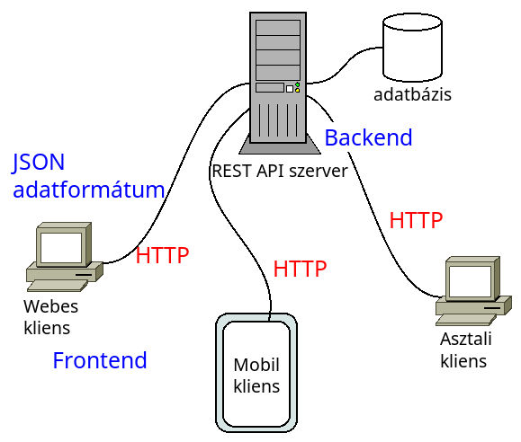

# Backend programozás - Preface

* **Szerző:** Sallai András
* Copyright (c) 2025, Sallai András
* Licenc: [CC Attribution-Share Alike 4.0 International](https://creativecommons.org/licenses/by-sa/4.0/)
* Web: [https://szit.hu](https://szit.hu)

## Tartalomjegyzék

* [Tartalomjegyzék](#tartalomjegyzék)
* [A Backendről](#a-backendről)
* [Környezet felépítése](#környezet-felépítése)
* [HTTP kliens teszteléshez](#http-kliens-teszteléshez)
* [Csomagkezelő - composer, npm](#csomagkezelő---composer-npm)
* [Webes Helló Világ](#webes-helló-világ)

## A Backendről

A Backend a weboldalak és az alkalmazások hátterét szolgálja.



Egy általános kapcsolódási lehetőséget nyújt a weboldalknak, telefonoknak és asztalai alkalmazásoknak. Az adatcsere formátumba általában JSON. Az adatokat HTTP csatornán küldjük és kezeljük.

Előnyök:

* többféle kliens csatlakozhat
* lényegtelen, hogy milyen az adatbázis
* az adatbázis könnyen cserélhető

## Környezet felépítése

Szükségünk van egy operációs rendszerre és azon a következő eszközökre:

* XAMPP
  * PHP
  * MariaDB (MySQL)
* composer
* Node.js
* Visual Studio Code

## HTTP kliens teszteléshez

### Insomnia

Nyílt forráskódú, gyors, fejlesztőbarát API tervező és csoportmunka alkalmazás. GraphQL, REST, WebSockets és gRPC kliens. Elérhető macOS, Windows és Linux operációs rendszereken.

* [https://insomnia.rest/](https://insomnia.rest/)
* [https://github.com/Kong/insomnia](https://github.com/Kong/insomnia)
* [https://docs.insomnia.rest/](https://docs.insomnia.rest/)

### Insomnium

Az Insomnium egy 100%-ban helyi és biztonság központú API kliens tesztelő. Használható GraphQL, REST, WebSockets, Server-sent események és gRPC kapcsolatok tesztelésére.

[https://github.com/ArchGPT/insomnium](https://github.com/ArchGPT/insomnium)

### Postman

Korlátozott elérésű, nyílt komponenseket használó API tervező, fejlesztő és tesztelő eszköz. Fejlesztője Postman Inc. A fejlesztést 2012-ben kezdték. Elérhető macOS, Windows és Linux rendszereken.

* [https://www.postman.com/](https://www.postman.com/)

### Parancssoros kliensek

* curl
* httpie
* resen

A resen telepíthető a következő paranccsal:

```cmd
npm install -g resen
```

Használata például:

```cmd
res http://localhost:8000/msg
```

## Csomagkezelő - composer, npm

### A composer

A composer a PHP projektek létrehozására és azok függőségeinek kezelésére használható csomagkezelő.

```cmd
composer --version
```

A composer segítségével hozzuk létre a Laravel projektet. Például:

```cmd
composer create-project laravel/laravel app01
```

### Az npm

Az npm a Node.js JavaScript keretrendszer csomagkezelője. Használható Node.js projektek létrehozására és függőségek kezelésére.

```cmd
npm --version
```

Az npm bizonytalan viselkedésre válaszul a Facebook fejlesztői létrehoztak egy alternatívát: yarn.

```cmd
yarn --version
```

A Laravel is használ Node.js csomagokat, így függőségkezelésnél az npm vagy a yarn parancsot is használjuk.

## Webes Helló Világ

Ha Laravel projektet szeretnénk létrehozni a **composer** parancsot használjuk.

```cmd
composer create-project laravel/laravel app01
```

A composer letölti az app01 könyvtárba az induló Laravel projektet.
