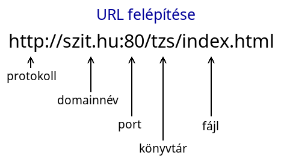
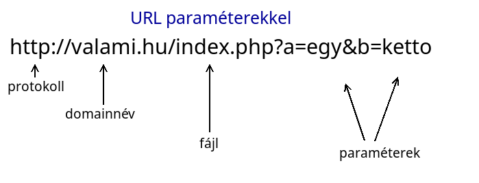
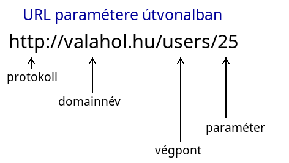
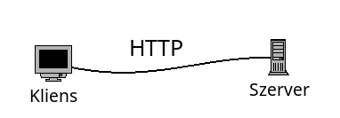
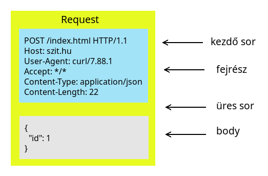
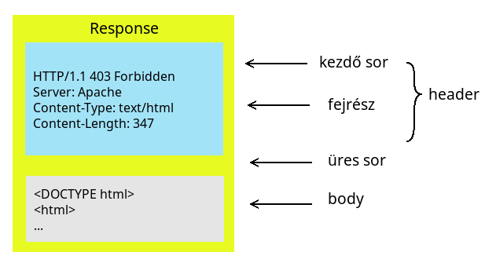

# Backend programozás - HTTP

* **Szerző:** Sallai András
* Copyright (c) 2025, Sallai András
* Licenc: [CC Attribution-Share Alike 4.0 International](https://creativecommons.org/licenses/by-sa/4.0/)
* Web: [https://szit.hu](https://szit.hu)

## Tartalomjegyzék

* [Tartalomjegyzék](#tartalomjegyzék)
* [URL](#url)
* [A HTTP protokoll](#a-http-protokoll)
* [HTTP kapcsolat](#http-kapcsolat)
* [A HTTP története](#a-http-története)
* [A HTTP kérés felépítése](#a-http-kérés-felépítése)
* [A HTTP válasz](#a-http-válasz)
* [HTTP metódusok](#http-metódusok)
* [HTTP fejlécek](#http-fejlécek)
* [HTTP body](#http-body)
* [HTTP kérés- és választípusok](#http-kérés--és-választípusok)

## URL

A HTTP áttekintése előtt ismételjük át mit kell tudni az URL-ről.

### Az URL

Az URL a Uniform Resource Locator rövidítése. Az Interneten található erőforrások (például weboldalak, képek, videók) egyedi címe. Célja, hogy pontosan meghatározza, hol található egy tartalom, és hogyan lehet hozzáférni. Gyakran nevezik webcímnek is.

Egy URL több részből áll:

* protokoll: ez az URL első része. Pl.: https:// vagy http://
* domainnév: a weboldal neve. Pl.: szit.hu
* elérési út: könyvtár, fájl. Pl. /blog/valami.php
* paraméterek: URL-paraméterek. Pl.: ?q=valami&category=másvalami



### URL-paraméterek

Az URL-paraméterek különféle paramétereket hordozhatnak a frontend és a backend között. Általában a lekérdezett adatok módosítására használjuk, például szűrésnél, keresésnél vagy oldalakra bontásnál.

Az URL-paraméterek a webhelye címe után kezdődnek (?) kérdőjelet követően. A paraméterek kulcs-érték pár formájában adjuk meg, amit (=) egyenlőségjel választ el. Ha több URL-paraméter adunk meg, azokat (&) karakterrel választjuk el.

Példa:

```url
https://valahol.hu/search?q=valami&category=másvalami
```

Példa paraméterek:

* q=valami
* category=másvalami



Ahogy az előbbi képen is látszik a port vagy az útvonal megadása nem kötelező, de paraméterek esetén is használhatjuk őket. A példában két paramétert adunk át:

* a=egy
* b=ketto

Paraméterek átadhatók URL útvanalként is. Például szeretném a 25 azonosítójú felhasználó adatati lekérni:

```url
http://valahol.hu/users/25
```



## A HTTP protokoll

A HTTP egy protokoll, amit a kliens-szerver alapú webes rendszerek között adatok szállítására használjuk.



Olyan erőforrások letöltésére használjuk mint a HTML dokumentum, vagy egyszerűen csak adatok le- és feltöltésére.


## HTTP kapcsolat

Egy HTTP kapcsolat egy kérésből és egy válaszból áll. Ezt követően a kapcsolat bontásra kerül.


## A HTTP története

* HTTP 0.9 - 1991
* HTTP 1.0 - 1996
* HTTP 1.1 - 1997 és 1999
* HTTP 2.0 - 2015
* HTTP 3.0 - QUIC protokollon alapszik

A QUIC egy szállítási protokoll UDP alapokon, amit a Google fejlesztett. A webszerverek jellemzően a HTTP 1.1-t ismerik, de beüzemelhető újabb verzió is.

## A HTTP kérés felépítése

A HTTP kérés egy meghatározott szerkezetű szöveges információ.



Első sora tartalmazza a kérés módját, a kért tartalmat és a HTTP verziószámát. A következő sorok fejlécsorok tetszőleges számban. A fejlécsorokat egy üres sor követi, ami után jöhet az üzenet teste.

* mód - metódus
* kért tartalom - erőforrás
* verzió - a HTTP verziója

```txt
metódus erőforrás verzió
fejléc: érték
fejléc: érték

üzenettest
```

A legegyszerűbb esetben két sort tartalmaz egy kérés. Egy fejléc kötelező, a Host, vagyis honnan töltjük le az erőforrást.

```http
GET /index.html HTTP/1.1
Host: szit.hu

```

A kérés végét egy üres sorral jelezzük.

## A HTTP válasz

Egy HTTP válasz hasonlóan épül fel a kéréshez.



## HTTP metódusok

* GET - erőforrás letöltése
* POST - adat feltöltése
* PUT - adat feltöltése egy erőforrás számára
* PATCH - adat feltöltése egy erőforrás számára
* DELETE - erőforrás törlése

További metódusok:

* HEAD - mint a GET, de csak a válasz fejlécet kérjük
* TRACE - a kérés vissza küldése
* OPTIONS - a szerver által támogatott HTTP metódusok lekérése
* CONNECT - a kérésből transzparens csatorna

A GET, HEAD, TRACE és OPTIONS metódusok nem változtatják meg a szerver állapotát, ezért biztonságosnak mondhatjuk. Ha többször ismételjük a kérését, ugyanazt az eredmény kell kapjuk, így a kliensek ezt ismételhetik.

## HTTP fejlécek

A HTTP fejlécek a kliensek és a szerverek számára további információk átadására adnak lehetőséget. A HTTP fejlécek kis- és nagybetűket megkülönböztető nevekből állnak. Utána egy (:) kettőspont következik, amit az érték követ. A szóközök az érték előtt figyelmen kívül maradnak.

Az egyéni fejléceket korábban X- előtaggal használták, de ez 2012-ben elavulttá vált.

Kontextus szerint csoportosítsuk a fejléceket:

* kérésfejlécek
* válaszfejlécek
* reprezentációs fejlécek
* hasznos adatfejlécek

Csoportosítás a proxy kezelése alapján:

* Connection
* Keep-Alive
* Proxy-Authenticate
* Proxy-Authorization
* TE
* Trailer
* Transfer-Encoding
* Upgrade

### Hitelesítés

WWW-Authenticate

Meghatározza az erőforrás eléréséhez használandó hitelesítései módszert.

Auhtorization

Tartalmazza a felhasználói ügynök kiszolgálóval történő hitelesítéshez szükséges adatokat.

### Gyorsítótárazás

Age

Az az idő másodpercekben, ameddig az objektum a proxy gyorsítótárban volt.

Expires

Az a dátum/idő, amely után a válasz elavultnak minősül.

### Feltételek

Last-Modified

Az erőforrás utolsó módosítási dátuma. Akkor hasznos, ha az erőforrásnak több verziója elérhető.

ETag

Az erőforrás verzióját azonosítja, karakterláncként.

If-Match

Csak akkor alkalmazza kérést, ha egyezik az egyik ETag fejléccel.

### Kapcsolatkezelés

Connection

Szabályozza, hogy a hálózati kapcsolat nyitva maradjon-e, az aktuális tranzakció befejezése után.

Keep-Alive

Szabályozza, hogy mennyi ideig maradjon nyitva egy kapcsolat.

### Tartalmi egyeztetés

Accept

A szervert tájékoztatjuk a visszaküldhető adattípusról.

Accept-Encoding

A visszaküldött erőforráson használható kódolási algoritmus.

Accept-Language

A szervernek üzenet, hogy milyen emberi nyelven válaszolhat.

### Vezérlők

Expect

Egy elvárást jelöl, amelyeket a szervernek teljesítenie kell a kérés megfelelő kezeléshez.

Max-Forwards

A használat során a TRACE azt jelzi, hogy a kérés hány ugrását végezhet, mielőtt megjelenik a feladónak.

### Cookie

Cookie

A szerver által korábban fejléccel együtt küldött HTTP sütiket tartalmazza.

Set-Cookie

Süti küldése a szerverről a kliensnek.

### CORS

Access-Control-Allow-Origin

Jelzi, hogy megosztható-e a válasz.

Acces-Control-Allow-Credentials

A kérésre adott válasz, elérhető-e, ha hitelesítő adatok jelzője igaz.

Access-Control-Allow-Headers

Elővizsgálati kérés esetén használjuk, hogy jelezzük, mely HTTP fejlécek használhatók a tényleges kérés benyújtásakor.

Access-Control-Allow-Methods

Előzetes vizsgálati kérelemre válaszul, meghatározzuk az engedélyezett metódusokat.

Access-Control-Expose-Headers

Jelzés, mely fejlécek jeleníthetők meg a válasz részeként.

Access-Control-Max-Age

Az elővizsgálati kérés eredményét mennyi ideig lehet gyorsítótárban tárolni.

Access-Control-Request-Headers

Elővizsgálati kérés kibocsátásakor használjuk, a szerver számára megmondjuk, mely HTTP-fejléceket fogja használni a tényleges kérésben.

Access-Control-Request-Method

Elővizsgálati kérés kibocsátásakor használjuk, a szerver számára megmondjuk, mely HTTP-metódust fogja használni a tényleges kérésben.

Origin

Jelzi, honnan származik a kérés.

### Az üzenettörzs információi

Content-Length

Decimális bájtokban az erőforrás mérete.

Content-Type

Az erőforrás médiatípusa.

Content-Encoding

A tömörítő algoritmus.

Content-Language

Az emberi nyelv beállítása.

Content-Location

A küldött adatok másik helye.

### Proxy-k

Forwarded

Kliens oldalról származó információk.

X-Forwarded-For

A csatlakozó kliens IP címe, ami HTTP-proxyn vagy terheléselosztón keresztül csatlakozik.

### Átirányítások

Location

Ahova az átirányítás történik

### Kontextus kérelem

From

A felhasználói ügynököt felügyelő ember e-mail címe.

Host

A kiszolgáló tartományneve. Opcionálisan az TCP portszám, ahol figyel a kiszolgáló.

Referer

Az előző weboldal címe, ahonnan kért hivatkozást követte.

User-Agent

Az alkalmazás leírása.

### A válasz kontextusa

Allow

Támogatott HTTP metódusok

Server

A kiszolgáló szoftverről információ.

### Tartománykérések

Range

A dokumentum azon része, amit a szervernek vissza kell adni.

### Biztonság

Cross-Origin-Resource-Policy(CORP)

A fejlécben nem szereplő más tartományok nem olvashatják az erőforrást.

### Forrás

További fejlécek

* [https://developer.mozilla.org/en-US/docs/Web/HTTP/Headers](https://developer.mozilla.org/en-US/docs/Web/HTTP/Headers)

## HTTP body

A HTTP része a body, amely tartalmazza az átvitt adatokat szerver és kliens között.

A HTTP kérésekben a body nem kötelező. A válaszban azonban kötelező, a HEAD kérések kivételével.

A body szöveges vagy bináris formátumban tartalmazhat adatokat. Szöveges adatok esetén MIME típus és a karakterkódolásnak megfelelően van formázva. Ilyen például az XML, JSON, HTML, stb. Bináris adatok esetén a bájtfolyam van a body-ban, ami lehet kép, zenei fájl, vagy más.

REST API-k esetén a body tartalma általában JSON formátumú.

## HTTP kérés- és választípusok

A HTTP válaszok első sora a protokoll verzióját tartalmazza, utána egy státuszkód, majd egy szöveges indoklás. Ezek után tetszőleges fejlécsor, majd egy üres sor, és az üzenet teste.

```http
verzió státuszkód indoklás
fejléc: érték
fejléc: érték
fejléc: érték

üzenettest
```

Lehetséges státuszkódok:

* 1xx - kérést megkaptuk
* 2xx - siker, kérés elfogadva
* 3xx - átirányítás, további művelet szükséges
* 4xx - kliens hiba, a kérés hibás
* 5xx - szerver hiba, a válasz nem teljesíthető
