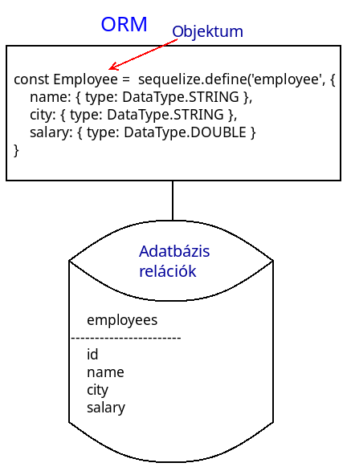
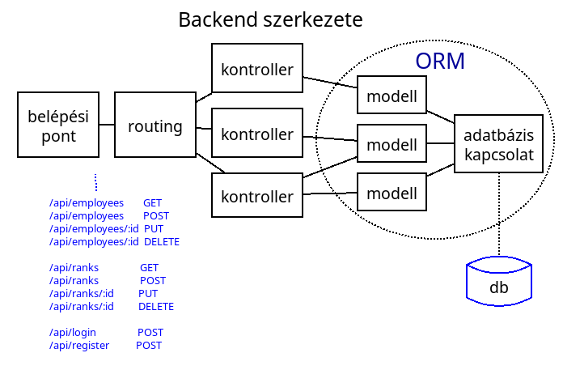

# Backend programozás - Express

* **Szerző:** Sallai András
* Copyright (c) 2023, Sallai András
* Szerkesztve: 2025
* Licenc: [CC Attribution-Share Alike 4.0 International](https://creativecommons.org/licenses/by-sa/4.0/)
* Web: [https://szit.hu](https://szit.hu)

## Tartalomjegyzék

* [Tartalomjegyzék](#tartalomjegyzék)
* [Szükséges](#szükséges)
* [Express és a Sequelize](#express-és-a-sequelize)
* [Első Express projekt](#első-express-projekt)
* [Kontrollerek](#kontrollerek)
* [HTTP válaszok testreszabása](#http-válaszok-testreszabása)
* [HTTP adat fogadása a klienstől](#http-adat-fogadása-a-klienstől)
* [Beállítások tárolása](#beállítások-tárolása)
* [ORM használata](#orm-használata)
* [SQLite használata](#sqlite-használata)
* [SQLite beállításfájlból](#sqlite-beállításfájlból)
* [MariaDB](#mariadb)
* [Kontroller modell használattal](#kontroller-modell-használattal)
* [Több adatbázis használata](#több-adatbázis-használata)
* [Táblák közötti kapcsolatok](#táblák-közötti-kapcsolatok)
* [Azonosítás](#azonosítás)
* [Bejelentkezés](#bejelentkezés)
* [Érvényesség](#érvényesség)
* [Biztonság](#biztonság)

## Szükséges

* Node.js
* VSCode
* Insomnia vagy Insomnium és a resen

## Express és a Sequelize

Az Express minimalista, rugalmas webes keretrendszer, ami Node.js-sel van megvalósítva.
Sok népszerű keretrendszer alapszik az Expressen.

A Sequelize egy ORM rendszer, ami a modelleket leképezi adatbázisra. Ebben a leírásban ezt fogjuk
használni az Express mellett.

## Első Express projekt

### Az index.js végponttal

Készítsünk egy új projektet **hello** néven:

```cmd
mkdir hello
cd hello
npm init -y
npm install express
mkdir app
```

ECMASCript szabványt fogjuk használni, ezért a package.json fájlban írjuk át a type kulcs tartalmát "module" értékre.

```json
{
    "type": "module"
}
```

Az app könyvtárban készítsünk egy index.js fájlt, a következő tartalommal:

_app/index.js:_

```javascript
import express from 'express';

// Express alkalmazás létrehozása
const app = express();

//egy /msg nevű végpont beállítása:
app.get('/msg', (req, res) => {
  res.send('Helló üzenet'); // Üzenet visszaküldése
});

// A REST API szerver fusson a 8000-s porton:
app.listen(8000, () => {
  console.log('Server is running on port 8000');
});
```

Ez a kis program a kezdetleges REST API szerverünk, futtassuk azt.

Futtatás:

```cmd
node app
```

A futtatás eredményeként, elindul a szerver és megjelenik a terminálban a "listening on port: 8000" szöveg. A szerver az előtérben fut, így nem adja vissza a várakozási jelet.

Ellenőrizzük a végpontot, például curl paranccsal:

```cmd
curl localhost:8000/msg
```

Használhatjuk a HTTPie alkalmazás http parancsát is:

```cmd
http localhost:8000/msg
```

A resen csomag res parancsával:

```cmd
res localhost:8000/msg
```

Nézzük meg az eredményt az Insomnia vagy Insomnium alkalmazásban is.

A futó szervert állítsuk le a Ctrl + C billentyűkombinációval.

### JSON válasz

Készítsünk egy újabb projektet például **jes** néven.

JSON válaszhoz készítsünk például egy tömböt, aminek most egyetlen eleme van:

```javascript
const data = [
    { title: 'Helló Express'}
];
```

Teljes kód:

_app/index.js_:

```javascript
import express from 'express';
const app = express();

const data = [
  { title: 'Helló Express' }
];

app.get('/msg', (req, res) => {
  res.send(data);
});

app.listen(8000, () => {
  console.log('Server is running on port 8000');
});
```

Futtassuk a szervert, és teszteljük res, curl vagy http paranccsal.

### Express több végponttal

Készítsünk egy **pcshop** nevű projektet. Az alkalmazást az **app** könyvtárban hozzuk létre.
A projekt értelemszerűen legyen Node.js projekt. A package.json fájlban állítsuk be ES szabványt,
vagyis a type kulcs értéke legyen "module". Telepítsük az Express csomagot.
Az adatokat egyenlőre nem adatbázisból vesszük, helyette beépítjük az adatokat a kódba, tömb formájában.

Készítsük el a következő **app/index.js** állományt:

_app/index.js_:

```javascript
import express from 'express';
const app = express();

const products = [
    { id: 1, name: 'CD-ROM', price: 34 },
    { id: 2, name: 'CPU',  price: 38 },
    { id: 3, name: 'RAM', price: 27 }
];

const customers = [
    { id: 1, name: 'Varga Béla', email: 'varga@kek.lan' },
    { id: 2, name: 'Dante Irén',  email: 'dante@kek.lan' },
    { id: 3, name: 'Lant Ferenc', email: 'lant@kek.lan' }
];

app.get('/products', (req, res) => {
    res.send(products);
});

app.get('/customers', (req, res) => {
    res.send(customers);
});

app.listen(8000, () => {
    console.log('listening on port: 8000');
});
```

### Metódusok

Nézzük meg, hogyan használunk egyetlen végponton több metódust. A végpont neve ebben az esetben nem változik.

Készítsünk egy új **metod** nevű projektet. A projekt ES modulokat használjon. Az alkalmazást az **app** könyvtárban fejlesszük. A belépésipont az index.js fájl. Telepítsük az express csomagot.

Használjunk get és post metódust is:

_app/index.js:_

```javascript
import express from 'express';
const app = express();

app.get('/msg', (req, res) => {
    res.send({msg: 'Helló get metódus'});
});

app.post('/msg', (req, res) => {
    res.send({msg: 'Helló post metódus'});
});

app.listen(8000, () => {
    console.log('listening on port 8000');
});
```

Teszteljük mindkettőt. Használjuk a resen csomag **res** parancsát vagy a HTTPie csomag http parancsát:

```cmd
res localhost:8000/msg
```

```cmd
http post localhost:8000/msg
```

Fejlesszük tovább az alkalmazásunkat és valósítsunk meg minden metódust.

_app/index.js:_

```javascript
import express from 'express';
const app = express();

app.get('/msg', (req, res) => {
    res.send({msg: 'get metódus'});
});

app.post('/msg', (req, res) => {
    res.send({msg: 'post metódus'});
});

app.put('/msg', (req, res) => {
    res.send({msg: 'put metódus'});
});

app.patch('/msg', (req, res) => {
    res.send({msg: 'patch metódus'});
});

app.delete('/msg', (req, res) => {
    res.send({msg: 'delete metódus'});
});

app.listen(8000, () => {
    console.log('listening on port 8000');
});
```

Teszteljük az alkalmazást valamilyen HTTP klienssel.

### Express router

Készítsünk egy **utas** nevű projektet.

A **Router** függvény használatával az alkalmazás egyes részei szétválaszthatók, és a végpontok is külön kezelhetők.

Először lássuk egyetlen fájlban a használatát. Készítsünk egy index.js fájlt az app könyvtárban:

_app/index.js:_

```javascript
import express from 'express';
import Router from 'express';

const app = express();
const router = Router();

const products = [
    { id: 1, name: 'CD-ROM', price: 34 }
];


/* A routingot most a router objektumon
   állítjuk be.
*/
router.get('/products', (req, res) => {
    res.send(products);
});

/* Első paraméterként megadunk egy 
   alap útvonalt a /api 
   A második paraméterben mondjuk meg, 
   hogy a router objektumot szeretnénk 
   használni.
*/
app.use('/api', router);

app.listen(8000, () => {
    console.log('listening on port: 8000');
});
```

Indítsuk el a szervert és teszteljük:

```cmd
res localhost:8000/api/products
```

### Az Express router szétbontva

Készítsünk két külön állományt egy **routes.js** és egy **index.js** fájlt, az app könyvtárban.

_app/routes.js:_

```javascript
import Router from 'express';
const router = Router();

const products = [
    { id: 1, name: 'CD-ROM', price: 34 }
];

router.get('/products', (req, res) => {
    res.send(products);
});

export default router
```

_app/index.js:_

```javascript
import express from 'express';
import router from './routes.js';

const app = express();

app.use('/api', router);

app.listen(8000, () => {
    console.log('listening on port: 8000');
});
```

Indítsuk el az alkalmazást:

```cmd
node app
```

### Express gyakorlat

Készítsen projektet **rendelo** néven.

* Állítsa be az ECMAScript használatát.
* Telepítése az Express szervert.
* Hozzon létre egy **patients** nevű végpontot.
* A patients végpont adjon vissza egy pac nevű JSON objektumot.
* A pac objektumban tároljon nevet, kezelés dátumot, életkort.
* A pac objektumban vegyen fel tetszőleges adatokat.
* A szerver 16500 porton figyeljen.
* Indítsa el a szervert.
* Ellenőrizze HTTP klienssel a végpontot.

## Kontrollerek

A következő célunk, hogy a választ egy kontrollerben generáljuk, leválasztva azt az útválasztásról.

### Új projekt

Készítsünk egy új projektet **empapi** néven. Node.js projekt:

```cmd
mkdir empapi
cd empapi
npm init -y
```

A következő könyvtárszerkezetet hozzuk létre:

```txt
empapi/
  |-node_modules/
  |-app/
  |   |-controllers/
  |   |  `-employeeController.js
  |   |-routes/
  |   |  `-api.js
  |   `-index.js
  |-package-lock.json
  `-package.json
```

Függőségek telepítése:

```cmd
npm install express
npm install --save-dev nodemon
```

A **nodemon** lehetővé teszi számunkra, hogy az alkalmazás fejlesztése során minden egyes mentéskor azonnal legyen aktuális a fejlesztett rész.

Írjunk egy indító scriptet és állítsuk be a package.json fájlban a type kulcsot "module" értékre.

A package.json fájlban az indító script és a típus részlet:

```json
  "scripts": {
    "dev": "nodemon app --watch app"
  },
  "type": "module"
```

### Útválasztás

Hozzuk létre a routingot a **routes** könyvtárban **api.js** néven, a következő tartalommal:

_app/routes/api.js:_

```javascript
import Router from 'express'
const router = new Router()

router.get('/employees', (req, res) => {
    res.json({msg: 'működik'})
})

export default router
```

Jelenleg egyetlen JSON adatot adunk vissza egy "msg" tulajdonsággal, a json() függvénnyel. A json() függvény beállítja a HTTP fejlécet is.

### Belépési pont

_app/index.js:_

```javascript
import express from 'express'
import router from './routes/api.js'
const app = new express()

app.use('/api', router)

app.listen(8000, () => {
    console.log('Port: 8000')
})
```

Indítsuk el az alkalmazást:

```cmd
npm run dev
```

Teszteljünk egy HTTP klienssel.

```cmd
res localhost:8000/api/employees
```

### Kontroller elkészítése

Készítsünk egy **employeeController.js** fájlt, a controllers könyvtárban, az alábbi tartalommal:

_app/controllers/employeeController.js_:

```javascript
const EmployeeController = {
    index: (req, res) => {
        res.json({msg: 'Kontroller itt'});
    }
}

export default EmployeeController
```

### Kontroller hívása az útválasztóból

Készítsünk az app könyvtárban egy routes nevű könyvtárat. Hozzunk benne létre egy api.js fájt.

```txt
empapi/
  |-node_modules/
  |-app/
  |   |-controllers/
  |   |  `-employeeController.js
  |   |-routes/
  |   |  `-api.js
  |   `-index.js
  |-package-lock.json
  `-package.json
```

A routes/api.js fájlban hozzunk létre egy útválasztást, ahol használjuk az EmployeeController-t.

_app/routes/api.js_:

```javascript
import Router from 'express'
import EmployeeController from '../controllers/employeeController.js'
const router = new Router()

router.get('/employees', EmployeeController.index)

export default router
```

Teszteljük újból. Most már a kontrollerből jön a válasz.

Teszteljün valamilyen HTTP klienssel.

```cmd
curl http://localhost:8000/api/employees
```

```cmd
res http://localhost:8000/api/employees
```

### Az összes metódus megvalósítása

Valósítsuk meg az összes metódust.

_app/controllers/employee.controller.js_:

```javascript
const EmployeeController = {
    index: (req, res) => {
        res.json({msg: 'read művelet'});
    },
    store: (req, res) => {
        res.json({msg: 'create művelet'});
    },
    update: (req, res) => {
        res.json({msg: 'update művelet'});
    },
    destroy: (req, res) => {
        res.json({msg: 'delete művelet'});
    }
}

export default EmployeeController
```

_app/routes/api.js_:

```javascript
import Router from 'express'
import EmployeeController from '../controllers/employeeController.js'
const router = new Router()

router.get('/employees', EmployeeController.index)
router.post("/employees", EmployeeController.store);
router.put("/employees", EmployeeController.update);
router.delete("/employees", EmployeeController.destroy);

export default router
```

## HTTP válaszok testreszabása

### JSON válasz a kontrollerben

A JSON segítségével több adatot is visszaadhatunk:

```javascript
res.json({
    success: true,
    msg: 'Valami'
    });
```

A példában egy success és egy msg tulajdonságot adunk vissza. A success megmutatja az üzenet sikeres vagy nem, az msg magát az üzenetet tartalmazza.

_app/controllers/employeeController.js_:

```javascript
const EmployeeController = {
    index: (req, res) => {
        res.json({
            success: true,
            msg: 'read művelet újra'
        });
    }
}

export default EmployeeController
```

### HTTP válaszkód

Szabályozhatjuk milyen válaszkódot adunk. Láncolva:

```javascript
res.status(200).json({msg: 'Valami'});
```

Több sorba:

```javascript
res.status(200)
res.json({msg: 'Valami'});
```

_api/controllers/employeeController.js_:

```javascript
const EmployeeController = {
    index: (req, res) => {
        res.status(200).json({msg: 'Valami'});
    }
}

module.exports = EmployeeController
```

Néhány lehetséges válaszkód:

| Státuszkód | Jelentés |
|---|---|
| 200 | OK |
| 201 | Created |
| 204 | No Content |
| 301 | Moved Permanently |
| 400 | Bad Request |
| 401 | Unauthorized |
| 403 | Forbidden |
| 404 | Not Found |
| 405 | Method Not Allowed |
| 500 | Internal Server Error |

Az **empapi** elérhető a következő helyen:

* [https://github.com/oktat/empapi_elso.git](https://github.com/oktat/empapi_elso.git)

## HTTP adat fogadása a klienstől

HTTP adatokat szeretnénk fogadni, egyelőre a belépésiponton, ez az index.js állomány lesz.


Készítsünk egy egyszerű Express REST API-t, ami read művelet tud /msg végponttal. A neve legyen **fogadas**.

Készítsünk a projektet az alábbiak szerint:

```txt
fogadas/
  |-app/
  |  `-index.js
  `-package.json
```

```bash
mkdir fogadas
cd fogadas
npm init -y
```

Telepítsük az express-t:

```bash
npm install express
```

Állítsuk be a package.json fájlt:

```json
{
    "type": "module"
}
```

Írjuk meg a belépésipontot. Jelenleg ez lesz az egyetlen állományunk.

_app/index.js_:

```javascript
import express from 'express';
const app = express();

app.get('/msg', (req, res) => {
    res.send('Működik');
});

app.listen(8000, () => {
    console.log('listening on port 8000');
});
```

Mondjuk meg, hogy szeretnénk JSON adatot fogadni. Ezt az Express beépített json() nevű köztes szoftverével valósítjuk meg:

```javascript
app.use(express.json());
```

Egészítsük ki az útválasztást egy POST metódussal, ami szintén a /msg végponton működik, fogadja a kéréssel érkező adatokat, és visszaküldi változatlanul:

```javascript
app.post('/msg', (req, res) => {
    res.send(req.body);
});
```

Szemben az **express.json()** függvénnyel, korábban a **body-parser** csomag volt használatos, de az **elavult** lett. Az Express már köztes szoftver formájában tartalmazza JSON értelmezőt.

_app/index.js_:

```javascript
import express from 'express';
const app = express();

app.use(express.json());

app.get('/msg', (req, res) => {
    res.send('Működik');
});

app.post('/msg', (req, res) => {
    res.send(req.body);
});

app.listen(8000, () => {
    console.log('listening on port 8000');
});
```

Indítsuk el a szervert. Ha az index.js fájl egy app könyvtárban van, akkor:

```cmd
node app
```

Ha fut a szerver, akkor teszteljük egy HTTP klienssel. Például resen csomag res parancsa:

```cmd
res POST http://localhost:8000/msg name=Valaki
```

A res parancs a "name" kulcsot, a "Valaki" értékkel JSON formátumban küldi el. Helyes műkdöés esetén ehhez hasonló választ kell kapjunk:

```txt
200 OK
Content-Type: application/json; charset=utf-8
Date: Tue, 16 Sep 2025 12:13:16 GMT
X-Powered-By: Express
{
  "name": "Valaki"
}
```

### Adat fogadása kontrollerben

Vegyük elő az **empapi** projektünket vagy készítsünk egy másikat, ha az nem áll rendelkezésre.

Az eddigiekben létrehoztunk egy belépési pont, egy útválasztót és egy kontrollert.


```txt
empapi/
  |-app/
  |  |-controllers/
  |  |  `-employeeController.js
  |  |-routes/
  |  |  `-api.js
  |  `-index.js
  `-package.json
```

Az Express szerverünk nem képes JSON adatokat fogadni alapértelmezetten. Ahhoz, hogy értelmezni tudja a JSON adatokat, kell egy értelmező. Az express egy json() függvényt tesz elérhetővé az értelmezéshez, amit köztes szoftverként tudunk használni.

Az index.js-ben adjuk hozzá az express.json() köztes szoftvert:

```javascript
app.use(express.json());
```

A köztes szoftvereket több módon is használhatjuk. Az egyik lehetőség a use() függvény.

Egy szerver írása során, egy idő után szeretnénk naplózást is szabályozni. Erre külső csomagot használunk, például a **morgan**.

Telepítsük a **morgan** naplózót:

```cmd
npm install morgan
```

A használathoz köztes szoftverként regisztráljuk:

```javascript
import morgan from 'morgan';
//...
app.use(morgan('tiny'));
```

A szerver belépési pontja, a teljes index.js:

_app/index.js_:

```javascript
import express from 'express';
import morgan from 'morgan';
import router from './routes/api.js';

const app = express();

app.use(morgan('tiny'));
app.use(express.json());
app.use('/api', router);

app.listen(8000, () => {
    console.log('port: 8000');
});
```

Fontos az app.use(express.json()); hívás. Ezt meg kell előzze az app.use('/api', router); sort.

Készítsünk egy útválasztó bejegyzést, ami POST metódust fogad és az EmployeeController, store() függvényét futtatja.

> Ha az előző empapi projektet használja, akkor ez már készen van.

Az api.js két bejegyzéssel:

_api/routes/api.js_:

```javascript
import Router from 'express';
import EmployeeController from '../controllers/employee.controller';
const router = Router();

router.get('/employees', EmployeeController.index);
router.post('/employees', EmployeeController.store);

exports default = router
```

Ha előző munkánkból megmaradt a többi útvonal, nyugodtan ott hagyhatjuk.

Készítsük el a kontrollerben a **store()** függvényt:

```javascript
store: (req, res) => {
    res.status(200).json({ezt_kuldted: req.body})
}
```

A teljes kontroller, index és store függvényekkel:

_api/controllers/employeeController.js_:

```javascript
const EmployeeController = {
    index: (req, res) => {
        res.status(200).json({msg: 'Valami'});
    },
    store: (req, res) => {
        res.status(200).json({ezt_kuldted: req.body})
    }
}

exports default EmployeeController
```

Teszteljük a végpontot POST metódussal. A http paranccsal például:

```bash
http POST http://localhost:8000/api/employees name=Valaki
```

A lehetséges kimenet:

```txt
http POST http://localhost:8000/api/employees name=Valaki 
HTTP/1.1 200 OK
Connection: keep-alive
Content-Length: 33
Content-Type: application/json; charset=utf-8
Date: Sun, 21 May 2023 21:07:31 GMT
ETag: W/"21-TQ2+VhlWHm1aN+P6nd9r3i9oU6o"
Keep-Alive: timeout=5
X-Powered-By: Express

{
    "ezt_kuldted": {
        "name": "Valaki"
    }
}
```

Küldjünk több adatot:

```cmd
http POST http://localhost:8000/api/employees name='Pártus László' city='Szeged' salary=358
```

Ha http parancsot használjuk, lehetőség van arra, hogy az adatokat egy .txt vagy .json fájlba tegyük:

_adat.txt_:

```json
{
    "name": "Pártus László",
    "city": "Szeged",
    "salary": 387
}
```

Ezek után az adat.txt állományt egyszerűen irányítsuk a http parancsra:

```cmd
http POST http://localhost:8000/api/employees < adat.txt 
```

### Adatellenőrzés

Ha a _api/controllers/employeeController.js_ fájlban fogadjuk az adatokat, érdemes ellenőrizni azok léteznek-e. Ha várunk például egy **name** mezőt, de az nem érkezik meg, azonnal küldhetünk hibakódot.

```javascript
store: (req, res) => {
    if(!req.body.name) {
        res.status(400);
        res.json({message: 'Bad Request'});
    }
    res.status(201).json({ezt_kuldted: req.body})
}
```

A **req.body.name** tulajdonságban kellene megkapjunk egy "name" értéket. Ezt ellenőrizzük az if() utasításban. Ha nincs a kérésben "name" tulajdonság, akkor a válaszkódot beállítjuk 400-ra, az üzenetet pedig "Bed Request"-re.

Ellenőrizzük úgy, hogy nem küldünk adatot:

```bash
http post localhost:8000/api/employees
```

A lehetséges kimenet:

```bash
http post localhost:8000/api/employees
HTTP/1.1 400 Bad Request
Connection: keep-alive
Content-Length: 25
Content-Type: application/json; charset=utf-8
Date: Sat, 03 Jun 2023 19:26:28 GMT
ETag: W/"19-FkPEY9wpMIN361xso7ugHGed8Qg"
Keep-Alive: timeout=5
X-Powered-By: Express

{
    "message": "Bad Request"
}
```

Most küldjünk egy name tulajdonságot tetszőleges értékkel:

```bash
http post localhost:8000/api/employees name='Béla'
```

A lehetséges kimenet:

```bash
http post localhost:8000/api/employees name='Béla'
HTTP/1.1 201 Created
Connection: keep-alive
Content-Length: 32
Content-Type: application/json; charset=utf-8
Date: Sat, 03 Jun 2023 19:30:11 GMT
ETag: W/"20-2hNokITzoaufR2pu/z4Hctjl+fA"
Keep-Alive: timeout=5
X-Powered-By: Express

{
    "ezt_kuldted": {
        "name": "Béla"
    }
}
```

Felvehetünk több tulajdonságot is. A következő példában elvárjuk a **name** és a **city** mezőt is. Ha az egyik hiányzik hibakód a válaszunk:

```javascript
store: (req, res) => {
    if(!req.body.name || !req.body.city) {
        res.status(400);
        res.json({message: 'Bad Request'});
    }
    res.status(201).json({ezt_kuldted: req.body});
}
```

### Paraméterek fogadása

Egy HTTP kommunikációban az adatokat adhatunk át az URL-ben is. Az URL-ben egyszerű paraméterként is küldhetünk adatokat.


Ezt általában a domain név után **/** jellel elválasztva tesszük. Böngészőbe, vagy HTTP klienshívásban például beírhatom:

```url
valahol.hu/api/employees/1
```

A példában átküldtem egy **1** értéket.

A következő példában átküldünk egy 23-as és egy 45-ös értéket:

```url
valahol.hu/api/employees/23/45
```

A paraméter átvételére általában az update és delete műveletnél szükséges. Szeretnénk megmondani, melyik elemet kell törölni, vagy melyik elemet kell frissíteni.

A read műveletnél is előfordulhat, ha olyan végpontot szeretnék írni, ami a sokaságból egyetlen elemet ad vissza. Paraméterként megmondjuk melyik elemet szeretnénk megjeleníteni.

Nézzük meg a delete műveletnél a paraméter átvételét.

Elsőként jelezzük az api.js fájlban az útválasztásnál, hogy paramétert is érkezik:

```javascript
router.delete("/employees/:id", EmployeeController.destroy);
```

A destroy() metódusban ezek után **req.params.id** tulajdonságban kapjuk meg az azonosítót:

```javascript
    destroy: (req, res) => {        
        res.send(req.params.id);
    }
```

A példában rögtön vissza is küldtük, így a tesztelésnél meg kell kapjuk az azonosítót. Teszteljük:

```bash
http delete localhost:8000/api/employees/30
```

A lehetséges kimenet:

```bash
http delete localhost:8000/api/employees/30
HTTP/1.1 200 OK
Connection: keep-alive
Content-Length: 2
Content-Type: text/html; charset=utf-8
Date: Sat, 03 Jun 2023 19:55:48 GMT
ETag: W/"2-ItIA+GcNvbPiU6kO7lCYR3yVwj0"
Keep-Alive: timeout=5
X-Powered-By: Express

30
```

Most már tudunk adatokat és paramétert átvenni, dolgozhatunk adatbázissal.

### Query sztring olvasása

Egy URL végén átadhatunk Query sztirngeket is.


A query sztringek vagy lekérdező karakterláncokra példa:

```javascript
localhost:8000/msg?name=Ferenc
```

Az erőforrás neve után (?) kérdjel, majd az adatok (&) ampersand-dal elválasztva. A fenti példában csak egyetlen adat szerepel. A következő URL-ben már nevet és településnevet is átveszünk:

```javascript
localhost:8000/msg?name=Ferenc&city=Szolnok
```

A query sztring adatainak átvétele:

```javascript
    destroy: (req, res) => {        
        res.send(req.query.name);
    }
```

A req.query objektumot használhatjuk a megadott kulccsal.

Teszteljük a működést:

```bash
res localhost:8000/msg?name=Ferenc
```

## Beállítások tárolása

A beállítások tárolhatók **.env** nevű fájlban vagy tárolhatók JSON fájlban is. A JSON fájl szokásos neve **config.json** vagy a **config/default.json**. Mi az utóbbit fogjuk használni.

Hozzuk létre egy **config/default.json** fájlt.

### Port beállítása

Elsőként állítsuk be az alkalmazás portszámát.

_config/default.json_:

```json
{
  "app": {
    "port": 3000
  }
}
```

Most be kell olvasni a default.json fáljt.

A projekt belépési pontját, az _index.js_ fájlt egészítsük ki a következő két sorral:

```javascript
import { readFileSync } from 'fs'
const fileUrl = new URL('config.json', import.meta.url)
const config = JSON.parse(readFileSync(fileUrl, 'utf-8'))

//...
app.listen(config.app.port, () => {
    console.log(`Port: ${config.app.port}`)
})
```

A beolvasás után a config objektumban érjük el beállításokat. A portbeállításnál ezt azonnal felhasználjuk.

A teljes index.js fájl:

_app/index.js_:

```javascript
import express from 'express'
import morgan from 'morgan'
import router from './routes/api'
import { readFileSync } from 'fs'

const fileUrl = new URL('config.json', import.meta.url)
const config = JSON.parse(readFileSync(fileUrl, 'utf-8'))

const app = new express()

app.use(morgan('tiny'))
app.use(express.json())
app.use('/api', router)

app.listen(config.app.port, () => {
    console.log(`Port: ${config.app.port}`)
})
```

Indítsuk újra a szervert. Most a default.json fájlban megadott portot veszi fel a szerver. Ellenőrizzük, egy 3000-s port beállításával, majd a szerver újraindításával.

## ORM használata

Az **ORM** az **Object-relational mapping** rövidítése, magyarul **objektum relációs leképezésnek** lehet fordítani. Adott programozási nyelven létrehozott objektum leképezése adatbázis tábláira.



ORM-nek a **Sequelize**-t használjuk. ORM segítségével valósítjuk meg a backend azon részét, ami kapcsolódik az adatbázishoz és a modelleket.



A backend és a frontend együtt ezek után.


## SQLite használata

Hozzunk létre egy **lite** nevű projektet. Könyvtárszerkezet:

```txt
lite/
  |-app/
  |  `-database/
  |     `-database.js
  |-database.sqlite
  `-package.json
```

A parancsok:

```cmd
mkdir lite
cd lite
npm init -y
npm install express
```

Állítsuk be a **package.json** fájlban a type kulcs tartalmát module-ra.

```json
{
    "type": "module"
}
```

Telepítsük az **SQLite** és **Sequelize** csomagjait:

```cmd
npm install sqlite3 sequelize
```

A Sequelize() konstruktorban paraméterként megadva írjuk le az adatbázist. Jelen esetben ez SQLite adatbázis. Ehhez két kulcsot kell megadni, a dialect és a storage.

_app/database/database.js_:

```javascript
import { Sequelize } from 'sequelize'

const sequelize = new Sequelize({
    dialect: 'sqlite',
    storage: 'database.sqlite'
})

//Megnézzük, hogy elérhető az adatbázis:
await sequelize.authenticate()
```

Futtassuk az alkalmazást:

```cmd
node app/database/database.js
```

A futtatás eredményeként létre kell jöjjön a projekt gyökérkönyvtárában egy **database.sqlite** fájl.

A Sequelize() konstruktor lehetséges paraméterei:

| Név | Típus | Tulajdonság | Leírás |
| --- | --- | --- | --- |
| database | sztirng | opcionális | Adatbázis neve |
| username | sztring | opcionális | Adatbázis felhasználóneve |
| password | sztring | opcionális | Adatbázis jelszava |
| options | objektum | opcionális | Adatbázis konfiguráció objektum |
| options.host | sztring | opcionális | Adatbázis elérési név |
| options.port | szám | opcionális | Adatbázis port |
| options.dialect | sztring | opcionális | Adatbázis tipus |
| options.username | sztring | opcionális | Adatbázis felhasználóneve |
| options.password | sztring | opcionális | Adatbázis jelszava |
| options.database | sztring | opcionális | Adatbázis neve |
| options.storage | sztring | opcionális | Adatbázis fájlnév |

```javascript
import { Sequelize } from 'sequelize'

const sequelize = new Sequelize({
    dialect: 'sqlite',
    storage: 'database.sqlite'
})

//Hibakezelés:
try {
  await sequelize.authenticate()
  console.log('Ok')
}catch (err) {
  console.error('Hiba!')
  console.error(err)
}
```

Futtassuk újra az alkalmazást.

A sequelize objektummal létrehozhatunk modellt, amiből létrejön egy tábla.

Tegyük fel, hogy dolgozók adatait szeretnénk tárolni.

```javascript
const Employee = new sequelize.define('employee', {
    name: { type: DataTypes.STRING },
    city: { type: DataTypes.STRING },
    salary: { type: DataTypes.DOUBLE }
})
```

Szükség van egy utasításra, ami leszinkronizálja az objektumot az adatbázisban.

```javascript
await sequelize.sync(
    { force: true }
)
```

Esetleg:

```javascript
await sequelize.sync(
    { alter: true }
)
```

Ha már léteznek a táblák a { force: true } kitörli és felülírja azt. Az { alter: true } meghadja az meglévő adatokat.

A teljes kód:

```javascript
import { Sequelize } from "sequelize";

const sequelize = new Sequelize({
  dialect: "sqlite",
  storage: "database.db"
});

const Employee = sequelize.define('employee', {
  name: { type: Sequelize.STRING },
  city: { type: Sequelize.STRING },
  salary: { type: Sequelize.DOUBLE }
});

await sequelize.sync({
    alter: true
});

await Employee.create({
  name: 'Erős István',
  city: 'Szeged',
  salary: 392
});
```

Az **id mezőt** nem adtuk meg, mivel automatikusan létrejön. A mezők értékét nem kötelező elküldeni a kliensnek, mivel alapértelmezetten ez nincs megkövetelve. Az allowNull: false beállítássall adhatjuk meg, hogy ezek kötelezőek legyenek.

Például:

```javascript
name: { 
    type: Sequelize.STRING,
    allowNull: false
    }
```

De ez már az érvényesség vizsgálat témaköre.

Futtassuk az alkalmazhást.

Az adatbázisban, most létre kell jöjjön egy employees tábla. Ellenőrizzük.

## SQLite beállításfájlból

Vegyük fel a **config** nevű mappát, benne egy **default.json** fájlt.

```txt
lite/
  |-app/
  |  `-database/
  |     `-database.js
  |-config/
  |  `-default.json
  |-database.sqlite
  `-package.json
```

Állítsuk be a **default.json** fájlban a SQLite elérési adatait. Vegyünk fel egy **db** kulcsot. Értéke egy objektum ami két újabb kulcsot tartalmaz: dialect és storage. A dialect kulcsban megadhatjuk az adatbázis típusát, a storage kulcsban megadhatjuk az adatbázis fájlt.

```json
{
    "db": {
        "dialect": "sqlite",
        "storage": "database.sqlite"
    }
}
```

Most be kell olvasni a fájl tartalmát.

```javascript
import { readFileSync } from 'fs'
const confPath = '../../config/default.json'
const fileUrl = new URL(confPath, import.meta.url)
const config = JSON.parse(readFileSync(fileUrl, 'utf-8'))
```

A beállíátsok a **config** objektmból érhetők el.

```javascript
import { Sequelize } from "sequelize";
import { readFileSync } from 'fs'
const confPath = '../../config/default.json'
const fileUrl = new URL(confPath, import.meta.url)
const config = JSON.parse(readFileSync(fileUrl, 'utf-8'))

const sequelize = new Sequelize({
  dialect: config.db.dialect,
  storage: config.db.storage"
});

const Employee = sequelize.define('employee', {
  name: { type: Sequelize.STRING },
  city: { type: Sequelize.STRING },
  salary: { type: Sequelize.DOUBLE }
});

await sequelize.sync({
    alter: true
});

await Employee.create({
  name: 'Erős István',
  city: 'Szeged',
  salary: 392
});
```

Töröljük az adatbázisfájlt majd, futtassuk újra az alkalmazást és ellenőrizzük az adatbázist, benne a táblát.

Hosszú távon a modellt és a modellen a create() függvény futtatását kiemeljük más állományba. A modelt egy models nevű könyvtárba helyezzük, az új dolgozó létrehozását a controllers nevű könyvtár egy állományába.

```txt
lite/
  |-app/
  |  |-controllers/
  |  |   `-employeeController.js
  |  |-database/
  |  |   `-database.js
  |  `-models/
  |      `-employee.js
  |-config/
  |  `-default.json
  |-database.sqlite
  `-package.json
```

## MariaDB

### Adatbázis előkészítése

Hozzuk létre az adatbázist és hozzá egy felhasználót:

```sql
create database empy
character set utf8
collate utf8_hungarian_ci;

grant all privileges
on empy.*
to empy@localhost
identified by 'titok';
```

A példában egy **empy** nevű adatbázis hoztunk létre, és egy empy nevű **felhasználó** érheti azt el a **titok jelszóval**.

### MariaDB használat

Hozzunk létre egy **empy** nevű projektet.

```txt
empy/
  |-app/
  |  `-database/
  |     `-database.js
  |-config/
  |  `-default.json
  |-models/
  |  `-employee.js
  `-package.json
```

```cmd
mkdir empy
cd empy
npm init -y
npm install express
npm install sequelize
npm install mariadb
```

A package.json **type** értéke legyen **module**.

```json
{
    "type": "module"
}
```

Most vegyük fel a **default.json** fájlban a MariaDB elérési adatait:

_config/default.json_:

```json
{
    "app": {
        "port": 8000
    },
    "db": {
        "dialect": "mariadb",
        "host": "localhost",
        "name": "empy",
        "user": "empy",
        "pass": "titok"
    }
}
```

### Adatbázis-elérés

Készítsünk egy **app/database/database.js** fájlt.

_app/database/database.js_:

```javascript
import Sequalize from 'sequelize'
import { readFileSync } from 'fs'
const confPath = '../../config/default.json'
const fileUrl = new URL(confPath, import.meta.url)
const config = JSON.parse(readFileSync(fileUrl, 'utf-8'))
 
const sequalize = new Sequalize(
    config.db.name,
    config.db.user, 
    config.db.pass,
    {
        host: config.db.host,
        dialect: 'mariadb',
        dialectOptions: {}
    }
)
 
export default sequalize
```

### Model készítése

Készítsünk egy **app/models/employee.js** fájlt.

_app/models/employee.js_:

```javascript
import { DataTypes } from 'sequelize'
import sequelize from '../database/database.js'

const Employee = sequelize.define('employee', {
    id: { 
        type: DataTypes.INTEGER,
        autoIncrement: true,
        primaryKey: true
    },
    name: { type: DataTypes.STRING,  allowNull: false  },
    city: { type: DataTypes.STRING,  allowNull: true  },
    salary: { type: DataTypes.DOUBLE , defaultValue: 0 }
})
 
/*
A model és az adatbázis 
szinkronizálása, nem erőltetve. 
*/
sequelize.sync({
    force: false
})
export default Employee
```

Ellenőrizzük, futtassuk a modellt:

```cmd
node app/models/employee.js
```

|  Jelölés  |  Jelentés  |
|-|-|
| DataTypes.INTEGER | egész |
| DataTypes.STRING  | sztring |
| DataTypes.DATETIME  | dátum és idő |
| DataTypes.DOUBLE    | double |
| DataTypes.FLOAT     | float  |
| DataTypes.DECIMAL   | decimális |
| DataTypes.BOOLEAN   | tinint(1) |

## Kontroller modell használattal

```txt
empy/
  |-app/
  |  |-controllers/
  |  |   `-employeeController.js
  |  |-database/
  |  |   `-database.js
  |  `-models/
  |      `-employee.js
  |-config/
  |  `-default.json
  `-package.json
```

Készítsük el a controllers könyvtárat benne a employeeController.js állománnyal.

_app/controllers/employeeController.js_:

```javascript
import Employee from '../models/employee.js'
 
const EmployeeController = {
    async index(req, res) {
        try {
            const emps = await Employee.findAll()
            res.status(200)
            res.json({
                success: true,
                data: emps
            })
        } catch (error) {
            res.status(500)
            res.send('Hiba')
        }        
    },
    async store(req, res) {
        try {
            const emp = await Employee.create(req.body)
            res.status(201)
            res.json({
                success: true,
                data: emp
            })
        } catch (error) {
            res.status(500)
            res.send('Hiba')
        }        
    },
    async update(req, res) {
        try {
            const id = req.params.id
            const emp = await Employee.update(req.body, {
                where: {id: id}
            })
            res.status(200)
            res.json({
                success: true,
                data: emp
            })
        } catch (error) {
            res.status(500)
            res.send('Hiba')
        }        
    },
    async destroy(req, res) {
        try {
            const id = req.params.id
            const emp = await Employee.destroy({
                where: {id: id}
            })
            res.status(200)
            res.json({
                success: true,
                data: emp
            })
        } catch (error) {
            res.status(500)
            res.send('Hiba')
        }        
    }
}
 
export default EmployeeController
```

### Az empy útválasztása

Az **empy** projekt útválasztása most ehhez hasonló kell legyen.

_app/routes/api.js_:

```javascript
import Router from 'express'
import EmployeeController from '../controllers/employeeController.js'
const router = Router();

router.get('/employees', EmployeeController.index)
router.post('/employees', EmployeeController.store)
router.put('/employees/:id', EmployeeController.update)
router.delete('/employees/:id', EmployeeController.destroy)
 
export default router
```

### Végleges belépési pont

Az **empy** projekt belépési pontja az index.js. Egészítsük ki naplózással. Ehhez használhatjuk a **morgan** csomagot.

A morgan lehetséges paraméterei:

* combined
* dev
* short
* tiny

Egészítsük ki beállításokat beolvasó résszel, és a portszámomt vegyük a beállítások fájlból.

_app/index.js_:

```javascript
import express from 'express'
import router from './routes/api.js'
import morgan from 'morgan'
import { readFileSync } from 'fs'

const fileUrl = new URL('../config/default.json', import.meta.url)
const config = JSON.parse(readFileSync(fileUrl, 'utf-8'))

const app = new express()

const PORT = config.app.port || 8000
 
app.use(morgan('combined'))
app.use(express.json())
app.use('/api', router)
 
app.listen(PORT, () => {
    console.log(`Listening localhost: ${PORT}`)
})
```

A futtatáshoz írjunk egy **dev** nevű scriptet, ami használja a nodemon csomaogt.

```bash
npm install --save-dev nodemon
```

A package.json részlet, ekkor:

```json
{
  "scripts": {
    "dev": "nodemon app --watch app"
  },
  "type": "module"
}
```

Futtatás:

```cmd
npm run dev
```

Tesztelés resen csomag res parancsával:

```cmd
res localhost:8000/api/employees
```

Az empy projekt elérhető a következő helyen:

* [https://github.com/oktat/empy_kezdes.git](https://github.com/oktat/empy_kezdes.git)

### Kontroller gyakorlatok

* Az empy projektben készítsük el a rank model-t, a rank kontroller-t és a hozzátartozó útválasztást is.

## Több adatbázis használata

Szeretnénk az adatbáis kódját úgy megírni, hogy az használhasson SQLite-t vagy MySQL-t, attól függően mit szeretnénk.

Töltsük le ehhez az **empdat** nevű projektet. A projekt az előz fejezetek alapján elkészített empy adatbázis, a gyakorlatok elvégzése után. A projekt elérhető itt:

* [https://github.com/oktat/empdat.git](https://github.com/oktat/empdat.git)

_config/default.json_:

```json
{
    "app": {
        "port": 8000
    },
    "db": {
        "dialect": "sqlite",
        "host": "localhost",
        "name": "empy",
        "user": "empy",
        "pass": "titok",
        "storage": "database.sqlite"
    }
}
```

Olvassuk a beállításfájlból a **dialect** kulcs és a **storage** kulcsok értékét.

_app/database/database.js_:

```javascript
import Sequalize from 'sequelize'

import { readFileSync } from 'fs'
const confPath = '../../config/default.json'
const fileUrl = new URL(confPath, import.meta.url)
const config = JSON.parse(readFileSync(fileUrl, 'utf-8'))

const sequalize = new Sequalize(
    config.db.name,
    config.db.user, 
    config.db.pass,
    {
        host: config.db.host,
        dialect: config.db.dialect,
        dialectOptions: {},
        storage: config.db.storage
    }
)

export default sequalize
```

Ezt követően a _config/default.json_ fájlban állítható be a **dialect** kulccsal, hogy milyen adatbáist szeretnénk használni. Ha csak SQLite adatbázist szeretnénk haszhálni, a MySQL beállításait nem kell kitörölni, elég a dialektus bállítása.

Ügyeljünk arra, hogy minden adatbázishoz legyen telepítve csomag:

```bash
npm install mariadb sqlite3
```

Az SQLite  esetén használhatunk memória-adatbázist is. Memória-adatbázis minden szerverindításkor újra létrejön, vagyis az adatok csak addig vannak meg, amíg fut a szerver. Tesztelésre kiváló.

```json
{
    "app": {
        "port": 8000
    },
    "db": {
        "dialect": "sqlite",
        "host": "localhost",
        "name": "empy",
        "user": "empy",
        "pass": "titok",
        "storage": ":memory:"
    }
}
```

## Táblák közötti kapcsolatok

### Az empkap projekt

Az empkap projekt az empy projekt egy egyszerűsített változata. A táblákban az egyszerűség kedvéért csak neveket tárolunk, de van már project és rank modell is.

Hozzunk létre egy porjektet **empkap** néven.

```txt
empkap/
  |-app/
  |  |-controllers/
  |  |   |-employeeController.js
  |  |   |-projectController.js
  |  |   `-rankController.js
  |  |-database/
  |  |   `-database.js
  |  |-models/
  |  |   |-employee.js
  |  |   |-project.js
  |  |   `-rank.js
  |  |-routes/
  |  |   `-api.js
  |  `-index.js
  |-database.sqlite
  `-package.json
```


A projektet az elkészítés helyett le is tölthetjük a következő helyről:

* [https://github.com/oktat/empkap_start.git](https://github.com/oktat/empkap_start.git)

### Szinkronizálás optimalizáslása

A szinkronizálást vegyük ki a modellekből, mivel elég egyszer végrehajtani. Legyen az **app/index.js** fájlban.

Ehhez importálni kell az _app/database/database.js_ fájlból a sequelize objektumot, majd mehet a szinkronizálás.

_app/index.js_:

```javascript
//...
import sequalize from './database/database.js'

await sequalize.sync()

//...
```

Az **await** a **Node.js 14** verziótól használható függvényen kívül is. A sequelize.sync() parancs legyen az app objektum beállítása előtt.

Írjunk beállítást is.

```javascript
sequelize.sync({
    alter: true
})
```

Az **alter: true** beállítás létrehozza a változtatásokat az adatbázis tábláiban, ha a modellben változtatjuk a mezőket.

A másik lehetőség az erőltetés, de az töröl minden táblatartalmat.

```javascript
sequelize.sync({
    force: true
})
```

Teljes kód:

```javascript
import express from 'express'
import router from './routes/api.js'
import morgan from 'morgan'
import { readFileSync } from 'fs'
import sequalize from './database/database.js'

const fileUrl = new URL('../config/default.json', import.meta.url)
const config = JSON.parse(readFileSync(fileUrl, 'utf-8'))

await sequalize.sync()

const app = express()
const PORT = config.app.port || 8000

app.use(morgan('tiny'))
app.use(express.json())

app.use('/api', router)

app.listen(PORT, () => {
  console.log(`Server is running on port ${PORT}`)
})
```

A modellekből ne felejtsük el kivenni a szinkronizálást. Teszteljük a működést. Töröljük az adatbázist, majd nézzük meg, hogyan jönnek létre a tblák.

### Egy a többhöz kapcsolat

Ellenőrizzük, legyen egy SQLite kapcsolat beállítva.

_config/default.json_:

```javascript
{
    "app": {
        "port": 8000
    },
    "db": {
        "dialect": "sqlite",
        "host": "localhost",
        "name": "empy",
        "user": "empy",
        "pass": "titok",
        "storage": "database.sqlite"
    }
}
```

Beosztásokat a **rank modellben** tároljuk:

_app/models/rank.js_:

```javascript
import sequelize from '../database/database.js';
import { DataTypes } from 'sequelize';

const Rank = sequelize.define('rank', {
    name: { type: DataTypes.STRING } 
})

export default Rank
```

Az **employee modell** így néz ki:

_app/models/employee.js_:

```javascript
import sequelize from "../database/database.js";
import { DataTypes } from 'sequelize';

const Employee = sequelize.define('employee', {
    name: { type: DataTypes.STRING } 
})

export default Employee
```

Telepítsük a függőségeket, ha szükséges, majd indítsuk el az alkalmazást.

```bash
npm install
npm run dev
```

Nézzük meg a táblákat a database.sqlite állományban. Vegyük észre, hogy nem adtunk meg **id** mezőket, azonban azok automatikusan létrejöttek.

Vegyünk fel legalább egy beosztást és legalább egy vagy két dolgozót. Például:

```bash
res post localhost:8000/api/ranks name=fejlesztő
res post localhost:8000/api/ranks name=tesztelő
res post localhost:8000/api/employees name=Irén
res post localhost:8000/api/employees name=Ferenc
```

Kérjük le a dolgozókat:

```bash
res get localhost:8000/api/employees
```

Az eredmény ehhez hasonló lehet:

```txt
res localhost:8000/api/employees
200 OK
Content-Type: application/json; charset=utf-8
Date: Tue, 16 Sep 2025 16:25:18 GMT
X-Powered-By: Express
{
  "success": true,
  "data": [
    {
      "id": 1,
      "name": "Irén",
      "createdAt": "2025-09-16T16:14:48.970Z",
      "updatedAt": "2025-09-16T16:14:48.970Z"
    },
    {
      "id": 2,
      "name": "Ferenc",
      "createdAt": "2025-09-16T16:14:53.076Z",
      "updatedAt": "2025-09-16T16:14:53.076Z"
    }
  ]
}
```

Kérjük le a beosztásokat:

```bash
res get localhost:8000/api/ranks
```

Az eredmény ehhez hasonló lehet:

```txt
res localhost:8000/api/ranks
200 OK
Content-Type: application/json; charset=utf-8
Date: Tue, 16 Sep 2025 16:26:45 GMT
X-Powered-By: Express
{
  "success": true,
  "data": [
    {
      "id": 1,
      "name": "fejlesztő",
      "createdAt": "2025-09-16T16:15:09.081Z",
      "updatedAt": "2025-09-16T16:15:09.081Z"
    },
    {
      "id": 2,
      "name": "tesztelő",
      "createdAt": "2025-09-16T16:15:18.630Z",
      "updatedAt": "2025-09-16T16:15:18.630Z"
    }
  ]
}
```

Most létre kell hozni a kapcsolatot. Az employee modellben szükség lesz a rank modellre, ezért importáljuk azt.

```javascript
//...
import Rank from './rank.js'
//...
```

A kapcsolatot a következő utasítással állítjuk be az **app/models/employee.js** fájlban:

```javascript
Employee.belongsTo(Rank)
Rank.hasMany(Employee)
```

Változtatás után az employee modell teljes kódja:

_app/models/employee.js_:

```javascript
import sequelize from "../database/database.js";
import { DataTypes } from 'sequelize';
import Rank from "./rank.js";

const Employee = sequelize.define('employee', {
    name: { type: DataTypes.STRING } 
})

Employee.belongsTo(Rank)
Rank.hasMany(Employee)

export default Employee
```

Ez a következő táblákat hozza létre:

* employees(id, name, createdAt, updatedAt, rankId)
* ranks(id, name, createdAt, updatedAt)

Nézzük meg, valóban létrehoza-e a megadott táblákat és mezőket. Vegyük észre a rankId mezőt az employees táblában.

Most állítsuk be a két dolgozónak beosztást:

```bash
res put localhost:8000/api/employees/1 rankId=1
res put localhost:8000/api/employees/2 rankId=2
```

Ha most lekérdezzük a dolgozókat ehhez hasonló lehet az adatrész:

```txt
{
  "success": true,
  "data": [
    {
      "id": 1,
      "name": "Irén",
      "createdAt": "2025-09-16T16:14:48.970Z",
      "updatedAt": "2025-09-16T16:34:16.845Z",
      "rankId": 1
    },
    {
      "id": 2,
      "name": "Ferenc",
      "createdAt": "2025-09-16T16:14:53.076Z",
      "updatedAt": "2025-09-16T16:34:21.308Z",
      "rankId": 2
    }
  ]
}
```

Mivel adhat többet az összekötött tábla?

Töröljük a táblák tartalmát. Ideiglenesen állítsuk az alter értéket force-ra az index.js fájlban.

```javascript
sequelize.sync({
    force: true
})
```

Vegyük az EmployeeController.index metódust. A dolgozókat a következő utasítással kérem le:

```javascript
const emps = await Employee.findAll()
```

Az összekötés lehetővé teszi, hogy a dolgozókkal együtt lekérdezzük a beosztásokat névvel együtt.

```javascript
const emps = await Employee.findAll({
    include: ['rank']
})
```

Vegyük fel újra az adatokat:

```bash
res post localhost:8000/api/ranks name=fejlesztő
res post localhost:8000/api/ranks name=tesztelő
res post localhost:8000/api/employees name=Irén rankId=1
res post localhost:8000/api/employees name=Ferenc rankId=2
```

Kérjük le újból a dolgozókat:

```bash
res get localhost:8000/api/employees
```

Az eredmény ehhez hasonló lehet:

```json
{
  "success": true,
  "data": [
    {
      "id": 1,
      "name": "Irén",
      "createdAt": "2025-09-16T16:46:58.656Z",
      "updatedAt": "2025-09-16T16:48:40.740Z",
      "rankId": 1,
      "rank": {
        "id": 1,
        "name": "fejlesztő",
        "createdAt": "2025-09-16T16:46:58.375Z",
        "updatedAt": "2025-09-16T16:46:58.375Z"
      }
    },
    {
      "id": 2,
      "name": "Ferenc",
      "createdAt": "2025-09-16T16:47:18.040Z",
      "updatedAt": "2025-09-16T16:48:49.806Z",
      "rankId": 2,
      "rank": {
        "id": 2,
        "name": "tesztelő",
        "createdAt": "2025-09-16T16:46:58.510Z",
        "updatedAt": "2025-09-16T16:46:58.510Z"
      }
    }
  ]
}
```

### A visszaadott mezők szabályozása

```javascript
      const emps = await Employee.findAll({
        attributes: ['id', 'name'],
        include: {
          model: Rank,
          attributes: ['name']
        }
      })
```

A kimenet ehhez hasonló lehet:

```json
{
  "success": true,
  "data": [
    {
      "id": 1,
      "name": "Irén",
      "rank": {
        "name": "fejlesztő"
      }
    },
    {
      "id": 2,
      "name": "Ferenc",
      "rank": {
        "name": "tesztelő"
      }
    }
  ]
}
```

Az eddigiek elérhetők a következő helyen:

* [https://github.com/oktat/empkap_egytobbkesz.git](https://github.com/oktat/empkap_egytobbkesz.git)

### Több a többhöz kapcsolat

A következő modellt tervezzük:

* employees(name)
* employee_project(employeeId, projectId)
* projects(name)

Egy dolgozó több projekthez is tartozhat, és egy projektben több dolgozó is részt vehet. A táblákhoz kapcsolótábla szükséges.

Hozzuk létre a prject modellt:

_app/models/project.js_:

```javascript
import sequelize from '../database/database.js';
import { DataTypes } from 'sequelize';

const Project = sequelize.define('project', {
    name: { type: DataTypes.STRING } 
})

export default Project
```

Nézzük meg, hogyan állítható be.

```javascript
Employee.belongsToMany(Project, { through: 'employee_project' });
Project.belongsToMany(Employee, { through: 'employee_project' });
```

Az két sort újra az employee modellbe helyezzük.

A kapcsolatbeállítás a következő kapcsolótáblát hozza létre:

* employee_project(createdAt, updatedAt, employeeId, projectId)

Hogyan vegyünk fel bejegyzést a kapcsolótáblába?

Routing lehetséges végpontjai:

```javascript
router.post('/emp/:empId/proj/:projId', 
    EmployeeController.addProject);
router.delete('/emp/:empId/proj/:projId', 
    EmployeeController.delProject);
```

A project rövidítve lett proj, az employee emp-re. A végponton két azonosítót adok át. Az egyik annak a dolgozónak a neve akihez szeretnék projektet felvenni, a másik pedig a projekt azonosítója.

Léterhozhatunk EmployeeProjectController-t is, vagy elhelyezhetjük az EmployeeControler-ben a függvényeket. A példánkban meg van valósítva az dolgozók kezeléséhez tartozó index() és store() függvények is.

A teszteléshez szükségünk lesz dolgozókra és projektekre, ezért megvalósítunk egy read és egy create műveletet is.

```javascript
router.get('/projects', EmployeeController.index);
router.post('/projects', EmployeeController.create);

```

A teljes routing most így nézhet ki:

```javascript
import Roter from "express";
import EmployeeController from "../controllers/employeeController";

const router = Roter();

router.get('/ranks', EmployeeController.index);
router.post('/ranks', EmployeeController.create);

router.get('/employees', EmployeeController.index);
router.post('/employees', EmployeeController.create);

router.get('/projects', EmployeeController.index);
router.post('/projects', EmployeeController.create);

router.post('/emp/:empId/proj/:projId', EmployeeController.addProject);
router.delete('/emp/:empId/proj/:projId', EmployeeController.delProject);

export default router
```

A kontrollerben ezek után:

```javascript
import Employee from '../models/employee.js';

const EmployeeController = {
    async index(req, res) {
        const employees = await Employee.findAll();
        res.json(employees);
    },

    async store(req, res) {
        const employee = await Employee.create(req.body);
        res.json(employee);
    },
    async addProject(req, res) {
        const employee = await Employee.findByPk(req.params.empId);
        const empProj = await employee.addProject(req.params.projId);
        res.json(empProj);
    },
    async delProject(req, res) {
        const employee = await Employee.findByPk(req.params.empId);
        const empProj = await employee.removeProject(req.params.projId);
        res.json(empProj);
    }
}

export default EmployeeController
```

A REST API eddig:

* [https://github.com/oktat/empkap_tobbtobb.git](https://github.com/oktat/empkap_tobbtobb.git)

### Kapcsolótáblában tárolt adat

Szeretnénk tudni egy dolgozó aktív státuszú-e egy projektben. Legyen egy **active** mező. Ilyen esetek lehetnek még, mikor lépet be, mikor hagyta el a projektet, ez esetben lehetne startedAt vagy startedOn és egy endedAt mező, de most maradjunk az active státusz mellett.

Ha a kapcsolótáblában szeretnénk valamit tárolni, létre kell hozni egy modellt. A modell neve például **employee_project**.

Modell lehetséges részlet:

```javascript
const EmployeeProject = sequelize.define('employee_project', {
    active: { type: DataTypes.BOOLEAN }
}, {
    //tábla többesszámának megakadályozása
    freezeTableName: true
})
```

A kapcsolásnál a through kulcs értékének az importált modell nevét kell megadni.

Kapcsolás javítása:

```javascript
Employee.belongsToMany(Project, { 
    through: EmployeeProject
    });

Project.belongsToMany(Employee, { 
    through: EmployeeProject
    });
```

Így használjuk egy kontrollerben:

```javascript
import Employee from '../models/employee.js';
import Project from '../models/project.js';

const EmployeeController = {
    async addProject(req, res) {
        const employee = await Employee.findByPk(req.params.empId);
        const project = await Project.findByPk(req.params.projId);
        const empProj = await employee.addProject(project, {
            through: { active: true }
        });
        res.json(empProj);
    },
    async delProject(req, res) {
        const employee = await Employee.findByPk(req.params.empId);
        const empProj = await employee.removeProject(req.params.projId);
        res.json(empProj);
    }
}

export default EmployeeController
```

* [https://github.com/oktat/empkap_plus_adat.git](https://github.com/oktat/empkap_plus_adat.git)

### Kapcsolatok külön fájlban

Az előző verzióban a kapcsolatokat az employee.js fájlban állítottuk be.

Célszerű létrehozni egy külön fájlt az app/models könyvtárban a következő nevek egyikén:

* index.js
* associations.js
* relations.js
* models.js
* modrels.js

Mi a realations.js nevet választjuk. A modrels.js fájlban importáljuk a modelleket, majd egy **db** nevű objektumba tesszük őket, így könnyebben kezelhetők az importálás helyén.

_app/models/modrels.js_:

```javascript
import Employee from '../models/employee.js'
import Rank from '../models/rank.js'
import Project from '../models/project.js'
import EmployeeProject from '../models/employeeProject.js'
import sequelize from "../database/database.js";

const db = {}

db.Employee = Employee
db.Rank = Rank
db.Project = Project
db.EmployeeProject = EmployeeProject

db.Employee.belongsTo(db.Rank)
db.Rank.hasMany(db.Employee)

db.Employee.belongsToMany(db.Project, { 
    through: db.EmployeeProject
});
db.Project.belongsToMany(db.Employee, { 
    through: db.EmployeeProject
});

/* { alter: true } vagy { force: true } 
Csak az egyik kulcs szerepeljen ture 
vagy false értékkel */
await sequelize.sync({ alter: true});

export default db
```

A modrels.js fájl utasításainak le kell futnia a szerver indításakor. Helyezzük el a belépésipontot jelképező fájlban. Esetünkben ez **app/index.js**.

```javascript
import "./models/modrels.js";
//...
```

Használni nem fogjuk az index.js fájlban, a célja csak az utasítások lefuttatása.

A modellekből kivehetjük a modellek és a táblák szinkronizálását is. Helyezzük el az előbbi import sor után. Egy lehetséges index.js:

_app/index.js_:

```javascript
import express from "express";
import routes from "./routes/api.js";
import "./models/modrels.js";

const app = express();

app.use(express.json());
app.use('/api', routes);

app.listen(8000, () => {
    console.log("Server started on port 8000");
});
```

### Példa

A kapcsolatok használatáról teljes példát találunk:

[https://github.com/oktat/relations.git](https://github.com/oktat/relations.git)

### Kapcsolatok gyakorlása

* Vegyük elő az empy projektet és építtsük be a kapcsolatokat a projektbe. Az empy projekt letöltehőt a következő helyről: [https://github.com/oktat/empy_kezdes.git](https://github.com/oktat/empy_kezdes.git)
* Hozzunk létre egy projektet **tishop** néven, ahol termékeket, számlákat és a számla tételeit tároljuk. Készítsünk hozzá beckendet végpontokkal, kapcsolatokkal.
* Vegye elő az utolsó empkap névvel kezdetű projektet, és egészítse ki a employee modellt. Vegyen fel egy city és egy salary mezőt.

## Azonosítás

Az útvonalak védelméhez szükség van felhasználókra. Az útvonalakat JWT tokennel fogjuk biztosítani.

### User model készítése

Készítsünk egy User modellt az **src/models/user.js** fájlban:

_src/models/user.js_:

```javascript
import { DataTypes } from 'sequelize'
import sequelize from '../database/mariadb.js'
 
const User = sequelize.define('User', {
    name: { type: DataTypes.STRING,  allowNull: false  },
    email: { type: DataTypes.STRING,  allowNull: true  },
    password: { type: DataTypes.STRING , allowNull: false }
})
 
export default User
```

A felhaszálóhoz nem kötelező email cím, de fordítva is előfordulhat, hogy az email cím kötelező de a név mező nincs vagy nem kötelező. Kötelezővé tehetjük mindkettőt. A jelszavakat mindenképpen titkosítva tároljuk a password mezőben.

A name és az email mezők esetén megkövetelhetjük az egyediséget adatbázis szintjén. Ha több felhasználói szerep is lesz, érdems felvenni egy mezőt, ahol tároljuk az aktuális felhasználó szerepét.

Tárolhatjuk szövegként:

* user
* admin
* superadmin
* stb.

Ha a felhasználót inaktív állapotba szeretnénk helyezni készíthetünk egy actiev nevű mezőt, ahol tároljuk, hogy aktív vagy nem.

A felhasználó modell kiegészítsékkel:

```javascript
const User = sequelize.define('user', {
  name: { 
    type: DataTypes.STRING, 
    allowNull: false, 
    unique: true 
  },
  email: { type: DataTypes.STRING, allowNull: false, unique: true },
  password: { type: DataTypes.STRING, allowNull: false },
  role: { type: DataTypes.STRING, allowNull: true, defaultValue: 'user' },
  active: { type: DataTypes.BOOLEAN, defaultValue: true }
})
```

### AuthController készítése

Egy felhasználó két módon kerülehet a felhasználói táblába. Vagy lehetőség van a regisztrációra, vagy egy adminisztrátor felveszi.
Ha regisztrálási lehetőség van, ez általában nem nem védett /register nevű végponton történik. Az adminisztrátor általában egy /users végponton veszi fel a felhasználókat, amit csak azonosítás után lehet elérni.

Itt most szabad regisztrációt fogunk használni, egy /register nevű végponttal. A jelszavak titkosításához a bcryptjs csomagot használjuk. A jelszót kétszer is bekérjük, amit ellenőrzünk, hogy egyeznek-e. A megadott felhasználónvet ellenőrzizzük, hogy létezik-e. Ha létezik hibát adunk vissza.

Telepítsük a projektbe a bcryptjs csomagot:

```bash
npm install bcryptjs
```

Készítsünk az **app/controllers/authController.js** fájlban egy AuthController-t:

_app/controllers/authController.js_:

```javascript
import User from '../models/user.js';
import bcrypt from 'bcryptjs';

const AuthController = {
    async register(req, res) {
        if(!req.body.name || 
            !req.body.password ||
            !req.body.password_confirmation
        ) {
            return res.status(400).json({
                success: false,
                message: 'name and password are required'
            });
        }
        if(req.body.password !== req.body.password_confirmation) {
            return res.status(400).json({
                success: false,
                message: 'passwords do not match'
            });
        }
        const user = await User.findOne({ where: { name: req.body.name } });
        if(user) {
            return res.status(400).json({
                success: false,
                message: 'user already exists'
            });
        }
        const hashedPassword = bcrypt.hashSync(req.body.password);
        const newUser = {
            name: req.body.name,
            password: hashedPassword
        }
        const storedUser = await User.create(newUser);
        res.json({ 
            success: true,
            data: storedUser
        });
    }
}

export default AuthController

```

### Útválasztás a regiszterhez

```javascript
import AuthController from '../controllers/authcontroller.js'
//...
router.post('/register', AuthController.register)
```

Az **app/routes/api.js** teljes tartalma:

_app/routes/api.js_:

```javascript
import Router from 'express';
const router = Router();

import EmployeeController from '../controllers/employeecontroller.js'
import AuthController from '../controllers/authcontroller.js'

//...

router.get('/employees', EmployeeController.index)
router.post('/employees', EmployeeController.store)
router.put('/employees/:id', EmployeeController.update)
router.delete('/employees/:id', EmployeeController.destroy)
 
router.post('/register', AuthController.register)
 
export default router
```

## Bejelentkezés

### Az APP_KEY

Hozzunk létre egy alkalmazáskulcsot a config/default.json fájlban.

```json
{
    "app": {
        "key":"43438438334398248341276598348249"
    }    
}
```

A számok véletlenszerűen megadott számok, legalább 32 darab.

A teljes config/default.json fájl az alábbiakban láthatjuk.

_config/default.json_:

```json
{
    "app": {
        "port": 8000,
        "key": "43438438334398248341276598348249"
    },
    "db": {
        "dialect": "sqlite",
        "host": "localhost",
        "name": "empy",
        "user": "empy",
        "pass": "titok",
        "storage": "database.sqlite"
    }
}
```

A key kulcs értéke egy saját véletlenszám sorozat legyen.

### A login() függvény az authController.js-ben

Szükségünk lesz egy token készítő csomagra. A jsonwebtoken csomagot fogjuk használni. Telepítsük:

```bash
npm install jsonwebtoken
```

Az authoController.js fájlban importálni kell a csomagot, és szükség lesz a konfigurációs állományra is.

_app/controllers/authController.js_:

```javascript
//...
import jwt from 'jsonwebtoken';
import { readFileSync } from 'fs'

const confPath = '../../config/default.json'
const fileUrl = new URL(confPath, import.meta.url)
const config = JSON.parse(readFileSync(fileUrl, 'utf-8'))
//...
```

Az authoController.js fájl login része:

_app/controllers/authController.js_:

```javascript
    async login(req, res) {
        if(!req.body.name || 
            !req.body.password
        ) {
            return res.status(400).json({
                success: false,
                message: 'name and password are required'
            });
        }
        const user = await User.findOne({ where: { name: req.body.name } });
        if(!user) {
            return res.status(400).json({
                success: false,
                message: 'user does not exist'
            });
        }
        if(!bcrypt.compareSync(req.body.password, user.password)) {
            return res.status(400).json({
                success: false,
                message: 'wrong password'
            });
        }
        const token = jwt.sign({ id: user.id }, config.app.key, {
            expiresIn: '24h'
        });
        res.json({ 
            success: true,
            id: user.id,
            name: user.name,
            accessToken: token
        });
    }
```

### Útválasztás a login számára

Hozzunk létre egy login nevű végpontot.

```javascript
router.post('/login', AuthController.login)
```

Vegyünk fel egy felhasználót, például janos, titok jelszóval, ha még nem tettük volna meg:

```bash
res localhost:8000/api/auth/register 
name=janos password=titok
password_confirmation=titok
```

Jelentkezzünk be:

```bash
res localhost:8000/api/auth/login 
name=janos password=titok
```

Amit visszakapunk ehhez hasonló kell legyen:

```json
{
  "success": true,
  "id": 1,
  "name": "janos",
  "accessToken": "eyJhbGciOi..."
}
```

Az accessToken kulcs értéke egy hosszú token.

### Tokenek ellenőrzse

Az útvonalak védelméhez ellenőrznünk kell a kliens által visszaadott tokeneket.

Az ellenőrzését egy köztes szoftverben végezzük. Hozzuk létre az **app/middleware/authjwt.js** fájlban a következőt:

_app/middleware/authjwt.js_:

```javascript
import jwt from 'jsonwebtoken'
import { readFileSync } from 'fs'

const fileUrl = new URL('config.json', import.meta.url)
const config = JSON.parse(readFileSync(fileUrl, 'utf-8'))
 
exports.verifyToken = (req, res, next) => {
    let authData = req.headers.authorization;
    if(!authData) {
        return res.status(403).send({
            message: 'No token provided!'
        })
    }
    let token = authData.split(' ')[1];
 
    jwt.verify(token, config.app.key, (err, decoded) => {
        if(err) {
            return res.status(401).send({
                message: "Unauthorized!"
            })
        }
        req.userId = decoded.id;
        next()
    })
};
```

### Útvonal védelme

Az útvonalak védelme get(), post(), put() és a delete() függvényhívásokban a második paraméter lesz. A példában szögletes zárójelben adtuk meg, ami tömb adatszerkezet. Vagyis több köztes szoftver is megadható.

```javascript
import { verifyToken } from '../middleware/authjwt.js'
//...
router.post('/employees', [verifyToken], EmployeeController.store)
```

Ellenőrizzük például a resen csomag res parancsával:

```cmd
res post localhost:8000/api/employees 
name='Verdi Ernő' city='Szeged' 
-A bearer -a eyJhbG
```

A -a után a token írjuk, ami valójában jóval hosszabb.

Állítsuk be az update és delete műveletre is:

```javascript
router.delete('/employees/:id', [verifyToken], employees.destroy);
router.put('/employees/:id', [verifyToken], employees.update);
```

## Érvényesség

A kliensektől érkező adatokat ellenőrizzük, hogy megfeleljen az adatbázis számára.

Az adatok fogadását a kontrollerben a modellen keresztül valósítjuk meg. A kontrollerben írhatunk az érvényesség ellenőrzésre kódot, de a Sequelize rendelkezik beépített érvényesség-kezeléssel. A modellek létrehozása során leírhatjuk az adatok érvényességét is.

### A null érték vizsgálata

```javascript
const Employee = sequelize.define('employee', {
    name: { 
        type: DataTypes.STRING,
        allowNull: false
    }
})
```

### A validate kulcs

A **validate** kulcs összetettebb ellenőrzési lehetőségeket biztosít. Segítségével megvizsgálhatjuk, hogy a modellhez rendelt adatok megfelelnek-e a definiált szabályoknak, még mielőtt az adat az adatbázisba kerülne.

Az **allowNull** egy adatbázis szintű korlátozás. Az **allowNull: false** beállítása a tábla létrehozásakor egy NOT NULL korlátozást állít be az adott mezőhöz.

A **validate: { notNull: true }** egy Sequelize szintű érvényeségi szabály. Ellenőrzi, hogy a mező értéke nem null, még az adatbázisba való rögzítés előtt.

A két beállítás együttesen a legjobb módja annak, hogy a mező ne lehessen null.

Vegyük most az employee modell name mezőjét:

```javascript
const Employee = sequelize.define('employee', {
    name: { 
        type: DataTypes.STRING,
        allowNull: false,
        validate: {
            notNull: true
        }
    }
})
```

A name mező létrehozásánál megmondtuk, hogy az adatbázis táblában nem fogadunk el null értéket, a validate: { notNull: true } beállítással pedig megmondtuk, hogy már az adatküldésekor sem lehet null a name mező.

### Üres sztring vizsgálata

A **validate: { notNull: true }** megtiltja üres sztring küldését. A **validate: { notEmpty: true }** azt is megköveteljük, hogy a **name** mező ne legyen üres sztring.

```javascript
const Employee = sequelize.define('employee', {
    name: { 
        type: DataTypes.STRING,
        allowNull: false,
        validate: {
            notNull: true,
            notEmpty: true
        }
    }
})
```

Üres sztring például:

```json
{
    "name": ""
}
```

### Üzenetek beállítása

Az egyes szabályokhoz saját üzenet is meghatározható.

```javascript
const Employee = sequelize.define('employee', {
    name: { 
        type: DataTypes.STRING,
        allowNull: false,
        validate: {
            notNull: {
                msg: 'A nev meg kell adni!'
            },
            notEmpty: {
                msg: 'A nev meg kell adni!'
            }
        }
    }
})
```

> [!NOTE]
> A **validate: { notNull: true }** csak az allowNull: false mellett használható.

<!---->

> [!NOTE]
> A **validate: { notEmpty: true }** önmagában megengedi, hogy ne adjuk meg az adott mezőt, de ha megadjuk nem lehet üres sztring, például **""**.

### Betűk és számok

A **validate: { isAlphanumberic: true }** egy olyan szabály, ami megköveteli egy mezőben betűk vagy számok jelenlétét.

```javascript
const Employee = sequelize.define('employee', {
    name: { 
        type: DataTypes.STRING,
        allowNull: false,
        validate: {
            notNull: true,
            notEmpty: true,
            isLowercase: true,
            isAlphanumberic: true,
            
        }
    }
})
```

Betűák és számok, de betűkből csak kisbetűs alak megkövetelése:

```javascript
const Employee = sequelize.define('employee', {
    name: { 
        type: DataTypes.STRING,
        allowNull: false,
        validate: {
            notNull: true,
            notEmpty: true,
            isLowercase: true,
            isAlphanumberic: true,
            isLowercase: true
        }
    }
})
```

### Hossz meghatározása

Szeretnék meghatározni, hogy a megadott név minimum 2 és maximum 10 karakter hosszú lehet.

```javascript
const Employee = sequelize.define('employee', {
    name: { 
        type: DataTypes.STRING,
        allowNull: false,
        validate: {
            notNull: true,
            notEmpty: true,
            isLowercase: true,
            isAlphanumberic: true,
            isLowercase: true,
            len: [3, 10]
        }
    }
})
```

### Beépített érvényesítők

```javascript
sequelize.define('foo', {
  bar: {
    type: DataTypes.STRING,
    validate: {
      is: /^[a-z]+$/i,          // RegEx egyezés
      is: ["^[a-z]+$",'i'],     // Mint a fenti, csak a RegEx karakterláncból áll
      not: /^[a-z]+$/i,         // RegEx nem egyezés
      not: ["^[a-z]+$",'i'],    // Mint a fenti, csak a RegEx karakterláncból áll
      isEmail: true,            // email cím (foo@bar.com)
      isUrl: true,              // URL elfogadása (https://foo.com)
      isIP: true,               // IPv4 (129.89.23.1) vagy IPv6 formátum
      isIPv4: true,             // IPv4 (129.89.23.1) cím
      isIPv6: true,             // IPv6 cím
      isAlpha: true,            // csak betűk az elfogadottak
      isAlphanumeric: true,     // betűk és számok; ez nem érvényes: "_abc"
      isNumeric: true,          // csak szám
      isInt: true,              // csak egész
      isFloat: true,            // csak valós szám
      isDecimal: true,          // csak szám
      isLowercase: true,        // csak kisbetűs
      isUppercase: true,        // csak nagybetűs
      notNull: true,            // a null nem megengedett
      isNull: true,             // csak null a megengedett
      notEmpty: true,           // nem lehet üres sztirng
      equals: 'specific value', // csak a megadott érték lehet
      contains: 'foo',          // benne kell legyen ez a sztring rész
      notIn: [['foo', 'bar']],  // ezek az értékek nem lehetnek
      isIn: [['foo', 'bar']],   // csak ezek az értékek lehetnek
      notContains: 'bar',       // csak ha nem tartalmazza ezt rész sztringet
      len: [2,10],              // az érték hossza 2 és 10 között lehet
      isUUID: 4,                // csak uuid a megengedett
      isDate: true,             // csak dátum sztring lehet
      isAfter: "2025-04-23",    // csak az adott dátum után dátum
      isBefore: "2025-04-23",   // csak az adott dátum előtt dátum
      max: 23,                  // az érték <= 23
      min: 23,                  // az érétk >= 23
      isCreditCard: true,       // csak valós credit card számok

    }
  }
});
```

## Biztonság

### CORS

A **CORS** a **Cross-Origin Resource Sharing** rövidítése. A CORS egy biztonsági mechanizmus, amely lehetővé teszi, hogy egy weboldalon futó JavaScript kód lekérjen erőforrásokat egy másik domainről.

A böngészők alapértelmezetten tiltják a különböző eredető (cross origin) kéréseket. A szerver jelezheti a HTTP válasz fejlécében egy **Access-Control-Allow-Origin** mezőben, hogy az adatok lekérhetők.

Ha a fejlécben nincs ilyen mező vagy annak tartalmában nem szerepel kérést végző domain, a böngésző a kérést visszautasítja.

A **Access-Control-Allow-Origin** értéke lehet:

* (*) (csillag)
* URL - Például: `https://example.com`

#### A set() függvény

A set() függvény segítségével a HTTP válaszban fejlécet állítunk be.

```javascript
app.get('/msg', (req, res) => {
    res.set('Access-Control-Allow-Origin', '*')
    res.send(data);
});
```

A példában beállítottuk, hogy bármilyen domain lekérheti az /msg végpontról az adatokat.

#### Node.js cors csomagja

A CORS kezelésére a Node.js **cors** csomagot is használhatjuk. Telepítsük, majd használjuk köztes szoftverként.

Telepítés:

```cmd
npm install cors
```

Használat:

```javascript
import cors from 'cors'
//...
app.use(cors())
```

Ebben a formában mindenhonnan fogad kérést.

Egyetlen útválasztáshoz is köthetjük:

```javascript
app.get('/valami', cors(), (req, res, next) => {})
```

A CORS beállítása:

```javascript
import cors from 'cors'
//...

const corsOption = {
    origin: 'http://localhost:4200',
    optionSuccessStatus: 200
}

app.get('/valami', cors(corsOpton), (req, res, next) => {})
```

Csak a localhost:4200 címről fogadunk hívásokat.

```javascript
import cors from 'cors'
//...

const corsOption = {
    origin: 'http://localhost:4200'
}

app.use(cors(corsOption))
```

De be is építhetjük:

```javascript
import cors from 'cors'
//...

app.use(cors({
    origin: 'http://localhost:4200' 
}))
```

Tömbben több hely is megadható:

```javascript
import cors from 'cors'
app.use(cors({
    origin: [
        'http://localhost:4200',
        'http://localhost:3000'
    ]
}))
```

Nyílvános:

```javascript
app.use(cors({
    origin: '*'
}));
```

* [https://www.section.io/engineering-education/how-to-use-cors-in-nodejs-with-express/](https://www.section.io/engineering-education/how-to-use-cors-in-nodejs-with-express/)
* [https://www.npmjs.com/package/cors](https://www.npmjs.com/package/cors)

#### A CORS tesztelése

A CORS teszteléséhez készítsünk egy weblapot, amit egy szerverről futtatunk. Lehet például a lite-server.

src/index.html:

```html
<html>
<script src="app.js"></script>
</html>
```

src/app.js:

```javascript
fetch('http://localhost:8000/msg')
    .then((res) => res.json())
    .then((data) => console.log(data))
```

```json
{
    "server": ["src"]
}
```

### A helmet

A helmet egy nyílt forráskódú JavaScript-könyvtár. HTTP fejlécek beállításával vagy éppen tiltásával segíti a biztonságos HTTP fejléceket.

A helmet nélkül az Express bizalmas információkat tesz közzé, így sebezhető lesz.

A Helmetet köztes szoftverként használjuk az Expressben.

Írjunk egy egyszerű Express szervert:

```javascript
import express from 'express';
const app = express();

app.get('/msg', (req, res) => {
    res.send('működik');
});

app.listen(8000, () => {
    console.log('listening on port 8000');
});
```

Vegyünk egy biztonsági tesztelő programot, például:

* [https://wapiti-scanner.github.io/](https://wapiti-scanner.github.io/)

Linuxon csak írjuk be:

```bash
apt install wapiti
```

Ezek után teszteljük a szerverünket, például:

```bash
wapiti -u http://localhost:8000/msg
```

A futtatás után a felhasználó könyvtárában, egy ehhez hasonló útvonalon találunk egy ripotrtot:

* [.wapiti/generated_report/localhost_8000_05212023_1843.html](.wapiti/generated_report/localhost_8000_05212023_1843.html)

A tesztelés elvégezhető szemrevételezéssel is, A HTTPie vagy a curl segítségével:

```cmd
http http://localhost:8000/msg
```

```cmd
curl --include http://localhost:8000/msg
```

Vegyük észre például a következő fejlécmezőt:

```json
X-Powered-By: Express
```

#### A Helmet használata

Most használjuk a Helmetet:

```javascript
import express from 'express';
import helmet from 'helmet';
const app = express();

app.use(helmet());

app.get('/msg', (req, res) => {
    res.send('működik');
});

app.listen(8000, () => {
    console.log('listening on port 8000');
});
```

Most készítsünk újra riportot a Wapitivel, illetve nézzük meg a http vagy curl paranccsal.
