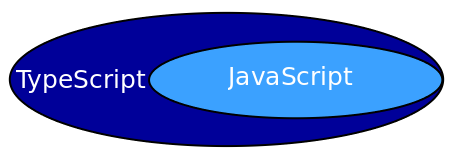
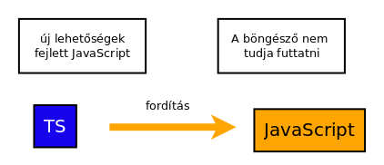

# Frontend - TypeScript

* **Szerző:** Sallai András
* Copyright (c) 2022, Sallai András
* Licenc: [CC Attribution-Share Alike 4.0 International](https://creativecommons.org/licenses/by-sa/4.0/)
* Web: [https://szit.hu](https://szit.hu)

## A TypeScript

A TypeScript a Microsoft egy nyílt forráskódú programozási nyelve, a JavaScript szuperhalmaza. Ahogy a neve is mutatja, leginkább típusokkal egészíti ki a JavaScript nyelvet. Úgy mondhatnánk: JavaScript típus szintaktikával.



A böngészők nem ismerik, ezért fordítani kell. A fordítás előnyös a programozók számára, mivel rávilágít több lehetséges hibára.



A TypeScript kódokat egy .ts kiterjesztésű fájlba írjuk.

## A tsc fordító

Telepítsük a fordítót:

```cmd
npm install -g typescript
```

Ellenőrzés:

```cmd
tsc --version
```

## Helló Világ

A legtöbb JavaScript utasítás változtatás nélkül használható TypeScript nyelvben. Készítsünk egy app.ts nevű fájlt az alábbi tartalommal:

```typescript
console.log('Helló Világ');
```

Fordítás:

```cmd
tsc app.ts
```

A fordítás után, létrejön egy app.js nevű fájl, amit a böngészők már képesek használni.

Készítsünk egy webolalt, majd teszteljük a programot, majd teszteljük böngészőben. A másik lehetőség, hogy az app.js fájlt futtassuk a node paranccsal.

```html
<!DOCTYPE html>
<html lang="hu">
<head>
    <meta charset="utf-8">
    <title>Helló</title>    
</head>
<body>
 
    <script src="app.js" defer></script>
</body>
</html>
```

Böngésző esetén nyissuk meg a fejlesztői felületet, például az F12 lenyomásával, majd kattintsunk a "Console" fülre, ha az nem aktív.

## A browser-sync szerver

### A browser-sync szerver-ről

A browser-sync egy HTTP szerver fejlesztők számára. Node.js csomagként fogjuk használni, egy browser-sync parancsként.

A csomagot két módon telepíthetjük: globálisan és lokálisan csak az aktuális projekt számára. A globális telepítés Windows operációs rendszeren nem igényel rendszergazdai jogot, de nem is használhatja csak az a felhasználó, aki telepítette.

Globális telepítés esetén a parancs a következő helyre kerül:

* C:\Users\janos\AppData\Roaming\npm

Lokális telepítés esetén a projekt könyvtárában, a node_modules/.bin könyvtárba be lesz hivatkozva.

Globális telepítés esetén útvonalba kell tenni a C:\Users\janos\AppData\Roaming\npm útvonalat.

Az útvonalba állításról Windowson itt olvashat:

* [https://szit.hu/doku.php?id=oktatas:operacios_rendszerek:windows:utvonalak#gui_felueleten](https://szit.hu/doku.php?id=oktatas:operacios_rendszerek:windows:utvonalak#gui_felueleten)

Ha lokálisan telepítjük megadhatjuk az útvonlat vagy használhatjuk az npx parancsot a projekt gyökérkönyvtárában:

```cmd
npx browser-sync start --server
```

### Node.js projekt készítése

Készítsük el a projekt könyvtárát, majd lépjünk a könyvtárba, például:

```cmd
mkdir app01
cd app01
```

Indítsuk el a Visual Studio Code programot a projekt gyökérkönyvtárában:

```cmd
code .
```

A projekt gyökérkönyvtárában készítsünk egy index.html fájlt, amelyben írjunk egy egyszerű weblapot.

Indítsunk egy terminálablakot, a továbbiakban ott fogunk parancsokat kiadni.

Készítsük el a Node.js projektet:

```cmd
npm init -y
```

Létrejön a package.json fájl.

Telepítsük a browser-sync szervert lokálisan, fejlesztési célra:

```cmd
npm install --save-dev browser-sync
```

A package.json fájlban megjelenik a browser-sync fejlesztői függőségként:

```json
    "devDependecies": {
        "browser-sync": "^3.0.2"
    }
```

Írjunk scriptet a browser-sync szerver indításához a package.json fájlban:

```json
{
    "name": "app01",
    "version": "1.0.0"
    "description": "",
    "main": "app.js"
    "scripts": {
        "test": "echo \"Error: no test specified\" && exit 1",
        "start": "browser-sync start --server"
    },
    "author": "",
    "license: "ISC",
    "devDependecies": {
        "browser-sync": "^3.0.2"
    }
}
```

A browser-sync szerver készen áll az indításra. Teszteljük:

```cmd
npm start
```

A böngészőben automatikusan megnyílik a projekt gyökérkönyvtárban található index.html tartalma.

Ha szerkesztjük az src könyvtárban valamelyik fájlt, a mentés után egyelőre nem történik semmi. Az automatikus frissítéshez újabb kapcsoló szükséges.

### Browser-sync beállító fájl

Készítsünk egy beállítófájlt bs-config.json néven, a következő tartalommal:

```json
{
    "server": ["src"],
    "port": 3000,
    "watch": true
}
```

Írjuk át az indítóscriptet:

```json
{
  "scripts": {
    "start": "browser-sync start --config bs-config.json"
  }
}
```

Ha fut a szerver, indítsuk azt újra.

### Bootstrap használata

Ha van egy Node.js projektünk, amiben Bootstrap-t használunk, kiadjuk a következő parancsot:

```cmd
npm install bootstrap
```

A Bootstrap ezt követően a node_modules/bootstrap/ könyvtárba telepszik. Az lenne a célunk, hogy ne kelljen innen linkelni, helyette a HTML fájlban csak annyit kelljen megadni, hogy bootstrap.css és bootstrap.js.

Ha Bootstrap-t használunk, a bs-config.json fájlban vegyük fel az src után két újabb útvonalat:

```json
{
    "server": [
        "src",
        "node_modules/bootstrap/dist/css",
        "node_modules/bootstrap/dist/js"
    ],
    "port": 3000,
    "watch": true
}
```

A beállítás után újra kell indítani a browser-sync szervert, ha az éppen fut.

## A sinto csomag

A sinto csomag leegyszerűsíti a Node.js projektek készítést. Telepítsük:

```cmd
npm install -g sinto
```

Telepítés után, kapunk egy **sin** parancsot. Ellenőrizzük:

```cmd
sin --version
```

Node.js projekt létrehozhása:

```cmd
sin init
```

Ami létrejön:

```cmd
app01/
  |-assets/
  |-src/
  |  |-style.css
  |  |-index.html
  |  `-app.js
  |-README.md
  |-package.json
  |-gulpfile.js
  `-bs-config.json
```

Függőségek telepítése:

```cmd
npm install
```

vagy:

```cmd
pnpm install
```

## TypeScript típusok

A következő típusokat használhatjuk:

| Típus |
|-|
| number |
| string |
| boolean |
| array |
| tuple |
| void |
| enum |

### Számtípusok

Egész és valós számok esetén is a number típust használjuk. Példa:

```javascript
var szelesseg: number;
szelesseg = 35;
console.log(szelesseg);
```

Írjuk a fenti kódot az app.ts fájlba. Fordítsuk le a kódot a tsc paranccsal:

```cmd
tsc src/app.ts
```

Létrejön az app.js, amit futtathatunk böngészőben vagy a node paranccsal. A node parancs használata:

```cmd
node app.js
```

Azonnal megadható az érték is:

```javascript
var szelesseg: number = 35;
```

Példa valós számmal:

```typescript
var szelesseg: number = 35.1234;
```

### Sztringek

Sztring tárolása:

```javascript
var name: string = 'Nagy János';
var city: string = "Szolnok";
var address: string = `Tél utca 3.`
```

Használhatunk aposztrófokat, idézőjeleket vagy tompa ékezeteket.

A tompa ékezetek lehetővé teszik a változóbehelyettesítést.

```javascript
var nev: string = 'Nagy János';
var msg: string = `Üdvözöllek ${nev}`;
```

### Logikai típus

Logikai típus tárolása:

```javascript
var letezik: boolean = true;
```

Lehet true vagy false az értéket.

### Tömbök

Számok üres tömbje:

```javascrit
var szamTomb: number[] = [];
```

A push() függvénnyel tehetünk bele számokat:

```javascript
szamTomb.push(30);
```

Karakterláncokat tartalmazó tömb:

```javascript
var nevek: string[] = [];
nevek.push('Gábor');
nevek.push('Irén');
```

Kezdőérték használata:

```javascript
var gyumolcsok string[] = ['alma', 'körte', 'barack'];
```

### A Tuple

Csak megadott számú elem adható meg.

```javascript
var szamTomb: [number, number, number] = [27, 42, 35];
document.write(String(szamTomb[2]));
```

A folytonos tsc src/app.ts parans kiadása helyett, mondjuk meg a tsc parancsnak, hogy folyamatosan figyelje az src/app.ts fájlt:

```cmd
tsc --watch src/app.ts
```

Ennek hatására mentéskor automatikusan megtörténik a fordítás.

### A void típus

```javascript
var valami: void = null;
```

Függvények esetén használjuk. Azt határozzuk meg, hogy nincs visszatérési értéke a függvények. Egyes programozási nyelvekben ezt nevezzük eljárásnak.

```javascript
function about():void {
    console.log('Pardon Béla');
}
```

### A never típus

A never típust is függvényeknél használjuk. Azt mondjuk, a függvényt végét sosem érjük el, így sosem lesz visszatérési értéke.

```javascript
function mehet(): never {
    while(true) {
        console.log('megy');
    }
}

function kuld(msg: string): never {
    throw new Error(msg);
}
```

### Az Union típus

A változó többféle típust is felvehet.

```javascript
var ertek : number | string;
ertek = 30;
console.log(ertek);
ertek = 'kör';
console.log(ertek);
```

Más típust nem tehetünk bele.

### Az any típus

Bármilyen típusú értéket megadhatunk.

```javascript
var valami : any;
valami = 'körte';
valami = true;
```

### Az enum típus

```javascript
enum Irany {
    Eszak,
    Del,
    Kelet,
    Nyugat
}

var irany: Irany;
irany = Irany.Eszak;

if (irany == Irany.Eszak) {
    console.log('Északra megyünk');
}
```

Az enum típus elemei kaphatnak értéket is:

```javascript
enum StatusCodes {
    OK = 200,
    BadRequest = 400,
    Forbidden,
    NotFound,
    Unauthorized    
}
```

## Típuskényszerítés

```javascript
var numAny: any = '30';
var num: number = <number> numAny;
```

Másik módszer:

```javascript
var numAny: any = '30';
var num: number = numAny as number;
```

Mindkét esetben a num változó típusa string lesz:

```javascript
console.log(typeof num);
```

A lehetséges kimenet:

```cmd
string
```

## Változók és állandók

Háromféle kulcsszóval hozható létre változó:

| Kulcsszó | Leírás |
|-|-|
| var | Globális hatókörű |
| let | Blokk szintű használat |
| const | Értéke nem változtatható meg |

```javascript
let nev = 'Penge Béla';
var kor = 35;
const igazEmber = true;
```

## Típuskövetkeztetés a TypeScritben

A TypeScript típusos nyelv, de nem kötelező a típus megadása, ha azonnal értéket adunk.

```javascript
var nev = 'Penge Béla';
var kor = 35;
var igazEmber = true;
```

A típust kikövetkezteti a megadott értékből.

Kikövetkeztetett tömb:

```javascript
var tomb = [ 30, 35, null, 45, 50];
```

Ilyen esetben a leggyakoribb típust keresi a TypeScript a típus megállapításához. Olyan típust választ, ami minden értékkel kompatibilis.

```javascript
var tomb = [ 30, 35, 'alma', 45, 50];
```

Ebben az esetben számok és sztringek uniótípusa lesz: (number | string). Újabb számot vagy sztringet hozzáadhatunk, de például egy logikai típus hozzáadása hibát okoz.

## Megjegyzések

```javascript
// egysoros megjegyzés

/*
több
soros
megjegyzés
*/
```

## Szelekció

### Az if utasítás

Az if utasítás egy logikai értéket fogad, vagy olyan kifejezést, ami logikai értéket ad vissza.

```javascript
if (true) {}
```

```javascript
if (a > 3) {}
```

### Ellenben ág

```javascript
if (a > 3) {}
else {}
```

### Ellenben ha

```javascript
if (a > b) {}
else if (c > d) {}
else {}
```

### Háromtagú operátor

```javascript
a > b ? console.log('Az a nagyobb') : console.log('A b nagyobb');
```

### A switch utasítás

```javascript
switch(num) {
    case 1:
        console.log('egy');
        break;
    case 2:
        console.log('kettő');
        break;
    case 3:
        console.log('három');
        break;
    case 4:
        console.log('négy');
        break;
    default:
        console.log('Nem ismert szám');
}
```

## Iteráció

### A for ciklus

```javascript
for(let i=0; i<10; i++) {
    console.log(i);
}
```

### A while ciklus

```javascript
var i: number = 0;
while(i<10) {
    console.log(i);
    i++;
}
```

### A do..while

```javascript
var i: number = 0;
do {
    console.log(i);
    i++;
}while(i<10);
```

## Függvények

```javascript
function név(paraméter: típus, ...): visszatérés_típusa {
    //tennivalók
}
```

### Nevesített függvények

```javascript
function about() {
    console.log('Penge Béla');
}
```

Paraméterek:

```javascript
function sum(num1: number, num2: number):number {
    return num1 + num2;
}
```

### Névtelen függvény

A névtelen függvényt a következő példában egy változóba tesszük:

```javascript
var welcome = function() {
    console.log('Üdv!');
}

//Használat:
welcome();
```

Lambda kifejezéssel:

```javascript
var welcome = () => {
    console.log('Üdv!');
}

//Használat:
welcome();
```

### Opcionális paraméterek

```javascript
function printEmployee(name: string, city?: string) {
    console.log(name);
    if (city !== undefined) {
        console.log(city)
    }
}

//hívások:
printEmployee('Penge Béla');
printEmployee('Penge Béla', 'Szolnok');
```

A vizsgálat elvégezhető typeof operátorral is. Ez esetben az undefined értéket sztringként kell megadni.

```javascript
if (typeof city !== 'undefined') {

}
```

### Alapértelmezett paraméter

```javascript
function printEmployee(name: string, city: string = 'ismeretlen') {
    console.log(name + ' ' + city);
}
```

### Változó hosszúságú paraméterlista

```javascript
function kibarat(nev: string, ...baratok: string[]) {
    console.log(nev + ': '+ baratok.join(', '));
}
 
kibarat('Irén', 'Béla');
kibarat('Kati', 'Lóri', 'Erik', 'Pali');
```

## Űrlap tartalma

Kötés létrehozása az input elemre:

```javascript
const num1Elem = 
document.querySelector("#num1")! as HTMLInputElement;
```

A "!" karakter a non-null assertion operátor.
Akkor használjuk, ha biztosan tudjuk, hogy a hivatkozott változó nem null vagy undefined lesz.

Kötés létrehozása button elemre:

```javascript
const calcButton = 
document.querySelector("#calcButton")! as HTMLButtonElement;
```

## Osztály használata

```javascript
class Employee {
    name: string;
    salary: number;
    constructor(name: string, salary: number) {
        this.name = name;
        this.salary = salary;
    }
    getSalary(): number {
        return this.salary;
    }
}

var emp = new Employee("John", 1000);
console.log(emp.getSalary());
```

### A tsconfig.json használata

A _sin ts_ parancs elkészíti számunkra a tsconfig.json fájlt, de ha a tsc prancsot paraméterekkel használjuk, akkor azt nem veszi figyelembe.

Gyakorlásként készítsünk egy _sin_ paranncsal egy projektet, majd adjuk hozzá a TypeScript lehetőséget:

```cmd
sin init
sin ts
```

Az src könyvtárban át kell nevezni az app.js fájlt app.ts-re. Létre kell hozni egy **app** nevű könyvtárat, amibe át kell mozgatni az index.html és style.css állományokat.

A Browser-sync szerver beállításaiban állítsuk át az src könyvtárat app könyvtárra:

```json
{
  "server": [
    "app",
    "node_modules/bootstrap/dist/css",
    "node_modules/bootstrap/dist/js"
  ],
  "port": 3000,
  "watch": true
}
```

Ha fut a szerver, újra kell indítani.

A tsconfig.json fájlban a ügyeljünk arra, hogy a module érték is ES-re legyen állítva:

```json
{
  "compilerOptions": {
    "target": "ES6",
    "module": "ESNext",
    "outDir": "./app",
    "strict": true,
    "esModuleInterop": true
  }  
}
```

Ezt követően a TypeScript fordítása:

```cmd
tsc
```

Folyamatos fordítást is beállíthatunk:

```cmd
tsc --watch
```

A könyvtárszerkezetünk ekkor így néz ki:

```txt
app01/
  |-app/
  |  |-app.js
  |  |-index.html
  |  `-style.css
  |-assets/
  |-node_modules/
  |-src/
  |  `-app.ts
  |-bs-config.json
  |-gulpfile.js
  |-package.json
  |-README.md
  `-tsconfig.json
```

## Interfész

Az interfész definiálja a megkötéseket az alkalmazásban. Az interfészt megvalósító osztályoknak követniük kell a megvalósított interfészt.

Az interfészt az interface kulcsszóval határozzuk meg. Tartalmazhat tulajdonságokat és metódusokat.

```javascript
interface Employee {
    name: string;
    city: string;
    salary: number;
    getSalary: () => number;
    getName(): string;
    elevateSalary(money: number): void;
}
```

Az interfész megvalósítása:

```javascript
class EmployeeImp implements Employee {
    name: string;
    city: string;
    salary: number;
    getSalary(): number {
        return this.salary;
    }
    getName(): string {
        return this.name;
    }
    elevateSalary(money: number): void {
        this.salary = this.salary + money;
    }
}
```

### Interfész típusként

```javascript
interface Employee {
    name: string;
    city: string;
    salary: number;
}

var emp1: Employee;
emp1 = {
    name: 'Penge Béla', 
    city: 'Szolnok',
    salary: 358
}
console.log(emp1.name);
```

## Forrás

* [https://szit.hu/doku.php?id=oktatas:web:typescript:typescript_nyelv](https://szit.hu/doku.php?id=oktatas:web:typescript:typescript_nyelv)
