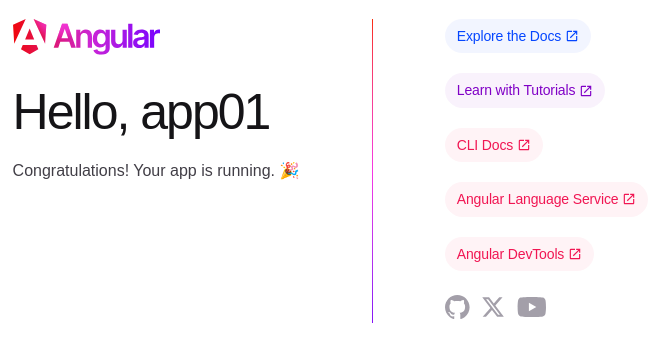

# Frontend - Angular keretrendszer

* **Szerző:** Sallai András
* Copyright (c) 2022, Sallai András
* Szerkesztve: 2022, 2023
* Licenc: [CC Attribution-Share Alike 4.0 International](https://creativecommons.org/licenses/by-sa/4.0/)
* Web: [https://szit.hu](https://szit.hu)

## Az Angular telepítése

### Telepítés

Célunk, hogy legyen egy **ng** nevű parancs. Ehhez a @angular/cli csomagot kell telepíteni:

```cmd
npm install -g @angular/cli
```

### Ellenőrzés

Nézzük meg, hogy létezik-e az **ng** parancs:

```cmd
ng version
```

vagy:

```cmd
ng v
```

Vegyük észre, hogy nem kellenek kötőjelek.

### Adott verzió beszerzése

A legújabb verzió helyett használjuk mindig az **LTS** verziót. Az LTS verzió hosszú támogatási idővel rendelkezik. Keressük meg a legújabb LTS a következő helyen:

* [https://angular.io/guide/releases](https://angular.io/guide/releases)

2022-10-17-én a legújabb LTS verzió a 13.0.0, ami 2023-05-04 jár le.

Telepítése:

```cmd
npm install -g @angular/cli@13.0.0
```

### Windowson

Windowson útvonalba kell tenni a következő könyvtárat:

```path
c:\Users\user\AppData\Romaing\npm
```

A user felhasználónév helyére helyettesítse be a saját felhasználónevét.

Az útvonalba állításról a következő helyen olvashat:

* [szit.hu](https://szit.hu/doku.php?id=oktatas:operacios_rendszerek:windows:utvonalak#gui_felueleten)

## Új projekt

```cmd
ng new app01
```

A program két kérdést tesz fel, ami magyarra valahogy így fordítható:

* Szeretnénk-e routingot is telepíteni?
* Milyen nyelven írunk stíluslapot?

Az első kérdés konkrét példa:

```cmd
ng new app02
? Would you like to add Angular routing? (y/N)
```

A kérdésből láthatjuk, hogy válaszolhatunk "y" vagy "n" billentyűvel. Mivel az "N" betű nagybetűvel van írva, ez lesz az alapértelmezés, ha csak egy "Enter" billentyű leütését választjuk, ami első projektnél teljesen megfelelő választás.

Most a következő kérdést látjuk:

```cmd
ng new app02
? Would you like to add Angular routing? No
? Which stylesheet format would you like to use? (Use arrow keys)
❯ CSS 
  SCSS   [ https://sass-lang.com/documentation/syntax#scss                ] 
  Sass   [ https://sass-lang.com/documentation/syntax#the-indented-syntax ] 
  Less   [ http://lesscss.org 
```

Az első projektnél itt is megfelelő a CSS választása, amihez itt is csak egy "Enter" billentyű szükséges.

Ezt követően elindul a projekt létrehozása, ahol hasonló sorokat látunk:

```cmd
ng new app02
? Would you like to add Angular routing? No
? Which stylesheet format would you like to use? CSS
CREATE app02/README.md (1059 bytes)
CREATE app02/.editorconfig (274 bytes)
CREATE app02/.gitignore (548 bytes)
CREATE app02/angular.json (3033 bytes)
CREATE app02/package.json (1068 bytes)
CREATE app02/tsconfig.json (863 bytes)
CREATE app02/.browserslistrc (600 bytes)
CREATE app02/karma.conf.js (1422 bytes)
CREATE app02/tsconfig.app.json (287 bytes)
CREATE app02/tsconfig.spec.json (333 bytes)
CREATE app02/.vscode/extensions.json (130 bytes)
CREATE app02/.vscode/launch.json (474 bytes)
CREATE app02/.vscode/tasks.json (938 bytes)
CREATE app02/src/favicon.ico (948 bytes)
CREATE app02/src/index.html (291 bytes)
CREATE app02/src/main.ts (372 bytes)
CREATE app02/src/polyfills.ts (2338 bytes)
CREATE app02/src/styles.css (80 bytes)
CREATE app02/src/test.ts (745 bytes)
CREATE app02/src/assets/.gitkeep (0 bytes)
CREATE app02/src/environments/environment.prod.ts (51 bytes)
CREATE app02/src/environments/environment.ts (658 bytes)
CREATE app02/src/app/app.module.ts (314 bytes)
CREATE app02/src/app/app.component.css (0 bytes)
CREATE app02/src/app/app.component.html (23332 bytes)
CREATE app02/src/app/app.component.spec.ts (953 bytes)
CREATE app02/src/app/app.component.ts (209 bytes)
✔ Packages installed successfully.
hint: Using 'master' as the name for the initial branch. This default branch name
hint: is subject to change. To configure the initial branch name to use in all
hint: of your new repositories, which will suppress this warning, call:
hint: 
hint:   git config --global init.defaultBranch <name>
hint: 
hint: Names commonly chosen instead of 'master' are 'main', 'trunk' and
hint: 'development'. The just-created branch can be renamed via this command:
hint: 
hint:   git branch -m <name>
    Successfully initialized git.

```

### Projekt használata

Lépjünk be a projekt könyvtárába, majd indítsunk egy kódszerkesztőt. Példánkban a VSCode-t indítjuk:

```cmd
cd app01
code .
```

A (.) pont az aktuális könyvtárat jelenti. A "code ." utasítás a VSCode-t úgy indítja, hogy az aktuális könyvtár lesz az alapkönyvtár.

### Projekt routinggal

Később megtanuljuk használni a routingot. A routing használatát választhatjuk a kapcsolóval is:

```cmd
ng new app01 --routing
```

### Futtatás

A projekt futtatása a "serve" paranccsal lehetséges. Ha használjuk a --open kapcsolót, akkor automatikusan megnyílik böngészőben.

```cmd
ng serve --open
```

A server és a --open is rövidíthető:

```cmd
ng s -o
```

A kimenet ehhez hasonló lehet:

```cmd
ng s -o 
✔ Browser application bundle generation complete.

Initial Chunk Files   | Names         |  Raw Size
vendor.js             | vendor        |   1.70 MB | 
polyfills.js          | polyfills     | 296.95 kB | 
styles.css, styles.js | styles        | 173.21 kB | 
main.js               | main          |  47.66 kB | 
runtime.js            | runtime       |   6.51 kB | 

                      | Initial Total |   2.21 MB

Build at: 2022-11-02T22:27:24.116Z - Hash: 17fc0071f143d1b7 - Time: 18563ms

** Angular Live Development Server is listening on localhost:4200, open your browser on http://localhost:4200/ **


✔ Compiled successfully.
```

A böngészőben megnyíló ablak:



## Könyvtár-struktúra

```cmd
projetk01/
  |-.angular/
  |-.vscode/
  |-node_modules/
  |-src/
  |  |-app/
  |  |  |-app.components.css
  |  |  |-app.component.html
  |  |  |-app.component.spec.ts
  |  |  |-app.components.ts
  |  |  `-app.modules.ts
  |  |-assets/
  |  |  `-.gitkeep
  |  |-favicon.ico
  |  |-index.html
  |  |-main.ts
  |  `-style.css
  |-.editorconfig
  |-.gitignore
  |-angular.json
  |-package-lock.json
  |-package.json
  |-README.md
  |-tsconfig.app.json
  |-tsconfig.json
  `-tsconfig.spec.json
```

A weblap az **src/index.html** állományból indul:

```html
<!doctype html>
<html lang="en">
<head>
  <meta charset="utf-8">
  <title>App01</title>
  <base href="/">
  <meta name="viewport" content="width=device-width, initial-scale=1">
  <link rel="icon" type="image/x-icon" href="favicon.ico">
</head>
<body>
  <app-root></app-root>
</body>
</html>
```

Ez az alkalmazás váza. Tartózik hozzá egy globális stíluslap, az src/style.css.

A weboldal komponensei az "app" könyvtárban találhatók. A weblap egy fő komponenssel indul. A fő komponens 4 darab állományból áll, mindegyik az "app" szóval kezdődik. Ez a komponens az alkalmazás gyökér (root) komponense.

Van még egy "app" szóval kezdődő állomány ez az Angular modulok importálására való.

A projekt gyökérkönyvtárában még sok más állomány is található, amelyek segítik a projekt működését.

### A fő komponens állományai

* app.component.css üres állomány
* app.component.html tartalmát törölni fogjuk
* app.component.spec.ts - teszállomány

Az app.component.spec.ts kezdeti tartalma:

```typescript
import { TestBed } from '@angular/core/testing';
import { AppComponent } from './app.component';

describe('AppComponent', () => {
  beforeEach(async () => {
    await TestBed.configureTestingModule({
      declarations: [
        AppComponent
      ],
    }).compileComponents();
  });

  it('should create the app', () => {
    const fixture = TestBed.createComponent(AppComponent);
    const app = fixture.componentInstance;
    expect(app).toBeTruthy();
  });

  it(`should have as title 'app02'`, () => {
    const fixture = TestBed.createComponent(AppComponent);
    const app = fixture.componentInstance;
    expect(app.title).toEqual('app02');
  });

  it('should render title', () => {
    const fixture = TestBed.createComponent(AppComponent);
    fixture.detectChanges();
    const compiled = fixture.nativeElement as HTMLElement;
    expect(compiled.querySelector('.content span')?.textContent).toContain('app02 app is running!');
  });
});
```

* app.component.ts - a fő komponens TypeScript állománya

Az app.component.ts tartalma:

```typescript
import { Component } from '@angular/core';

@Component({
  selector: 'app-root',
  templateUrl: './app.component.html',
  styleUrls: ['./app.component.css']
})
export class AppComponent {
  title = 'app02';
}
```

* app.module.ts - az importált Angular modulok

Kezdeti tartalma:

```typescript
import { NgModule } from '@angular/core';
import { BrowserModule } from '@angular/platform-browser';

import { AppComponent } from './app.component';

@NgModule({
  declarations: [
    AppComponent
  ],
  imports: [
    BrowserModule
  ],
  providers: [],
  bootstrap: [AppComponent]
})
export class AppModule { }
```

## Angular elmélet

### Komponens

* component

Az Angular alapú weblap komponensekből áll. A komponensek egy nézetet valósítanak meg, ami valójában a weboldal egy része.

### Szolgáltatás

Létrehozhatunk szolgáltatásokat, amelyeket a komponensek használhatnak. A szolgáltatásokat a komponensekben függőség befecskendezéssel használhatók.

### Dekorátorok

A modulok, komponensek és a szolgáltatások osztályként vannak létrehozva. Minden osztályhoz tartozik egy dekorátor, ami az osztály számára metaadatokat tartalmaz.

### Routing

Az Angular a routing segítségével képes választani a betöltendő nézetek között.

### Modulok

Az Angular modulok az ES2015 JavaScript szabvány kiegészítői.

## Kötések

A komponens két főbb része:

* app.component.ts
* app.component.html

A kettő között az adatok összeköthetők, így adatkötésről beszélhetünk.

Töröljük üresre az app.component.html fájlt. Az app.component.ts fájlban már van egy adat title néven. Alapértelmezetten a projekt nevét találjuk itt:

```typescript
import { Component } from '@angular/core';

@Component({
  selector: 'app-root',
  templateUrl: './app.component.html',
  styleUrls: ['./app.component.css']
})
export class AppComponent {
  title = 'app02';
}
```

A fő komponensosztály neve AppComponent. Benne egy "title" nevű adattag. Most kössük a title változót a HTML állományhoz. A app.component.html fájlban:

```html
<h1>{{title}}</h1>
```

A változó nevét beírtuk dupla kapcsoszárójelek közé. Így létrehoztuk a kötést. Nézzük meg a weblapon. Ha közben leállítottuk a szervert a beépített szervert, indítsuk el:

```cmd
ng server --open
```

## Életciklus események

Olyan függvények, amelyek lehetővé teszik az alkalmazás különböző életciklusainak nyomon követését, azokhoz kapcsolódó műveletek végrehajtását.

A következő függvények állnak rendelkezésre:

* ngOnInit()
* ngOnDestroy()
* ngAfterViewInit()
* ngOnChanges()
* stb.

### ngOnInit() függvény

A komponens betöltésekor fut le. Általában adatok lekérésére, betöltésére használjuk, előkészítésére használjuk.

Az @angular/core-ból kell importálni:

```javascript
import { Component, OnInit } from '@angular/core';
@Component({
  selector: 'app-example',
  templateUrl: './example.component.html',
  styleUrls: ['./example.component.css']
})
export class ExampleComponent implements OnInit {
  ngOnInit() {
    // Adatlekérés és betöltés
    this.loadData();
  }

  loadData() {
    // Adatok betöltése
  }
}

```

### Az ngOnDestroy() függvény

Az ngOnDestroy() életciklus függvény akkor fut le, amikor a komponens megsemmisül. Ez a komponens eltávolítását jelenti. Eseményfigyelők, időzítők és adatfolyamok leállítására használjuk.

```javascript
import { Component, OnDestroy } from '@angular/core';
import { Subscription } from 'rxjs';

@Component({
  selector: 'app-example',
  templateUrl: './example.component.html',
  styleUrls: ['./example.component.css']
})
export class ExampleComponent implements OnDestroy {
  private exampleSubscription: Subscription;

  constructor(private exampleService: ExampleService) {
    this.exampleSubscription = this.exampleService.exampleObservable.subscribe({
      next(data) {
        // Csináld valamit az adattal
      }
    });
  }

  ngOnDestroy() {
    // Leiratkozás az observable-re az unsubscribe() metódussal
    this.exampleSubscription.unsubscribe();
  }
}
```

## Szolgáltatások

Az adatkezelés és a funkcionalitás bővítését teszik lehetővé a szolgáltatások. A szolgáltatások tulajdonképpen olyan osztályok, amelyeket injektálni lehet más osztályokba, vagy más szolgáltatásokba. A szolgáltatások így újrahasznosíthatók, könnyen karbantarthatók.

A szolgáltatások tárolhatnak egyszerűen adatokat, vagy elérhetnek szerveren tárolt adatokat.

A szolgáltatást az @Injectable dekorátorral kell használni, ahhoz hogy a szolgáltatást injektálhatónak jelöljük. A root érték azt jelenti, hogy a szolgáltatás az egész alkalmazásból elérhető.

```javascript
import { Injectable } from '@angular/core';

@Injectable({
  providedIn: 'root'
})
export class ExampleService {
  private data: string[] = [
    'Example 1', 
    'Example 2', 
    'Example 3'
    ];

  getData(): string[] {
    return this.data;
  }

  addData(newData: string): void {
    this.data.push(newData);
  }

  deleteData(index: number): void {
    this.data.splice(index, 1);
  }

  updateData(index: number, newData: string): void {
    this.data[index] = newData;
  }
}
```

## Függőségbefecskendezés

Az Angular Dependency Injection, röviden DI, lehetővé teszi a direktívák, szolgáltatások, komponensek számára, hogy egyik a másikra támaszkodjon.

A példa kedvéért készítsünk egy egyszerű szolgáltatást:

```javascript
import { Injectable } from '@angular/core';

@Injectable({
  providedIn: 'root'
})
export class GreetingService {
  greet(name: string): string {
    return `Hello, ${name}!`;
  }
}

```

Készítsünk egy komponenst, amely függőségként befecskendezi az előbbi szolgáltatást:

```javascript
import { Component } from '@angular/core';
import { GreetingService } from './greeting.service';

@Component({
  selector: 'app-greeting',
  template: '<p>{{ greeting }}</p>',
  styles: []
})
export class GreetingComponent {
  greeting: string;

  constructor(private greetingService: GreetingService) {
    this.greeting = greetingService.greet('John');
  }
}
```

A komponens konstruktora egy GreetingService példányt kap a DI révén. Így az alkalmazás részévé válik és bárhol használhatjuk.

Az app.module.ts fájlban a GreetingService szolgáltatást regisztrálni kell, hogy az egész alkalmazásból elérhető legyen.

```javascript
import { NgModule } from '@angular/core';
import { BrowserModule } from '@angular/platform-browser';

import { AppComponent } from './app.component';
import { GreetingComponent } from './greeting.component';
import { GreetingService } from './greeting.service';

@NgModule({
  declarations: [
    AppComponent,
    GreetingComponent
  ],
  imports: [
    BrowserModule
  ],
  providers: [GreetingService],  // injektáljuk a GreetingService-t
  bootstrap: [AppComponent]
})
export class AppModule { }
```

## Routing és navigáció

Az Angular keretrendszer lehetővé teszi, hogy egyszerűen kezeljük az alkalmazásunk navigációját és az útvonalakat. A routing használatához a Router modult kell használnunk.

Az útvonalak beállításával megadhatjuk, hogy a felhasználó hogyan jusson el egyik oldalról a másikra, és milyen komponens töltődjön be.

### Routing elkészítése

Létre kell hozni az AppRoutingModule modult.

```cmd
ng generate module app-routing --flat --module=app
```

Az AppRoutingModule-ban be kell állítani az útvonalakat.

```javascript
import { NgModule } from '@angular/core';
import { Routes, RouterModule } from '@angular/router';

import { HomeComponent } from './home/home.component';
import { AboutComponent } from './about/about.component';

const routes: Routes = [
  { path: '', component: HomeComponent },
  { path: 'about', component: AboutComponent }
];

@NgModule({
  imports: [RouterModule.forRoot(routes)],
  exports: [RouterModule]
})
export class AppRoutingModule { }
```

Ebben a példában két útvonal van. A kezdőlap és az About oldal.

Mindkét útvonal egy-egy komponenshez van rendelve. A path: '' az üres útvonalat jelenti. Az alkalmazásunk első megnyitásakor az itt megadott komponens töltődik be.

Navigáció:

```javascript
<nav>
  <a routerLink="/">Kezdőlap</a>
  <a routerLink="/about">Rólunk</a>
</nav>

<router-outlet></router-outlet>
```

A routerLink attribútum használata szükséges az SPA viselkedéshez. Ha href attribútumot használunk az oldal újratöltéssel navigál.

A router-outlet direktíva azt jelzi, hogy ide kell behelyettesíteni az aktuális komponenst.

## A HTTP és a Backend kommunikáció

Az Angular lehetővé teszi HTTP kommunikációt a háttérben futó szerverekkel. Az Angularnak ehhez saját HTTP modulja van.

### A HttpClientModule

Az app.module.ts fájlban:

```javascript
import { HttpClientModule } from '@angular/common/http';
//...
 
imports: [
    HttpClientModule
],
```

Ahol használni szeretnénk, például egy szolgáltatásban importáljuk a HttpClient osztályt:

```javascript
import { HttpClient } from '@angular/common/http';
```

A konstruktorban injektáljuk:

```javascript
constructor(private http: HttpClient) { }
```

Ezek uátn használhatjuk a get(), post(), put(), delete() stb. metódust.

Példa:

```javascript
this.http.get('https://jsonplaceholder.typicode.com/todos').subscribe(data => {
   console.log(data);
});
```

A http.get() metódus elküldi a kérést az URL-re, majd kapunk egy Observable objektumot, ahol a subscribe() metódussal kapjuk meg a választ.

A HttpClient aszinkron kommunikációt tesz lehetővé a szerverrel, így nem kell várakoznunk a szerver válaszára.

## Angular animáció

Az Angularban elérhető az @angular/animations modul, ami lehetővé teszi animáció létrehozását.

A használathoz importálni kell az alkalmazás számára a BrowserAnimationsModule modult.

```javascript
import { BrowserAnimationsModule } from '@angular/platform-browser/animations';

@NgModule({
    imports: [
        BrowserModule,
        BrowserAnimationsModule
    ],
    declarations: [AppComponent],
    bootstrap: [AppComponent]
})
export class AppModule { }
```

Ez után definiálhatunk a komponenseikben animációt:

```javascript
import { trigger, state, style, animate, transition } from '@angular/animations';

@Component({
    selector: 'app-root',
    template: `
        <button (click)="toggle()">Toggle</button>
        <div [@fadeInOut] *ngIf="visible">Hello World</div>
    `,
    animations: [
        trigger('fadeInOut', [
            state('void', style({
                opacity: 0
            })),
            transition(':enter, :leave', [
                animate(300)
            ])
        ])
    ]
})
export class AppComponent {
    visible: boolean = false;

    toggle() {
        this.visible = !this.visible;
    }
}
```

A fadeInOut az animáció neve. A state() függvényben megmondjuk, hogy milyen állapotok között kell váltani. A void állapot, azt jelenti az animáció nem látható. A transition() függvényben meghatározzuk, hogy az animáció milyen állapotváltozásra kell bekövetkezzen.

## Az Angular egységtesztelés

Az egységtesztek fontosak az alkalmazás minőségbiztosításához. Az egységtesztek esetén az alkalmazás egy elkülönített részét teszteljük, ami általában egy függvény.

A teszteléshez a következő Angular szolgáltatásokra van szükség:

* TestBed
* ComponentFixture

A teszteket egy spec.ts kiterjesztésű fájlba tesszük.

```javascript
import { ComponentFixture, TestBed } from '@angular/core/testing';
import { YourComponent} from './your.component';

describe('YourComponent', () => {
    let component: YourComponent;
    let fixture: ComponentFixture<YourComponent>;

    beforeEach(async () => {
        await TestBed.configureTestingModule({
            declarations: [ YourComponent ]
        }).compileComponents();
    });

    beforeEach(() => {
        fixture = TestBed.createComponent(YourComponent);
        component = fixture.componentInstance;
        fixture.detectChanges();
    });

    it('should create', () => {
        expect(component).toBeTruthy();
    });
});
```

Az Angular komplexebb tesztjei a következő modulokat is használhatják:

* HttpClientTestingModule
* RouterTestingModule
* FormsModule
