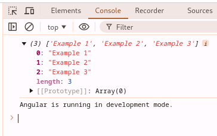
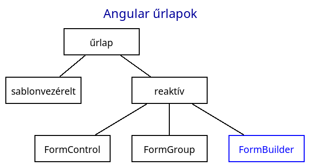
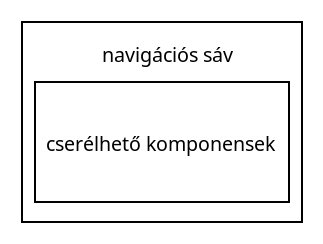

# Frontend - Angular keretrendszer

* **Szerző:** Sallai András
* Copyright (c) 2022, Sallai András
* Szerkesztve: 2022, 2023, 2024, 2025
* Licenc: [CC Attribution-Share Alike 4.0 International](https://creativecommons.org/licenses/by-sa/4.0/)
* Web: [https://szit.hu](https://szit.hu)

## Tartalomjegyzék

* [Tartalomjegyzék](#tartalomjegyzék)
* [Az Angular](#az-angular)
* [Az Angular telepítése](#az-angular-telepítése)
* [Új projekt](#új-projekt)
* [Könyvtár-struktúra](#könyvtár-struktúra)
* [Angular koncepció](#angular-koncepció)
* [Kötések](#kötések)
* [Életciklus események](#életciklus-események)
* [Bootstrap használata](#bootstrap-használata)
* [Képek megjelenítése](#képek-megjelenítése)
* [Eseménykezelő](#eseménykezelő)
* [Szelekció](#szelekció)
* [Iteráció](#iteráció)
* [Komponensek](#komponensek)
* [Szolgáltatások](#szolgáltatások)
* [Függőségbefecskendezés](#függőségbefecskendezés)
* [Sablon-vezérelt űrlapok](#sablon-vezérelt-űrlapok)
* [Reaktív űrlapok](#reaktív-űrlapok)
* [HttpClient](#httpclient)
* [Táblázatok](#táblázatok)
* [Routing és navigáció](#routing-és-navigáció)
* [Pipe](#pipe)
* [Filter](#filter)
* [Komponensek kommunikációja](#komponensek-kommunikációja)
* [Tesztelés](#tesztelés)
* [Deploy](#deploy)
* [Tömb lapozása](#tömb-lapozása)
* [Angular animáció](#angular-animáció)

## Az Angular

Az Angular a Google **TypeScript** alapú, népszerű keretrendszere. Az első Angular neve AngularJS volt, mivel JavaScript alapú volt, és 2010-ben adták ki. Az Angular 2.0-nak nevezett kiadás 2016-ban lett kiadva, és már TypeScript alapokon működött.

Az Angular szabad és nyílt forráskódú _single-page_ webalkalmazások létrehozására használható keretrendszer.

Ebben a leírásban az Angular 18-s verziójával dolgoztam.

## Az Angular telepítése

### Telepítés

Célunk, hogy legyen egy **ng** nevű parancs. Ehhez az @angular/cli csomagot kell telepíteni. Verzió megadásával együtt:

```cmd
npm install -g @angular/cli@18.0.0
```

### Ellenőrzés

Nézzük meg, hogy létezik-e az **ng** parancs:

```cmd
ng version
```

vagy:

```cmd
ng v
```

Vegyük észre, hogy nem kellenek kötőjelek.

### Adott verzió beszerzése

Ha telepítéskor elhagyjuk a verziót, akkor a legújabb telepszik. Ez nem biztos, hogy megfelel.

A legújabb verzió helyett használjuk mindig az **LTS** verziót vagy azt amit követelnek az iskolában vagy a munkahelyen. Az LTS verzió hosszú támogatási idővel rendelkezik. Keressük meg a legújabb LTS a következő helyen:

* [https://angular.dev/reference/releases](https://angular.dev/reference/releases)

2024-07-17-én a legújabb LTS verzió a 17.0.0, ami 2025-05-15 jár le.

Telepítése:

```cmd
npm install -g @angular/cli@18.0.0
```

Ha valahol egy képzésen veszel részt, vedd figyelembe a képzés helyén milyen verziót használsz, és azt telepítsd.

### Windowson

Windowson útvonalba kell tenni a következő könyvtárat:

```path
c:\Users\user\AppData\Romaing\npm
```

A user felhasználónév helyére helyettesítse be a saját felhasználónevét.

Az útvonalba állításról a következő helyen olvashat:

* [szit.hu](https://szit.hu/doku.php?id=oktatas:operacios_rendszerek:windows:utvonalak#gui_felueleten)

## Új projekt

```cmd
ng new app01
```

A program két kérdést tesz fel, ami magyarra valahogy így fordítható:

* Milyen nyelven írunk stíluslapot?
* Szeretnéd engedélyezni a Server-Side Rendering (SSR) és a Static Site Generation (SSG) használatát?

Az első kérdés konkrét példa:

```cmd
ng new app01
? Which stylesheet format would you like to use? (Use arrow keys)
❯ CSS 
  SCSS   [ https://sass-lang.com/documentation/syntax#scss                ] 
  Sass   [ https://sass-lang.com/documentation/syntax#the-indented-syntax ] 
  Less   [ http://lesscss.org 
```

Az első projektnél megfelelő a CSS választása, amihez csak egy "Enter" billentyű leütése szükséges.

```cmd
? Do you want to enable 
Server-Side Rendering (SSR) 
and Static Site Generation 
(SSG/Prerendering)? (y/N) 
```

Kezdetnek válasszuk "N" lehetőséget, egy "Enter" nyomásával.

Ezt követően elindul a projekt létrehozása, ahol hasonló sorokat látunk:

```cmd
ng new app01
? Which stylesheet format would you like to use? CSS
? Do you want to enable Server-Side Rendering (SSR) and Static Site Generation 
(SSG/Prerendering)? No
CREATE app01/README.md (1059 bytes)
CREATE app01/.editorconfig (274 bytes)
CREATE app01/.gitignore (548 bytes)
CREATE app01/angular.json (2587 bytes)
CREATE app01/package.json (1036 bytes)
CREATE app01/tsconfig.json (903 bytes)
CREATE app01/tsconfig.app.json (263 bytes)
CREATE app01/tsconfig.spec.json (273 bytes)
CREATE app01/.vscode/extensions.json (130 bytes)
CREATE app01/.vscode/launch.json (470 bytes)
CREATE app01/.vscode/tasks.json (938 bytes)
CREATE app01/src/main.ts (250 bytes)
CREATE app01/src/favicon.ico (15086 bytes)
CREATE app01/src/index.html (291 bytes)
CREATE app01/src/styles.css (80 bytes)
CREATE app01/src/app/app.component.css (0 bytes)
CREATE app01/src/app/app.component.html (19903 bytes)
CREATE app01/src/app/app.component.spec.ts (913 bytes)
CREATE app01/src/app/app.component.ts (301 bytes)
CREATE app01/src/app/app.config.ts (227 bytes)
CREATE app01/src/app/app.routes.ts (77 bytes)
CREATE app01/src/assets/.gitkeep (0 bytes)
✔ Packages installed successfully.
hint: Using 'master' as the name for the initial branch. This default branch name
hint: is subject to change. To configure the initial branch name to use in all
hint: of your new repositories, which will suppress this warning, call:
hint: 
hint:   git config --global init.defaultBranch <name>
hint: 
hint: Names commonly chosen instead of 'master' are 'main', 'trunk' and
hint: 'development'. The just-created branch can be renamed via this command:
hint: 
hint:   git branch -m <name>
    Successfully initialized git.
```

### Projekt használata

Lépjünk be a projekt könyvtárába, majd indítsunk egy kódszerkesztőt. Példánkban a VSCode-t indítjuk:

```cmd
cd app01
code .
```

A (.) pont az aktuális könyvtárat jelenti. A "code ." utasítás a VSCode-t úgy indítja, hogy az aktuális könyvtár lesz az alapkönyvtár.

### Futtatás

A projekt futtatása a "serve" paranccsal lehetséges. Ha használjuk a --open kapcsolót, akkor automatikusan megnyílik böngészőben.

```cmd
ng serve --open
```

A server és a --open is rövidíthető:

```cmd
ng s -o
```

Az első indítás előtt rákérdezhet, szeretnénk-e statisztikai adatokat küldeni. Válaszoljunk egy "Enter" lenyomásával:

```cmd
? Would you like to share pseudonymous usage 
data about this project with the Angular Team
at Google under Google's Privacy Policy at 
https://policies.google.com/privacy. For more
details and how to change this setting, see 
https://angular.io/analytics. (y/N)
```

A kimenet ehhez hasonló lehet:

```cmd
ng s -o 
Global setting: enabled
Local setting: disabled
Effective status: disabled
Initial chunk files | Names         |  Raw size
polyfills.js        | polyfills     |  86.27 kB | 
main.js             | main          |  21.97 kB | 
styles.css          | styles        |  95 bytes | 

                    | Initial total | 108.33 kB

Application bundle generation complete. [1.563 seconds]

Watch mode enabled. Watching for file changes...
  ➜  Local:   http://localhost:4200/
  ➜  press h + enter to show help

```

A böngészőben megnyíló ablak:


## Könyvtár-struktúra

```cmd
projetk01/
  |-.vscode/
  |-node_modules/
  |-public/
  |  `-favicon.ico
  |-src/
  |  |-app/
  |  |  |-app.components.css
  |  |  |-app.component.html
  |  |  |-app.component.spec.ts
  |  |  |-app.components.ts
  |  |  |-app.config.ts
  |  |  `-app.routes.ts
  |  |-index.html
  |  |-main.ts
  |  `-style.css
  |-.editorconfig
  |-.gitignore
  |-angular.json
  |-package.json
  |-pnpm-lock.yaml
  |-README.md
  |-tsconfig.app.json
  |-tsconfig.json
  `-tsconfig.spec.json
```

A weblap az **src/index.html** állományból indul:

```html
<!doctype html>
<html lang="en">
<head>
  <meta charset="utf-8">
  <title>App01</title>
  <base href="/">
  <meta name="viewport" content="width=device-width, initial-scale=1">
  <link rel="icon" type="image/x-icon" href="favicon.ico">
</head>
<body>
  <app-root></app-root>
</body>
</html>
```

Ez az alkalmazás váza. Tartozik hozzá egy globális stíluslap, az _src/style.css_ fájl.

A webhely komponensei az "app" könyvtárban találhatók. A webhely egy fő komponenssel indul. A fő komponens 4 darab állományból áll, mindegyik az "app" szóval kezdődik. Ez a komponens az alkalmazás gyökér (root) komponense.

Az app.config.ts fájlban állíthatjuk be az alkalmazást, és az app.routes.ts fájlban állíthatjuk be az alkalmazáshoz tartozó útválasztást.

A projekt gyökérkönyvtárában még sok más állomány is található, amelyek segítik a projekt működését.

### A fő komponens állományai

* _app.component.css_ - üres állomány
* _app.component.html_ - tartalmát törölni fogjuk
* _app.component.ts_ - a fő komponens TypeScript állománya
* _app.component.spec.ts_ - tesztállomány

Az _app.component.ts_ állománnyal fogunk dolgozni.

Az _app.component.ts_ tartalma:

```typescript
import { Component } from '@angular/core';
import { RouterOutlet } from '@angular/router';

@Component({
  selector: 'app-root',
  standalone: true,
  imports: [RouterOutlet],
  templateUrl: './app.component.html',
  styleUrl: './app.component.css'
})
export class AppComponent {
  title = 'app01';
}
```

Az _app.config.ts_ - az alkalmazás konfigurációs állományának kezdeti tartalma:

```typescript
import { ApplicationConfig } from '@angular/core';
import { provideRouter } from '@angular/router';

import { routes } from './app.routes';

export const appConfig: ApplicationConfig = {
  providers: [provideRouter(routes)]
};
```

Az _app.routes.ts_ tartalma:

```typescript
import { Routes } from '@angular/router';

export const routes: Routes = [];
```

### Csomagkezelő beállítása

A csomagkezelőt ne állítgassuk osztott felhasználású gépen. Csak az otthoni saját gépen állítsuk át.

Az Angular számára az alapértelmezett csomagkezelő a npm.

A következő parancs segítségével beállíthatjuk, például a pnpm parancsot:

```cmd
ng config -g cli.packageManager pnpm
```

Ez az információ a felhasználó alapkönyvtárában egy fájlban jelenik meg:

* Windows: %USERPROFILE%\angular-config.json
* Linux: ~/.angular-config.json

A beállítás után, egy ilyen tulajdonságot találunk:

```json
{
  "cli": {
    "packageManager": "pnpm"
  }
}
```

Ezt követően az angular a pnpm csomagkezelő használja.

## Angular koncepció

### Komponens

* component

Az Angular alapú weblap komponensekből áll. A komponensek egy nézetet valósítanak meg, ami valójában a weboldal egy része.

### Szolgáltatás

Létrehozhatunk szolgáltatásokat, amelyeket a komponensek használhatnak. A szolgáltatásokat a komponensekben függőség befecskendezéssel használhatjuk.

### Dekorátorok

A modulok, komponensek és a szolgáltatások osztályként vannak létrehozva. Minden osztályhoz tartozik egy dekorátor, ami az osztály számára metaadatokat tartalmaz.

### Routing

Az Angular a routing segítségével képes választani a betöltendő nézetek között. A ruting segítségével különböző komponenseket tölthetünk a főkomponensebe, vagy akár egy alkomponensbe.

### Modulok

Számtalan előre legyártott Angular modult használhatunk. Az Angular modulok az ES2015 JavaScript szabvány szerint készültek. Ilyen modul például a HttpClientModule, ami lehetővé teszi, az Angular saját HTTP kliense.

## Kötések

A komponensek két főbb részből állnak. A TypeScript fájl és a HTML sablon. A főkomponens állományai például:

* app.component.ts
* app.component.html

Az adatokat a TypeScript fájlba érkeznek meg, de a HTML sablonban szeretnék azokat megjeleníteni. Ezért a TypeScript fájlban lévő adatokat a HTML sablonfájlba kötni kell, ilyen esetben adatkötésről beszélhetünk.

Töröljük üresre az _app.component.html_ fájlt. Az app.component.ts fájlban már van egy adat title néven. Alapértelmezetten a projekt nevét találjuk itt:

```typescript
import { Component } from '@angular/core';
import { RouterOutlet } from '@angular/router';

@Component({
  selector: 'app-root',
  standalone: true,
  imports: [RouterOutlet],
  templateUrl: './app.component.html',
  styleUrl: './app.component.css'
})
export class AppComponent {
  title = 'app01';
}
```

A fő komponensosztály neve AppComponent. Benne egy "title" nevű adattag. Most kössük a title változót a HTML állományhoz. A app.component.html fájlban:

```html
<h1>{{title}}</h1>
```

A változó nevét beírtuk dupla kapcsoszárójelek közé. Így létrehoztuk a kötést. Nézzük meg a weblapon. Ha közben leállítottuk a szervert a beépített szervert, indítsuk el:

```cmd
ng server --open
```

## Életciklus események

Olyan függvények, amelyek lehetővé teszik az alkalmazás különböző életciklusainak nyomon követését, azokhoz kapcsolódó műveletek végrehajtását. Életciklus függvények az alkalmazáson belül a komponensekben használhatók.

A következő függvények állnak rendelkezésre:

* ngOnInit()
* ngOnDestroy()
* ngOnChanges()
* ngDoCheck()
* ngAfterContentInit()
* ngAfterContentChecked()
* ngAfterViewInit()
* ngAfterViewChecked()

### ngOnInit() függvény

A komponens betöltésekor fut le, a konstruktor után. Általában adatok lekérésére, betöltésére, előkészítésére használjuk.

Az @angular/core-ból kell importálni:

```javascript
import { Component } from '@angular/core';
@Component({
  selector: 'app-example',
  templateUrl: './example.component.html',
  styleUrls: ['./example.component.css']
})
export class ExampleComponent {
  ngOnInit() {
    // Adatlekérés és betöltés
    this.loadData();
  }

  loadData() {
    // Adatok betöltése
  }
}
```

A szolgáltatásokban nem használhatók!

### Az ngOnDestroy() függvény

Az ngOnDestroy() életciklus függvény akkor fut le, amikor a komponens megsemmisül. Ez a komponens eltávolítását jelenti. Eseményfigyelők, időzítők és adatfolyamok leállítására használjuk.

```javascript
import { Component } from '@angular/core';
import { Subscription } from 'rxjs';

@Component({
  selector: 'app-example',
  templateUrl: './example.component.html',
  styleUrls: ['./example.component.css']
})
export class ExampleComponent {
  private exampleSubscription: Subscription;

  constructor(private exampleService: ExampleService) {
    this.exampleSubscription = this.exampleService.exampleObservable.subscribe({
      next(data) {
        // Csinálunk valamit az adattal
      }
    });
  }

  ngOnDestroy() {
    // Leiratkozás az observable-re az unsubscribe() metódussal
    this.exampleSubscription.unsubscribe();
  }
}
```

## Bootstrap használata

Telepítés:

```cmd
npm install bootstrap
```

Vegyük fel az src/style.css fájlban a bootstrap-t.

_src/style.css_:

```css
@import "bootstrap";
```

### Bootstrap JavaScript

Az angular.json fájlba írjuk be bootstrap.js helyét.

_angular.json_:

```json
"build": {
    "options": {
        "scripts": [
            "node_modules/bootstrap/dist/js/bootstrap.js"
        ]
    }
}
```

Ellenőrzéshez készíthetünk egy egyszerű HTML részletet:

```html
<button class="btn btn-primary"
data-bs-toggle="collapse"
data-bs-target="#aaa"
>Mehet</button>

<div class="collapse" id="aaa">
  <div class="card card-body">doboz</div>  
</div>
```

A gomb megnyomására meg kell jelenjen a doboz.

### Bootstrap ikonok

```cmd
ng add bootstrap-icons
```

style.css fájl:

```css
@import "bootstrap-icons";
```

Használat:

```html
<i class="bi bi-bug-fill"></i>
```


```html
<i class="bi bi-book"></i>
```


```html
<i class="bi bi-basket"></i>
```


## Képek megjelenítése

Képeket az public könyvtárba kell elhelyezni. A public nem csak a képek, de minden médiafájl helye is. Tehetünk ide videókat, hangfájlokat. Korábbi Angular verzókban a médiák helye az src/assets könyvtár volt.

Töltsük le egy képet például a következő helyről:

* [Képek](https://szit.hu/download/images)

Tegyük a kiválasztott képet a public könyvtárba. Például:

```txt
public/tatra_hegy.jpg
```

Az _app.component.html_ fájlba ekkor

```html

```

A public könyvtáron belül készíthetünk egy images vagy hasonló könyvtárat és tárolhatjuk abban a képeket. Esetleg public/assets/images.

* public/valami.png
* public/images/valami.png
* public/assets/images/valami.png
* public/imgs/valami.png

A média fájlok helye, az angular.json fájlban van beállítva:

```json
"assets": [
  "glob": "**/*",
  "input": "public"
]
```

## Eseménykezelő

Webes alkalmazások esetén egyik alapvető esemény, amit figyelni szoktunk a kattintás. Az Angular ehhez HTML attribútumokat használ. Az attribútum értéket a hívott függvény neve, zárójelekkel együtt.

```html
<p>{{name}}</p>

<button (click)="changeName()">
  Névcsere
</button>
```

A TypeScript tartalma:

```typescript
export class AppComponent {
  name = 'Ernő';

  changeName() {
    this.name = 'Tibor';
  }
}
```

## Szelekció

A HTML sablonfájlokban egy elem megjelenését feltételhez köthetjük. A megjeleníthetőséget a TypeScript fájlban egy logikai típusú változó tartalmazza.

### Az @if használata

Az Angular 17 verzióban megjelent egy feltételes renderelés @if formája, a sablonok (.html fájlok) számára:

```html
<div>
@if (showContent) {
  Tartalom megjelenítése/elrejtése
}
</div>
```

A "Tartalom megjelenítése/elrejtése" szöveg csak akkor látható, ha a TypeScript fájlban a **showContent** változó értéke igaz, vagyis **true**. Ellenkező esetben nem jelenik meg semmi.

Használhatuk ellenben ággal:

```html
@if (showContent) {
  Tartalom megjelenítése/elrejtése
} @else {
  más
}
```

A fenti példákat próbáljuk ki. A TypeScript fájlban, hozzunk létre a showContent változhót. Készítsünk egy toggleContent() metódust is a kapcsolgatáshoz.

```typescript
  showContent: boolean = true;  // Kezdetben igaz, tehát a tartalom megjelenik

  toggleContent() {
    this.showContent = !this.showContent;  // Átváltja az értéket
  }
```

A HTML sablonfájlba tegyünk egy nyomógombot, ami futtatja a toggleContent() metódust:

```html
<button 
  (click)="toggleContent()">
    Tartalom megjelenítése/elrejtése
</button>
````

### A *ngIf direktíva

Az Angular 16 és korábbi verzióiban az *ngIf direktíva volt használatos a HTML sablonokban szelekcióra. Az újabb Angular verziók továbbra is támogatják ezeket a **CommonModule** importálása után.

```typescript
import { CommonModule } from '@angular/common';
//...
  imports: [CommonModule],
```

Használat:

```html
<div *ngIf="showContent">
  Tartalom
</div>

```

## Iteráció

### A @for ciklus sablonokban

Az Angular 17 verziótól a @for utasítás használható sablon fáljokban a tartalom iterálására.

Legyen egy tömb a példa kedvéért ami TypeScript fájlban hozunk létre:

```typescript
export class AppComponent {
  fruitList = [
    "alma",
    "körte",
    "barack",
    "szilva"
  ]
}
```

Ezt a tömböt szeretnék megjeleníteni egy listában.

Az iterálás:

```html
<ul>
  @for(fruit of fruitList; track fruit) {
      <li>{{fruit}}</li>
  }
</ul>
```

### Az Angular 16 *ngFor direktívája

Az Angular 16 és korábbi verzióiban *ngFor direktíva volt használatos a sablon fájlokban iterálásra. Az újabb Angular verziókban is használhatók, de importálni kell a **CommonModule** modult.

```typescript
import { CommonModule } from '@angular/common';
//...
  imports: [CommonModule],
```

Használatra példa:

```html
<ul>
    <li *ngFor="let fruit of fruits">
        {{fruit}}
    </li>
</ul>
```

## Komponensek

A komponensek a weboldal építőelemei. Amikor létrehozunk egy Angular alkalmazást eleve van egy komponensünk, a fő komponens, amit egyszerűen **app** komponensnek nevezünk. A fő komponensbe újabb komponensek építhetők be.


Beépíthetünk kettő vagy több komponenst is. Lehet egymás alatt, vagy egymás mellett. Minden komponensbe újabb komponenst építhetünk. Nézzük meg a következő ábrákat.

Kettő egymás alatt:


Kettő egymás mellett:


A főkomponensben több komponens:


A komponensek egymás melletti helyzetét CSS segítségével állítjuk be, mint minden más webes alkalmazásnál.

### Komponens cseréje

Előfordulhat hogy a fő komponensbe szeretnénk egyetlen komponenst, amit a weblap újratöltése nélkül cserélgetünk. A cserélgetést útválasztás hatására szeretnénk megtenni.

Útválasztás alatt értjük az URL változtatását. Legyen például egy weboldal elérhető a example.com URL-en.

```url
https://example.com
```

A fenti link hatására be kell töltődjön például a comp1 kompnens.

Másik útvonalat jelölhetek meg egy könyvtár megadásával. Például:

```url
https://example.com/comp2
```

Erre be kell töltődjön a comp2 komponens, és így tovább.

A comp2 a comp1 helyére töltődik be:


Akár több komponenst is cserélgethetünk egymással.


### Komponens létrehozása

A komponenseket az **ng generate component kompnensnév** utasítással generálhatunk.

```cmd
ng generate component comp1
```

Rövidítve:

```cmd
ng g c comp1
```

Ami létrejön:

```txt
app01/
  `-src/
    `-comp1/
      |-comp1.component.css
      |-comp1.component.html
      |-comp1.component.spec.ts
      `-comp1.component.ts
```

### Komponensek egymásba illesztése

Mindig van egy fő komponens (app), amibe a többit illesztjük. Az útválasztásról későbbi fejezetben fogunk beszélni. Nézzük meg, hogyan illesztjük a fő komponensbe a comp1 nevű komponenst.

Az **app.component.html** állomány tartalma egy alapértelmezett tartalom, amit üresre törlünk, majd:

_app.component.html_:

```html
<app-comp1></app-comp1>
```

Mivel ez a fő komponens, ide tehetjük Bootstrap használata esetén a .container osztályjelölővel ellátott div elemet, ha használunk ilyet.

app.component.html:

```html
<div class="container">
  <app-comp1></app-comp1>
</div>
```

## Szolgáltatások

Az adatkezelés és a funkcionalitás bővítését teszik lehetővé a szolgáltatások. A szolgáltatások tulajdonképpen olyan osztályok, amelyeket injektálni lehet más osztályokba, vagy más szolgáltatásokba. A szolgáltatások így újrahasznosíthatók, könnyen karbantarthatók.

A szolgáltatások tárolhatnak egyszerűen adatokat, vagy elérhetnek szerveren tárolt adatokat.

A szolgáltatást az **@Injectable** dekorátorral kell használni, ahhoz hogy a szolgáltatást injektálhatónak jelöljük. A root érték azt jelenti, hogy a szolgáltatás az egész alkalmazásból elérhető.

Nézzünk meg egy szolgáltatást, ami egy tömb adatait szolgáltatja:

```javascript
//src/app/shared/ExampleService.ts
import { Injectable } from '@angular/core';

@Injectable({
  providedIn: 'root'
})
export class ExampleService {
  private data: string[] = [
    'Example 1', 
    'Example 2', 
    'Example 3'
    ];

  constructor(){ }

  getData(): string[] {
    return this.data;
  }

  addData(newData: string): void {
    this.data.push(newData);
  }

  deleteData(index: number): void {
    this.data.splice(index, 1);
  }

  updateData(index: number, newData: string): void {
    this.data[index] = newData;
  }
}
```

Szolgáltatás létrehozása:

```cmd
ng generate service example
```

Röviden használva:

```cmd
ng g s example
```

Ajánlott külön könyvtárba elhelyezni a szolgáltatásokat:

```cmd
ng generate service shared/example
```

Ebben az esetben a szolgáltatás a **shared** könyvtáron belül jön létre. Eltérő könyvtárnevet is használhatunk.

## Függőségbefecskendezés

Az Angular **Dependency Injection**, röviden **DI**, lehetővé teszi a direktívák, szolgáltatások, komponensek számára, hogy egyik a másikra támaszkodjon.

### Az example szolgáltatás használata

Készítünk az _src/app/app.component.ts_ fájlban egy konstructort:

```typecript
//src/app/app.component.ts
import { Component } from '@angular/core';
import { RouterOutlet } from '@angular/router';

@Component({
  selector: 'app-root',
  standalone: true,
  imports: [RouterOutlet],
  templateUrl: './app.component.html',
  styleUrl: './app.component.css'
})
export class AppComponent {
  title = 'app07';

  constructor() {}
}

```

A konstruktorban private bejövő paraméterként fogadjuk egy ExampleService típustú objektumot:

```typescript
import { ExampleService } from './shared/example.service';
//...
constructor(private example: ExampleService) {}
```

Készítsünk egy ngOnInit() metódust, amiben használjuk a szolgáltatást.

```typescript
ngOnInit() {
  console.log(this.example.getData());
}
```

Indítsuk el a szervert:

```cmd
ng serve --open
```

A böngészőben a F12-vel jelenítsük meg a DevTools felületet, majd a konzolon ellenőrizzük az ereményt.



Most adjunk egy új elemet a kiíratás előtt a tömbhöz:

```typescript
  ngOnInit() {
    this.example.addData('Example 4');
    console.log(this.example.getData());
  }
```

Az _app.component.ts_ teljes kódja:

```typescript
//src/app/app.component.ts
import { Component } from '@angular/core';
import { RouterOutlet } from '@angular/router';
import { ExampleService } from './shared/example.service';

@Component({
  selector: 'app-root',
  standalone: true,
  imports: [RouterOutlet],
  templateUrl: './app.component.html',
  styleUrl: './app.component.css'
})
export class AppComponent {
  title = 'app01';

  constructor(private example: ExampleService) {}
  ngOnInit() {
    this.example.addData('Example 4');
    console.log(this.example.getData());
  }
}
```

### Szolgáltatás használata gyakorlat

#### A greeting szolgáltatás készítése

A példa kedvéért készítsünk egy egyszerű szolgáltatást:

```cmd
ng generate service shared/greeting
```

A tartalom a következő legyen:

_src/app/shared/GreetingService.ts_:

```javascript
import { Injectable } from '@angular/core';

@Injectable({
  providedIn: 'root'
})
export class GreetingService {

  constructor() { }

  greet(name: string): string {
    return `Helló ${name}!`;
  }
}
```

#### A greet komponens készítése

Készítsünk egy komponenst, amely függőségként befecskendezi az előbbi szolgáltatást:

```cmd
ng generate component greet
```

A _greet.component.html_ fájlban kössük be a greeting változót:

```html
<p>{{ greeting }}</p>
```

A **greet.component.ts** fájlban, készítsünk egy greeting nevű változót, string típussal:

```typescript
greeting!: string;
```

A konstruktorba írjuk meg a függőségbefecskendezést:

```typescript
constructor(private greetingService: GreetingService) {}
```

A konstruktor törzsébe:

```typescript
this.greeting = greetingService.greet('Tibor');
```

A teljes tartalom:

_src/app/greet/greet.component.ts_:

```typescript
import { Component } from '@angular/core';
import { GreetingService } from '../shared/greeting.service';

@Component({
  selector: 'app-greeting',
  standalone: true,
  imports: [],
  templateUrl: './greeting.component.html',
  styleUrl: './greeting.component.css'
})
export class GreetComponent {
  
  greeting: string;
  
  constructor(private greetingService: GreetingService) {}
  
  ngOnInit(){
    this.greeting = greetingService.greet('Tibor');
  }
}
```

A komponens konstruktora egy **GreetingService** példányt kap a DI révén. Így az alkalmazás részévé válik és bárhol használhatjuk.

Vegyük észre, hogy a @Component dekorátorban nem kellett felvenni a szolgáltatást az import tömbben.

#### A greeting megjelenítése

A greeting komponenst láthatóvá kell tenni. Ha nincs routing, akkor egyszerűen helyezzük el a főkomponensben. Ehhez importáljuk az src/app/app.component.ts fájlba.

```typescript
import { GreetComponent } from './greet/greet.component';
```

Vegyük fel a **Component** dekorátor paraméterében is:

```typescript
imports: [CommonModule, RouterOutlet, RouterLink, GreetComponent],
```

A teljes src/app/app.component.ts fájl tartalma:

_src/app/app.component.ts_:

```typescript
import { Component } from '@angular/core';
import { CommonModule } from '@angular/common';
import { RouterLink, RouterOutlet } from '@angular/router';
import { GreetComponent } from './greet/greet.component';


@Component({
  selector: 'app-root',
  standalone: true,
  imports: [CommonModule, RouterOutlet, RouterLink, GreetComponent],
  templateUrl: './app.component.html',
  styleUrls: ['./app.component.css']
})
export class AppComponent {

}
```

Ezt követően hivatkozzunk a HTML állományban a greeting komponensre:

Az src/app/app.component.html fájl tartalma:

```html
<app-greet></app-greet>
```

## Sablon-vezérelt űrlapok

Az űrlapok segítségével kérhetünk be a felhasználóktól különböző adatokat.

Az Angular keretrendszerben alapvetően kétféle űralap létezik:

* sablon-vezérelt
* reaktív

A reaktív űrlapokat három osztállyal is használhatjuk. Ezek: FormControl, FormGroup és FormBuilder.



Ebben a fejezetben a sablon-vezérlet űrlapokkal foglalkozunk. Hozzunk létre egy új Angular projektet, például **urlap** néven.

### Űrlap tartalmának elérése

Legyen egy komponens ahol bekérünk egy számot. Komponens létrehozása:

```cmd
ng generate component num
```

Szükségünk van egy **num** adattagra és egy onStart() metódust fogunk létrehozni, amivel feldolgozzuk a számot.

_src/app/num/num.component.ts_:

```typescript
import { Component } from '@angular/core';
import { FormsModule } from '@angular/forms';

@Component({
  selector: 'app-num',
  standalone: true,
  imports: [FormsModule],
  templateUrl: './num.component.html',
  styleUrl: './num.component.css'
})
export class NumComponent {
  num: number = 0;
  onStart() {
    console.log(this.num)
    this.num = 27;
  }
}
```

_src/app/num/num.component.html_:

```html

<label for="num">Szám</label>
<input 
    type="text" 
    id="num" 
    name="num" 
    [(ngModel)]="num"
    class="form-control"
>

<button (click)="onStart()"
    class="btn btn-primary mt-2">
    Mehet
</button>
```

Vegyük fel a főkomponensbe a num komponenst.

_src/app/app.component.ts_:

```typescript
import { NumComponent } from './num/num.component';
//...
  imports: [RouterOutlet, NumComponent],
```

_src/app/app.component.html_:

```html
<div class="container">
  <app-num></app-num>
</div>
```

### Signup űrlap

Gyakoroljunk és nézzük meg az űrlap érvényességének vizsgálatát is. Készítsünk egy **signup** nevű projektet.

#### Signup komponens készítése

Készítsünk egy komponenst, signup néven.

```cmd
ng generate component signup
```

#### Az űrlapok direktívái

A sablon-vezérelt űrlapok esetén az ngForm, ngModel direktívát fogjuk használni. Ehhez **importálni** kell a **FormsModule** modult.

```typescript
import { FormsModule } from '@angular/forms';
//...
  imports: [FormsModule],
```

A teljes _signup.component.ts_ tartalma:

```typescript
import { Component } from '@angular/core';
import { FormsModule } from '@angular/forms';

@Component({
  selector: 'app-signup',
  standalone: true,
  imports: [FormsModule],
  templateUrl: './signup.component.html',
  styleUrl: './signup.component.css'
})
export class SignupComponent {

}
```

#### Űrlap elkészítése

Az _src/app/signup/signup.component.html_ fájl tartalma kezdetben:

```html
<form #userForm="ngForm">

</form>
```

Az űrlap fejlesztve:

```html
<form #userForm="ngForm" (ngSubmit)="submitForm(userForm)">
    <div class="input">
        <label for="name" class="form-label">Név</label>
        <input type="text" id="name"
        class="form-control" 
        name="username"
        [(ngModel)]="user.name">
    </div>
    <div class="input">
        <label for="email" class="form-label">E-mail</label>
        <input type="text" id="name"
        class="form-control" [(ngModel)]="user.email"
        name="email">
    </div>
    <div class="input">
        <label for="name" class="form-label">Jelszó</label>
        <input type="text" id="name"
        class="form-control" [(ngModel)]="user.password"
        name="password">
    </div>
    <div>
        <button class="btn btn-primary mt-2">Regisztrálok</button>
    </div>
</form>
```

A name attribútum használata kötelező, ha az ngModel attirbútumot használjuk.

#### A TypeScript rész

Importáljuk az NgForm osztályt, amit típusként fogunk használni. A dekorátorban ezt nem kell megtenni!

```javascript
import { FormsModule, NgForm } from '@angular/forms';
```

A teljes TypeScript az _src/app/signup/signup.component.ts_ fájl:

```typescript
import { Component } from '@angular/core';
import { FormsModule, NgForm } from '@angular/forms';


@Component({
  selector: 'app-signup',
  standalone: true,
  imports: [FormsModule],
  templateUrl: './signup.component.html',
  styleUrl: './signup.component.css'
})
export class SignupComponent {

  user: any = {
    name: '',
    email: '',
    password: ''
  }

  submitForm(userForm: NgForm) {
    console.log(userForm.value, this.user);
  }
}
```

#### A signup projekt fő komponense

Építsük a komponenst a főkomponensbe.

Az _src/app/app.component.ts_ fájlba:

```typescript
import { SignupComponent } from './signup/signup.component';
//...
  imports: [RouterOutlet, SignupComponent],
```

Az _src/app/app.component.html_ fájlba:

```html
<div class="container">
  <app-signup></app-signup>
</div>
```

Indítsuk el a szervert:

```bash
ng serve -o
```

#### Interface használata

```typescript
import { Component } from '@angular/core';
import { FormsModule, NgForm } from '@angular/forms';

interface User {
  name: string;
  email: string;
  password: string;
}

@Component({
  selector: 'app-signup',
  standalone: true,
  imports: [FormsModule],
  templateUrl: './signup.component.html',
  styleUrl: './signup.component.css'
})
export class SignupComponent {

  user: User = {
    name: '',
    email: '',
    password: ''
  }

  submitForm(userForm: NgForm) {
    console.log(userForm.value, this.user);
  }

}
```

#### Érvényesség vizsgálata

Az input elembe vezessük be a **require** attribútumot.

```html
<div class="input">
    <label for="name" class="form-label">Név</label>
    <input type="text" id="name"
    class="form-control" 
    name="username"
    [(ngModel)]="user.name"
    required>
</div>
```

TypeScript oldalon:

```typescript
  submitForm(userForm: NgForm) {
    if(userForm.valid) {
      console.log(userForm.value, this.user);      
    }
  }
```

#### E-mail cím vizsgálata

```typescript
validateEmail() {
  const regex = /^[a-z0-9][\w\.]+\@\w+?(\.\w+){1,}$/gi;
  return regex.test(this.user.email);
}
```

Tegyük elérhetetlenné a nyomógombot, ha nem érvényes az űrlap:

```html
<div>
    <button class="btn btn-primary mt-2"
    [disabled]="!validateEmail()">
    Regisztrálok
    </button>
</div>
```

A gomb legyen elérhetetlen érvénytelen űrlap vagy érvénytelen e-mail cím esetén:

```html
<button type="submit"
  [disabled]="!userForm.valid || !validateName()">
  Regisztrálok
</button>
```

## Reaktív űrlapok

A reaktív űrlapok kicsit több kódolást igényelnek, de átláthatóbb, könnyebb kezelést tesznek lehetővé.

### Reaktív űrlap példaprojekt

Készítsünk egy új projektet, például **empha** néven.

Vegyünk fel egy emp nevű komponenst.

```cmd
ng g c emp
```

Építsük be a fő komponensbe:

```html
<!-- src/app/app.component.html -->
<app-emp />
```

### FormControl használata

Szükségünk lesz a FormControl és a ReactiveFormsModule modulokra:

```typescript
import { 
  FormControl, 
  ReactiveFormsModule 
  } from '@angular/forms';
```

A @Component dekorátorban fel kell venni a ReactiveFormsModule osztályt:

```typescript
  imports: [ReactiveFormsModule],
```

Ez szükséges, hogy az űrlapon hivatkozhassunk a FormControl konstruktorral létrehozott változóra.

Legyenek például egy dolgozó adatai:

```typescript
  name = new FormControl('');
  city = new FormControl('');
  salary = new FormControl('');
```

Kattintásra szeretnék ezeket lekérdezni, konzolra írni:

```typescript
  getData() {
    console.log(this.name.value);
    console.log(this.city.value);
    console.log(this.salary.value);
  }
```

Nézzük meg, hogya állítunk be értéket. Lehessen alapértelmezett értéket beállítani a beviteli mezőkben:

```typescript
  setDefault() {
    this.name.setValue('névtelen');
    this.city.setValue('ismeretlen');
    this.salary.setValue('300');
  }
```

#### A FormControl űrlapja

Az input elemek számára egy **[formControl]** attribútum szükséges.

Elkészíthetjük az űrlapot:

```typescript
//src/app/emp/emp.component.ts
<h1>Dolgozók</h1>

<div class="form-group">
  <label for="name">Név</label>
  <input type="text" [formControl]="name">
</div>

<div class="form-group">
  <label for="city">Település</label>
  <input type="text" [formControl]="city">
</div>

<div class="form-group">
  <label for="salary">Fizetés</label>
  <input type="text" [formControl]="salary">
</div>

<button (click)="getData()">Lekér</button>
<button (click)="setDefault()">Alap</button>
```

### Csoportosított űrlapvezérlők

A reaktív űrlapok lehetővé teszik az űrlapok csoportban kezelését. Ehhez szükségünk lesz az FormGroup modulra is.

Készítsünk egy **triha** nevű projektet. Vegyünk fel egy **tri** nevű komponenst.

```cmd
ng g c tri
```

Építsük be a főkomponensbe.

A _tri.component.ts_ fájlban állítsuk be a szüksége komponenseket. A ReactiveFormsModule, FormControl és a FormGroup osztályokra lesz szükség:

```typescript
import { 
  FormControl, 
  FormGroup, 
  ReactiveFormsModule 
  } from '@angular/forms';
```

A @Component dekorátor import sorába:

```typescript
  imports: [ReactiveFormsModule],
```

A FormControl konstruktorra továbbra is szükség van, de egyetlen objektumként átadjuk a FormGroup konstruktornak:

```typescript
  triangleForm = new FormGroup( {
    base: new FormControl(''),
    height: new FormControl(''),
    area: new FormControl('')
  })
```

A számítás:

```typescript
  calculateArea(): void {
    const base = this.triangleForm.get('base')?.value;
    const height = this.triangleForm.get('height')?.value;
    const area = (base * height) / 2;

    this.triangleForm.patchValue({ area });
  }
```

Vegyük észre, hogy a csoport nevén keresztül érjük el az egyes adatokat, a get() metódus segítségével. Az area mezőbe kell írnunk az eredményt. Ez szintén a csoport objektumon keresztül tehetjük, meg a patchValue() metódussal.

A sablonban itt használjuk a **form** HTML elemet is. Minden input elem számára fel kell vennünk egy **formControlName** attribútumot. A form elem számára be kell állítanunk a **[formGroup]** attirbútumot.

A sablon:

```html
<form [formGroup]="triangleForm"
  (ngSubmit)="calculateArea()">

  <div class="form-group">
    <label for="base">Szám</label>
    <input type="text" id="base"
    class="form-control"
    formControlName="base">
  </div>

  <div class="form-group">
    <label for="height">Szám</label>
    <input type="text" id="height"
    class="form-control"
    formControlName="height">
  </div>

  <button class="btn btn-primary mt-2">
    Számít
  </button>

  <div class="form-group">
    <label for="area">Szám</label>
    <input type="text" id="area"
    class="form-control"
    formControlName="area">
  </div>
</form>
```

### FormBuilder használata

Készítsünk egy **loginha** nevű projektet. Felhasználónevet, e-mail címet és jelszót fogunk bekérni.

A FormControl és a FormGroup helyett használhatjuk a FormBuilder konstruktort.

Importáljuk a FormBuilder és a ReactiveFormsModule osztályokat.

```typescript
import { FormBuilder, ReactiveFormsModule } from '@angular/forms';
```

Állítsuk be a @Component dekorátor paraméterét is:

```typescript
imports: [ReactiveFormsModule],
```

Szükségünk van egy userForm változóra:

```typescript
userForm: any;
```

Injektáljuk a FormBuilder osztályt:

```typescript
constructor(public builder: FormBuilder) { }
```

Készítsük el az ngOnInit() metódust:

```typescript
ngOnInit(): void {}
```

Töltsük meg tartalommal:

```typescript
ngOnInit(): void { 
  this.userForm = this.builder.group({
    name: '',
    email: '',
    password: ''
  })
}
```

Készítsünk egy onSubmit() metódust:

```typescript
onSubmit() {
  console.log(this.userForm.value);
}
```

#### HTML a reaktív űrlaphoz

A **[formGroup]** és a **formControlName** attirbútum továbbra is szükséges. A változás csak a TypeScript oldalon van.

```html

<form [formGroup]="userForm">

    <div class="form-group">
        <label for="name">Name</label>
        <input
            type="text"
            id="name"
            formControlName="name"
        />
    </div>

    <div class="form-group">
        <label for="email">Email</label>
        <input
            type="email"
            id="email"
            formControlName="email"
        />
    </div>

    <div class="form-group">
        <label for="password">Password</label>
        <input
            type="password"
            id="password"
            formControlName="password"
        />
    </div>

    <button (click)="onSubmit()" type="submit">Submit</button>

</form>
```

#### Reaktív űrlapok érvényessége

A FormBuilder lehetővé teszi a bejövő adatok hatékony ellenőrzését. Ehhez szükségünk van a **Validators** osztályra. A Validators.required egyszerűen kötelezőv teszi a mező kitöltését. A Validators.email megköveteli az email cím megadását az adott mezőben.

```typescript
ngOnInit(): void { 
  this.userForm = this.builder.group({
    name: ['', Validators.required],
    email: ['', [Validators.required, Validators.email]],
    password: ['', Validators.required]
  })
}
```

A következő táblázatban a Validators osztály néhány tagját láthatjuk:

| Függvény | Leírás |
|-|-|
| min() | A kontroll értékének minimuma |
| max() | A kontroll értékének maximuma |
| required | Kötelező megadni |
| required | A kontroll értékének true-nak kell lennie |
| email | Az email tesztnek meg kell felelnie |
| minLength | Minimum ennyi karakter a kontroll értéke |
| maxLength | Maximum ennyi karakter a kontroll értéke |
| pattern | A megadott regexnek megfelel a kontroll értéke |
| nullValidator | Semmit sem vizsgálunk  |
| compose | Több érvényesítő összefogása, egy függvénybe |
| composeAsync | Több aszinkron érvényesítő összefogása |

Az email esetén az a@a email cím már megfelel.

#### Figyelmeztetés

Az Angular 17 verziótól:

```html
    @if (
      userForm.get('name')?.invalid &&
      userForm.get('name')?.touched
      ) {
    <div>
      Kötelező kitölteni
    </div>
    }
```

Az Angular 16 és korábbi verziókban:

```html
    <div *ngIf="
        userForm.get('name')?.invalid && 
        userForm.get('name')?.touched">
        Kötelező kitölteni
    </div>
```

Az input elemmel együtt:

```html
<form [formGroup]="userForm">

    @if (
      userForm.get('name')?.invalid &&
      userForm.get('name')?.touched
      ) {
    <div>
      Kötelező kitölteni
    </div>
    }

    <div class="form-group">
        <label for="name">Name</label>
        <input
            type="text"
            id="name"
            formControlName="name"
            class="form-control"
        />
    </div>
    <!-- ... -->
</form>
```

A hasError() használata:

```typescript
<div *ngIf="
    userForm.get('name')?.hasError('required') && 
    userForm.get('name')?.touched">
    Kötelező kitölteni
</div> 
```

## HttpClient

A REST API szerverrel való kommunikációra használhatjuk a JavaScript fetch() függvényét. Az Angular azonban saját megoldsát kínál erre a célra a HttpClient modult.

Készítsünk egy **todoclient** nevű projektet.

### A HttpClientModule importálása

Ha a komponenseink standalone módban használjuk, akkor a modult az app.config.ts fájlban kell felvennünk. Ha az Angular 16 vagy korábbi verzióját használjuk, vagy a projektet úgy hoztuk létre, hogy nem standalone módban fusson, akkor az app.module.ts fájlban kell felvenni a függőségként.

Az app.config.ts fájlban:

```javascript
providers: [
  provideHttpClient()
]
```

A teljes kód:

```typescript
//src/app/app.config.ts
import { ApplicationConfig, provideZoneChangeDetection } from '@angular/core';
import { provideRouter } from '@angular/router';
import { provideHttpClient } from '@angular/common/http';

import { routes } from './app.routes';

export const appConfig: ApplicationConfig = {
  providers: [
    provideZoneChangeDetection({ eventCoalescing: true }),
    provideRouter(routes),
    provideHttpClient(),
  ]
};
```

A providers tömbben lehetnek más elemek is.

### Api szolgáltatás készítése

Készítsünk egy szolgáltatást, amivel elérjük a backend-t.

```cmd
ng generate service shared/api
```

Az injektálás megoldható az **inject()** függvénnyel is. De itt most a konstruktort fogjuk erre a célra használni.

Használjuk a [https://jsonplaceholder.typicode.com/todos](https://jsonplaceholder.typicode.com/todos) hamis REST API szervert.

Az _src/app/shared/api.service.ts fájlba_:

```javascript
//src/app/shared/api.service.ts
import { HttpClient } from '@angular/common/http';
import { Injectable } from '@angular/core';

@Injectable({
  providedIn: 'root'
})
export class ApiService {

  host = 'https://jsonplaceholder.typicode.com';

  constructor(private http: HttpClient) { }

  getTodos() {
    let url = this.host + '/todos';
    return this.http.get(url);
  }
}
```

A **http** objektumon futtathatjuk a get(), post(), put(), delete() stb. függvényt.

A http.get() metódus elküldi a kérést az URL-re, majd kapunk egy Observable objektumot, ahol a subscribe() metódussal kapjuk meg a választ.

### A szolgátatás használta

Készítsünk egy todo nevű komponenst:

```cmd
ng generate component todo
```

A szolgáltatásunkat injektáljuk a konstruktorban a komponensbe. Hozzunk létre egy getTodos() függvényt, amivel használjuk a szolgáltatást.

_src/app/todo/todo.component.ts_:

```typescript
import { Component } from '@angular/core';
import { ApiService } from '../shared/api.service';

@Component({
  selector: 'app-emp',
  standalone: true,
  imports: [],
  templateUrl: './emp.component.html',
  styleUrl: './emp.component.css'
})
export class TodoComponent {

  constructor(private api: ApiService) { }

  ngOnInit() {
    this.getEmployees();
  }

  getTodos() {
    this.api.getTodos().subscribe((data) => {
      console.log('Adat: ', data);
    });
  }
}
```

A böngésző fejlesztő felületén nézzük meg az eredményt.

## Táblázatok

Szükségünk lesz egy REST API szerverre:

* [https://github.com/oktat/empjs.git](https://github.com/oktat/empjs.git)

Töltsük le és üzemeljük be.

Készítsünk egy új projektet **empclient** néven.

A következő teendők vannak.

* HttpClientModule használatbavétele
* api szolgáltatás készítése
* emp komponens készítése
* CRUD műveletek megvalósítása

### A HttpClientModule használata

Szerkesszük az _src/app/app.config.ts_ fájlt:

```typescript
import { provideHttpClient } from '@angular/common/http';

//...

  providers: [
    provideHttpClient()
  ]
```

A teljeskód:

 _src/app/app.config.ts_:

```typescript
import { ApplicationConfig } from '@angular/core';
import { provideRouter } from '@angular/router';

import { routes } from './app.routes';
import { provideHttpClient } from '@angular/common/http';

export const appConfig: ApplicationConfig = {
  providers: [
    provideZoneChangeDetection({ eventCoalescing: true }),
    provideRouter(routes),
    provideHttpClient()
  ]
};
```

### Szolgáltatás elkészítése

```cmd
ng generate service api
```

```typescript
import { HttpClient } from '@angular/common/http';
import { Injectable } from '@angular/core';

@Injectable({
  providedIn: 'root'
})
export class ApiService {
  host = 'http://localhost:8000';
  constructor(private http: HttpClient) { }
  getEmployees() {
    let url = `${this.host}/employees`;
    return this.http.get(url);
  }
}
```

### Emp komponens készítése

```cmd
ng generate component emp
```

Jelenítsük meg a komponenst a főkomponensben. Ehhez szerkesszük a _src/app/app.component.ts_ fájlt. Importáljuk az Emp komponenst:

```typescript
import { EmpComponent } from './emp/emp.component';

@Component({
  imports: [EmpComponent],
})
```

A teljes kód:

```typescript
import { Component } from '@angular/core';
import { CommonModule } from '@angular/common';
import { RouterOutlet } from '@angular/router';
import { EmpComponent } from './emp/emp.component';

@Component({
  selector: 'app-root',
  standalone: true,
  imports: [CommonModule, RouterOutlet,
    EmpComponent
  ],
  templateUrl: './app.component.html',
  styleUrls: ['./app.component.css']
})
export class AppComponent {
  title = 'app01';
}
```

Az _app.component.html_ fájl tartalma a következő legyen:

```html
<app-emp></app-emp>
```

### A komponens használata

```typescript
import { Component } from '@angular/core';
import { ApiService } from '../shared/api.service';

@Component({
  selector: 'app-emp',
  standalone: true,
  imports: [],
  templateUrl: './emp.component.html',
  styleUrl: './emp.component.css'
})
export class EmpComponent {

  employees: any[] = [];
  constructor(private api: ApiService) {
  }

  ngOnInit() {
    this.showEmployees();
  }
  showEmployees() {
    this.api.getEmployees().subscribe({
      next: (data: any) => {
        this.employees = data;
        console.log(data);
      }
  })
  }
}
```

Az _src/app/emp/emp.component.html_

```html

<table class="table table-striped">
    <legend>Dolgozók</legend>
    <thead>
        <tr>
            <th>ID</th>
            <th>Név</th>
            <th>Település</th>
            <th>Fizetés</th>
        </tr>
    </thead>
    <tbody>
        @for (emp of employees; track emp) {
            <tr>
                <td>{{emp.id}}</td>
                <td>{{emp.name}}</td>
                <td>{{emp.city}}</td>
                <td>{{emp.salary}}</td>
            </tr>
        }
    </tbody>
</table>
```

### Új elem felvétele

Szükségünk lesz a Bootstrap JavaScript részére:

_angular.json_:

```json
"build": {
    "options": {
        "scripts": [
            "node_modules/bootstrap/dist/js/bootstrap.js"
        ]
    }
}
```

Indítsuk újra az Angular fejlesztői szerverét és már kész is.

Vegyünk a Bootstrap-ből egy modális ablakot, és egy űrlapot.

```html
<!-- Button trigger modal -->
<button 
    type="button" 
    class="btn btn-primary m-2" 
    data-bs-toggle="modal" 
    data-bs-target="#addModal"
    (click)="addMode = true"
    >
    Hozzáadás
</button>

<!-- ... -->

<!-- Modal -->
<div class="modal fade" id="addModal" tabindex="-1" aria-labelledby="exampleModalLabel" aria-hidden="true">
    <div class="modal-dialog">
      <div class="modal-content">
        <div class="modal-header">
          <h1 class="modal-title fs-5" id="exampleModalLabel">Hozzáadás</h1>
          <button type="button" class="btn-close" data-bs-dismiss="modal" aria-label="Close"></button>
        </div>
        <div class="modal-body">


            <form [formGroup]="empForm" (ngSubmit)="saveEmployee()" 
            id="empForm">
                <div class="mb-3">
                  <label for="name" class="form-label">Id</label>
                  <input type="text" class="form-control" id="name"
                  formControlName="id"
                  readonly>
                </div>
                <div class="mb-3">
                  <label for="name" class="form-label">Név</label>
                  <input type="text" class="form-control" id="name"
                  formControlName="name">
                </div>
                <div class="mb-3">
                  <label for="city" class="form-label">Település</label>
                  <input type="text" class="form-control" id="city"
                  formControlName="city">
                </div>
                <div class="mb-3">
                  <label for="salary" class="form-label">Fizetés</label>
                  <input type="text" class="form-control" id="salary"
                  formControlName="salary">
                </div>
            </form>            

        </div>
        <div class="modal-footer">
          <button 
            type="button" 
            class="btn btn-secondary" 
            data-bs-dismiss="modal">
            Close</button>
          
          <button 
            type="submit" 
            class="btn btn-primary"
            data-bs-dismiss="modal"
            form="empForm"
            >
            Mentés</button>
        </div>
      </div>
    </div>
  </div>
```

#### A szolgáltatás bővítése

```typescript
  addEmployee(data: any) {
    let url = `${this.host}/employees`;
    return this.http.post(url, data);
  }
```

#### A mentés

```typescript
saveEmployee() {
    console.log('Mentés indul...')
    console.log(this.empForm.value);

    this.api.addEmployee(this.empForm.value).subscribe({
      next: (data: any) => {
        console.log('Mentés sikeres!');
        this.showEmployees();
        this.empForm.reset();
      }
    })    
  }
```

#### Teljes TypeScript

_src/app/emp/emp.component.ts_:

```typescript
import { Component } from '@angular/core';
import { ApiService } from '../shared/api.service';
import { FormBuilder, ReactiveFormsModule } from '@angular/forms';

@Component({
  selector: 'app-emp',
  standalone: true,
  imports: [ReactiveFormsModule],
  templateUrl: './emp.component.html',
  styleUrl: './emp.component.css'
})
export class EmpComponent {
  
  addMode: boolean = true;
  employees: any[] = [];
  empForm: any;

  constructor(
    private api: ApiService,
    private builder: FormBuilder
  ) { }

  ngOnInit() {
    this.showEmployees();
    this.empForm = this.builder.group({
      id: '',
      name: '',
      city: '',
      salary: ''
    })
  }
  showEmployees() {
    this.api.getEmployees().subscribe({
      next: (data: any) => {
        this.employees = data;
        console.log(data);
      }
    })
  }

saveEmployee() {
    console.log('Mentés indul...')
    console.log(this.empForm.value);

    this.api.addEmployee(this.empForm.value).subscribe({
      next: (data: any) => {
        console.log('Mentés sikeres!');
        this.showEmployees();
        this.empForm.reset();
      }
    })
    
  }
}
```

### Elem módosítása

Az api _szolgáltatásunkat_ alkalmassá kell tenni a módosításra. Vegyük fel a következő függvényt az **src/app/shared/api.service.ts** fájlban:

```typescript
  updateEmployee(data: any) {
    let url = `${this.host}/employees/${data.id}`;
    return this.http.put(url, data);
  }
```

#### Szerkesztés

Szükségünk lesz minden sorban egy szerkesztésgombra, és egy metódusra, ami reagál a gombnyomásra. Készítsük el a metódust:

```typescript
  editEmployee(emp: any) {
    this.addMode = false;
    this.empForm.patchValue(emp);
  }
```

A táblázatban a sorok végére vegyük fela szerkesztőgombot:

```html
<td>
  <button 
    type="button"
    data-bs-target="#addModal"
    data-bs-toggle="modal"
    class="btn btn-primary"
    (click)="editEmployee(emp)"
    >
    Szerkesztés
  </button>
</td>
```

Kattintásra az editEmployee() metódust hívjuk és paraméterként átadjuk az aktuális dolgozó adatiat.

Kattintásra meg kell, hogy jelenjen a modális ablak, amit most már szerencsésebb lenne operationModel-nak nevezni az addModal helyett, mivel már két funkciót is ellát.

A mentésgombra hogyan regáljun TypeScript oldalon? Írjuk át a saveEmployee() metódust, mert most már másként kell reagáni, ha nem hozzáadás módban vagyunk.

```typescript
  saveEmployee() {
    console.log('Mentés indul...')
    if (this.addMode) {
      this.addEmployee();
    } else {
      this.updateEmployee(this.empForm.value);
    }
  }
```

Létrehozunk egy addEmployee() metódust, ahova bekerül az előzőleg saveEmplyoee() metódusban található tartalom:

```typescript
  addEmployee() {
    this.api.addEmployee(this.empForm.value).subscribe({
      next: (data: any) => {
        console.log('Mentés sikeres!');
        this.showEmployees();
        this.empForm.reset();
      }
    })    
  }
```

Végül szükségünk van egy updateEmployee() metódusra, ami a módosítást elküldi a szolgáltatásnak.

```typescript
  updateEmployee(emp: any) {
    this.api.updateEmployee(this.empForm.value).subscribe({
      next: (data: any) => {
        console.log('Mentés sikeres!');
        this.showEmployees();
        this.empForm.reset();
      }
    })
  }
```

### Elem törlése

#### Törlés szolgáltatásban

```typescript
  deleteEmployee(id: any) {
    let url = `${this.host}/employees/${id}`;
    return this.http.delete(url);
  }
```

#### Törlési lehetőség a komponensben

```typescript
  deleteEmployee(id: any) {
    this.api.deleteEmployee(id).subscribe({
      next: (data: any) => {
        console.log('Törölve!');
        this.showEmployees();
      }
    })
  }
```

#### Törlés gomb táblázatban

Fel kell vennünk egy gombot a törléshez a táblázat sorainak a végén:

```html
<td>
  <button 
    type="button"
    class="btn btn-danger"
    (click)="deleteEmployee(emp.id)"
    >
    Törlés
  </button>
</td>
```

#### Példa a GitHubon és képen

* [https://github.com/oktat/angular_emps_crud.git](https://github.com/oktat/angular_emps_crud.git)


## Routing és navigáció

Az Angular keretrendszer lehetővé teszi, hogy egyszerűen kezeljük az alkalmazásunk navigációját és az útvonalakat. A routing használatához a Router modult kell használnunk.

Az útvonalak beállításával megadhatjuk, hogy a felhasználó hogyan jusson el egyik oldalról a másikra, és milyen komponens töltődjön be.

### Két komponens elkészítése

Hozzunk létre két komponenst: home és about.

```cmd
ng generate component home
ng generate component about
```

### A RouterLink importálása

Vegyük fel a **Component** dekoráció paramétereként, az imports részhez a **RouterLink** és a RouterOutlet osztályt. Ugyanezt tegyük meg a dekorátoban is.

```typescript
import { RouterLink, RouterOutlet } from '@angular/router';
//...
  imports: [RouterOutlet, RouterLink],
```

A teljes kód:

_src/app/app.component.ts_:

```typescript
import { Component } from '@angular/core';
import { CommonModule } from '@angular/common';
import { RouterLink, RouterOutlet } from '@angular/router';

@Component({
  selector: 'app-root',
  standalone: true,
  imports: [CommonModule, RouterOutlet, RouterLink],
  templateUrl: './app.component.html',
  styleUrls: ['./app.component.css']
})
export class AppComponent {

}
```

### Navigáció készítése

Az _src/app/app.component.html_ tartalma legyen:

```html
<nav>
  <ul>
    <li>
      <a routerLink="/">Főoldal</a>
    </li>
    <li>
      <a routerLink="/about">Rólunk</a>
    </li>
  </ul>
</nav>

<router-outlet></router-outlet>
```

### Az útválasztás elkészítése

```typescript
import { Routes } from '@angular/router';
import { HomeComponent } from './home/home.component';
import { AboutComponent } from './about/about.component';

export const routes: Routes = [
    { path: '', component: HomeComponent },
    { path: 'about', component: AboutComponent}
];
```

Ebben a példában két útvonal van. A kezdőlap és az About oldal.

Mindkét útvonal egy-egy komponenshez van rendelve. A path: '' az üres útvonalat jelenti. Az alkalmazásunk első megnyitásakor az itt megadott komponens töltődik be.


Az **a** elemben, a routerLink attribútum használata szükséges az SPA viselkedéshez. Ha href attribútumot használunk az oldal újratöltéssel navigál.

A router-outlet direktíva azt jelzi, hogy ide kell behelyettesíteni az aktuális komponenst.

### Komplexebb megoldás

```typescript
const routes: Routes = [
  { path: 'home', component: HomeComponent },
  { path: 'task/:id', component: TaskComponent },
  { path: 'tasks', component: TasksComponent },
  { path: 'about', component: AboutComponent },  
  { path: '', redirectTo: 'home', pathMatch: 'full' },
  { path: '**', component: NopageComponent }
];
```

Ha a path értéke üres, nem írtam útvonalat, akkor átirányítunk a Home komponensre.

A két csillag (**), azt jelenti nem létező útvonal. Ha ilyenre hivatkozik valaki, akkor betöltjük a Nopage componenst.

### Routing alútvonalkkal

Az útválasztás során a komponenseket a főkomponensebe töltjük be, ami általában az **app** komponens. A betöltött komponensekbe az útválasztás során újabb gyermek komponenseket tölthetünk útválasztással.

A következő példában az **admin** komponensbe útválasztással **login** és a **products** gyermekkomponenst töltöm.

_src/app/app.routes.ts_:

```typescript
//...
const routes: Routes = [
  {
    path: 'admin', component: AdminComponent,
    children: [
      {path: 'login', component: LoginComponent},
      {path: 'products', component: ProductsComponent,  canActivate: [AuthGuard]}      
    ]
  },
  {
    path: '', component: WebsiteComponent,
    children: [
      { path: 'buy', component: BuyComponent }
      { path: 'contact', component: ContactComponent }
    ]
  }
];
```

_src/app/admin/admin.component.html_:

```html
<router-outlet></router-outlet>
```

_src/app/buy/buy.component.html_:

```html
<router-outlet></router-outlet>
```


### Útvonalak védelme

#### Az isLoggedIn() metódus

Feltételezzük, hogy az azonosítás az AuthService nevű szolgáltatásban van leírva.

Az auth.services.ts fájlban, az AuthService könyvtárban hozzuk létre egy isLoggedIn() nevű metódust.

```typescrpit
  isLoggedIn() {
    if (localStorage.getItem('currentUser') === null) {
      return false;
    }    
    return true;
  }
```

#### Guard használata

```cmd
ng generate guard shared/auth
```

Vagy röviden:

```cmd
ng g g shared/auth
```

Választanunk kell, milyen eseményre szeretnénk reagálni:

```txt
>(*) CanActivate
 ( ) CanActivateChild
 ( ) CanDeactivate
 ( ) CanLoad
```

Szóközzel jelöljük meg a **CenActivate** lehetőséget.

A következő állományok jönnek létre:

* src/app/shared/auth.guard.spec.ts
* src/app/shared/auth.guard.ts

Az _auth.guard.ts_ tartalma:

```typescript
//src/app/shared/auth.guard.ts
import { CanActivateFn } from '@angular/router';

export const authGuard: CanActivateFn = (route, state) => {
  return true;
};
```

#### Injektálás függvénybe

Szükségünk van az AuthService szolgáltatásra. Be kell injektálni a függvénybe. Mivel függvényt használunk, nincs konstruktor, így az inject() nevű függvényt fogjuk használni:

```typescript
import { inject } from '@angular/core';
//...
const auth = inject(AuthService);
```

Most már használhatjuk az isLoggedIn() függvényt. A teljes auth.guard.ts tartalma:

```typescript
import { inject } from '@angular/core';
import { CanActivateFn } from '@angular/router';
import { AuthService } from './auth.service';

export const authGuard: CanActivateFn = (route, state) => {
  const auth = inject(AuthService);

  if (!auth.isLoggedIn()) {
    return false;
  }
  return true;
};
```

#### Guard használata az útvonalon

Ha sikerült megvalósítani az authGurad védelmet, a használat már egyszerű. Az útvonalhoz egyszerűen adjunk meg egy újabb kulcs-érték párt.

```typescript
//...
import { EmpComponent } from './emp/emp.component';
import { authGuard } from './shared/auth.guard';
//...
  { 
    path: 'employees',  
    component: EmpComponent,
    canActivate: [authGuard]
  },
```

Felvettük a **canActivate** kulcsot és **[authGuard]** értéket.

Teljes kód:

```typescript
//src/app/app.routes.ts
import { Routes } from '@angular/router';
import { EmpComponent } from './emp/emp.component';
import { authGuard } from './shared/auth.guard';
import { NopageComponent } from './nopage/nopage.component';

export const routes: Routes = [
  { 
    path: 'employees',  
    component: EmpComponent,
    canActivate: [authGuard]
  },
  { path: '**', component: NopageComponent}
];
```

## Pipe

### A pipe-ról

A pipe egy csővezetek, amiben valamilyen adatot beengedünk, majd visszakapunk valami mást. Segítségével a HTML sablonfájlokban az adatokon átalakításokat, formázásokat végezhetünk.

Vannak beépített pipe-ok, mint az **uppercase**, a **date** stb.

### Beépített pipe használata

Nézzük meg a beépített pipe használatát.

A pipe-t HTML oldalon használjuk. Szintaxis:

```html
nyito_htmltag {{ valtozonev | pipenev [:paraméterek] }} zaro_htmltag
```

Legyen egy felirat, amit szeretnénk nagybetűssé alakítani.

```typescript
//...

export class AppComponent {
  title = 'app01';  
}
```

HTML oldalon:

```html
<p>
{{ title | uppercase }}
</p>
```

Az uppercase pipe nagybetűssé alakítja a title változó tartalmát. A "|" karakter az _AltGr+W_ beírásával írható be.

A pipe-ok kaphatnak paramétereket is. A date függvény például a dátum formázására használható:

```typescript
//...

export class AppComponent {
  date = new Date();
}
```

HTML oldalon:

```html
<p>
  {{ date | date: 'short' }}
</p>
```

A 'short' paraméter által a dátum röviden jelenik meg. Most alakítsuk át konkrét formára:

```html
<p>
  {{ date | date: 'yyyy-MM-dd' }}
</p>
```

Gyakorlásként készítsünk egy új Angular alkalmazást és probáljuk ki a leírtakat a fő vagy egy alkomponensben.

### Saját pipe készítése

Nézzük meg, hogyan készíthetünk saját pipe-t. Legyen egy feladat miszerint magyar **Ft** utótagot szeretnénk tenni egy fizetés értéke után. Legyen az új pipe neve salaryhuf.

Készítsünk egy új Angular projektet. Készítsünk benne egy csővezetéket.

Csővezeték készítése:

```cmd
ng g pipe shared/pipe/salaryhuf
```

A **shared/pipe** könyvtárak megadása nem kötelező, de jó gyakorlat.

Kapunk két fájlt:

* src/app/shared/pipe/salaryhuf.pipe.spec.ts
* src/app/shared/pipe/salaryhuf.pipe.ts

Nézzük a salaryhuf.pipe.ts fájlt tartalmát.

_salaryhuf.pipe.ts_:

```typescript
import { Pipe, PipeTransform } from '@angular/core';

@Pipe({
  name: 'salaryhuf',
  standalone: true
})
export class SalaryhufPipe implements PipeTransform {

  transform(value: unknown, ...args: unknown[]): unknown {
    return null;
  }

}
```

Kapunk egy tansform() függvényt, amiben elvégezhetjük az átalakítást. A value fogja tartalmazni az értéket, ami jön a csővezetéken. A neve akár maradhat is. A típusát viszont adjuk meg, javítsuk az unknown szót a megfelelő típusra. Ha vannak a pipe-nak paraméterei ezt az args változóban kapjuk meg. A transform() függvény törzsében végezzük el az átalakítást, majd térjünk vissza az értékkel. A visszatérés típusát is javítsuk.

Nézzük meg, hogyan tehetjük egy pénzösszeg végére a **Ft** szót:

```typescript
import { Pipe, PipeTransform } from '@angular/core';

@Pipe({
  name: 'salaryhuf',
  standalone: true
})
export class SalaryhufPipe implements PipeTransform {

  transform(value: number): string {
    return value + ' Ft';
  }

}
```

A return tartalmazó sorban egyszerűen a **value** után fűzzük a **Ft** szót, előtt egy szóközzel, ezzel az értékkel térünk vissza.

### Saját pipe használata

Importáljuk a pipe-t abban a komponensben ahol használni szeretnénk:

```typescript
import { SalaryhufPipe } from './shared/pipe/salaryhuf.pipe';
```

A @Component() dekorátorban is adjuk meg az import paraméternek a **SalaryhufPiep**-t:

```typescirpt
  imports: [SalaryhufPipe],
```

Hozzuk létre a salary változót és tegyünk bele valamilyen értéket:

```typescript
export class AppComponent {
  salary = 1780000;
}
```

A főkomponens esetén a _src/app/app.component.ts_ fájl teljes tartalma:

```typescript
import { Component } from '@angular/core';
import { CommonModule } from '@angular/common';
import { RouterOutlet } from '@angular/router';
import { SalaryhufPipe } from './shared/pipe/salaryhuf.pipe';

@Component({
  selector: 'app-root',
  standalone: true,
  imports: [CommonModule, RouterOutlet, SalaryhufPipe],
  templateUrl: './app.component.html',
  styleUrls: ['./app.component.css']
})
export class AppComponent {
  salary = 780000;
}
```

Ezt követően az _src/app/app.component.html_ fájlban, használjuk a pipe-t:

```html
<p>
  {{ salary | salaryhuf }}
</p>
```

A kimenet ehhez hasonló lesz:

```txt
1780000 Ft
```

## Filter

Ha adott egy listánk vagy egy táblázatunk, amiben nagyon **sok sor** van, a szűrési lehetőség megkönnyítheti a munkánkat.

A szűréshez pipe-t fogunk használni.

### Kezdeti projekt

Kezdésnek készítsünk egy Angular projektet. A bemutatott mintának legalább 17 verzió szükséges. Korábbi verziókban az iterációt másként valósítjuk meg.

```cmd
ng new app01
cd app01
code .
```

Dolgozókkal fogunk dolgozni, ezért készítsünk egy _emp_ komponenst és egy _empfilter_ nevű pipe-t. Ebből láthatjuk, hogy a szűrést pipe segítségével fogjuk megoldani.

```cmd
ng g c emp
ng g p empfilter
```

Az emp komponenst ágyazzuk be a főkomponensbe.

Először importáljuk a főkomponensbe az EmpComponent osztályt:

```typescript
import { EmpComponent } from './emp/emp.component';

//...

  imports: [CommonModule, RouterOutlet,
    EmpComponent
  ],
```

Az _src/app/app.component.html_ fájl tartalma a következő legyen:

```html
<div class="container">  
  <app-emp></app-emp>
</div>
```

### Adatok készítése

Az adatok most az emp komponensben lesznek, egy objektumokat tartalmazó tömbben.

Az _src/app/emp/emp.component.ts_ fájlban vegyük fel:

```typescript
export class EmpComponent {

  employees = [
    { id: 1, name: 'Nitin Szabó', city: 'Budapest' },
    { id: 2, name: 'Prakash Varga', city: 'Budapest' },
    { id: 3, name: 'Sachin Tóth', city: 'Pécs' },
    { id: 4, name: 'Vijay Kiss', city: 'Debrecen' },
    { id: 5, name: 'Prabhat Nagy', city: 'Miskolc' },
  ];
  
}
```

Jelenítsük meg a HTML oldalon:

```html
<table class="table table-striped">
    <thead>
        <tr>
            <th>Id</th>
            <th>Name</th>
            <th>City</th>
        </tr>
    </thead>
    <tbody>
        @for(emp of employees; track emp.id){
            <tr>
                <td>{{emp.id}}</td>
                <td>{{emp.name}}</td>
                <td>{{emp.city}}</td>
            </tr>
        }
    </tbody>
</table>
```

### Szűrőmező létrehozása

Űrlap elemet szeretnénk az emp komponensben kötni. Ehhez sablonvezérelt űrlapot fogunk használni. Az _src/app/emp/emp.component.ts_ fájlban importáljuk:

```typescript
import { FormsModule } from '@angular/forms';
//...
  imports: [FormsModule],
```

Az EmpComponent osztályban vegyünk fel egy újabb adattagot. Legyen a neve **filteredName**. Ide fogjuk kötni a szűrőmező tartalmát, és ezt fogjuk felhasználni a szűrőben.

```typescript
export class EmpComponent {
  filteredName: string = '';
  //...
  //itt következik a tömb
}
```

Az _src/app/emp/emp.component.ts_ fájlban a táblázat felett vegyünk fel egy beviteli mezőt. Ez lesz a szűrőmezőnk.

```html
<input 
    type="text" 
    [(ngModel)]="filteredName"
    class="form-control mt-3" 
    placeholder="szűrés név alapján">
```

### Szűrő létrehozása

Az empfilter pipe-t írjuk át a következőre:

```typescript
import { Pipe, PipeTransform } from '@angular/core';

@Pipe({
  name: 'empfilter',
  standalone: true
})
export class EmpfilterPipe implements PipeTransform {

  transform(values: any[], filter: string) {
    if (!values || !filter) {
      return values;
    }
    return values.filter(value => value.name.indexOf(filter) !== -1);
  }

}
```

A value változót átneveztük values-re mivel tömbbel fogunk dolgozni. Az any[] után a szögletes zárójellel jeleztük, hogy valamilyen tömböt kell szűrni. Paraméterként fogunk kapni valami szűrőértéket. Ezt a filter nevű változóból szeretnénk használni.

Az if utasításban, megmondjuk, ha nincs adat a values vagy a filter változóban, térjünk vissza az üres values változóval.

Ha van adat, a values változón futtatjuk a filter() függvényt, aminek paramétere egy függvény. Névtelen függvényt fogunk használni, amiben leírjuk hogyan szűrünk.

A névtelen függvény egy dolgozó adatait szolgáltatja, a value változóban. A névtelen függvény törzsében megvizsgáljuk, hogy ha a dolgozó nevében megtalálható a szűrő szöveg, akkor térjünk vissza igaz értékkel.

Ennyi a szűrés megvalósítása név alapján.

### A szűrő használata

Az Emp komponensben importálni kell a szűrőt:

```typescript
import { EmpfilterPipe } from '../shared/pipe/empfilter.pipe';
//...
  imports: [FormsModule, EmpfilterPipe],
```

A tényleges szűrés beállítása a HTML fájlban:

```html
@for(emp of employees | empfilter:filteredName;
  track emp.id){
    <tr>
        <td>{{emp.id}}</td>
        <td>{{emp.name}}</td>
        <td>{{emp.city}}</td>
    </tr>
}
```

## Komponensek kommunikációja

Néha szükséges lehet a komponensek közötti kommunikációra. Például: egy beléptető felületen, egy login komponensben elvégezzük a beléptetést, és a főkomponens navigációs sávjában szükségvan erre az információra, mivel ettől függ például a **Logout** gomb megjelenítése.



A komponensek közötti kommunikációra a BehaviorSubject osztályt fogjuk használni.

Adott egy Angular alkalmazás ahol el van kezdve egy alkalmazás, beléptetési felülettel.

* [https://github.com/oktat/ang-comp-comm-start.git](https://github.com/oktat/ang-comp-comm-start.git)

Három komponens van:

* home
* login
* employee

Az útválasztás be van állítva, kezdetben a home komponens jelenik meg. Navigációból választható a login komponens. A login komponens beléptető gombja jelenleg csak egy szöveget ír a konzolra.

Klónozzuk az alkalmazást és fejlesszük tovább. A login komponensben, bejelentkezés tényéről át kell adni az információt a főkomponens számára. Ezt **BehaviorSubject** osztállyal fogjuk megvalósítani.

Készítsünk egy szolgáltatás auth néven:

```bash
ng generate service shared/auth
```

_src/app/shared/auth.service.ts_:

```typescript
import { Injectable } from '@angular/core';
import { Router } from '@angular/router';
import { BehaviorSubject } from 'rxjs';

@Injectable({
  providedIn: 'root'
})
export class AuthService {
  private _isAuthenticated = new BehaviorSubject(false);
  isAuthenticated$ = this._isAuthenticated.asObservable();

  constructor(private router: Router) { }

  loginSuccess() {
    this._isAuthenticated.next(true);
  }

  logout() {
    this._isAuthenticated.next(false);
    this.router.navigate(['home']);
  }
}
```

A _login.component.ts_ fájlban az **onLogin()** komponenst
valósítsuk meg:

```typescript
  onLogin() {
    if (this.loginForm.valid) {
      this.auth.loginSuccess();
      this.router.navigate(['employee']);
    }
  }
```

Teljes kód:

_src/app/login/login.component.ts_:

```typescript
import { Component } from '@angular/core';
import { FormBuilder, ReactiveFormsModule } from '@angular/forms';
import { AuthService } from '../shared/auth.service';
import { Router } from '@angular/router';

@Component({
  selector: 'app-login',
  standalone: true,
  imports: [ReactiveFormsModule],
  templateUrl: './login.component.html',
  styleUrl: './login.component.css'
})
export class LoginComponent {

  loginForm = this.builder.group({
    username: ['admin'],
    password: ['titok']
  });

  constructor(
    private builder: FormBuilder,
    private auth: AuthService,
    private router: Router
  ) { }

  onLogin() {
    if (this.loginForm.valid) {
      this.auth.loginSuccess();
      this.router.navigate(['employee']);
    }
  }

}
```

A főkomponensben iratkozzunk fel a szolgáltatás isAuthenticated értékére:

_src/app/app.component.ts_:

```typescript
import { Component } from '@angular/core';
import { RouterLink, RouterOutlet } from '@angular/router';
import { AuthService } from './shared/auth.service';

@Component({
  selector: 'app-root',
  standalone: true,
  imports: [RouterOutlet, RouterLink],
  templateUrl: './app.component.html',
  styleUrl: './app.component.css'
})
export class AppComponent {
  isLoggedIn = false;

  constructor(private auth: AuthService) { }

  ngOnInit() {
    this.auth.isAuthenticated$.subscribe(isAuthenticated => {
      this.isLoggedIn = isAuthenticated
    })
  }

  logout() {
    this.auth.logout();
  }
}
```

A jelenlegi alkalmazás:

* [https://github.com/oktat/ang-comp-comm-ready.git](https://github.com/oktat/ang-comp-comm-ready.git)

## Tesztelés

### Egységtesztelés

Az egységtesztek fontosak az alkalmazás minőségbiztosításához. Az egységtesztek esetén az alkalmazás egy elkülönített részét teszteljük, ami általában egy függvény vagy egy osztály.

A teszteléshez a következő Angular szolgáltatásokra van szükség:

* TestBed
* ComponentFixture

A teszteket egy spec.ts kiterjesztésű fájlba tesszük.

```javascript
import { ComponentFixture, TestBed } from '@angular/core/testing';
import { YourComponent} from './your.component';

describe('YourComponent', () => {
    let component: YourComponent;
    let fixture: ComponentFixture<YourComponent>;

    beforeEach(async () => {
        await TestBed.configureTestingModule({
            declarations: [ YourComponent ]
        }).compileComponents();
    });

    beforeEach(() => {
        fixture = TestBed.createComponent(YourComponent);
        component = fixture.componentInstance;
        fixture.detectChanges();
    });

    it('should create', () => {
        expect(component).toBeTruthy();
    });
});
```

Az Angular komplexebb tesztjei a következő modulokat is használhatják:

* HttpClientTestingModule
* RouterTestingModule
* FormsModule

## Deploy

### Build

Ha elkészült a termék a build paranccsal készítsünk belőle kiadást:

```cmd
ng build
```

Létre jön egy dist/projectnev nevű könyvtár. Az útvonal az angular.json fájlban, az autputPath tulajdonsággal szabályozható.

### Build alkönyvtárba

Ha a projekt a végleges helyén egy alkönyvtárban lesz, akkor használnunk kell a --base-href vagy a --deployUrl kapcsolót.

```cmd
ng build --base-href=/alkonyvtárnév/
```

### A providerRouter paraméterezése

Az **src/app/app.config.ts** fájlban találjuk a **providers tömböt**, benne a provideRouter() függvényt. Ennek egy paramétere van a routes objektum, amiban az útválasztási információk találhatók. Ha szerveren alkönyvtárat használunk a második paraméterként hívjuk meg a **withHashLocation() függvényt. Az útválasztás nélküle is működik. Azonban ha egy ilyen weboldon frissítjük a weblapot, az oldal nem található üzenetet kapjuk.

_src/app/app.config.ts_:

```typescript
import { ApplicationConfig } from '@angular/core';
import { provideRouter, withHashLocation } from '@angular/router';

import { routes } from './app.routes';

export const appConfig: ApplicationConfig = {
  providers: [
    provideRouter(routes, withHashLocation())
  ]
};

```

Lásd a dokumentációt:

* [https://angular.dev/](https://angular.dev/guide/routing/common-router-tasks#hashlocationstrategy)

#### Az aktuális könyvtár beállítása

Az index.html fájlban is beállítható, akár build után is az alkönyvtár.

Ha nincs alkönyvtár:

```html
<base href="./">
```

Alkönyvtár beállítása.

```html
<base href="/egy/">
```

Ha változtatunk ezen a beállításon és azt szeretnénk a böngészőben megtekinteni, a böngésző nem frissít. Megoldás:

* Nyissuk meg az oldal forráskódját.
* Frissítsük az oldal forráskódját.

Élő példa:

* [https://szit.hu/m/angular_minta/](https://szit.hu/m/angular_minta/)

## Tömb lapozása

### TypeScript oldalon

```typescript
import { Component } from '@angular/core';
import { ApiService } from '../shared/api.service';

@Component({
  selector: 'app-employee',
  standalone: true,
  imports: [],
  templateUrl: './employee.component.html',
  styleUrl: './employee.component.css'
})
export class EmployeeComponent {

  employees : any = []
  pageSize = 5;
  currentPage = 1;

  constructor(private api: ApiService){

    api.getEmployees().subscribe({
      next: data => {
        console.log(data);
        this.employees = data;
      },
      error: err => {
        console.error('Hiba! A letöltés sikertelen!');
      }
    })
  }

  get totalPages(): number {
    return Math.ceil(this.employees.length / this.pageSize);
  }

  get pagedEmployees(): any {
    const startIndex = (this.currentPage - 1) * this.pageSize;
    return this.employees.slice(startIndex, startIndex + this.pageSize);
  }

  previousPage() {
    this.currentPage--;
  }

  nextPage() {
    this.currentPage++;
  }
}
```

### Weblap

Legyen egy táblázat dolgozókkal:

```html
<p>Dolgozók</p>

<table>
    <thead>
        <tr>
            <th>Id</th>
            <th>Név</th>
            <th>Település</th>
            <th>Fizetés</th>
        </tr>
    </thead>
    <tbody>
        @for(emp of pagedEmployees; track emp) {
            <tr>
                <td>{{emp.id}}</td>
                <td>{{emp.name}}</td>
                <td>{{emp.city}}</td>
                <td>{{emp.salary}}</td>
            </tr>
        }
    </tbody>
</table>


<div>
    <button (click)="previousPage()" [disabled]="currentPage === 1">Előző</button>
    <button (click)="nextPage()" [disabled]="currentPage === totalPages">Következő</button>
</div>
```

### Példa

A következő tároló paging ágán találunk egy CRUD művelettek melett magvalósított lapozást:

* [https://github.com/oktat/angular_emps_crud.git](https://github.com/oktat/angular_emps_crud.git)


## Angular animáció

Az Angularban elérhető az @angular/animations modul, ami lehetővé teszi animáció létrehozását.

A használathoz importálni kell az alkalmazás számára a BrowserAnimationsModule modult. Standalone alkalmazásnál ehhez a **provideAnimationsAsync() függvényt használjuk. Az app.config.ts fájlban importáljuk:

```typescript
import { provideAnimationsAsync } from '@angular/platform-browser/animations/async';
```

Az app.config.ts fájlban vegyük fel a **providers** tömbbe:

```typescript
providers: [    
    provideAnimationsAsync()
  ]
```

Ez után definiálhatunk egy komponensben animációt. Importáljuk a szükséges függvényeket:

```javascript
import { 
  animate, 
  state, 
  style, 
  transition, 
  trigger 
  } from '@angular/animations';
```

A @Component dekorátorban hozzk létre az animations tömböt:

```javascript
animations: [
    trigger('fadeInOut', [
      state('void1', style({ opacity: 0 })),
      state('void2', style({ opacity: 0.9 })),
      transition('void1 => void2', [animate('2s')]),
      transition('void2 => void1', [animate('2s')])
    ])
  ],
```

A fadeInOut az animáció neve. A state() függvénnyel megmondjuk, hogy milyen állapotok vannak. Esetünkben void1 és void2. A void1 az első állapot. A transition() függvényben meghatározzuk, hogy az animáció milyen állapotváltozásra kell bekövetkezzen. Először a void1 állapotból megyünk a void2 állapotba, majd vissza. Az animate() függvényben mondjuk meg, hogy mennyi idő alatt szeretnénk.

Szükségünk van még egy **visible** változóra és egy toggle() metódusra.

A teljes kód:

_src/app/app.component.ts_:

```javascript
import { animate, state, style, transition, trigger } from '@angular/animations';
import { Component } from '@angular/core';


@Component({
  selector: 'app-root',
  standalone: true,
  imports: [],
  templateUrl: './app.component.html',
  styleUrl: './app.component.css',
  animations: [
    trigger('fadeInOut', [
      state('void1', style({ opacity: 0 })),
      state('void2', style({ opacity: 0.9 })),
      transition('void1 => void2', [animate('2s')]),
      transition('void2 => void1', [animate('2s')])
    ])
  ],
})
export class AppComponent {
  visible = false;

  toggle() {
    this.visible = !this.visible;
  }
}
```

A sablonfájlban:

```html
<button (click)="toggle()">Vált</button>

<div [@fadeInOut]="visible ? 'void1' : 'void2'">
  Helló Világ
</div>
```

Ha visible true értékkel rendelkezik, akkor void1 állaptot vesszük fel, és fordítva.

Lásd még: [https://angular.dev/guide/animations](https://angular.dev/guide/animations)
