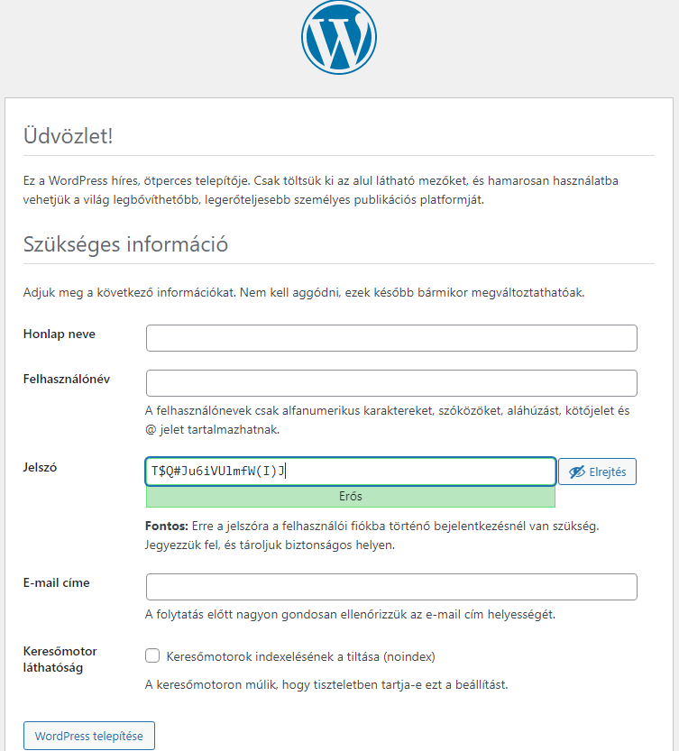

# Frontend - CMS

* **Szerző:** Sallai András
* Copyright (c) Sallai András, 2022
* Licenc: [CC Attribution-Share Alike 4.0 International](https://creativecommons.org/licenses/by-sa/4.0/)
* Web: [https://szit.hu](https://szit.hu)

## Tartalomjegyzék

* [Tartalomjegyzék](#tartalomjegyzék)
* [CMS alapok](#cms-alapok)
* [WordPress rendszer telepítése](#wordpress-rendszer-telepítése)
* [Tartalom kezelése](#tartalom-kezelése)
* [Felhasználó-kezelés](#felhasználó-kezelés)
* [Sablon kezelés](#sablon-kezelés)
* [Kiegészítők](#kiegészítők)
* [CMS gyakorlatok](#cms-gyakorlatok)

## CMS alapok

### CMS bevezetés

A **CMS** a **Content Management System** rövidítése. Magyarul tartalomkezelő rendszer. Lehetővé teszik webes tartalmak könnyű és hatékony kezelését.

Lehetőség van weboldalak létrehozására, szerkesztésére, publikálására, részletesebb webfejlesztői vagy programozói ismeretek nélkül. A CMS rendszerek felületei egyszerűen használhatók és személyre szabhatók.

### A CMS rendszerek előnyei, hátrányai

Előnyök:

* egyszerű és hatékony tartalomkezelés
* könnyen testre-szabható
* a tartalom biztonságosan tárolható
* beépített SEO eszközök
* jól dokumentált
* sok kiegészítő érhető el

Az egyik legnépszerűbb CMS rendszer a WordPress, de népszerű a Drupal a Joomla stb. A választást egy adott projekt igényei szokták meghatározni.

Hátrányok:

* használatát megtanulni időt igényel
* a testreszabáshoz technikai tudás
* az egyszerűség csökkenti a testre-szabhatóságot
* nem minden CMS terhelhető nagy forgalommal

### Alapvető terminológia

1. CMS (Content Management System)
   * Definíció: Egy szoftveralkalmazás, amely lehetővé teszi tartalom létrehozását, kezelését és publikálását.
2. Téma (Theme)
   * Definíció: A weboldal megjelenését és elrendezését meghatározó sablonok és sítlusok gyűjteménye.
3. Plugin/Modul
   * Definíció: Egy kiegészítő szoftverkomponens, ami további funkciókat és képességeket ad a CMS-hez. Például egy SEO vagy egy képgaléria.
4. Widget
   * Definíció: A weboldalhoz könnyen hozzáadható Kisalkalmazások, amelyek apró funkciókat látnak el. Ilyen lehet egy keresősáv, vagy egy hírlevél feliratkozási lehetőség.
5. WYSIWYG (What-You-See-Is-What-You-Get)
   * Definíció: Egy szerkesztőfelület, ahol a szerkesztés során a végleges megjelenést látjuk.
6. SEO (Search Engine Optimization)
   * Defincíció: Technikák és gyakorlatok, amelyek elősegítik, hogy egy keresőmotor találálati listáján minél jobb helyen szerepeljen a webhelyünk.
7. Permalink
   * Definíció: Egy weblapon egy bejegyzés állandó URL címe, ahol az elérhető.
8. Content Types
   * Definíció: A különböző típusú tartalmak: bejegyzés (post), oldal (page), csatolmány (attacments), hozzászólás (comment) stb.
9. Taxonomy (rendszertan)
   * Definíció: A tartalom kategóriákba rendezése és címkézésnek rendszere, módja.
10. User Roles (Felhasználói szerepek)
    * Definíció: A szerepek a felhasználók csoportjai, amelyek különböző lehetőségekkel rendelhetnek. Ilyenek az adminisztrátor, szerkesztő, látogató stb.
11. Media Library (Média könyvtár)
    * Definíció: A weboldalakhoz feltöltött képek, videók, hangfájlok helye.

## WordPress rendszer telepítése

* Telepítő fájl letöltése.
* Fel kell tölteni a használt tárhelyre.
* Adatbázist kell létrehozni.
* CMS telepítése, általában URL-en keresztül.
* Belépés és tesztelés

### Beszerzés

A CMS rendszerek közül a WordPress-t fogjuk használni. Keressük fel a WordPress webhelyét:

* [https://hu.wordpress.org/](https://hu.wordpress.org/)

Kattintsunk a "WordPress letöltése" gombra. Egy újabb oldalon válasszuk a "Download WordPress 6.5" gombra. Egy ilyen fájlt kapunk 6.5 verzió esetén:

* wordpress-6.5-hu_HU.zip

### Tárhely

#### A php parancs használata

A távoli tárhely helyett, helyben fogunk fejlesztő szervert indítani.

Csomagoljk ki tetszőleges helyre a WordPress-t. Lépjünk be a WordPress könyvtárába, majd indítsuk el a szervert:

```bash
php -S localhost:3000 -t . -d extension=mysqli
```

A php parancsnak útvonalba kell lennie. Ha XAMPP-t telepítettünk a Chocolatey csomagkezelővel, a php parancs útvonalba lesz. Mindenképpen el kell még indítanunk egy MariaDB szervert (MySQL).

### Az XAMPP használata

A php parancs használata helyett az XAMPP könyvtárába is elhelyezhetjük a WordPress állományokat.

Ha az XAMPP a C:\ gyökérkönyvtárába lett telepítve, akkor találunk egy ilyen könyvtárat:

* C:\xampp\htdocs

Ebben könyvtárba csomagoljuk ki a .zip állományt. Ha mindent jól csináltunk lesz egy ilyen könyvtárunk:

* C:\xampp\htdocs\wordpress

### Adatbázis létrehozása

Akár a php parancsot használjuk, akár a XAMPP könyvtárában használjuk a WordPress, a telepítés megkezdése előtt létre kell hozni egy adatbázist.

Hozzuk létre az adatbázist. Legyen a neve wordpress.

```sql
create database wordpress;
```

```sql
grant all privileges
on wordpress.*
to wordpress@localhost
identified by 'titok';
```

A kicsomagolt wordpress könyvtárban van egy wp-config-sample.php fájl. Ebből készítsünk egy wp-config.php nevű fájlt. A wp-config.php fájlban állítsuk be az adatbázis elérését. Keressük meg a következő sorokat:

```php
/** Adatbázis neve */
define('DB_NAME', 'adatbázis_neve');

/** MySQL felhasználónév */
define('DB_USER', 'felhasználónév');

/** MySQL jelszó. */
define('DB_PASSWORD', 'jelszó');
```

Javítsuk:

```php
/** Adatbázis neve */
define('DB_NAME', 'wordpress');

/** MySQL felhasználónév */
define('DB_USER', 'wordpress');

/** MySQL jelszó. */
define('DB_PASSWORD', 'titok');
```

Indítsuk el az XAMPP kontrollfelületén az Apache és MySQL lehetőséget.



Be kell állítani webhely nevét, fel kell vennünk egy felhasználót. Adjuk meg a következő adatokat:

* Honlap neve
* Felhasználónév
* Jelszó
* E-mail címe
* Keresőmotor láthatóság (bepipálva tiltjuk)

Amikor sikerült telepíteni, a következő kép fogad minket:


Kattinthatunk a Bejelentkezés linkre. A következő képernyő fogad:


### WordPress beállítások

* Oldalbeállítások
* Sablonok
* Menük és oldalsávok
* Widgetek
* Bejegyzések, oldalak
* Kommentek
* SEO beállítások

## Tartalom kezelése

### Tartalom létrehozása

* Bejegyzések oldalon "Új hozzáadása" gomb.
* Meg kell adni a címet és a tartalmat a Bejegyzés szerkesztése oldalon.
* Használhatjuk a formázási lehetőségeket.
* A Média gomb segítségével médiaelemeket hozhatunk létre.
* Ki kell választani egy kategóriát és egy címkét a bejegyzéshez, hogy könnyen megtalálható legyen.
* Ha készen van, kattintsunk a "Közzététel" gombra.

## Felhasználó-kezelés

Be kell jelentkeznünk adminisztrátori jogokkal.

* Bejelentkezés a adminisztrátorként.
* "Összes felhasználó"-ra kattintunk.
* "Felhasználó hozzáadása" új felhasználóhoz.
* A felhasználói profilban beállítható a név, email cím, jelszó és más adatok.
* Beállíthatunk jogosultságokat, amelyek meghatározhatják mit tehet meg egy felhasználó. Például bejegyzés létrehozása, szerkesztése, törlése, oldalak szerkesztése, szerkesztések jóváhagyása.
* A felhasználók eltávolíthatók szükség esetén.

## Sablon kezelés

* Ingyenes és fizetős sablonok is elérhetők.
* "Alkalmazás testreszabása" menüben találhatók a Sablonok.
* A sablonokban találhatunk egy testreszabási lehetőséget. Szín, szöveg stílus, oldalsávok, fejléc, lábléc módosítás.
* A sablonok akár szerkeszthetők is a teljes testreszabás érdekében.
* Készíthetünk egyedi sablon is. Ehhez másolnunk kell az alapértelmezett sablonfájlt.

## Kiegészítők

Egyedi funkciókat adhatunk a WordPress számára a kiegészítőkkel.

* Vannak ingyenes és fizetős kiegészítők.
* A bővítmények egymással lehetnek konfliktusban.
* A telepítés az admin felületen lehetséges.
* Van néhány alap bővítmény:
  * biztonsági
  * SEO-optimalizálás

## CMS gyakorlatok

1. Egy LLM-től kérdezze le, melyek a legnépszerűbb CMS rendszerek.
