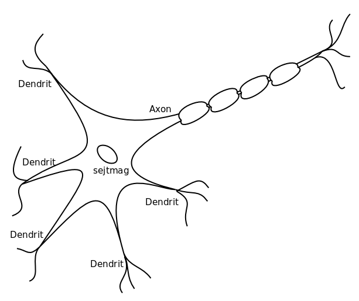

# Gépek

* **Szerző:** Sallai András
* Copyright (c) Sallai András, 2022
* Licenc: [CC Attribution-Share Alike 4.0 International](https://creativecommons.org/licenses/by-sa/4.0/)
* Web: [https://szit.hu](https://szit.hu)

## Mesterséges intelligencia

A mesterséges intelligencai rövdien MI. Angolul artifical intelligence, vödien AI.

A MI fejlesztés célja, hogy olyan intelligenciával rendelkező gépet hozzunk létre, ami az intelligens viselkedéshez hasonlít.

Meg kell jegyezzük, hogy a manapság AI néven elérehtő gépek nem valódi mesterséges intelligenciák. Ezt az alkotójuk is beismerik. Üzeleti érdekekből, azonban AI néven teszik hozzáférhetővé.

Az AI néven elérhető gépek statisztikai nyelvi modulok. Általánosan "Nagy nyelv modellek". Angolul: Large Language Model. A helyes rövidítés így: LLM. Így helyesebb nyelvi modellekről beszélni, vagy egyszerűen LLM-ről.

Nézzük meg hol használják ezeket a technológiákat:

* Robotok irányítása
* Számolás
* Keresés adatok között
* Alakzatok felismerése
* Nyelvek közötti fordítás
* Természetes nyelvek megértése
* Beszéd előállítása

Az AI fejlesztésnek négy irányzatát különböztetjük meg:

* Emberi módon gondolkodó rendszerek
* Emberi módon cselekvő rendszerek
* Racionálisan gondolkodó rendszerek
* Racionálisan cslekvő rendszerek

Az AI-t első képviselői automaták, amelyek már az ókorban is megjelentek.

### Arisztotelész

Arisztotelész (Kr. e 384-324), a Politika című művében automatiáknak nevezett eszközökkel kívánta kiváltani a rabszolgák munkáját, amely sosem valósultak meg. A "Szerszám" című művében lefekteti a logika és a szillogizmus alapjait. "Elemek" című munkájában a számelméleti algoritmusokról ír. Itt szerepel, például két szám legynagyobb közös osztója.

### Turing

Alan Mathison Turing 1950-ben tesztet javasol az automata számára, amit 26 fejezeten keresztül tárgyal. A gép akkor állja ki a próbát, ha a vele társalgó ember nem tudja eldönteni, hogy gépről vagy emberről van szó.

Ehhez a gépekenek a következőkkel kell rendelkeznie:

* természtese nyelv feldolgozása
* ismert vagy hallot információ tárolása
* következtetése levonása
* gépi tanulás - új következtetések levonása

### Arthur Samuel

Arhur Samuel 1952-ben egy IBM számítógépen elkszít egy dámajátékot. Minden játék után a program hatékanyabb dámajátékossá vált.

### Dartmouth College

Az amerikai Darthmouth Collage-ban, 1956-ban 10 tudós megfogalmazza, mit kell tudni egy gépnek:

* nyelvhasználat
* elvont fogalmak ismerete
* problémamegoldás

### Deep Blue

A Deep Blue nevű sakkgép 1997-ben legyőzi Garri Kaszparovot.

### Geoffry Hinton

Geoffry Hinton 2006-ban megalkotja a deep learning fogalmát. Kutatásai során foglalkozott algoritmusokkal, amelyek objektumokat és szövegeket ismernek fel videókon, képeken.

### A Turing teszt teljesítése

2014-ben egy gép teljesíti a Turing tesztet.

### Nyílt levél

2015-ben 3000 fejlesztő találkozott, ahol nyílt levelet fogalmaztak meg. Nyílt levélben az autónom rendszerek veszélyeir hívták fel a figyelmet, amelyk emberi beavatkozás nélkül választják ki a célpontjaikat.

Néhény ismertebb résztvevő:

* Elon Musk
* Steve Wozniak
* Stephen Hawkig

A felhívás itt olvasható:

* [https://arstechnica.com/](https://arstechnica.com/gadgets/2015/07/musk-hawking-wozniak-call-for-ban-on-autonomous-weaponry-and-military-ai/)

AlphaGo

2016-ban az AlphaGo nevű program megver egy profi kínai Go játékost.

## Gépi tanulás

A gépek egy-egy probléma esetén összetett mintákat is felismerhetnek.

A gépi tanulás osztályozása:

* felügyelt
* nem felügyelt
* megerősített

### Felügyelt tanulás

Az adatokat valmailyen céllal címkézzük. Ilyen elven működnek:

* spam szűrő
* célzott reklám, hírdetés

### Nem felügyelt tanulás

A rendezelet adatokban a gép csoportokat ismer fel, de nem áll rendelkezésre célérték.

* hasonló viselkedésű ügyfelek keresése

### Megerősített tanulás

A rendszer hibákból tanul. Eleinte sokat hibázik, amikről visszajelzést kap.

* arfelismerés

## Neurális hálózatok

A "neurális hálózatok" mint fogalom, elsőként a biológiában jelent meg. A biológiai neuronok összekapcsolt hálózatát nevezzük neurális hálózatnak. Egy neuron, az idegsejt idegen szóval. A LLM gépeket adatkezelését a neurális hálózatok mintájára építették meg. Ezért nézzük meg hogyan működik.

Egy neuronnak van egy sejtmagja és egy vagy több nyúlványa. A nyúlványok dendritek és egy axon.

Az idegsejt a dendriteken keresztül impulzust fogad. Megfelelő számú impulzus esetén az idegsejt az axonon keresztül továbbítja az implzust.

### Mesterséges neurális hálózat

A biológiai neurális hálózatok alapján megalkották a mesterséges neurális hálózatokat. A mesterséges neurális hálózatok csak bizonyos tulajdonságokat modelleznek a biológiai hálózatból.

## Gépi látás

A képfeldolgozás esetén gépi látásról beszélünk. Olyan algoritmusokkal dolgozunk, amelyek kidreítik mi látható egy videón vagy egy képen.

A következő tevékenységek jellemzik:

* osztályozás
* objektum követése
* a valóság kiterjesztése
* képek előfeldolgozása (nyújtás, színcsatornák)

A gyártósoron a CNC eszterga minőségellenőre jó példa erre.

## Elérhető modellek

Néhány elérhető nagy nyelvi modell, aza LLM:

* [https://deepai.org/chat](https://deepai.org/chat ) - általános célú
* [https://chatgpt.com/](https://chatgpt.com/) - általános célú
* [https://gemini.google.com/](https://gemini.google.com/) - áltaános célú
* [https://codeium.com/](https://codeium.com/) - szoftverfejlesztési cél
* [https://bito.ai/](https://bito.ai/) - szoftverfejlesztő cél

## Gyakorlat

### Feleletválasztós kérdések

1. Minek a rövidítése az MI?
    * Mechanikus interfész
    * Mesterséges Intelligencia
    * Mesterséges Interfész
    * Magyar informatika
2. Melyik helyes állítás?
    * Az MI célja az emberhez hasonló viselkedés gépeknél.
    * Az MI célja az embertől különböző viselkedés gépeknél.
    * A gépi tanulás nem tartozik az MI témakörébe.
    * A gépi tanuláshoz nem használnak neurális hálózatokat.
3. Az MI területéhez nem tartozik az alábbiak közül az egyik. Melyik az?
    * robotok irányítása
    * megtervezett alakzatok megjelenítése
    * nyelvek közötti fordítás
    * beszéd előállítása
4. Melyik MI irányzat?
    * Racionálisan számoló rendszerek
    * Emberi módon viselkedő állatok
    * Racionálisan gondolkodó állatok
    * Racionálisan cselekvő rendszerek

### Egyszerű kérdések

1. Milyen területeken alkalmazzák jelenleg az MI-t?
2. Mire használjuk a neurális hálózatokat?
3. Milyen veszélyei vannak a mesterséges intelligenciának?
4. Képes az MI érzelmekre?
5. Mikor lesz az MI-nek olyan öntudata, minta az embernek?
6. Mi a neurális hálózat?
7. Milyen beszélgetős MI ismert manapság?
8. Mi a Turing-teszt
9. Hol találkozunk MI-vel a hétköznapokban?
