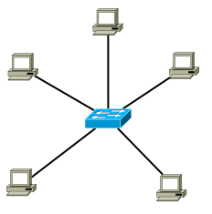
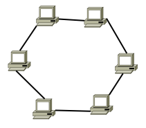
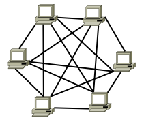
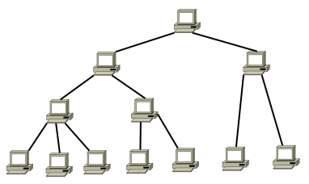
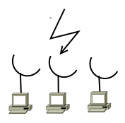

# Hálózat

* **Szerző:** Sallai András
* Copyright (c) Sallai András, 2022
* Licenc: [CC Attribution-Share Alike 4.0 International](https://creativecommons.org/licenses/by-sa/4.0/)
* Web: [https://szit.hu](https://szit.hu)

## Tartalomjegyzék

* [Tartalomjegyzék](#tartalomjegyzék)
* [A hálózatokról](#a-hálózatokról)
* [A fizikai és logikai topológia](#a-fizikai-és-logikai-topológia)
* [Csatlakozás az Internethez](#csatlakozás-az-internethez)
* [BYOD](#byod)
* [SDN](#sdn)
* [A hálózat fenyegetései](#a-hálózat-fenyegetései)
* [Kérdések](#kérdések)
* [Irodalom](#irodalom)

## A hálózatokról

A hálózat egymással összekapcsolt számítógépek és informatikai eszközök rendszere.

Célja adatok átvitele egyi eszközről a másik eszközre.

A hálózatot alkotó eszközök két csoportra oszthatók:

* aktív
* passzív

Az aktív eszközök a jelet újra generálják, így azok nem gyengülnek.

Aktív hálózati eszközök:

* PC
* kapcsoló (swtich)
* elosztó (hub)
* jelismétlő (repeater)
* útválasztó (router, forgalomirányító)
* híd (bridge)
* tűzfal (firewall)
* modem

Passzív hálózati eszközök:

* csatlakozó (RJ45)
* fali aljzat
* patch panel
* kábel
* toldó

A hálózatok megkönnyítik az adatok átvitelét számítógpek között. A világméretű hálózat létrejötte egész társadalmakat változtattak meg. Az internet szereplői hálózaton keresztül vásárolnak, tárgyalnak, rendelnek, csevegnek, megosztanak, tanulnak, ismeretet szereznek stb.

## A fizikai és logikai topológia

A hálózatok felépítését két módon ábrázoljuk:

* topográfia
* topológia

A topográfia leírja mit mivel kötünk össze, de az tis megmutatja hol lesznek ezek az eszközök földrajzilag. Melyik szobában, vagy melyik településen; a méret mindegy.

A topológiai ábrán nem szerepel, hogy hol vannak az eszközök. Csak azt mutatja meg, mit mivel kötünk össze.

A következő ábrán már láthatók milyen fizikai eszközök vesznek részt a hálózatban.

Ha a kommunikációs mechanizmust ábrázoljuk, azt is topológiának hívjuk. Így topológiát kétféle típusát szokás megkülönböztetni:

* fizikai topológia
* logikai topológia

A **fizikai topológia**, ahol ábrázoljuk a hálózat felépítését csompontokkal, vagy konkrét eszközökkel, ahogy azt fentebb is leírtuk.

A **logikai topológián** viszont a kommunikációs mechanizmust ábrázoljuk. Ez alapvetően kétféle lehet:

* szórásos
* vezérjeles

### Fizikai topológia

Attól függően, hogy milyen alakzatok jönnek létre, különböző típusokat határozhatunk meg.

Topológiák:

Csillag topológia:

Gyűrű topológia:

Teljes vagy hálós topológia:

Fa topológia:

Sín topológia:

Rádiós topológia:

### Logikai topológia

A logikai topológia ábrázoljuk, hogyan kommunikálnak egymással a hálózatok. Ez alapvetően kétféle:

* szórásos
* vezérjeles

#### Szórásos topológia

Megnézzük, hogy adhatunk-e és ha igen, akkor adunk.

#### Vezérjeles topológia

Mindig az adhat akinél a vezérjel van. A vezérjel idegen szóval token.

### Megjegyzés

Néhány leírás szerint a logikai topológián ábrázoljuk a az eszkzök pontos típusát is. Más leírások azt mondják, hogy a logikai topológián nincsennek eszközök, azok csak a fizikai topológián. Van ahol a logikai topológián eszközök is szerepelhetnek, de hogy hol van, az csak a fizikai topológián szerepel.

A logikai topológiát arra is használják, hogy megmutassák, hogy két eszköz között kapcsolat van, de hogy ténylegesen milyen eszközökön keresztül épül fel a kapcsolat az lényegtelen.

## Csatlakozás az Internethez

Szükségünk van egy ISP-re. Az **ISP** az **Internet Service Provider** rövidítése. Az ISP egy olyan vállalkozás, amely Internet hozzáférést biztosít más vállalkozások vagy éppen otthonok, intézmények számára.

Az ISP az Internet biztosítása mellett számos más szolgáltatást is nyújthat:

* webtárhely
* IP alapú hangtovábbítás
* technikai szolgáltatás
* alkalmazás szolgáltatás
* adatbázis szolgáltatás
* FTP tárhely

Az internet a végpontokon:

* betárcsázós hozzáférés
* DSL (telefonvonalat használ, de állandó kapcsolatot biztosít)
* kábelmodem
* műholdas

A hozzáférés egyik jellemzője, az egy másodperc alatt átvihető bitek száma. A mértékegység ennek megfelelően:

* bit/s

A sávszélességek megadását általában ilyen formákban szokás:

* bit/s
* Kbit/s
* Mbit/s
* Gbit/s

### Vállalatok

Vállalatok átlal leggyakrabban használt nagysávszélességű kapcsolatok:

* T1 - 1,544/2,048 Mbit/s
* T3 - 44,736/34,368 Mbit/s
* Metro - 10 Gbit/s

A T1-t közepes szintű vállalatok szokták választani, míg a T3 a nagyvállalatok választása. A több irodával vagy telephellyel rendelkező vállalatok választása a Metro Ethernet.

Az ISP hálózatán nagysebességű útválasztók és kapcsolókon keresztül jutnak el az adataink a célgéphez.

## BYOD

A **BYOD** a **Bring Your Own Device** rövidítése. Magyarul: hozd a saját eszközödet. Ez olyan munkamodell, ahol a dolgozók saját eszközön dolgoznak a munkahelyükön.

## SDN

Az **SDN** a **Software Defined Networking** rövidítése, magyarul szoftver által beállított hálózat. Az SDN olyan beállításra utal, ahol a hálózatot dinamikusan programozottan szoftverek állítják be.

## A hálózat fenyegetései

### Sérülékenységek kategóriái

* adathalászat
* adat-szivárgás
* elárasztás
* hozzáférési szabályok sértése
* gyáribeállítások használata
* ellenőrizetlen bemeneti adatok
* hibás konfiguráció
* jelszókezelés

### Néhány megelező ötlet

A helyi adminisztártorok olyan hozzáférést kapjanak, ami automatikusan lejár.

A jelszó nem túl egyszerű, nem túl bonyolult.
A jelszó nem változik, amíg nem kompromitálódik.

Folyamatos naplóelemzés ajánlott.

## Kérdések

### Feleletválsztós

1.) Milyen csoportokba sorolhatók a számítógépes hálózatok?

* nyitott
* mesterséges
* aktív
* reális

2.) Egy hálózatban mi generálja újra a vivőjelet?

* passzív eszköz
* kézi eszköz
* aktív eszköz
* csak a fehér eszközök

3.) Az alábbiak közül melyik nem aktív hálózati eszköz?

* modem
* fali aljzat
* útválasztó (router)
* híd (bridge)

4.) Az alábbiak közül melyik passzív eszköz?

* toldó (vezetéktoldó)
* tűzfal (firewall)
* híd (bridge)
* kapcsoló (switch)

5.) Mi a topográfia?

* megmutatja fizikailag hol helyezkednek el a hálózat eszközei
* mindig megmutatja az adatáramlás irányát
* csak azt mutatja meg, milyen  eszközök vannak a hálózatban
* megmutatja, hol hibásodnak meg a hálózatok

6.) Mi jellemző a fizikai topológiára?

* megmondja milyen eszközök vesznek részt a hálózatban
* minden esetben leolvasható milyen maszkokat használunk
* megmutatja hány IP cam van a hálózatban
* megmutatja milyen hextettel kezdődnek a MAC címek

7.) Mi jellemző a szimplex kapcsolatra?

* egyirányú
* kétirányú
* egyszerre csak egyirányú
* mindig nagyon gyors kapcsolat

8.) Mi jellemző a duplex kapcsolatra?

* egyirányú
* kétirányú
* egyszerre csak egyirányú
* mindig nagyon gyors kapcsolat

9.) Mi jellemző a félduplex kapcsolatra?

* egyirányú
* kétirányú
* egyszerre csak egyirányú
* mindig nagyon gyors kapcsolat

10.) Milyik közeghozzáférési módszer?

* szimplex kapcsolat
* versengéses hozzáférés
* egyirányú kapcsolat
* útválasztót használó

11.) Milyik közeghozzáférési módszer?

* szimplex kapcsolat
* egyirányú kapcsolat
* szabályozott hozzáférés
* útválasztót használó

12.) A CSMA technológiára igaz:

* versengéses
* szabályozott
* egyirányú
* egyszintű

13.) Az Ethernet szabvány száma:

* 802.3
* 802.4
* 802.5
* 802.6

14.) A Wireless szabvány száma:

* 802.9
* 802.10
* 802.11
* 802.12

15.) Melyik nem címzési mód egy hálózatban?

* unicast
* broadcast
* whencast
* multicast

### Egyszerű kérdések

1. ) Mi a hálózat?
2. ) Mi a célja a hálózatnak?
3. ) Hogyan osztályozzuk a hálózatokban résztvevő eszközöket.
4. ) Mi a protokoll?
5. ) Mi a különbség az analóg és a digitális átvitel között?
6. ) Mi a TCP/IP?
7. ) Mi az RFC?
8. ) Mire használható a ping parancs?
9. ) Milyen paranccsal kérdezhetjük le a hálózati kártya fizikai címét.
10. ) Milyen paranccsal tudjunk megújítani IP cím bérlést.

## Irodalom

* [https://www.computernetworkingnotes.com/](https://www.computernetworkingnotes.com/networking-tutorials/differences-between-physical-and-logical-topology.html)
