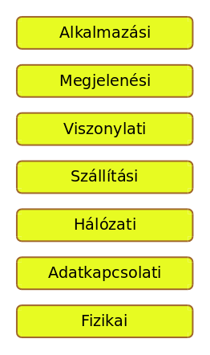
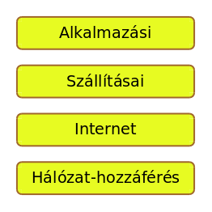
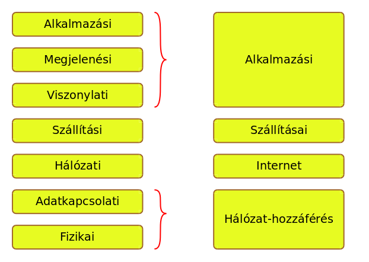

# Hálózati protokollok

* **Szerző:** Sallai András
* Copyright (c) Sallai András, 2022
* Licenc: [CC Attribution-Share Alike 4.0 International](https://creativecommons.org/licenses/by-sa/4.0/)
* Web: [https://szit.hu](https://szit.hu)

## A hálózati protokollok

Ha két gép össze van kötve, és szeretne egymással kommunikálni, ahhoz, hogy megértsék egymást, szükség van lefektetett szabályokra.
Ki mikor adjon, vegyen jelet. Ilyen szabványokat többféle szervezet létrehozott:

* ITU-T
* IEEE
* ISO
* IETF - RFC
* IANA

## RFC

Az internetes szabványokat az IETF hozza létre és RFC nevű leírásokban teszik közzé.

A példa kedvéért, az FTP protokoll a 114 számú RFC-ben írták le, és többek között itt található:

* [https://www.rfc-editor.org/rfc/rfc114](https://www.rfc-editor.org/rfc/rfc114)

## OSI rétegmodell

A hálózatok lehetséges felépítését rétegezve tervezik, mert így az egyes rétegek eszközei cserélhetők.

Az OSI modell a hálózatok egy rétegmodellje:

* Alkalmazási
* Megjelenési
* Viszonylati
* Szállítási
* Hálózati
* Adatkapcsolati
* Fizikai

A OSI modellt a Nemzetközi Szabványügyi Szervezet kezdte leírni 1977-ben, 1984-ben jelent meg.

## TCP/IP

A TCP/IP egy protokollcsalád. Neve két protokollból alakult ki, de ennél jóval több protokollt foglal magába.

A TCP/IP régetmodellje:

* Alkalmazási
* Szállítási
* Internet
* Hálózat-hozzáférés

Az OSI modell és a TCP/IP összehasonlítása

## Továbbiak

Továbbiak elérhetők a következő helyen:

* [https://szit.hu/doku.php?id=oktatas:halozat:halozatok#protokollok](https://szit.hu/doku.php?id=oktatas:halozat:halozatok#protokollok)

* [https://szit.hu/doku.php?id=oktatas:halozat:cisco_szerint_a_halozat:fejezet_03_-_a_halozati_kommunikacio_es_a_protokollok](https://szit.hu/doku.php?id=oktatas:halozat:cisco_szerint_a_halozat:fejezet_03_-_a_halozati_kommunikacio_es_a_protokollok)

* [https://szit.hu/doku.php?id=oktatas:halozat:cisco_szerint_a_halozat:fejezet_04_-_eszkoezoek_kapcsolasa_a_halozatra](https://szit.hu/doku.php?id=oktatas:halozat:cisco_szerint_a_halozat:fejezet_04_-_eszkoezoek_kapcsolasa_a_halozatra)

## Gyakorló

### Feleletválasztós kérdések

1.) Mi a protokoll a hálózatok témakörben?

* Kommunikációs szabályok gyűjteménye.
* Kizárólag a közegelérési módszerek gyűjteménye.
* Találkozók megszervezésének íratlan szabályai.
* Verziókövetők gyűjteménye.

2.) Melyik hálózatszabványosításal foglalkozó szervezet.

* IEEE
* AAA
* IAAA
* EEE

3.) Milyen szabványokkal foglalkozik az RFC?

* internetes
* elektronikai
* hálózati kártya
* domain nevek kiosztása

4.) Melyik nem az OSI modell rétege?

* megjelenés
* viszony
* szállítás
* logisztika

5.) Melyik nem az OSI modell rétege?

* adatkapcsolat
* két ember kapcsolata
* hálózati
* fizikai

6.) Melyik az OSI modell rétege?

* viszony
* két ember kapcsolata
* szállítási
* logikai

7.) Melyik az OSI modell rétege?

* fizikai
* adat
* stílus
* logikai

8.) Melyik az OSI modell rétege?

* megjelenés
* fizikai
* adatkapsolati
* gépi

9.) Melyik a TCP/IP rétege?

* megjelenés
* logikai
* fizikai
* hálózat-hozzáférés

10.) Melyik nem a TCP/IP rétege?

* alkalmazási
* logikai
* internet
* szállítási

11.) Melyik szervezet készít távközlési szabványokat?

* ITU-T
* RFC
* IANA
* IC

12.) Melyik szervezet készíti az RFC-ket?

* IETF
* ITU-T
* IEEE
* AAA

13.) Melyik szervezet foglalkozik az Interneten belüli számok kiosztásával?

* IETF
* IEEE
* ITU-T
* IANA
