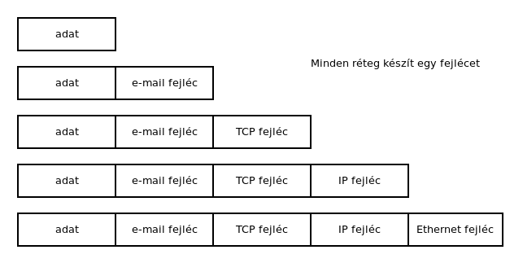
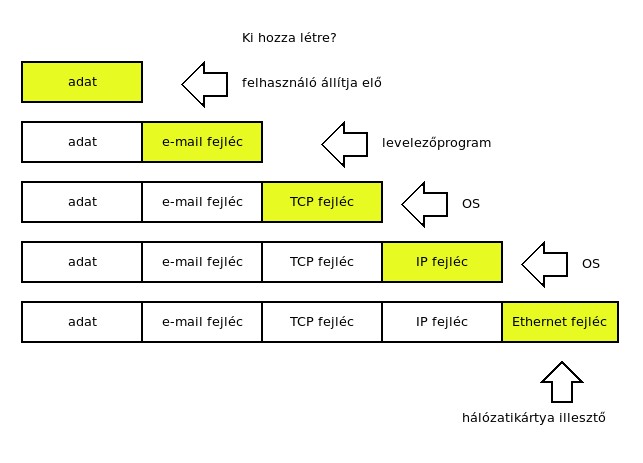
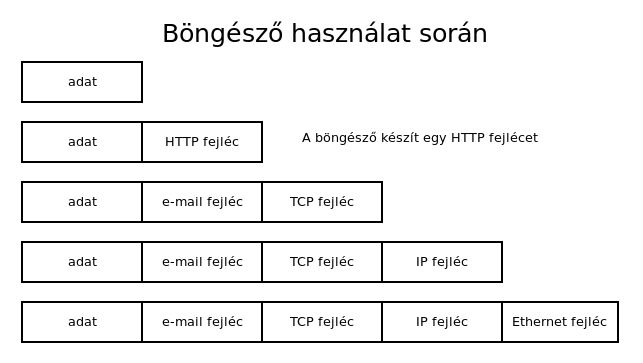
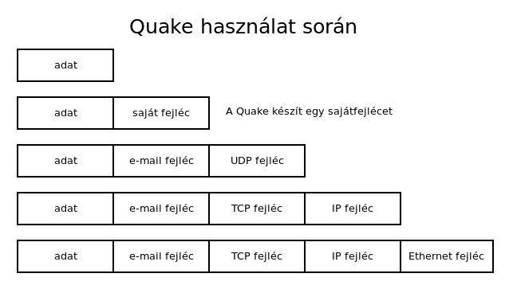

# Hálózati protokollok

* **Szerző:** Sallai András
* Copyright (c) Sallai András, 2022
* Licenc: [CC Attribution-Share Alike 4.0 International](https://creativecommons.org/licenses/by-sa/4.0/)
* Web: [https://szit.hu](https://szit.hu)

## Tartalomjegyzék

* [Tartalomjegyzék](#tartalomjegyzék)
* [A hálózati protokollok](#a-hálózati-protokollok)
* [RFC](#rfc)
* [OSI rétegmodell](#osi-rétegmodell)
* [TCP/IP](#tcpip)
* [Adatküldés](#adatküldés)
* [Protokollok](#protokollok)
* [Protokoll készítő szervezetek](#protokoll-készítő-szervezetek)
* [Az RFC](#az-rfc)
* [Továbbiak](#továbbiak)
* [Gyakorló](#gyakorló)

## A hálózati protokollok

Ha két gép össze van kötve, és szeretne egymással kommunikálni, ahhoz, hogy megértsék egymást, szükség van lefektetett szabályokra.
Ki mikor adjon, vegyen jelet. Ilyen szabványokat többféle szervezet létrehozott:

* ITU-T
* IEEE
* ISO
* IETF - RFC
* IANA

A protokoll a kommunikációs szabályok gyűjteménye.

Protokollok nélkül két hálózati eszköz nem képes kommunikálni egymással.

Egy kapcsolat általában több protokollon keresztül van megvalsítva. Egy e-mail küldéséhez általában a következő protokollok szükségesek:

* SMTP
* TCP
* IP
* Ethernet
* stb.

## RFC

Az internetes szabványokat az IETF[^ietf] hozza létre és RFC nevű leírásokban teszik közzé.

[^ietf]: Internet Engineering Task Force, egy nyílt szabványügyi szervezet.

A példa kedvéért, az FTP protokoll a 114 számú RFC-ben írták le, és többek között itt található:

* [https://www.rfc-editor.org/rfc/rfc114](https://www.rfc-editor.org/rfc/rfc114)

## OSI rétegmodell

A hálózatok lehetséges felépítését rétegezve tervezik, mert így az egyes rétegek eszközei cserélhetők.

Az OSI modell a hálózatok egy rétegmodellje:

* Alkalmazási
* Megjelenési
* Viszonylati
* Szállítási
* Hálózati
* Adatkapcsolati
* Fizikai

A OSI modellt a Nemzetközi Szabványügyi Szervezet kezdte leírni 1977-ben, 1984-ben jelent meg.

## TCP/IP

A TCP/IP egy protokollcsalád. Neve két protokollból alakult ki, de ennél jóval több protokollt foglal magába.

A TCP/IP régetmodellje:

* Alkalmazási
* Szállítási
* Internet
* Hálózat-hozzáférés

Az OSI modell és a TCP/IP összehasonlítása

Nézzük meg a TCP/IP rétegeiben, milyen protokollok találhatók, a teljesség igénye nélkül.

## Adatküldés

Nézzük hogyan történik egy adatküldés. Legyen egy email amit megírunk egy levelezőprogramban.

* Kigondoljuk mit szeretnénk elküdleni, nevezzük ezt adatnak.
* Beírjuk a levelezőprogramba, ami készít hozzá egy fejlécet.
* A levelezőprogram továbbküldi az OS-nek.
* A szállítási szinten a TCP protokoll fejlécét teszi az adatokhoz.
* A hálózati szint a még hozzátesz egy IP fejlécet.
* A hálózati szint átadja az adatot az eddigi fejlécekkel a hálózati kártya illesztőprogramjának, ami szintén hozzátesz egy fejlécet; Ethernet fejlécet.

A következő ábra ezt szemlélteti.

A hálózati kártya végül digitális jelekké alakítja az adatot, minden fejléccel együtt és kiküldi a hálózati kártyán.

Ezt a folyamatot adatbeágyazásnak is nevezzük.

## Protokollok

A következő ábrán láthatjuk, hogy melyik rétegben milyen protokollt találunk. Ez nem az összes protokoll, csanéhány ismertebb. Az alkalmazási szinten rengeteg protokollt található, mivel bárki írhat egy újabb programot, ami egy új alkalmazói protokollt használ.

A lentebb rétegekben ritkábban jönnek létre új protokollok. Ha készítek egy új alkalmazást, általában a szállítási szint TCP vagy UDP protokollját használom.

Ha böngészőt használunk, ugyanez történik.

A Quake játéknak nincs ismert alkalmazói protokollja. Előállít egy adatot saját szabályai szerint, majd átadja a szállítási szintnek.

Vegyük észre, hogy a Quake a szállítási szinten UDP protokollt használ, az eddigi TCP helyett.

## Protokoll készítő szervezetek

* ITU-T - International Telecommunication Union
* IEEE - Institute of Electrical and Electronics Engineers
* ISO - International Standard Organization
* IETF - Internet Engineering Task Force
* IANA - Internet Assigned Numbers Authority

## Az RFC

Az RFC - Request for Comments rövidítése. Az internet protokolljait RFC-ben írjuk le. Egy protokoll leíársa egy RFC. Minden RFC kap egy sorszámot.

Az elkészült RFC sosem változik. Ha hibás egy RFC, akkor újabbat adnak ki.

## Továbbiak

Továbbiak elérhetők a következő helyen:

* [https://szit.hu/doku.php?id=oktatas:halozat:halozatok#protokollok](https://szit.hu/doku.php?id=oktatas:halozat:halozatok#protokollok)

* [https://szit.hu/doku.php?id=oktatas:halozat:cisco_szerint_a_halozat:fejezet_03_-_a_halozati_kommunikacio_es_a_protokollok](https://szit.hu/doku.php?id=oktatas:halozat:cisco_szerint_a_halozat:fejezet_03_-_a_halozati_kommunikacio_es_a_protokollok)

* [https://szit.hu/doku.php?id=oktatas:halozat:cisco_szerint_a_halozat:fejezet_04_-_eszkoezoek_kapcsolasa_a_halozatra](https://szit.hu/doku.php?id=oktatas:halozat:cisco_szerint_a_halozat:fejezet_04_-_eszkoezoek_kapcsolasa_a_halozatra)

## Gyakorló

### Feleletválasztós kérdések

1.) Mi a protokoll a hálózatok témakörben?

* Kommunikációs szabályok gyűjteménye.
* Kizárólag a közegelérési módszerek gyűjteménye.
* Találkozók megszervezésének íratlan szabályai.
* Verziókövetők gyűjteménye.

2.) Melyik hálózatszabványosításal foglalkozó szervezet.

* IEEE
* AAA
* IAAA
* EEE

3.) Milyen szabványokkal foglalkozik az RFC?

* internetes
* elektronikai
* hálózati kártya
* domain nevek kiosztása

4.) Melyik nem az OSI modell rétege?

* megjelenés
* viszony
* szállítás
* logisztika

5.) Melyik nem az OSI modell rétege?

* adatkapcsolat
* két ember kapcsolata
* hálózati
* fizikai

6.) Melyik az OSI modell rétege?

* viszony
* két ember kapcsolata
* szállítási
* logikai

7.) Melyik az OSI modell rétege?

* fizikai
* adat
* stílus
* logikai

8.) Melyik az OSI modell rétege?

* megjelenés
* fizikai
* adatkapsolati
* gépi

9.) Melyik a TCP/IP rétege?

* megjelenés
* logikai
* fizikai
* hálózat-hozzáférés

10.) Melyik nem a TCP/IP rétege?

* alkalmazási
* logikai
* internet
* szállítási

11.) Melyik szervezet készít távközlési szabványokat?

* ITU-T
* RFC
* IANA
* IC

12.) Melyik szervezet készíti az RFC-ket?

* IETF
* ITU-T
* IEEE
* AAA

13.) Melyik szervezet foglalkozik az Interneten belüli számok kiosztásával?

* IETF
* IEEE
* ITU-T
* IANA
