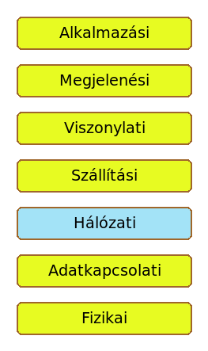
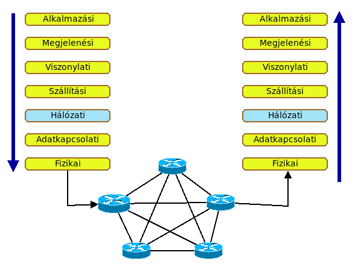
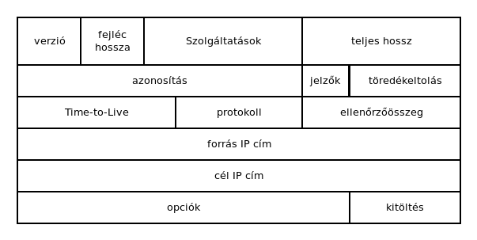

# Hálózati réteg

* **Szerző:** Sallai András
* Copyright (c) Sallai András, 2022
* Licenc: [CC Attribution-Share Alike 4.0 International](https://creativecommons.org/licenses/by-sa/4.0/)
* Web: [https://szit.hu](https://szit.hu)

## A hálózati réteg

A hálózati réteg az OSI modell 3-dik rétege alulról.

Az adatok egy gépen az alkalmazási rétegben keletkeznek. Megindulnak a rétegeken lefelé a fizikai rétegig. A gépet elhagyva útválasztókon keresztül eljutnak egy másik gépig, ahol a fizikai rétegbe érkezk az adat. A fizikai rétegből az alkalmazási rétegbe indul a rétegeken keresztül.

## Hálózati protokollok

Néhány elterjedt hálózati protokoll:

* IP
* IPX
* AppleTalk
* CLNS/DECNet

Ebből minket az IP protokoll érdekel, mivel ez van a TCP/IP protokollcsaládban.

## Az IP protokoll

A leggyakrabban használt protokoll, mivel ezt mindig érinteni kell. Két verziója érhető el:

* IPv4
* IPv6

Az IP protokoll a szállításái rétegből fogadja a szegmenseket. A szegmensekhez hozzáadja saját fejrészét, innentől kezdve csomagokról beszélünk. A csomagot továbbíjtja az adatkapcsolati réteg felé.

Az IP protokoll jellemzői:

* összeköttetés mentes
* nem megbízható, de lejobb szándékú
* nincs nyugtázás
* nincs hibajavítás
* nincs szinkronizáció
* nem tudja milyen kommunikációt továbbít
* a küldő nem tudja fogadjáke- a csomagot

## IP fejléc

| Mező | Leírás |
|------|---------|
| verzió | IPv4 esetén 0100 |
| fejléc hossz | 4 bites szám; A fejlécben a 32 bites szavak száma |
| szolgáltatások | Korábban a szolgáltatás típusa volt; Ma az első 16 bit QoS, az utolsó 2 bit torlódás jelzése |
| teljes hossz | 16 bites; A fejléc és az adat bájltban |
| azonosítás | 16 bites; Az IP csomag egy darabjának azonosíátsa |
| jelzők | |
| töredékeltolás | 13 bit; a sorrend megadása |
| Time-To-Live | 8 bit; minden router csökkenti 1-el az értékét |
| protokoll | 8 bit; A szállított tartalom típusa. ICMP, TCP, UDP |
| Ellenőrzhő összeg | 16 bites |
| forrás IP cím | 32 bitres IP |
| cél IP cím | 32 bitres IP |
| opciók | ritkán szükséges plusz információ |
| kitöltés | Ha az opció nem tölti ki a 32 bitet, akkor kitöltjük (padding) |

## IPv4

Az IPv4 címekről:

* elfogytak
* ~4 billió nyilvános IP cím van
* 32 bites címek
* a címek osztályokba vannak sorolva
* hátrány a sok fenntartott cím
  * csoportos címzés
  * tesztelésre

## IPv6

Az IPv6 címekről:

* az 1990-es években találták ki
* IETF
* megnövekedett címtér
* 128 bites címek
* nincs szükség címfordításra (NAT)
* integrált biztonság
* fejlett csomagkezelés
* ~340 szextillió cím

## Lásd még

* [https://szit.hu/doku.php?id=oktatas:halozat:cisco_szerint_a_halozat:fejezet_07_-_ip_cimek](https://szit.hu/doku.php?id=oktatas:halozat:cisco_szerint_a_halozat:fejezet_07_-_ip_cimek)
