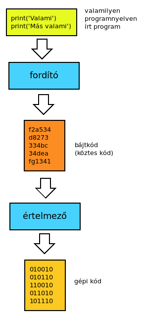

# Programozás alapok - Bevezetés a programozásba

* **Szerző:** Sallai András
* Copyright (c) Sallai András, 2022
* Licenc: [CC Attribution-Share Alike 4.0 International](https://creativecommons.org/licenses/by-sa/4.0/)
* Web: [https://szit.hu](https://szit.hu)

## Tartalomjegyzék

* [Tartalomjegyzék](#tartalomjegyzék)
* [Játékos programozás](#játékos-programozás)
* [Oktatási portálok](#oktatási-portálok)
* [Fordítás és értelmezés](#fordítás-és-értelmezés)
* [Algoritmus](#algoritmus)
* [Fejlesztés](#fejlesztés)
* [Python Shell](#python-shell)
* [Gyakorlat](#gyakorlat)

## Játékos programozás

A játékos programozás növelheti a lelkesedésünket a programozást iránt. Többféle online megoldás is létezik erre a célra. Egyik ajánlott hely a lightbot.hu, ahol egy kis robotot irányíthatunk, az általunk összerakott programjainkkal.

Játékos programozáshoz ajánlott webhely:

* [https://www.lightbot.lu/](https://www.lightbot.lu/)
* [https://www.crunchzilla.com/code-maven](https://www.crunchzilla.com/code-maven)
* [https://screeps.com/a/#!/sim/tutorial/1](https://screeps.com/a/#!/sim/tutorial/1)
* [https://lab.reaal.me/jsrobot/#level=1&language=en](https://lab.reaal.me/jsrobot/#level=1&language=en)
* [https://codecombat.com/play/level/dungeons-of-kithgard?](https://codecombat.com/play/level/dungeons-of-kithgard?)

## Oktatási portálok

Önálló tanuláshoz ajánlott webhelyek:

Nagy segítség lehet a további fejlődéshez egy online oktató webhely, mint a scriba.com, codecademy.com vagy a programiz.pro.

* [https://scrimba.com/](https://scrimba.com/)
* [https://www.codecademy.com/](https://www.codecademy.com/)
* [https://programiz.pro/](https://programiz.pro/)

## Fordítás és értelmezés

A számítógép a gépi kódot ismeri, mi emberek viszont nem szeretjük gépi kódban megmonandi a számítógépeknek mit tegyen. Ezért programozási nyelveket hozunk létre, amivel leírjuk miket csináljon a számítógép. Ehhez szükség van egy fordítóra vagy egy értelmezőre, ami számítógép számára lefordítja, azt amit írtunk.

Szükséges:

* compiler - fordító
* inpterpreter - értelmező

A kettő közötti különbség, hogy ha fordítót használunk, a gépi kódú programot terjesztjük. Ha értelmezőt használunk, a forráskódot terjesztjük, értelmezéskor kerül fordításra.

Ha adott programozási nyelven leírjuk a parancsok sorozatát, azt forráskódnak hívjuk.


* forráskód > gépi kód

### Értelmezett nyelv

Megírjuk a programot valamilyen programozási nyelven. A program futtatáskor egy értelmező program fordítja gépi kóddá.

* forráskód > értelmező > gépi kód


Ha értelmezett nyelvet használunk, akkor a terjesztendő program maga a forráskód lesz, ezt kapja meg a megrendelő. Ilyen például a Python.

### Fordítás

Megírjuk valamilyen nyelven a programot. Lesz egy forrásfájlunk. Ebből egy vagy több menetben fordítunk egy gépi kódot, ami egy másik állomány lesz. Windowson ez például egy .exe kiterjesztésű fájl. Ilyen nyelv a C, C++ stb.

* forráskód > fordító > gépi kód

A fordítás több lépésből is állhat, például tárgykód készítés.


Ha fordított nyelvet használunk, akkor a terjesztendő program a fordítás után létrejött gépikód.

### Modern nyelvek

Az újabb nyelvek egy köztes kódot fordítanak a forráskódból. Vagyis használuk fordítót. A köztes kódot terjesztem. Ez azhért jó, mert a köztes kód géptől független. Ahol futtatom, ott lenni kell egy értelmezőnek, ami az adott gép számára lefordítja a gép függelten kódot, gép függő gépi kódra.

* forráskód > fordító > bájtkód > értelmező > gépi kód



A modern nyelvek bátkódot fordítani, és ezt terjesztjük. Ezt azonban a gép nem érti, ezt futtatáskor gépi kóddá kell fordítanni.

## Algoritmus

Az algoritmus lépésekből álló utasítások sorozata.

Az algoritmusokat számítógép vagy valamilyen automata követi egy adott feladat elvégzése során.

Az ételkészítés, a tea vagy kávé készítés is egy algoritmus alapján történik.

### Mondatszerű leírás

Az algoritmust egy természetes nyelven írom le.

#### Szekvenciális tevékenység mondatszerű leírással

```txt
A program indul
Bekérek egy alapot
Bekérek egy magasságot
Területként eltárolom az alap és a magasság szorzatánka felét
Kiírom a területet
A program vége
```

#### Szelekciós tevékenység mondatszerű leírással

```txt
A program indítása.
Ki írjuk, hogy kérjük az alapot.
Bekérjük az alap változóba a alapot.
Ki írjuk, hogy kérjük a magasságot.
Bekérjük a magasság valtozóba a magasságot.
Megvizsgáljuk, hogy az alap vagy a 
    magasság kisebb-e mint nulla.
  Ha kisebb, kiírjuk: "Érvénytelen adat"
Ha nem így van:
  Kiszámítom a területet az alap és a magasság
    szorzatának a felétől.
  Kiírom a területet.
A programnak vége
```

#### Iterációs tevékenység mondatszerű leírással

```txt
Indítjuk a programot.
Ismétlés kezdete.
  Ki írjuk, hogy kérjük az alapot.
  Bekérjük az alap változóba a alapot.
  Ki írjuk, hogy kérjük a magasságot.
  Bekérjük a magasság valtozóba a magasságot.
Ismétlés végn megvizsgáljuk, 
    hogy az alap vagy a magasság kisebb-e 
    mint nulla. Ha igaz vissza az ismétlés
    elejére.

Kiszámítom a területet az 
    alap és a magasság szorzatának a felétől.
Kiírom a területet.

Vége a programnak.
```

### Pszeudókód

Az algoritmust előre meghatározott szabályok alapján írjuk le.

#### Szekvenciális tevékenység pszeudókóddal

```txt
Indulás
Ki "Alap: "
Be alap
Ki "Magasság: "
Be magassag
terulet = alap * magasság / 2
ki "Terület: ", terulet
Vége
```

#### Szelekciós tevékenység pszeudókóddal

```txt
Indulás
Ki "Alap: "
Be alap
Ki "Magasság: "
Be magassag
Ha alap <= 0 vagy magassag <= 0 akkor
    Ki "Érvénytelen adat"
Ellenben
  terulet = alap * magassag
  ki "Terület: ", terulet
Ha vége
Vége
```

#### Iterációs tevékenység pszeudókóddal

```txt
Indulás
Ismétlés kezdete
  Ki "Alap: "
  Be alap
  Ki "Magasság: "
  Be magassag
Ismétlés alap <= 0 vagy magassag <= 0
terulet = alap * magassag
Ki "Terület: ", terulet
Vége
```

### Folyamatábra

Az algoritmust alakzatokban írom le


#### Szekvenciális tevékenység

Lássunk egy példát a szekvenciális tevékenységre.


#### Szelekciós tevékenység

Példa a szelekciós tevékenységre.


#### Iterációs tevékenység

Az iterációs tevékenység példája.


Több informácia:

* [https://szit.hu/doku.php?id=oktatas:programozas:programozas_elmelet:tananyag#folyamatabra](https://szit.hu/doku.php?id=oktatas:programozas:programozas_elmelet:tananyag#folyamatabra)

## Fejlesztés

Láthattuk, hogy a fejlesztés az adott programozási nyelven egy algoritmus leírása. A programozási nyelveket szabályok alapján használjuk, hasonlóan a természetes nyelvekhez. A nem szabályosan írt utasítás nyelvtani hiba, ahogy a természetes nyelvekben is.

### Szintaktikai hibák

Nem korrekt helyesírás, a program nem fordul, nem fut.

### Szemantikai hibák

A program fut, de logikailag hibás.

### Végrehajtás közben fellépő hibák

A végrehajtás közben fellépő hibák angol neve: **Run-time error**. Ehhez a programnak speciális körülmények közzé kell kerüljenek. Például egy fájl nem létezik. Ezeket a hibákat **kivételeknek** hívjuk: **exception**. Tehát jelzik, hogy valami kivételes dolgoz történt.

### Hibakeresés

Debugolásnak is hívjuk.

## Python Shell

A Python önmagában is indítható. A 2-s vagy 3 verziótól függően:

  python

  python3

A parancsot begépelve a Python értelmező indul el. Lehetséges kimenet:

```python
python3
Python 3.11.2 (main, Mar 13 2023, 12:18:29) [GCC 12.2.0] on linux
Type "help", "copyright", "credits" or "license" for more information.
>>> 
```

Ezt a környezetet hívjuk **Read-Eval-Print Loop**-nak, röviden **REPL**.

Használjuk a REPL-t számításokhoz:

```python
>>> 30+35
65
```

```python
>>> 30+35*2
100
```

A matematikai operátorok prioritása érvényesül.

Osztás:

```python
>>> 70/2
35.0
```

Egész osztás:

```python
>>> 8//5
1
```

Osztás:

```python
>>> 8./5
1.6
```

```python
>>> 5/3
1.6666666666666667
```

### Változók

```python
>>> szam1=35
>>> szam1
35
```

```python
>>> nev='Zoli'
>>> nev
'Zoli'
```

### Többszörös értékadás

```python
>>> alap = magassag = 30
>>> alap
30
>>> magassag
30
```

### Operátorok és kifejezések

```python
>>> res = 3*7 + 5/2
>>> res
23.5
```

Egész osztás maradéka:

```python
>>> 5%3
2
```

Hatvány:

```python
>>> 2**8
256
```

## Gyakorlat

### Feleletválasztós gyakorlat

1.) Hogy hívják a nyelvet amit, a számítógép beszél?

* interpreter
* gépi kód
* compiler
* fordító

2.) A szoftverfejlesztő mit állít elő fejlesztéskor?

* táblázatkezelővel táblázat
* forráskód
* képernyő
* billentyűzet

3.) Mi igaz a compiler-re?

* A forráskódból fordít köztes állapotokon keresztül gépi kódot.
* A program futtatásakor értelmezi a forráskódot.
* A táblázatkezelőben a képleteket értjük alatta.
* A gépi kódból készít forráskódot.

4.) Melyik nyelven fordítunk bájtkódot a gépi kód helyett?

* C
* C++
* C#
* Pascal

5.) Melyik nyelven fordítunk bájtkódot a gépi kód helyett?

* JavaScript
* Java
* PHP
* Pascal

6.) Értelmezett nyelvre melyik igaz?

* Futtatáskor az értelmező gépi kódot készít
* A forráskódot, még futtatás előtt gépi kóddá fordítjuk.
* Nem használunk forráskódot.
* A programot gépi kódba írjuk.

7.) Mi igaz az algoritmusokra?

* Egyértelműen elírt utasítások sorozatára van szükség.
* Nincs szükség egyértelműen előírt utasításokra.
* Az algoritmus nem tartalmazhat ismétlődéseket.
* Az algoritmus nem tartalmazhat elágazásokat.

8.) Mi igaz a mondatszerű leírásra.

* Síkidomokban írjuk le az algoritmust.
* Természetes nyelv mondataival írjuk le az algoritmust.
* Mondatszerű leírást csak számítógépen készíthetünk.
* Mondatszerű leírásban nem használhatunk szorzásnak * operátort.

9.) Mi igaz a REPL-re?

* Adott programozási nyelvhez van egy interaktív program, ahova beírhatjuk, kipróbálhatjuk az utasításait.
* A REPL arra utal, hogy programozási nyelvnek sokszor jelenik meg újabb verziója.
* A REPL a Read Event Point Loop rövidítése.
* A Python nyelvhez nem készítettek REPL-t.

10.) A Python 3 nyelvre igaz:

* 70/2 kifejezésben a "/" jel valós osztást jelent
* 70/2 kifejezésben a "/" jel egész osztást jelent
* 70/2 kifejezésben a "/" jel, nem állhat magában, kettő darab szükséges "//".
* 70/2 kifejezésben a "/" jel az osztás maradékát kapjuk.

11.) A Python 3 nyelvre igaz:

* A "%" operátorként a valós osztást eredményét adja.
* A "%" operátorként a hatványértéket számít.
* A "%" operátor egy egész osztás, egész részét adja.
* A "%" operátor egy egész osztás maradékát adja.
