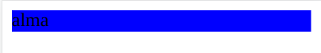
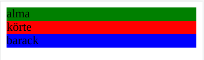
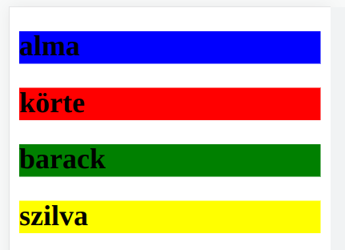
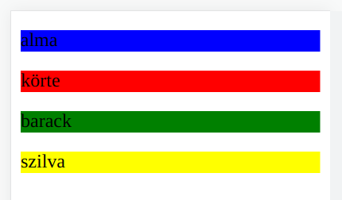
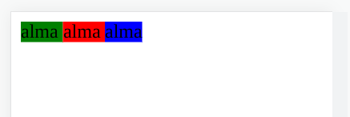
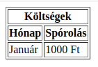
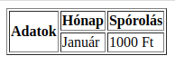
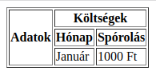

# Webszerkesztés

* **Szerző:** Sallai András
* Copyright (c) Sallai András, 2022
* Licenc: [CC Attribution-Share Alike 4.0 International](https://creativecommons.org/licenses/by-sa/4.0/)
* Web: [https://szit.hu](https://szit.hu)

## HTML

A HTML a **Hypertext Markup Language** rövidítése. Magyarul: **Hiperszöveg jelölő nyelv**. A hiperszöveg, olyan szöveg, ahol ugrásokat végehetünk egy szöveg egyik részéből egy másik részbe.

A HTML fájlokat .html kiterjesztésű állományba írjuk.

### Történet

A GML nyelvet (Generalized Markup Language) az IBM alkotta meg az 1960-as években. Ezt a nyelvet használta dokumentumok leírásara. Az SGML nyelvből később szabvány lett, elét tettek egy "S" betűt, így lett SGML (Standard Generalized Markup Language). Az SGML később tovább fejlesztették, ez lett az XML.

Tim Berners-Lee 1990-ben a CERN-nél dolgozott, ahol kitalálta a World Wide Web-t, azzal együtt a HTML-t.

A HTML először a SGML alapján készült. Így lettek 1, 2, 3, 4, 4.1 verziók. Ezt követően XML alapokon kezdték a HTML újraírni, így lett XHTML 1, 1.1 és 2.0. A böngészőgyártok azonban nem mutattak nagy hajlandóságot a megvalósításra.

2007-ben a Mozilla Foundation, Apple, és az Opera Software létrehozott egy közösséget Web Hypertext Application Technology Working Group (WHATWG) néven. Ez lett a HTML5, amit ma is használunk.

## Online szerkesztő

* [https://jsbin.com/](https://jsbin.com/)

## Telepíthető szerkesztő

* [https://code.visualstudio.com/](https://code.visualstudio.com/)

Telepítés Chocolatey csomagkezelővel:

```cmd
choco install vscode.install
```

## Helló Világ

Készítsünk egy hello nevű projektet. Ez legyen egy hello nevű könyvtár, amelyben egy index.html fájl van:

```txt
hello/
  `-index.html
```

Az index.html fájl tartalma a következő legyen:

```html
<!DOCTYPE html>
<html lang="hu">
<head>
    <meta charset="utf-8">
    <title>Cím</title>
</head>
<body>
    <h1>Az oldal címe</h1>

</body>
</html>
```

Nyissuk meg böngészőben az index.html oldalt. Erre az egyik módszer: böngészőben Ctrl+O, kikeresem az index.html-t, majd a "Select" vagy "Megnyitás" gombra kattintva megnyitom.

## Elemzés

Minden HTML fájlt DOCTYPE sorral kezdjük. Ez megmondja
a böngészőnek, hogy a HTML melyik verzióját használjuk.
A példában szereplő &lt;!DOCTYPE html&gt; sor, azt jelenti, HTML5
verziót használunk.

A HTML oldal szerkezetét tagekkel határozzuk meg.
Egy tag kisebb mint jellel kezdődik és nagyobb mint jellel
záródik:

```xml
<név>
```

A kisebb mint és nagyobb mint jelek között adjuk meg a tag nevét.
Kétféle tag van:

* nyitó
* záró

A tartalmat ezek tagek fogják közre. Egy nyitó és egy záró taget
együtt elemnek nevezünk, HTML elem.

A weboldalak ilyen szervezése az SGML, majd később ebből kialakult
XML dokumentumleíró nyelvből jött létre.

A HTML elemek lehetséges neveit szabvány határozza meg, amit [W3C](https://www.w3.org/) konzorcium készít.

Az egész HTML dokumentumot html elemek közzé tesszük, a DOCTYPE sor
után.

A HTML dokumentumot két részre lehet osztani a html elemek
között:

* fejrész
* törzsrész

A fejrészt a head elemek között adjuk meg, a törzsrészt a body elemek között.

A fejrészben a megjelenő weblaphoz háttér-információkat adunk.
A megjelenő részt a törzs részben helyezzük el. A fejrészben van két minimálisan megadandó HTML elem. Az egyik a weblap karakterkódolását mondja meg, a másik a weboldalnak egy olyan címét határozza meg, amely a böngésző címsorában, vagy annak fülein jelenik meg.

A karakterkódolást a meta elemmel adjuk meg. Minden HTML elem
felvehet attribútumokat. Az attribútumoknak van mindig egy értékük.
A meta elemmel nagyon sok dolog beállítható, a karakterkódolás csak
az egyik dolog. A karakterkódolást a charset attribútummal adjuk meg. Ennek értéke a kódolás:

```html
<meta charset="utf-8">
```

Az értéket mindig az attribútum és egy egyenlőség jel után adjuk meg, idézőjelek között.

A head elemek között az oldal címét a title taggel adjuk meg.

```html
<title>Valami</title>
```

## A body elem

A body elemek közzé írt tartalom jelenik meg a weboldalon.
Korábbi HTML verzióknál használtak attribútumokat a weboldal
formázására, de a HTML5 esetén a formázást CSS nyelvvel
végezzük.

A body elemen belül újabb HTML elemeket helyezünk el a
weboldal így egy hierarchikus dokumentumfába szerveződik.
Ezt a dokumentumfát nevezzük DOM-nak, ami a Document
Object Model rövidítése.

```html
<body>
    <div>
       <h1>Fejrész</h1>
       <p>Bekezdés</p>
    </div>
</body>
```

## Megjegyzés

Megjegyzéseket a következő módon készíthetünk:

```html
<!-- egy sorban -->
<!-- 
  több
  soros
  megjegyzés
  szöveg 
-->
```

A HTML megjegyzések nem ágyazhatók egymásba.

## Fejezetcímek

A fejezet címek a h1, h2, h3, h4, h5, h6 elemekkel határozhatók meg.
Alapértelmezetten a h1 elem jelenik meg a legmagasabb betűmérettel.

```html
<h1>H1 fejezetcím</h1>
<h2>H2 fejezetcím</h2>
<h3>H3 fejezetcím</h3>
<h4>H4 fejezetcím</h4>
<h5>H5 fejezetcím</h5>
<h6>H6 fejezetcím</h6>
```

## Bekezdések

A szövegeket bekezdésekre szokás tagolni. A HTML nyelven a
bekezdés a "p" elemmel készíthető:

```html
<p>
Lorem ipsum dolor sit amet.
</p>
```

A contenteditable attribútummal böngészőben a weblapról szerkeszhető bekezdés hozható létre.

```html
<p contenteditable="true">
Lorem ipsum
</p>
```

Ritkán van rá szükség.

## Általános elemek

A div és a span elemeknek nincs szemantikai jelentésük. A div elem az oldal szerkezetének meghatározására lett létrehozva. A span elem segítségével a szöveg egyes részei eltérően formázhatók.

A következő példa a div elemek használatára mutat egy lehetséges megoldást:

```html
<div class="container">
    <div class="fejresz">
        <!-- ide jön a fejrész -->
    </div>
    <div class="menu">
        <!-- ide jön a menü -->
    </div>
    <div class="tartalom">
        <!-- ide jön az oldal tartalma -->
    </div>
</div>
```

A span elem használatára példa:

```html
Lorem <span class="egy">ipsum</span> dolor sit amet
consectetur, <span class="ketto">adipisicing</span> elit. 
Numquam, rem.
```

## Szemantikus elemek

A szemantikus elemek valamilyen jelentéssel bírnak. Nem szemantikus elem a span és a div. Néhány szemantikus elem:

* table - táblázatok létrehozása
* i - dőlt szöveg jelölése
* p - bekezdés jelölése
* form - űrlap készítítése
* section - egy rész jelölése

## Blokk és inline szintű elemek

### Blokkelemek

Ha egy blokkelemet hozunk létre, az a tartalomtól függetlenül kitölti a rendelkezésre álló helyet. A következő példában a div elemmel hozunk létre egy dobozt, amelynek a tartalmazza az "alma" szót. Minden HTML elem egy úgynevezett dobozt hoz létre a weblapon. Ezen dobozok mérete, kiterjedése, általában nem látszik.

```html
<body>
   <div>
       alma
   </div>
</body>
```

A div elem a böngésző bal szélétől a jobb széléig tart.

Hogy lássuk a div boboz kiterjedését, adjunk háttérszint a doboznak:

```html
<body>
   <div style="background-color: blue">
       alma
   </div>
</body>
```

A doboznak a style attribútummal állítottunk be kék háttérszint.



Készítsünk több div elemet egymás után:

```html
<body>
   <div style="background-color: green">
       alma
   </div>
   <div style="background-color: red">
       körte
   </div>
   <div style="background-color: blue">
       barack
   </div>

</body>
```



Kettes szintű fejezetcímek egymás után:

```html
<h2 style="background-color: blue">alma</h2>
<h2 style="background-color: red">körte</h2>
<h2 style="background-color: green">barack</h2>
<h2 style="background-color: yellow">szilva</h2>
```



p elemek:

```html
    <p style="background-color: blue">alma</p>
    <p style="background-color: red">körte</p>
    <p style="background-color: green">barack</p>
    <p style="background-color: yellow">szilva</p>
```



Láthatjuk, hogy a blokkelemek egymás után folynak lefele a weblapon, mindegyik egyetlen sort elfoglalva.

### Inline elemek

Az inline elemek mérete a tartalomhoz igazodnak. Nézzünk egy span elemet, ami inline elem. A style attribútummal megszínezzük:

```html
<body>
   <span style="background-color: blue">
       alma
   </span>
</body>
```


Láthatjuk a háttérszín alapján, hogy a doboz csak a szöveg körül létezik.

Most tegyünk több inline elemet egymás után:

```html
<body>
    <span style="background-color: green">
        alma
    </span>
    <span style="background-color: red">
        alma
    </span>
    <span style="background-color: blue">
        alma
    </span>    
</body>
```

Több inline elem egy sorban jelenik meg mindaddig, amíg elfér a sorban. Ha egy inline elem nem fér el, akkor a következő sorba jelenik meg.



Figyeljük meg, hogy a dobozok egymás után jelennek meg, egyetlen sorban. Az inline elemek körülfogják a tartalmat és nem nagyobbak mint a tartalom. Egymás után egyetlen sorban folynak, ha nincs több hely, a következő sorba folynak a weblapon.

### Összefoglaló

Egyes elemek blokk szintűek, egyes elemek inline szintűek:

Blokkelemek:

* div
* p
* h1 - h6
* stb.

Inline elemek:

* span
* b
* i
* a
* stb.

## Sortörés

Sortörést a br elemmel lehet megvalósítani. A b elemnek nincs lezáró része, a lezárást az elem neve után írt szóköz, majd a / karakter jelölheti, de ez nem kötelező.

```html
<br />
```

Próbáljuk meg egy bekezdésben:

```html
<p>
Lorem ipsum dolor sit amet consectetur, 


adipisicing elit. Numquam, rem.
</p>
```

Így önmagában, hiába teszek sortöréseket, a weblapon az nem látszik. Használjunk helyette br elemet:

```html
<p>
Lorem ipsum dolor sit amet consectetur, 
<br><br>
adipisicing elit. Numquam, rem.
</p>
```

A három sor akár egyetlen sorban is megadható.

## Kiemelés

A kiemelésekre többféle HTML elem áll rendelkezésre. A következő három fejezet, ilyen kiemelő elemeket mutat be.

### Szövegek kiemelése

| Tag | Leírás |
|-|-|
| &lt;b&gt; | félkövér szöveg |
| &lt;em&gt; | kiemelt szöveg  |
| &lt;i&gt; | dőlt szöveg |
| &lt;small&gt; | kis szöveg |
| &lt;strong&gt; | erős szöveg |
| &lt;sub&gt; | alsó index |
| &lt;sup&gt; | felő index |
| &lt;ins&gt; | beszúrt szöveg |
| &lt;del&gt; | törölt szöveg |
| &lt;s&gt; | elavult, pontatlan, nem fontos szöveg |

### Számítógépes kiemelések

| Tag | Leírás |
|-|-|
| &lt;code&gt; | számítógépes kód |
| &lt;kbd&gt; | billentyűzet |
| &lt;samp&gt; | mintakód |
| &lt;var&gt; | változó |
| &lt;pre&gt; | előreformázott szöveg |

### Idézetek és definíciók

| Tag | Leírás |
|-|-|
| &lt;abbr&gt; | egy rövidítés |
| &lt;address&gt; | cím |
| &lt;bdo&gt; | szöveg iránya |
| &lt;blockquote&gt; | hosszú idézet |
| &lt;q&gt; | rövid idézet |
| &lt;cite&gt; | cím idézése |
| &lt;dfn&gt; | egy kifejezése meghatározása |

## Listák

A listák minden dokumentumban fontos szervező elemek. A HTML oldalakon háromféle listát hozhatunk létre:

* számozott
* számozatlan
* definíciós

A számozott és számozatlan lista egymásba átalakítható CSS segítségével, amit később fogunk megtanulni.

### Számozatlan lista

A számozatlan lista angolul "unordered list". Ha a két szónak vesszük az első betűit, az ul-t kapjuk. Az ul elemmel hozhatunk létre számozatlan listákat. A lista elemeit az li elemmel adjuk meg. Lássunk egy példát:

```html
<ul>
    <li>alma</li>
    <li>körte</li>
    <li>barack</li>
    <li>szilva</li>
</ul>
```

### Számozott lista

Az angol "ordered list" szavak első betű ol. Az ol elemmel hozhatunk létre számozott listát.

```html
<ol>
    <li>alma</li>
    <li>körte</li>
    <li>barack</li>
    <li>szilva</li>
</ol>
```

A számozás szabályozása:

```html
<ol start="40">
    <li>alma</li>
    <li>körte</li>
    <li>barack</li>
    <li>szilva</li>
</ol>
```

Ebben a példában a számozás 40-től indul.

A számozás megfordítása:

```html
<ol reversed="reversed">
    <li>alma</li>
    <li>körte</li>
    <li>barack</li>
    <li>szilva</li>
</ol>
```

Használhatjuk két attribútumot együtt is.

### Egymásba ágyazás

Az li elemen belül megadható akár egy másik lista is.

```html
<ol>
  <li>Olaszorzság</li>
  <li>Magyarország
    <ol>
      <li>Hatvan</li>
      <li>Szolnok</li>
      <li>Miskolc</li>
    </ol>
  </li>
  <li>Szlovákia</li>
</ol>
```

### Definíciós lista

Valamilyen fogalom definiálásra használható a definíciós lista:

```html
<dl>
  <dt>fogalom</dt>
    <dd>leírás</dd>
  <dt>fogalom2</dt>
    <dd>leírás</dd>
    <dd>alternatív leírás</dd>
    <dd>másik alternatív leírás</dd>
</dl>
```

## Képek beillesztése

Használható fájltípusok:

|  Rövidítés  |  Formátum  | Kiterjesztés |
|-|-|-|
| JPEG | Joint Photographics Expert Group | .jpg, .jpeg |
| GIF | Graphics Interchange Format | .gif |
| PNG | Portable Network Graphics | .png |
| SVG | Scalable Vector Graphics | .svg |
| WebP | Web Picture | .webp |

Az [MDN](https://developer.mozilla.org/en-US/docs/Web/Media/Formats/Image_types) a dokumentációjában ide sorolja az APNG és az AVIF formátumokat is.

```html

```

Az src és az alt attribútumok kötelezőek.

A képeknek, azonban más attribútumai is lehetnek.

```html

```

### A figure elem

A figure elem segítségével összefoghatjuk a képet és a feliratát.

```html
<figure>
  
  <figcaption>Felirat<figcaption>
</figure>
```

## Táblázat

A táblázat elterjedt formája többféle tulajdonság megjelenítésének.

### Alap

```html
<table border="1">
  <tr>
    <th>#</th>
    <th>Név</th>
  </tr>
  <tr>
    <td>1</td>
    <td>Pala Béla</td>
  </tr>
</table>
```

A border attribútum szegélyt határoz meg a táblázat részére. Ezt nem így fogjuk megadni később, de most jól látható ettől a táblázat kinézete.

### Táblázat felirata

A caption elem segítségével feliratozható a táblázat. Böngészőtől függ, hogy ez hol jelenik meg.

```html
<table border="1">
  <caption>Dolgozók</caption>
  <tr>
    <th>#</th>
    <th>Név</th>
  </tr>
  <tr>
    <td>1</td>
    <td>Pala Béla</td>
  </tr>
</table>
```

### Táblázat összefoglalója

Ritkábban használt attribútum a summary, amiben megadhatunk egy összefoglalót, ami egyébként csak a forráskódban jelenik meg.

```html
<table border="1" summary="A dolgozók adatai">
  <caption>Dolgozók</caption>
  <tr>
    <th>#</th>
    <th>Név</th>
  </tr>
  <tr>
    <td>1</td>
    <td>Pala Béla</td>
  </tr>
</table>
```

### Oszlopnyúlás

```html
<table border="1">
  <tr>
    <th colspan="2">Költségek</th>
  </tr>
  <tr>
    <th>Hónap</th>
    <th>Spórolás</th>
  </tr>
  <tr>
    <td>Január</td>
    <td>1000 Ft</td>
  </tr>
</table>
```



### Sornyúlás

```html
<table border="1">
  <tr>
    <th rowspan="2">Adatok</th>
    <th>Hónap</th>
    <th>Spórolás</th>
  </tr>
  <tr>
    <td>Január</td>
    <td>1000 Ft</td>
  </tr>
</table>
```



### Sor- és oszlopnyúlás

```html
<table border="1">
  <tr>
    <th rowspan="3">Adatok</th>
    <th colspan="2">Költségek</th>
  </tr>
  <tr>
    <th>Hónap</th>
    <th>Spórolás</th>
  </tr>
  <tr>
    <td>Január</td>
    <td>1000 Ft</td>
  </tr>
</table>
```



### Táblázat részeinek csoportosítása

A táblázat sorait felbontjuk fejrészre, törzs és lábrészre. A fejrészt a thead elemmel adjuk meg, a törzs részt a tbody elemmel, míg a lábrészt a tfoot elemmel.

```html
<table>
  <thead>
    <tr>
      <th>Név</th>
      <th>Fizetés</th>
    </tr>
  </thead>
  <tbody>
    <tr>
      <td>Nagy János</td>
      <td>3850000</td>
    </tr>
    <tr>
      <td>Kemény Ferenc</td>
      <td>2870000</td>
    </tr>
  </tbody>
  <tfoot>
    <tr>
      <td>Összesen</td>
      <td>6720000</td>
    </tr>
  </tfoot>
</table>
```

### Oszlopok csoportosítása

Az oszlopok is csoportosíthatók a colgorup és col HTML elemekkel.

```html
<table>
  <colgroup>
    <col span="2" style="background-color:yellow">
    <col style="background-color:blue">
  </colgroup>
  <tr>
    <th>No.</th>
    <th>Név</th>
    <th>Település</th>
  </tr>
  <tr>
    <td>1</td>
    <td>Nagy József</td>
    <td>Szolnok</td>
  </tr>
  <tr>
    <td>2</td>
    <td>Peres Ferenc</td>
    <td>Szeged</td>
  </tr>
</table>
```

## Hiperhivatkozás

Hiperhivatkozást az "a" elemmel hozunk létre. Maga a hivatkozás a href attribútum értéke. Az "a" elem tartalma pedig ami a weblapon megjelenik.

```html
<a href="hivatkozas">Leírás</a>
```

A hivatkozás lehet egy horgony, lehet egy másik weblap, vagy egy másik weblap horgonnyal.

```html
<a href="#horgonynev">Leírás</a>
<a href="masik.html">Leírás</a>
<a href="masik.html#horgonynev">Leírás</a>
```

Ha egy weboldalon belül szeretnénk egy szöveghez ugrani, akkor ahova szeretnénk ugrani, ott lenni kell egy horgonynak.

Horgony:

```html
<a id="név"></a>
```

vagy:

```html
<a name="név"></a>
```

## Videó

Videókat a video elemmel teszünk közzé.

```html
<video src="fajlnev.ogg" width=”300” height=”300”></video>
```

Több formátumban is feltölthetünk videót. Ha egy böngésző nem ismeri az egyik formátumot, a másikat jó eséllyel már igen.

```html
<video  width=”300” height=”300”>
    <source src="fajlnev1.ogg">
    <source src="fajlnev2.mp4">
</video>
```

## Hang

Hangot az audio elemmel tehetünk közzé.

```html
<audio controls="controls">
  <source src="hangfajl.ogg" type="audio/ogg">
  <source src="hangfajl.mp3" type="audio/mpeg">
A böngésződ nem támogatja az audio elemet. 
</audio>
```

## Űrlap

Az űrlapok segítségével a weblap felhasználója adatokat közölhet a webszerverrel.

```html
<form action="akcio.php" method="POST">
<fieldset>
  <legend>Teljesnév</legend>
  <label for="vnev">Vezetéknév:</label>
  <input type="text" name="vnev" value="" id="vnev" /><br />
  <label for="knev">Keresztnév:</lable>
  <input type="text" name="knev" value="" id="knev" /><br />
 
  <input type="submit" value="Elküld" />
</fieldset>
 
</form>
```

## Az oldal szerkezetét leíró elemek

Az oldal szerkezetét általános célú div elemekkel,
vagy szemantikus elemekkel írjuk le. Erre a célra
a következő szemantikus elemek állnak rendelkezésre:

* section - a weblap egy szakasza
* aside - érintőlegesen kapcsolódó tartalom
* header - az oldal vagy egy rész fejrésze
* nav - navigációs sáv
* footer - az oldal vagy egy rész lábrésze
* article - tartalmi egységek
* main - az oldal főbb része

## Gyakorlat

### Szerkesztő gyakorlat

Oldjon meg feladatokat a következő gyűjteményből:

* [https://szit.hu/doku.php?id=oktatas:web:html:html_feladatok](https://szit.hu/doku.php?id=oktatas:web:html:html_feladatok)

### Feleletválasztós gyakoralt

1.) Melyik HTML elem a gyökérelem egy dokumentumban?

* head
* doctype
* html
* body

2.) Melyik HTML elemmel adjuk meg lang változót?

* head
* html
* body
* div

3.) Melyik az a HTML elem, amelynek a tartalma a böngészőben megjelenik mint weblap?

* head
* meta
* title
* body

4.) Mit állíthatunk be a lang attribútummal?

* Az oldal készítésének dátuma.
* A weboldal karakterkódolása.
* A weboldal nyelvezete.
* A weboldalhoz használt fordító program.

5.) Melyik a helyes karakterkódolás beállítás?

* &lt;html charset="utf-8"&gt;
* &lt;lang charset="utf-8"&gt;
* &lt;body charset="utf-8"&gt;
* &lt;meta charset="utf-8"&gt;

6.) Ha szeretnénk megjeleníteni a "Madár" szót elsődleges fejezetcímként, akkor azt a következő elemek között tesszük.

* body
* h1
* title
* lang

7.) &lt;html lang="hu"&gt;&lt;/html&gt; részletből HTML elemnek nevezzük a következőt:

* lang
* bármelyik html egyedül
* a két html együtt
* "hu"

8.) Egy HTML elem egyik tagját így hívjuk:

* log
* tag
* feg
* heg

9.) A title elemek célja:

* A weblapon megjelenő oldal címének beállítása.
* A weblap karakterkódolásának beállítása.
* A weblap címe a böngésző fülön vagy a címsorában.
* A weblap gyökéreleme.

10.) A body elem célja:

* A böngészőfülön cím beállítása.
* A weboldal kódolásának beállítása.
* A weboldalon megjelenő tartalmat ide helyezzük.
* A weboldal nyelvét állítjuk be.

11.) HTML oldalon a helyes megjegyzés:

* /&lowast; szöveg &lowast;/
* &lt;!-- szöveg --&gt;
* &num; szöveg
* { szöveg }

12.) Ennyiféle fejezetcím állítható be a HTML elemekkel:

* 4
* 5
* 6
* 7

13.) Kettes szintű fejezetcímet a következő HTML elemmel állítunk be:

* h2
* f2
* head2
* header2

14.) HTML-en belül bekezdésnek a következő elemmel jelölünk szöveget:

* a
* b
* p
* i

15.) Melyik elem általános célú a következők közül.

* i
* h1
* div
* em

16.) Melyik elem általános célú a következők közül.

* i
* span
* p
* pre

17.) Mitől blokkszintű egy HTML elem?

* A tartalma csak utf-8 kódolású lehet.
* Csak a tartalmat fogja körbe.
* Nem lehet tartalma.
* Kitölti a rendelkezésre álló helyet.

18.) Mitől inline egy HTML elem?

* Kitölti a rendelkezésre álló helyet.
* Nem lehet tartalma.
* Csak a tartalmat fogja körbe.
* A tartalma csak utf-8 kódolású lehet.

19.) Melyik blokk elem?

* span
* i
* b
* div

20.) Melyik inline elem?

* i
* div
* p
* h1

21.) Hogyan lehet sortörést megjeleníteni a weblapon?

* line
* br
* break
* linebreak
