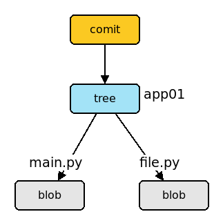
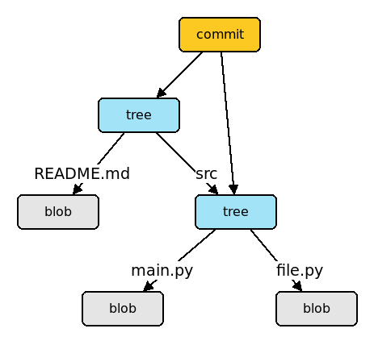

# Webes hibakeresés

* **Szerző:** Sallai András
* Copyright (c) Sallai András, 2022
* Licenc: [CC Attribution-Share Alike 4.0 International](https://creativecommons.org/licenses/by-sa/4.0/)
* Web: [https://szit.hu](https://szit.hu)

## Tartalomjegyzék

* [Tartalomjegyzék](#tartalomjegyzék)
* [HTML](#html)
* [Git](#git)
* [IRC](#irc)
* [Fórumok](#fórumok)
* [LLM](#llm)

## HTML

### Validátor

A validátorok a HTML oldalak szabványosságát vizsgálja. A W3C konzorcium érvényesség vizsgálója:

* [https://validator.w3.org/](https://validator.w3.org/)

A validátorba megadhatjuk URL segítségével a welapunk címét, vagy feltölthetjük, esetleg egyszerűen vágólapról bemásolhatjuk.

### A böngésző fejlesztői eszköze

Ma már a népszerűbb böngészők tartalmaznak fejlesztői eszközöket, a weboldalak teszteléséhez, hibakereséshez.

A fejlesztőeszköz megjelenítéséhez billentyűkód:

* Ctrl + Shift + I

vagy

* F12

Korábban csak a Ctrl+Shift+I működött. Mostanság az F12 is.

Lehetőségek:

* elem kiválasztása vizsgálatra - Elements-el együtt
* eszközválasztó sáv - oldal megtekintése pl. mobil felbontásban
* Elements - HTML és CSS vizsgálata
* Console - JavaScript konzolja
* stb.

## Git

A Git egy verziókövető rendszer. Segítségével visszaállítható egy korábbi állapot hiba esetén. A fejlesztés több különálló ágra osztható, amit később összefésülhetünk.

### Kezdés

Készítsük el a projektet, majd a készítsünk belőle git tárolót:

```cmd
mkdir app01
cd app01
git init
```

Innentől kezdve a projekt fel van készítve a verziókövetésre. A projekt állományait tudjuk követni.

### Bemutatkozás

Az állapotok tárolása mindig valakinek a nevében történnek. Vagy globálisan, vagy a helyi projekten belül be kell mutatkozni a git számára. A bemutatkozás a név és e-mail cím megadását jelenti.

Beállítás globálisan, minden projekthez:

```cmd
git config --global user.name "Keresztnév Vezetéknév"
git config --global user.email "joska@zold.and"
```

Csak az aktuális projekthez:

```cmd
git config --local user.name "Keresztnév Vezetéknév"
git config --local user.email "joska@zold.and"
```

Beállítások lekérdezése:

```cmd
git config --list
```

Hol vannak tárolva a beállítások:

```cmd
git config --list --show-origin
```

Az e-mail és a név lekérdezése egyenként:

```cmd
git config --global user.email
git config --global user.name
```

Ha sajt gépünkön dolgozunk, nem szükséges törölni a bemutatkozást. Ha azonban osztott módon használ egy gépet több ember, a munkánk végeztével ajánlott törölni a bemutatkozást.

Beállítások megszüntetése:

```cmd
git config --global --unset user.email
git config --global --unset user.name
```

A folyamatos beállításhoz és törléshezt találunk a következő linken néhány batch fájlt.

Batch fájlok:

* [https://github.com/oktat/githandler](https://github.com/oktat/githandler)

### Tárolás


Készítsünk egy adat.txt és egy naplo.txt állományt:

```cmd
echo alma > adat.txt
echo 2022 > naplo.txt
```

Az adat.txt állományt szeretnénk verzió-követni, de a naplo.txt állományt nem. A naplo.txt állomány nevét írjuk bele egy .gitignore állományba. Így a Git nem törekszik annak követésére.

```cmd
echo "naplo.txt" >> .gitignore
```

Most adjuk ki a git status parancsot. Lehetséges kimenet:

```cmd
git status
On branch master

No commits yet

Untracked files:
  (use "git add <file>..." to include in what will be committed)
  .gitignore
  adat.txt

nothing added to commit but untracked files present (use "git add" to track)
```

Láthatjuk, hogy két fájlt szeretne követni a Git. A .gitignore és az adat.txt fájlt. A naplo.txt fájl nem érdekli.

Először vegyük rá a fájl követésére a tárolót:

```cmd
git add .gitignore
git add adat.txt
```

Kérdezzük le újból a tároló státuszát:

```cmd
git status
```

Most fűzzünk megjegyzést a tárolt állapothoz. Például "Kezdés".

```cmd
git commit -m "Kezdés"
```

A tárolás most kész. Kérdezzük le újból a státuszt:

```cmd
git status
```

A kimenet most:

```txt
On branch master
nothing to commit, working tree clean
```

Egyetlen állapot lett véglegesítve. A véglegesített állapot neve commit. Nézzük meg:

```cmd
git log
```

Lehetséges kimenet:

```txt
commit 11377e55527cfa39dfad9314629d9c1cabc4aed7 (HEAD -> master)
Author: Nagy János <janos@zold.lan>
Date:   Wed Aug 24 20:42:50 2022 +0200

    Kezdés
```

Minden commit kap egy azonosítót, ami 40 karakterből áll, és egy hexadecimális szám.

A következő képen a három commit utáni állapotot látjuk.


Egy commit egy pillanatkép a projektről. A HEAD mutatja éppen hol dolgozunk. A képen láthatjuk, hogy a master ágon dolgozunk és a harmadik pillanatképen.

### Az add művelet

A stage állapotba az add paranccsal tesszük a fájlokat. Ezzel követett állapotba kerülnek.

```cmd
git add .gitignore
git add adat.txt
```

A fájlok hozzáadása a --all kapcsolóval egyetlen paranccsal is megoldhatók:

```cmd
git add --all
```

Ezzel a paranccsal vigyáznunk kell, mert olyan fájlok és könyvtárak is hozzáadhatunk amiket nem szeretnénk. A következő forma még egyszerűbb:

```cmd
git add .
```

Ügyeljünk a használatuk során. A pont és a --all használata esetén ajánlot mindig futtatni a status lekérdezését:

```cmd
git status -u
```

### Git objektumok

A Git használata során a háttérben különféle objektumok jönnek létre.

A példa kedvéért készítsünk az app01 projekt könyvtárban két fájlt:

```txt
app01/
  |-main.py
  `-file.py
```

Épjünk be az app01 projekt könyvtárba, ha nem vagyunk belépve, majd készítsünk helyi tárolót:

```cmd
cd app01
git init
```

Tegyük a két fájlt stage (színpad) állapotba:

```cmd
git add main.py
git add file.py
```

A művelet után mindkét fájlhoz létrejön egy **blob** nevű objektum.

* blob


Ezt követően tároljuk el a **git commit** paranccsal:


A művelet után létrejön két objektum:

* tree
* commit

A következő objektumszerkezet létezik:



Az add műveletnél létrejön a blob objektum, a commit műveletnél létrejön a tree és commit objektum.

Lássunk egy példát egy másik Git objektumszerkezetre. A könyvtárszerkezet:

```cmd
app01/
  |-src/
  |  |-main.py
  |  `-file.py
  `-README.md
```

A létrejött objektumok:



### Visszaállítás

Adjunk az adat.txt állományhoz a "körte", majd az "eper" szót is.

```cmd
echo körte >> adat.txt
echo eper >> adat.txt
```

Most rájövünk, hogy ezt nem kellett volna, vissza kéne állni az utolsó végleges mentéshez, amikor még csak az alma szó volt az adat.txt fájlban.

Visszaállás, ha még nem volt git add:

```cmd
git reset --hard
```

Ha már volt git add:

```cmd
git reset --hard HEAD
```

Visszaállás egy véglegesített állapotra:

```cmd
git reset --hard 4824
```

Az ágból elhagyott commitokat is szeretnénk látni:

```cmd
git log --reflog
```

Automatikusan stage állapotba és commit:

```cmd
git commit -a -m "Valami"
git commit --all --message "Valami"
```

A két utasítás egyező hatást vált, ki csak a második hosszú kapcsolókat használ.

### Ágak használata

A Git képes különálló fejlesztési folyamatokat kezelni, ehhez ágakat hozunk létre, angolul branch. A Git tároló létrehozásakor is létrejön egy fő ág "master" néven. (Mostanában szorgalmazzák, hogy ezt nevezzük át "main" ágra). Amíg nem hozunk létre másik ágat és nem lépünk át rá, addig ezen a fő ágon dolgozunk.

Egy tetszőleges néven létrehozunk egy új ágat, majd átálunk az új ágra. A váltás után az eredeti ághoz nem nyúlunk, külön ágon fejlesztünk tovább.

A főágra bármikor visszaválthatunk.

Elágazás létrehozása:

```cmd
git branch dev
```

Átállás az elágazásra:

```cmd
git checkout dev
```

Fejlesztünk:

```cmd
echo uborka >> zoldseg.txt
git add zoldseg.txt
git commit -m "Uborka hozzáadva"
```

Visszaállás a master ágra és összefűzés:

```cmd
git checkout master
git merge dev
```

### Távoli munka

A tárolóinkat feltölthetjük egy Git szerverre, vagy a szerverről letölthetjük saját gépünkre. Egy népszerű szabadon használható Git szerver a GitHub. De használhatjuk a GitLab vagy Bitbucket szervereket is. A következő példákban a GitHub szerver használjuk.

Ha egy projektből még nincs példányunk, a klónozást használjuk a "clone" paranccsal:

```cmd
git clone https://github.com/valaki/valami
```

Ha már van példányunk a projektből és szeretnék a változásokat letölteni, használjuk a "pull" parancsot:

```cmd
git pull origin master
```

Feltöltéshez távoli szerver beállítását a "remote" paranccsal végezzük:

```cmd
git remote add origin https://github.com/valaki/valahol.git
```

Ha javítani kell a távoli szerver URL-jét, az "add" parancsot javítani kell a "set-url" parancsra:

```cmd
git remote set-url origin https://github.com/valaki/valahol.git
```

A beállított URL lekérdezhető a "get-url" parancs segítségével:

```cmd
git remote get-url origin
```

A távoli elérés törlése:

```cmd
git remote remove origin
```

A helyi tároló feltöltése távoli szerverre:

```cmd
git push origin master
```

### További lehetőségek

Bővebb leírást találhatunk a Git használatáról a [https://szit.hu](https://szit.hu) webhelyen:

* [https://szit.hu/doku.php?id=oktatas:programozas:verziokontroll:git](https://szit.hu/doku.php?id=oktatas:programozas:verziokontroll:git)

## IRC

Az **IRC** az **Internet Relay Chat** rövidítése. Egy **szerver-kliens** alapú csevegő protokoll. Kommunikációt tesz lehetővé valós időben, úgynevezett csatornákon keresztül.

Az első IRC klienst és szervert **Jarkko Oikarinen** készítette **1988**-ban. a finnországi **Oului Egyetemen**.

A fejlesztők használhatják megbeszélésekre, segítségkérésekre, szoftverek támogatására, hibák közös keresésére. A közösségi oldalak csevegő felületével szemben itt olyan emberektől is kaphatunk segítséget, akivel még sosem találkoztunk.

Néhány IRC hálózat:

* DALnet
* DigitalIRC
* EntropyNet

Egy IRC szerver, ami nem szokott a klienslistákban szerepelni:

* chat.freenode.net

Néhány Freenode csatorna 2022-ben:

* #web
* #python
* #html
* #css

### Néhány parancs

Kapcsolódás egy csatornához:

```irc
/join #csatornanév
```

Ha egy nem létező csatornába lépünk be, a csatorna létrejön automatikusan. Ekkor mi vagyunk a csatorna operátora, így a nevünk előtt egy @ jel karakter jelenik meg. Az operátor a csatorna mindenható ura.

Kilépés:

```irc
/quit "Üzenet"
```

Nem kötelező az üzenet megadása.

### Online kliens

* [https://kiwiirc.com/nextclient/](https://kiwiirc.com/nextclient/)

### Windows kliens

Telepítés:

```cmd
choco install hexchat
```

### Debian GNU/Linux kliens

Debian vagy Debian alapú rendszeren:

```cmd
apt install hexchat
```

### Több információ

Az IRC-ről több információ a következő helyen:

* [https://szit.hu/doku.php?id=oktatas:halozat:irc](https://szit.hu/doku.php?id=oktatas:halozat:irc)

## Fórumok

Kérdéseket tehetünk fel internetes fórumokon:

* [https://prog.hu/](https://prog.hu/)
* [https://hup.hu/](https://hup.hu)
* [https://stackoverflow.com/](https://stackoverflow.com/)

## LLM

Kérdéseket intézhetünk a nagy nyelvi modellekhez (LLM), amelyeket úgy ismerünk, hogy mesterséges intelligencia.

Például:

* [https://you.com/](https://you.com/)
