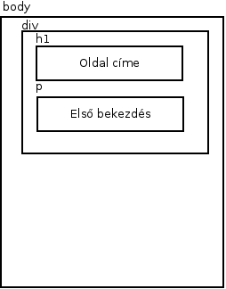
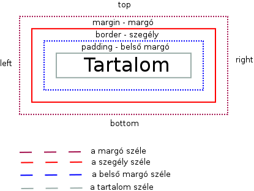
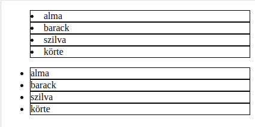
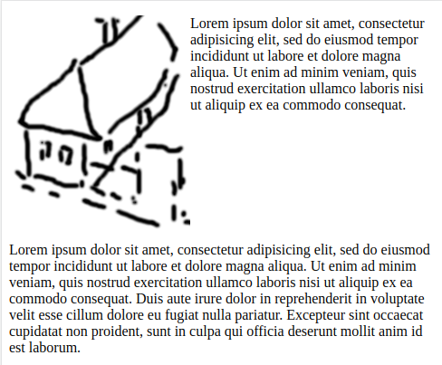

# Programozás alapok - Webformázás - CSS

* **Szerző:** Sallai András
* Copyright (c) Sallai András, 2022
* Licenc: [CC Attribution-Share Alike 4.0 International](https://creativecommons.org/licenses/by-sa/4.0/)
* Web: [https://szit.hu](https://szit.hu)

## Kezdés

A CSS rész a következő helyen található:

* [https://szit.hu/doku.php?id=oktatas:web:css](https://szit.hu/doku.php?id=oktatas:web:css)

## CSS

A CSS a Cascading Style Sheets rövidítése. Magyarul Lépcsőzetes stíluslapok. A CSS segítségével formázzuk a weboldalakat, határozzuk meg annak stílusát.

## Stíluslapok készítése

Stílusutasítást meghatározhatnak a következők:

* szerző
* felhasználó
* kliens

A stílus lap HTML oldalhoz rendelése:

* inline - soron belül állítunk stílust
* internal - a weboldalon belül állítunk stílust
* external - külön fájlban állítunk stílust

A külön fájlban elhelyezett stílusutasításokat .css kiterjesztésű állományokba írjuk. Az állomány neve tetszőleges, de gyakran használják a style.css-t, ha csak egyetlen állományban írjuk a CSS utasításokat.

A külső stíluslapot a HTML állományban a link elemmel csatoljuk:

```html
<link rel="stylesheet" href="style.css">
```

## Szelektorok

A stílust mindig egy HTML elemhez rendeljük hozzá. A szelektorok segítségével mondjuk meg, melyik HTML elem számára írunk beállításokat. Például:

```css
h1 {

}
```

vagy:

```css
body {

}
```

A stílus utasítások tulajdonság értékpárokból állnak. Ezeket a szelektor után írjuk a kapcsos zárójelek közzé. Állítsuk be a példa kedvéért a h1 elemek háttérszínét kék színűre.

```css
h1 {
    background-color: blue;
}
```

Az első tulajdonságunk a background-color, amit egy blue érték követ. Vegyük észre a tulajdonság és az érték között az kettőspontot (:), az érték után a pontosvesszőt (;)

Egyszerre több elemet is megadhatunk:

```css
h1, h2, h3 {
    background-color: blue;
}
```

A h1, a h2 és a h3 elem számára is beállítottuk a kék háttérszínt. A szelektornál fontos a vessző (,), mivel nélküle más jelentést kapunk.

### Osztályok használata

Ha például több h2 elemünk is van, és nem szeretnénk mindegyik h2 elemnek beállítani a kék színt, akkor osztályt használunk. A HTML oldalról:

```html
<h2>egy</h2>
<h2>kettő</h2>
<h2 class="kek">három</h2>
<h2 class="kek">négy</h2>
```

A CSS fájlban ezek után:

```css
h2.kek {
    background-color: blue;
}
```

A h2 akár el is hagyható:

```css
.kek {
    background-color: blue;
}
```

### Azonosító használata

Ha egyetlen elemet szeretnénk azonosítani a HTML elemek között, akkor azonosítót használunk.

A következő példában h2 helyett div elemeket használunk:

```html
<div id="egy">első</div>
<div id="ketto">kettő</div>
```

A CSS fájlban így hivatkozunk rá:

```css
div#egy {
    background-color: blue;
}
```

Itt is elhagyható a div:

```css
#egy {
    background-color: blue;
}
```

## Háttérbeállítások

### Háttérszín beállítása

A háttérszínt a background-color tulajdonsággal állítjuk. Értéke egy szín neve, vagy RGB kód lehet hexadecimális formában vagy rgb() függvénnyel.

```css
h1 {
    background-color: navy;
}
```

### Kép beállítása háttérként

Háttérképet a background-image tulajdonsággal állítunk. Értéke egy url() függvény, amelynek a paramétere egy képet tartalmazó fájlnak a neve, útvonallal együtt.

```css
h1 {
    background-image: url(fajlnev.png);
}
```

### A háttérkép ismétlése

A háttérkép ismétlését a background-repeat tulajdonsággal állítjuk.

Lehetséges értékei:

* repeat
* no-repeat
* repeat-x
* repeat-y

```css
h1 {
    background-image: url(virag.png);
    background-repeat: no-repeat;
}
```

### A háttérkép pozicionálása

Lehetséges értékei:

* left
* center
* right
* top
* bottom

```css
h1 {
    background-image: url(virag.png);
    background-repeat: no-repeat;
    background-position: center;
}
```

### A háttérkép rögzítése

A háttérképet rögzíthetjük a böngésző ablakához. A háttérkép rögzítését a background-attachment tulajdonsággal lehetséges. Lehetséges értékek:

* scroll
* fixed
* local

```css
h1 {
    background-image: url(virag.png);
    background-repeat: no-repeat;
    background-position: left;
    background-attachment: fixed;
}
```

### A háttérkép méretének beállítása

A háttérkép méretét a background-size tulajdonsággal állítjuk. Lehetséges értékei:

* cover
* contain
* méret (például 140px)

```css
h1 {
    background-image: url(virag.png);
    background-size: cover;
}
```

## Fontok

### A font stílusa

A font stílusát a font-style tulajdonsággal állítjuk. Lehetséges értékei:

* normal
* italic
* oblique
* inherit

```css
p {
    font-style: italic;
}
```

### A fontok vastagsága

A fontok vastagságát a font-weight tulajdonsággal állítjuk. Lehetséges értékei:

* normal
* bold
* bolder
* lighter
* 100, 200, 300, ..., 900
* inherit

```css
p {
    font-weight: bold;
}
```

### A fontok mérete

A fontok méretét a font-size tulajdonsággal állítjuk.

Lehetséges értékek:

* medium - alapértelmezett érték
* xx-small
* x-small
* small
* large
* x-large
* xx-large
* smaller
* larger
* hossz - számmal, mértékegységgel
* százalékos forma

```css
p {
    font-size: 15px;
}
```

### Fontcsalád beállítása

Beállítható fontcsalád, vagy konkrét font. Ehhez a font-family tulajdonságot használjuk.

A következő táblázat tartalmazza a fontcsaládokat:

| Fontcsalád | Leírás |
|-|-|
| serif | talapas betűk |
| sans-serif | talpatlan betűk |
| monospace | fix betűszéless |
| cursive | kurzív fontok |
| fantasy | fantázia fontok |

```css
p {
    font-family: Arial, Helvetica, sans-serif;
}
```

### Fontok beállítása csoportban

```css
p {
    font: italic bold 14px Arial, Helvetica, sans-serif;
} 
```

### Fontvariációk

Fontvariációkat a font-variant tulajdonsággal állíthatunk. Lehetséges értékek:

* normal
* small-caps
* inherit

```css
p {
    font-variant: small-caps;
}
```

A kiskapitális nagybetűs írás, de kisebb méretben.

## Szövegbeállítások

### Szöveg színezése

#### Elnevezett színek

A szöveget a "color" tulajdonsággal tudjuk színezni. Értéke lehet egy szín neve vagy RGB kódja. Néhány elérhető alapszín:

* white
* black
* red
* green
* blue
* yellow
* brown

Névvel megadott beállítás:

```css
h1 {
    color: blue;
}
```

#### RGB kód

RGB a Red, Green és Blue szavak rövidítése. A három szinből állítjuk össze a kívánt színt. A színeket hexadecimális számokkal adjuk meg. A kódon belül, egy színt két hexadecimális számmal adunk meg. Mivel három színt kell megadni, ezért hat darab hexadecimális számot írunk. A tiszta piros szín például: #ff0000. A tiszta zöld szín: #00ff00. A kék szín: #0000ff. A számokat variálva különböző színek állíthatók össze.

```css
h1 {
    color: #0000ff;
}
```

#### rgb() függvény

Az rgb() függvény segítségével decimális számokkal is megadható egy RGB színkód:

```css
h1 {
    color: rgb(0, 0, 255);
}
```

Használható még a rgba() függvény is, de arról később lesz szó.

### A betűk közötti távolság

```css
p {
   letter-spacing: 3px;
}
```

### A sormagassága

Az előző sorhoz képest beállítható a távolság a line-height segítségével.

```css
p {
    line-height: 1.6;
}
```

### Szöveg igazítása

A szöveg igazításához a text-align tulajdonságot használjuk. Értékeik a következők lehetnek:

* left
* right
* center
* justify
* initial - kezdeti érték
* inherit - a szülőelemtől örökölt érték

Vegyünk egy h1 elemet. A szöveg automatikusan balra igazodik. Ha szeretnénk középre igazítani:

```css
h1 {
    text-align: center;
}
```

#### Szövegigazítás gyakorlat

##### Szövegigazítás gyakorlat 01

Készítsünk egy index.html és egy style.css fájlt.

```html
<!DOCTYPE html>
<html lang="hu">
<head>
  <meta charset="utf-8">
  <title>Igazítás</title>
  <link rel="stylesheet" href="style.css">
</head>
<body>
    <h1>alma</h1>
</body>
</html>
```

```css
h1 {
    text-align: center;
}
```

Nézzük meg a weboldalt a böngészőben, és próbáljuk ki a lehetséges értékeket.

##### Szövegigazítás gyakorlat 02

Adott a következő weblap:

```html
<!DOCTYPE html>
<html lang="hu">
<head>
  <meta charset="utf-8">
  <title>Igazítás</title>
  <link rel="stylesheet" href="style.css">
</head>
<body>
    <h1>alma</h1>
</body>
</html>
```

Feladat: Határozza meg a h1 elem szülőelemét.

## Kerettulajdonságok

Minden HTML elemhez beállítható keret, vagy másként mondva szegély. A szegélyt a border tulajdonsággal állítjuk.

Meg kell adnunk a keret szélességét, stílusát és színét.

A keret szélességének beállítására példa egy p elemen:

```css
p {
    border-width: 3px;
    border-style: solid;
    border-color: blue;
}
```

A szélesség lehet egy érték valamilyen mértékegységgel és a következők:

* thin
* medium
* thick

A stílus a következők egyike lehet:

* none
* dotted
* dashed
* solid
* double
* groove
* ridge
* inset
* outset

A border-style beállításait kipróbálhatjuk a [szit.hu webhelyen](https://szit.hu/doku.php?id=oktatas:web:css:css_nyelv#a_border-style)

Csoportos használat:

```css
p {
    border: 3px solid blue;
}
```

A border-collapse tulajdonság használható táblázatoknál, lásd ott.

## Dobozmodell

Minden böngészőben megjelenő HTM elemet egy doboznak tekintünk. Így beszélhetünk a dobozmodellről. Figyeljük meg a következő ábrán a dobozokat. Legkülső dobozt a body elem alkotja. Abban van egy div doboz. A divben egy h1 és egy p doboz van.



Minden doboz ugyanúgy épül fel, ugyanazok a tulajdonságok jellemzik. Lehet valami tartalma. A tartalma vagy egy másik doboz, vagy szöveg. A tartalom körül beállítható egy belső margó. A belső margó után állítható a szegély. A szegélyt margó veszi körül. Mindezeket állíthatjuk felül, jobbra, alul és balra. Figyeljük meg a következő ábrán:



### Margó beállítása

A margót a margin tulajdonsággal állítjuk.

```css
p {
    margin: 20px;
}
```

A margók állíthatók felül, jobbra, alul és balra:

* margin-top
* margin-right
* margin-bottom
* margin-left

```css
p {
    margin-left: 20px;
}
```

Minden margónak a következő tulajdonságok állíthatók be:

* auto
* hossz - px, pt, cm stb.
* % - a tartalmazó elemhez képest százalékban
* inherit - a szülőtől örökölt tulajdonság

### Rövid változat

```css
p {
    margin: 5% 2% 10% 15;
}
```

A négy érték felső, jobb, alsó és bal margót jelentik.

Megadható három érték is:

```css
p {
    margin: 5% 2% 10%;
}
```

Ekkor a felső 5%, a jobb és a bal margó 2%, az alsó margó 10%-s.

Két érték beállítása:

```css
p {
    margin: 5% 2%;
}
```

Az felső és alsó margó 5%-s, a bal és a jobb margó 2%-s.

### Az auto éréték

Az auto beállítást a dobozok vízszintes középre igazításához használjuk.

## Túlcsordulás

A HTML dobozok alapértelmezetten rugalmas méretűek. Ha hozzáadunk tartalmat, akkor automatikusan nő a méretük. Ha viszont fix szélességű és magasságú dobozt hozunk létre, és a tartalom nem fér el benne, a doboz túlcsordul.

A példa kedvéért hozzunk létre egy 100px széles és 100px magas dobozt, például div elemből, doboz osztályjelölővel:

```html
<div class="doboz">

</div>
```

Legyen a doboz tartalma egy hosszabb Lorem ipsum szöveg:

```html
<div class="doboz">
Lorem ipsum dolor sit amet consectetur 
adipisicing elit. Voluptates aut dolorum 
officiis ipsam ratione, est velit.
</div>
```

Állítsuk be a doboz osztályjelölőt. Adjunk hozzá háttérszint is, hogy lássuk a túlfolyást.

```css
.doboz {
    width: 100px;
    height: 100px;
    background-color: aqua;
}
```

Az overflow tulajdonsággal megváltoztathatjuk a viselkedést:

```css
.doboz {
    width: 100px;
    height: 100px;
    background-color: aqua;
    overflow: scroll;
}
```

A szöveg nem folyik ki, a tartalom gördíthető.

Az overflow használható értékei:

* hidden - a tartalom nyírva lesz, a görgetősáv elrejtve
* scrool - a tartalom nyírva lesz, a görgetősáv megjelenik
* none - ez az alapértelmezés
* visible - a tartalomtól függetlenül a görgetősáv a dobozon kívül lesz
* auto - a megjelenés a tartalomtól függ
* clip - a tartalom nyírva, a többi része láthatatlan; letiltja a görgetést

Az **overflow-x** és **overflow-y** tulajdonság is használható.

### Az overflow-y

Beállítható értékek:

* visible
* hidden
* scroll
* auto
* initial
* inherit

Állítsunk be csak függőleges korlátozást.

```css
.doboz {
    width: 100px;
    height: 100px;
    background-color: aqua;
    overflow-y: scroll;
}
```

## Lista

A definíciós lista mellett a két alapvető listát használunk, ez a számozott és a számozatlan. Ha CSS-t használunk, mindegy melyiket hozzuk létre, mivel a CSS segítségével bármelyikből készíthetsz, számozott vagy számozatlan listát.

### A lista stílus típusa

A lista stílus típust a list-style-type tulajdonsággal állítható.

A következő értékeket veheti fel:

* disc
* circle
* square
* decimal
* lower-roman
* upper-roman
* lower-alpha
* upper-alpha
* none

Nézzünk egy példát:

```css
ul {
    list-style-type: circle;
}
```

### Listapozíciók

A listapozícióját a list-style-position tulajdonsággal állítjuk.

Lehetséges értékek:

* inside
* outside

```css
ul {
    list-style-position: inside;
}
```

Készítsünk egy weblapot, amely következőt tartalmazza:

```html
<ul class="egy">
    <li>alma</li>
    <li>barack</li>
    <li>szilva</li>
    <li>körte</li>
</ul>
<ul class="ketto">
    <li>alma</li>
    <li>barack</li>
    <li>szilva</li>
    <li>körte</li>
</ul>
```

A hozzátartozó CSS:

```css
ul.egy {
    list-style-position: inside;
}

ul.ketto {
    list-style-position: outside;
}

li {
    border: 1px solid black;
}
```



## Megjelenés

A dobozok megjelenítését a visibility és a display tulajdonsággal állítható.

Alapértelmezetten minden doboz látszik.

Dobozok rejtése:

```css
.doboz2 {
    visibility: hidden;
}
```

Dobozok rejtése a dispaly tulajdonsággal:

```css
.doboz2 {
    display: none;
}
```

Mi a különbség a kettő között? Ha visibility segítségével rejtünk el egy dobozt, annak helye megmarad. Ha display segítségével rejtünk el valamit, annak helye sem marad meg.

### A display

A display tulajdonsággal a megjelenített dobozokra is hatással lehetünk. Egyes dobozok blokk, míg más dobozok inline dobozok.

A display tulajdonság segítségével a blokk elemkből inline, az inlineból blokk elem állítható be. Beállítható típusok:

* block
* inline
* inline-block
* contents
* flex
* grid
* inline-flex
* inline-grid
* inline-table
* list-item
* run-in
* table
* table-caption
* table-column-group
* table-header-group
* table-footer-group
* table-row-group
* table-cell
* table-column
* table-row
* none
* initial
* inherit

```css
div.doboz {
    display: inline;
}
```

```css
span.doboz {
    display: block;
}
```

## Pozicionálás

A dobozok poziciónálást a position tulajdonsággal állítjuk.

Lehetséges értékei:

* static
* relative
* absolute
* fixed
* sticky

A dobozok alapértelmezetten static elhelyezkedésűek. Ez azt jelenti, hogy a weboldalon a dobozok egymás után folynak jobbra és lefele. Az inline elemek jobbra folynak, amíg van hely. A blokk elemek lefelé folynak a weblapon és így jelennek meg.

Ezen a megjelenésen tudunk változtatni.

### A relative érték

A relatív érték beállításával a dobozunk a helyén marad, de a tartalmat saját helyéhez képest elmozdíthatjuk jobbra, balra, fel és le.

Készítsük el a következő weblapot:

```html
    <div class="container">
        <div class="egy">
            Lorem ipsum dolor sit amet consectetur, adipisicing elit. Similique, id reiciendis voluptatum cum ducimus dolorem.
        </div>
        <div class="ketto">
            Lorem ipsum dolor sit amet.
        </div>
        <div class="harom">
            Lorem ipsum dolor sit amet consectetur, adipisicing elit. Similique, id reiciendis voluptatum cum ducimus dolorem.
        </div>
    </div>
```

Adjunk hozzás CSS-t:

```css
.ketto {
    background-color: navy;
    color: white;
    position: relative;
    top: 30px;
    left: 30px;
}
```

A középső dobozt pozicionálását relative-ra állítjuk, majd kiemeljük a helyéről, a helyéhez képest.

### Abszolút pozicionálás

A dobozok folyamából teljesen kiemeljük az adott dobozot, és a weblap tetejéhez, aljához és széleihez igazítjuk a dobozt.

Készítsük el az előző weboldalt:

```html
    <div class="container">
        <div class="egy">
            Lorem ipsum dolor sit amet consectetur, adipisicing elit. Similique, id reiciendis voluptatum cum ducimus dolorem.
        </div>
        <div class="ketto">
            Lorem ipsum dolor sit amet.
        </div>
        <div class="harom">
            Lorem ipsum dolor sit amet consectetur, adipisicing elit. Similique, id reiciendis voluptatum cum ducimus dolorem.
        </div>
    </div>
```

Adjunk hozzás CSS-t, egy apró változtatással:

```css
.ketto {
    background-color: navy;
    color: white;
    position: absolute;
    top: 30px;
    left: 30px;
}
```

Vegyük észre, hogy a top érték mostantól a weblap tetejétől értendő.

### A fixed érték

A fixed beállítás olyan minta az abszolút. A doboz kikerül a dobozok folyamából. Az igazítás viszont nem a weblap széleihez képest értendő, hanem a böngészőablak széleihez.

A kipróbáláshoz olyan hosszú szöveges tartalmat illesszünk a bekezdésekbe, hogy megjelenjenek a görgető sávok. Görgetéskor figyeljük meg a fixed pozicionálású doboz viselkedését.

### A sticky érték

A sticky érték esetén a doboz helyén marad mindaddig, amíg el nem éri a felsőrészt, 5 pixelre.

## Lebegtetés

Egy doboz tartalmában úsztatunk egy másik dobozt. A tartalom általában szöveg, az úsztatott doboz pedig egy képet jelenít meg.

Az úsztatást a float tulajdonsággal állítjuk be.

```css
.doboz {
    float: left;
}
```

Készítsünk egy HTML oldalt a következő tartalommal:

```html
<p>
    
    Lorem ipsum dolor sit amet, consectetur adipisicing elit, sed do eiusmod tempor incididunt ut labore et dolore magna aliqua. Ut enim ad minim veniam, quis nostrud exercitation ullamco laboris nisi ut aliquip ex ea commodo consequat. Duis aute irure dolor in reprehenderit in voluptate velit esse cillum dolore eu fugiat nulla pariatur. Excepteur sint occaecat cupidatat non proident, sunt in culpa qui officia deserunt mollit anim id est laborum.

</p>
```

A weblaphoz illesszünk egy tetszőleges képet.

Az illesztett CSS:

```css
img {
    width: 100px;
    float: left;
}
```

### A clear

A float beállítás után, minden tartalomban úszik a kép. Ha szeretnénk törölni az úsztatást, a clear tulajdonsággal tudjuk. Lehetséges értékek:

* left
* right
* both
* none



## Blokk elemek igazítása

A blokk elemek a böngésző bal szélétől a jobb széléig érnek. Ha beállítjuk, hogy 50% legyen a szélesség, a doboz automatikusan baloldalra igazodik. Középre igazításhoz a bal és jobb margót automatikusra kell állítani.

```css
.doboz {
    background-color: gold;
    width: 50%;
    margin-left: auto;
    margin-right: auto;
}
```

## Ál-osztályok

Az ál-osztályok speciális szelektorok. Például ál-osztállyal állíthatjuk be a, linkeket, az aktivált linkek, a már meglátogatott linkeket stb.

```css
a:link {color:#FF0000;}      /* még nem látogatott linkek */
a:visited {color:#00FF00;}  /* látogatott linkek */
a:hover {color:#FF00FF;}  /* ha az egér felé megy */
a:active {color:#0000FF;}  /* aktuális linkek */
```

## Átlátszatlanság

```css
.doboz {
    opacity: 0.6;
}
```

```css
.doboz {
    height: 150px; 
    width: 220px;
    background-color: #ffffff;
    opacity: 0.6;
}
```

### Az rgba() függvény

```txt
rgba(piros, zöld, kék, alfa)
```

```css
.doboz {
   background-color:rgba(255, 0, 0, 0.3);
} 
```

## Táblázatok

Szegély beállítása:

```css
table {
    border: 1px solid black;
}
```

A cellák számára is beállítjuk:

```css
table, th, td {
    border: 1px solid black;
}
```

A tábla szegélyének összeomlasztása:

```css
table {
    border-collapse: collapse;
}
```

A cellák közötti távolság beállítása:

```css
table {
    border-spacing: 20px;
}
```

A cella és tartalma közötti tér:

```css
td {
    padding: 30px;
}
```

## Z-index

```html
<div id="egy" >z-index: 1</div>
<div id="ketto">z-index: 2</div>
<div id="harom">z-index: 3</div>
```

A hozzátartozó CSS:

```css
#egy {
    position: relative; left: 0px; top:0px; width:100px; height:100px; 
    background: #f00;
    z-index:3;
}
 
#ketto {
    position: relative; left: 50px; top:-50px; width:100px; height:100px; 
    background: #0f0;
    z-index:2;
}
 
#harom {
    position: relative; left: 100px; top:-100px; width:100px; height:100px; 
    background: #00f;
    z-index:1;
}
```

A z-index változtatása:

```css
#egy {
    position: relative; left: 0px; top:0px; width:100px; height:100px; 
    background: #f00;
    z-index:3;
}
 
#ketto {
    position: relative; left: 50px; top:-50px; width:100px; height:100px; 
    background: #0f0;
    z-index:2;
}
 
#harom {
    position: relative; left: 100px; top:-100px; width:100px; height:100px; 
    background: #00f;
    z-index:1;
}
```

## Mértékegységek

### Relatív hosszmértékek

| Mértékegység | Leírás |
|-|-|
| em | A releváns karakter mérete |
| ex | A releváns karakter x-magassága |
| % | Százalék |
| ch | A "0" (zéró) szélességhez relatívan |
| rem | A root elem fontszélességéhez relatívan |

### Abszolút és relatív

Abszolút és mégis relatív hosszmértékek

| Mértékegység | Leírás |
|-|-|
| px | képpont; eszközfüggő |

### Abszolút hosszmértékek

| Mértékegység | Leírás |
|-|-|
| in | inch; hüvelyk; 25,4 mm |
| cm | centiméter |
| mm | milliméter |
| pt | pt; pont; 1/72 hüvelyk; kb.: 0,352 mm |
| pc | pica; 12 pont, 3/18 hüvelyk; kb.: 4,23 mm |

| Mértékegység | Leírás |
|-|-|
| px | képpont; eszközfüggő |

## Színek

A böngészők általában elfogadják a következő színeket:

* AliceBlue
* AntiqueWhite
* Aqua
* Aqumarine
* Azure
* Beige
* Bisque
* Black
* BlanchedAlmond
* Blue
* BlueViolet
* Brown
* BurlyWood
* CadetBlue
* Chartreuse
* Chocolate
* Coral
* CornflowerBlue
* Cornsilk
* Crimson
* Cyan
* DarkBlue
* DarkCyan
* DarkGoldenRod
* DarkGray
* DarkGrey
* DarkGreen
* DarkKhaki
* DarkMagenta
* DarkOliveGreen
* DarkOrange
* DarkOrchid
* DarkRed
* DarkSalmon
* DarkSeaGreen
* DarkSlateBlue
* DarkSlateGray
* DarkSlateGrey
* DarkTurquoise
* DarkViolet
* DeepPink
* DeepSkyBlue
* DimGray
* DimGrey
* DodgerBlue
* FireBrick
* FloralWhite
* ForestGreen
* Fuchsia
* Gainsboro
* GhostWhite
* Gold
* GoldenRod
* Gray
* Grey
* Green
* GreenYellow
* HoneyDew
* HotPink
* IndianRed
* Indigo
* Ivory
* Khaki
* Lavender
* LavenderBlush
* LawnGreen
* LemonChiffon
* LightBlue
* LightCoral
* LightCyan
* LightGoldenRodYellow
* LightGray
* LightGrey
* LightGreen
* LightPink
* LightSalmon
* LightSeaGreen
* LightSkyBlue
* LightSlateGray
* LightSlateGrey
* LightSteelBlue
* LightYellow
* Lime
* LimeGreen
* Linen
* Magenta
* Maroon
* MediumAquaMarine
* MediumBlue
* MediumOrchid
* MediumPurple
* MediumSeaGreen
* MediumSlateBlue
* MediumSpringGreen
* MediumTurquoise
* MediumVioletRed
* MidnightBlue
* MintCream
* MistyRose
* Moccasin
* NavajoWhite
* Navy
* OldLace
* Olive
* OliveDrab
* Orange
* OrangeRed
* Orchid
* PaleGoldenRod
* PaleGreen
* PaleTurquoise
* PaleVioletRed
* PapayaWhip
* PeachPuff
* Peru
* Pink
* Plum
* PowderBlue
* Purple
* RebeccaPurple
* Red
* RosyBrown
* RoyalBlue
* SaddleBrown
* Salmon
* SandyBrown
* SeaGreen
* SeaShell
* Sienna
* Silver
* SkyBlue
* SlateBlue
* SlateGray
* SlateGrey
* Snow
* SpringGreen
* SteelBlue
* Tan
* Teal
* Thistle
* Tomato
* Turquoise
* Violet
* Wheat
* White
* WhiteSmoke
* Yellow
* YellowGreen

## Ajánlott linkek

* [https://szit.hu/doku.php?id=oktatas:web:css](https://szit.hu/doku.php?id=oktatas:web:css) (2022)
* [https://developer.mozilla.org/en-US/docs/Learn/CSS](https://developer.mozilla.org/en-US/docs/Learn/CSS) (2022)
