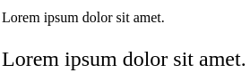
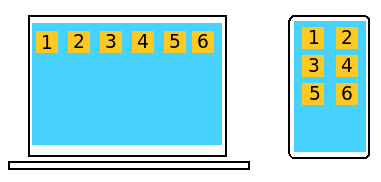
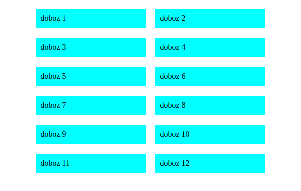
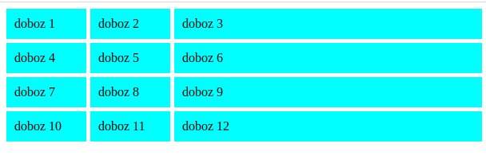

# Reszponzív

* **Szerző:** Sallai András
* Copyright (c) 2022-2023, Sallai András
* Licenc: [CC Attribution-Share Alike 4.0 International](https://creativecommons.org/licenses/by-sa/4.0/)
* Web: [https://szit.hu](https://szit.hu)

## Tartalomjegyzék

* [Tartalomjegyzék](#tartalomjegyzék)
* [A reszponzív weblapokról](#a-reszponzív-weblapokról)
* [Médialekérdezések](#médialekérdezések)
* [Töréspontok](#töréspontok)
* [Viewport](#viewport)
* [Mértékegységek](#mértékegységek)
* [Flex dobozok](#flex-dobozok)
* [Grid dobozok](#grid-dobozok)
* [CSS keretrendszerek](#css-keretrendszerek)

## A reszponzív weblapokról

A reszponzív tervezéshez újabban betűszavakat hoznak létre. Responsive Web Design, és RWD-ként rövidítik.

A reszponzív tervezés esetén, a legkülönfélébb eszközökön szeretnénk a weblapot optimálisan megjeleníteni.

A cél eléréshez az elemek méretét, helyét valamilyen relatív értékben adjuk meg, illetve a beállításokat médiaméretéhez igazítjuk.

## Médialekérdezések

### CSS2 médiatípusok

A CSS2 bemutatta médiatípusokat. Ez lehetővé teszi stílusok meghatározását különböző médiatípusokhoz.

* all - minden médiatípus
* screen - képernyő
* print - nyomtató
* speech - beszéd alapú olvasás - képernyőolvasó

Például más stílust lehet beállítani a nyomtatott médiához és más a képernyőhöz.

A webfelületen különböző stíluslapok médiához igazítva:

```html
<link rel="stylesheet" media="típus and|not|only (kifejezés)" href="fajlnev.css">
```

### CSS3 eszközök képessége

A CSS3-ban bevezették az eszköz képességeinek lekérdezését, a szimpla típusfigyelés helyett.

Miket figyelhetünk a médialekérdezések során:

* Felbontás.
* A nézet szélesség és magassága.
* A készülék szélessége és magassága.
* Tájolás (fekvő vagy álló)

Szintaxis:

```txt
@media not|only médiatípus and (kifejezés) {
    /* Ide jön a CSS kód */
}
```

Példa:

```css
@media screen and (min-width: 450px) {
    .doboz {
        background-color: blue;
    }
}
```

### Vegyes példák

Példa médiatípus meghatározására:

```css
@media screen {
    p {
        color: blue;
    }
}

@media print {
    p {
        color: red;
    }
}
```

Médiatípus beállítása HTML fájlban, példa:

```html
<link 
    rel="stylesheet" 
    href="egy.css"
    media="screen">

<link 
    rel="stylesheet" 
    href="ketto.css"
    media="print">
```

### Médialekérdezés gyakorlat

#### Feladat 001

Készítsünk egy weblapot a következők szerint:

* A weblapon a tartalom egy .container div-be kerüljön.
* Legyen a weblapon egy cím, egyes fejezetcímmel
  * A cím szövege: CPU
* A címet kövesse egy bekezdés **lorem** rövidítéssel létrehozva.
* Nyomtató esetén követelmény a .container számára:
  * A fontcsalád: serif
  * A háttérszín: fehér
* Képernyő esetén:
  * A fontcsalád: sans-serif
  * A háttérszín: aqua
* Mindkét média esetén:
  * Külső margó: 5%
  * Belső margó: 10px
  * 10px-es lekerekített sarok

Megoldás:

index.html:

```html
<!DOCTYPE html>
<html lang="hu">
<head>
    <meta charset="UTF-8">
    <meta name="viewport" content="width=device-width, initial-scale=1.0">
    <title>CPU</title>
    <link rel="stylesheet" href="style.css">
</head>
<body>

    <div class="container">
        <h1>CPU</h1>
        <p>
            Lorem ipsum dolor sit, amet consectetur 
            adipisicing elit. Voluptate at voluptatum 
            delectus autem animi, unde laudantium 
            accusamus expedita quos officiis eos 
            placeat libero, commodi beatae dolor 
            tenetur veritatis fugiat pariatur.
        </p>
    </div>
    
</body>
</html>
```

style.css:

```css
.container {
    margin: 5%;
    padding: 10px;
    border-radius: 10px;
}

@media screen {
    .container {
        font-family: sans-serif;
        background-color: aqua;
    }
}
@media print {
    .container {
        font-family: serif;
        background-color: white;
    }
}
```

Ha elkészült a weboldal nyissuk meg böngészőben, ellenőrizzük. Ezt követően nézzük meg nyomtatási nézetben, a Ctrl+P megnyomásával.

## Töréspontok

A töréspontok segítségével a webhely tartalma különböző módon reagál az eszköz szélességére. A töréspontokat a médialekérdezés teszi lehetővé.

Lássunk néhány gyakori töréspontot:

* 320
* 480
* 768
* 1024
* 1200

Nincs meghatározva a töréspontok száma, de érdemes legalább 3 töréspontot használni.

Készítsünk egy index.html a body elemben a következő tartalommal:

### Példa a töréspont használatára

```html
<h1>Lorem</h1>
<p>
    Lorem ipsum dolor sit amet.
</p>
<p>
    400 pixelnél váltás
</p>
```

```css
.container {
    background-color: navy;
    color: white;
}

@media only screen and (min-width: 400px) {
    .container {
        background-color: gold;
        color: #333;
    }
}
```

Tekintsük meg működés közben a weblapot:

* [https://szit.hu/m/media_query/](https://szit.hu/m/media_query/)

Másik példa:

* [https://szit.hu/m/media/](https://szit.hu/m/media/)

## Viewport

A viewport a böngészőnek az a része, ahol weblapot látjuk. A következő weblapon a viewport szélét 5 pixeles szegéllyel jeleztem:

* [https://szit.hu/m/media_border/](https://szit.hu/m/media_border/)

A viewport segítségével a tartalom automatikusan igazodik a kijelző méretéhez. A megjelenés mérete megfelelő skálázással jelenik a különböző eszközökön. Beállítható a nagyítással kapcsolatos tulajdonságok.

A viewport beállítása:

```html
<meta name="viewport" content="width=device-width, initial-scale=1.0">
```

A width=device-width biztosítja, hogy webolal szélessége megegyezzen a készülék szélességével. A initial-scale=1.0 beállítja a kezdeti nagyítási szintet.

Készítsünk egy webolat, amiben szerepel egy rövid mondat: "Lorem ipsum dolor est amet". Nézzük meg a viewport beállítással és nélküle telefonon, vagy böngészőben telefonnézetben.

* [https://szit.hu/m/viewport/](https://szit.hu/m/viewport/)

Hosszabb szöveg esetén a böngésző igazíthatja a szöveget, de rövid szöveg esetén ez nem történik meg. Ha fix szélességű dobozt használunk a probléma ismét megjelenhet. Ha használjuk a viewport beállítást, a probléma megoldott.

## Mértékegységek

Kétféle mértékegység van:

* relatív
* abszolút

### Realatív hosszmértékek

| Mértékegység | Leírás  |
|--------------|---------|
| em | A releváns karakter mérete |
| px | képpont; eszközfüggő |
| ex | A releváns karakter x-magassága |
| % | Százalékban megadott érték |
| ch | A "0" szélességhez relatívan |
| rem | A gyökérelem fontszélességéhez relatívan |
| vw | A viewport szélességének 1%-hoz relatívan |
| vh | A viewport magasságának 1%-hoz relatívan |
| vmin | A viewport kisebb dimenziójához képest 1%-al |
| vmax | A viewport nagyobb dimenziójához képest 1%-al |

### Abszolút hosszmértékek

| Mértékegység | Leírás  |
|--------------|---------|
| in | inch; hüvelyk; 25,4 mm |
| cm | centiméter |
| mm | milliméter |
| pt | pt; pont; 1/72 hüvelyk; kb.: 0,352 mm |
| pc | pica; 12 pont, 3/18 hüvelyk; kb.: 4,23 mm |

### Mit mikor ajánlott használni?

| Média | Ajánlott | Alkalmanként | Nem ajánlott |
|-------|----------|--------------|--------------|
| Képernyő | px, em, % | ex | mm, cm, in, pt, pc |
| Nyomtatott | mm, cm, in, pt, pc, em, % | px, ex, | |

A fontok méretének meghatározása során haszáljunk em vagy rem értéket. Ha abszolút mértékegységet használunk, az gondot okozhat a nagyított használt esetén.

Gyakorlásként hozzunk létre egy weblapot a következő tartalommal:

```html
<p class="egy">Lorem ipsum dolor sit amet.</p>
<p class="ketto">Lorem ipsum dolor sit amet.</p>
```

Állítsuk be a következő stílust:

```css
p.egy {
    font-size: 16px;
}
p.ketto {
    font-size: 1rem;
}
```

Alapértelmezetten mindkét bekezdés 16px méretben jelenik meg, hiszen a 1rem alapértelmezetten 16px.

Most menjünk a beállításokhoz, majd válasszuk a **Megjelenítés**-t. A **Betűméret**-nél állítsuk be "Nagyon nagy" lehetőséget. Ha most megnézzük a weblapot, a px mértékegységgel beállított bekezdés mérete nem változott. A rem mértékegységgel beállított bekezdés azonban az elvárásokank megfelelően nagy lett.



## Flex dobozok

A reszponzív viselkedés egyik lehetséges módja a flex dobozok használata.

Ha több dobozunk van egymás mellett, kisebb képernyőn szeretnénk kevesebb oszlopban látni.



Példa a flexdobozok használatára:

```html
<!DOCTYPE html>
<html lang="hu">
<head>
    <meta charset="UTF-8">
    <meta name="viewport" content="width=device-width, initial-scale=1.0">
    <title>Document</title>
    <style>
        .container {
            display: flex;
            flex-wrap: wrap;
            justify-content: center;
        }
        .container div {
            background-color: aqua;
            width: 200px;
            margin: 20px;
            padding: 10px;
        }
    </style>
</head>
<body>
 
 
    <div class="container">
        <div>doboz 1</div>
        <div>doboz 2</div>
        <div>doboz 3</div>
        <div>doboz 4</div>
        <div>doboz 5</div>
        <div>doboz 6</div>
        <div>doboz 7</div>
        <div>doboz 8</div>
        <div>doboz 9</div>
        <div>doboz 10</div>
        <div>doboz 11</div>
        <div>doboz 12</div>
    </div>
 
</body>
</html>
```

Megjelenés:



Élő példa:

* [https://szit.hu/m/flex](https://szit.hu/m/flex)

## Grid dobozok

A grid használata egy újabb lehetőség a különböző kijelző méretek kezelésére.

Legyen 3 oszlopos grid, ahol a harmadik oszlop mérete rugalmasan változik.

```html
<!DOCTYPE html>
<html lang="hu">
<head>
    <meta charset="UTF-8">
    <meta name="viewport" content="width=device-width, initial-scale=1.0">
    <title>Grid</title>
    <style>
        #grid {
            display: grid;
            column-gap: 5px;
            row-gap: 5px;
            grid-template-columns: 100px 100px auto;
        }
        .grid-item {
            background-color: aqua;
            padding: 10px;
        }
    </style>
</head>
<body>
 
 
    <div id="grid">
        <div class="grid-item">doboz 1</div>
        <div class="grid-item">doboz 2</div>
        <div class="grid-item">doboz 3</div>
        <div class="grid-item">doboz 4</div>
        <div class="grid-item">doboz 5</div>
        <div class="grid-item">doboz 6</div>
        <div class="grid-item">doboz 7</div>
        <div class="grid-item">doboz 8</div>
        <div class="grid-item">doboz 9</div>
        <div class="grid-item">doboz 10</div>
        <div class="grid-item">doboz 11</div>
        <div class="grid-item">doboz 12</div>
    </div>
 
</body>
</html>
```

A böngészőben:



Élő példa:

* [https://szit.hu/m/grid](https://szit.hu/m/grid)

## CSS keretrendszerek

A CSS keretrendszerek előre elkészített stílusok és komponensek gyűjteménye. Hatékonyabb és termelékenyebb fejlesztést tesznek lehetővé.

* Bootstrap
* Foundation
* Materialize
* Tailwind CSS
* Bulma
* UIkit
* Primer

### Bootstrap rácsok

A Bootstrap 12 oszlopban teszt lehetővé rácsozást.

```html
<div class="row">
    <div class="col-lg-3 col-sm-6">Lorem1</div>
    <div class="col-lg-3 col-sm-6">Lorem2</div>
    <div class="col-lg-3 col-sm-6">Lorem3</div>
    <div class="col-lg-3 col-sm-6">Lorem4</div>
</div>
```

Szimpla felosztás összehasonlítva a nagy és kicsi beállítással:

```html
<!DOCTYPE html>
<html lang="hu">
<head>
    <meta charset="UTF-8">
    <meta name="viewport" content="width=device-width, initial-scale=1.0">
    <title>Rács</title>
    <link href="https://cdn.jsdelivr.net/npm/bootstrap@5.3.1/dist/css/bootstrap.min.css" rel="stylesheet" integrity="sha384-4bw+/aepP/YC94hEpVNVgiZdgIC5+VKNBQNGCHeKRQN+PtmoHDEXuppvnDJzQIu9" crossorigin="anonymous">
    <style>
        .egy {
            background-color: aqua;
        }
        .ketto {
            background-color: burlywood;
        }
    </style>
</head>
<body>

    <div class="row egy">
        <div class="col-3">Lorem1</div>
        <div class="col-3">Lorem2</div>
        <div class="col-3">Lorem3</div>
        <div class="col-3">Lorem4</div>
    </div>

    <div class="row ketto">
        <div class="col-lg-3 col-sm-6">Lorem1</div>
        <div class="col-lg-3 col-sm-6">Lorem2</div>
        <div class="col-lg-3 col-sm-6">Lorem3</div>
        <div class="col-lg-3 col-sm-6">Lorem4</div>
    </div>


    
</body>
</html>
```

Élő példa:

* [https://szit.hu/m/bootstrap/bs.html](https://szit.hu/m/bootstrap/bs.html)
