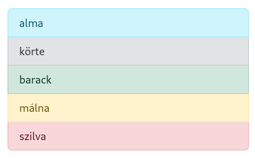
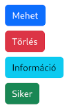

# Bootstrap

* **Szerző:** Sallai András
* Copyright (c) Sallai András, 2022
* Licenc: [CC Attribution-Share Alike 4.0 International](https://creativecommons.org/licenses/by-sa/4.0/)
* Web: [https://szit.hu](https://szit.hu)

## Tartalomjegyzék

* [Tartalomjegyzék](#tartalomjegyzék)
* [Bootstrap kezdés](#bootstrap-kezdés)
* [Tipográfia](#tipográfia)
* [Konténerek](#konténerek)
* [Rácsok](#rácsok)
* [Elrendezés](#elrendezés)
* [Listák](#listák)
* [Táblázatok](#táblázatok)
* [Képek](#képek)
* [Navigáció](#navigáció)
* [Gombok](#gombok)

## Bootstrap kezdés

A Bootstrap egy nyílt forráskódú frontend keretrendszer, amit weboldalak stílussal való ellátására szolgál.

Jellemzők:

* előre definiált stílusok
* reszponzív tervezés
* JavaScript bővítmények
* testreszabható
* közösségi támogatás

### A használat módjai

* Letötljük a Bootstrap-t a weboldalon keresztül.
* npm csomagként letöltöm
* CDN-t használok

Webhely:

* [https://getbootstrap.com](https://getbootstrap.com)

Amit linkelni szükséges: bootstrap.css

```html
<link rel="stylesheet" href="bootstrap.css">
```

A saját stílusfájlt (ha van ilyen) a Bootstrap hivatkozása után kell megadni:

```html
<link rel="stylesheet" href="bootstrap.css">
<link rel="stylesheet" href="style.css">
```

### A használta kezdete

Nem kötelező, de érdemes egy div elmmel kezdeni, aminek a .container osztállyelölőt adom:

```html
<div class="container">
  <h1>Cím</h1>
  <p>
    Lorem ispum dolor est amet
  </p>
</div>
```

## Tipográfia

Fejezetcímek beállítása

```html
<p class="h1">Cím</p>
<p class="h2">Cím</p>
<p class="h3">Cím</p>
<p class="h4">Cím</p>
<p class="h5">Cím</p>
<p class="h6">Cím</p>
```

Címsorok másként:

```html
<h1 class="display-1">Cím</h1>
<h1 class="display-2">Cím</h1>
<h1 class="display-3">Cím</h1>
<h1 class="display-4">Cím</h1>
<h1 class="display-5">Cím</h1>
<h1 class="display-6">Cím</h1>
```

Vezető szöveg:

```html
<p class="lead">
Vezető szöveg rész, ami elkülönül a több bekezdéstől.
</p>
```

Kiemelések:

| Mit helyettesítünk | Mivel |
|-|-|
| &lt;mark&gt; | .mark |
| &lt;small&gt; | .small |
| &lt;u&gt; | .text-decoration-underline |
| &lt;s&gt; | .text-decoration-line-through |
| &lt;abbr&gt; | .initialism |
| &lt;blockquote&gt; | .blockquote |

## Konténerek

* .container
* .container-sm
* .container-md
* .container-lg
* .container-xl
* .container-xxl
* .container-fluid

Alapértelmezett konténer:

```html
<div class="container">
   <!-- Ide jön a tartalom -->
</div>
```

Reszponzív konténerek:

```html
<div class="container-sm">100% small töréspont</div>
<div class="container-md">100% medium töréspont</div>
<div class="container-lg">100% large töréspont</div>
<div class="container-xl">100% extra large töréspont</div>
<div class="container-xxl">100% extra extra large töréspont</div>
```

Folyékony konténer:

```html
<div class="container-fluid">
   <!-- Ide jön a tartalom -->
</div>
```

## Rácsok

```html
<div class="container text-center">
  <div class="row">
    <div class="col">
      Oszlop
    </div>
    <div class="col">
      Oszlop
    </div>
    <div class="col">
      Oszlop
    </div>
  </div>
</div>
```

Két sor:

```html
<div class="container text-center">
  <div class="row">
    <div class="col">
      1 of 2
    </div>
    <div class="col">
      2 of 2
    </div>
  </div>
  <div class="row">
    <div class="col">
      1 of 3
    </div>
    <div class="col">
      2 of 3
    </div>
    <div class="col">
      3 of 3
    </div>
  </div>
</div>
```

Arányok meghatározása:

```html
<div class="container text-center">
  <div class="row">
    <div class="col">col</div>
    <div class="col">col</div>
    <div class="col">col</div>
    <div class="col">col</div>
  </div>
  <div class="row">
    <div class="col-8">col-8</div>
    <div class="col-4">col-4</div>
  </div>
</div>
```

Keverés:

```html
  <div class="row">
    <div class="col-6 col-md-4">.col-6 .col-md-4</div>
    <div class="col-6 col-md-4">.col-6 .col-md-4</div>
    <div class="col-6 col-md-4">.col-6 .col-md-4</div>
  </div>
```

* [https://getbootstrap.com/docs/5.2/layout/grid/](https://getbootstrap.com/docs/5.2/layout/grid/)

## Elrendezés

Ha form elemek tartalmát egymás helyezzük el egymás utána, azok a egymás alatt jelennek meg a weblapon. A rácsok használatával egymás mellé tehetjük azokat.

```html
<div class="mb-3">
  <label for="egy" class="form-label">Egy</label>
  <input type="text" class="form-control" id="egy" placeholder="egy jön ide">
</div>
<div class="mb-3">
  <label for="ketto" class="form-label">Kettő</label>
  <input type="text" class="form-control" id="ketto" placeholder="kettő jön ide">
</div>
```

Elhelyezés egymás mellé:

```html
<div class="row">
  <div class="col">
    <input type="text" class="form-control" placeholder="Egy">
  </div>
  <div class="col">
    <input type="text" class="form-control" placeholder="Kettő">
  </div>
</div>
```

* [https://getbootstrap.com/docs/5.2/forms/layout/](https://getbootstrap.com/docs/5.2/forms/layout/)

## Listák

A listák ul elemét a **list-group** osztályjelölőve jelöljük. A listaelemeket **list-group-item** osztályjelölővel jelöljük.

```html
<ul class="list-group">
  <li class="list-group-item">alma</li>
  <li class="list-group-item">körte</li>
  <li class="list-group-item">barack</li>
  <li class="list-group-item">szilva</li>
</ul>
```

Színezés:

```html
<ul class="list-group">
  <li class="list-group-item
  list-group-item-info">alma</li>
  <li class="list-group-item
  list-group-item-secondary">körte</li>
  <li class="list-group-item
  list-group-item-success">barack</li>
  <li class="list-group-item
  list-group-item-warning">málna</li>
  <li class="list-group-item
  list-group-item-danger">szilva</li>
</ul>
```



## Táblázatok

A táblázatokat egyszerűen a **table** osztályjelölővel jelöljük.

```html
<table class="table">
  <thead>
    <tr>
      <th scope="col">#</th>
      <th scope="col">Név</th>
      <th scope="col">Település</th>
      <th scope="col">Fizetés</th>
    </tr>
  </thead>
  <tbody>
    <tr>
      <th scope="row">1</th>
      <td>Jenő</td>
      <td>Szeged</td>
      <td>347</td>
    </tr>
    <tr>
      <th scope="row">2</th>
      <td>Pali</td>
      <td>Miskolc</td>
      <td>470</td>
    </tr>
  </tbody>
</table>
```

Csíkozott táblázat beállítása:

```html
<table class="table table-striped">
</table>
```

Bővebb információ:

* [https://getbootstrap.com/docs/5.2/content/tables/](https://getbootstrap.com/docs/5.2/content/tables/)

## Képek

Átméretezhető képek:

```html

```

Miniatűrök:

```html

```

Igazítás, kerekítés:

```html


```

Igazítás display értékkel:

```html

```

Igazítás másként:

```html
<div class="text-center">
  
</div>
```

* [https://getbootstrap.com/docs/5.2/content/images/](https://getbootstrap.com/docs/5.2/content/images/)

## Navigáció

A navigációhoz érdemes a Bootstrap JavaScript bővítményét is használni, mivel kisméretű viewport esetén így tud egyetlen ikonnra váltani.

```html
<link rel="" href="bootstrap.css">
<!--...-->
<script src="bootstrap.js"></script>
```

A navigációra példa:

```html
<ul class="nav justify-content-center">
  <li class="nav-item">
    <a class="nav-link" href="index.html">Főoldal</a>
  </li>
  <li class="nav-item">
    <a class="nav-link" href="contact.html">Kapcsolat</a>
  </li>
  <li class="nav-item">
    <a class="nav-link" href="products.html">Termékek</a>
  </li>
</ul>
```

* [https://getbootstrap.com/docs/5.2/components/navs-tabs/](https://getbootstrap.com/docs/5.2/components/navs-tabs/)

## Gombok

A gombokat a btn osztályjelölővel jelöljük. Nézzünk néhány színezéshez használt osztályjelölőt: btn-primary, btn-danger, btn-info, btn-success.

```html
<button class="btn btn-primary">Mehet</button>
<br>
<button class="btn btn-danger">Törlés</button>
<br>
<button class="btn btn-info">Információ</button>
<br>
<button class="btn btn-success">Siker</button>
```



* [https://getbootstrap.com/docs/5.2/components/buttons/](https://getbootstrap.com/docs/5.2/components/buttons/)
