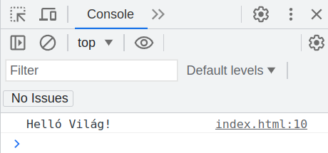
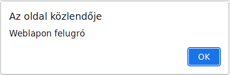

# JavaScript

* **Szerző:** Sallai András
* Copyright (c) Sallai András, 2022
* Licenc: [CC Attribution-Share Alike 4.0 International](https://creativecommons.org/licenses/by-sa/4.0/)
* Web: [https://szit.hu](https://szit.hu)

## A JavaScript

A JavaScript eredetileg böngészőre szánt programozási nyelv. A JavaScript alkalmazás a weboldallal együtt letöltődik a kliensgépre, amit böngésző futtat.

Ma már szerver oldalon is írhatunk alkalmazást a NodeJS segítségével, illetve kliens oldalon böngészőn kívül is lehet programokat készíteni. Itt most a böngészőben fogjuk használni.

## Kimenet

A JavaScripben a kimenet a böngésző weblapja vagy böngésző konzolja lehet. A konzolt az F12 billentyűvel jeleníthető meg.

A konzolra a console objektum log() függvényével írhatunk:

```javascript
console.log('Helló Világ');
```

Készítsük el a következő weblapot.

```html
<!DOCTYPE html>
<html lang="hu">
<head>
    <meta charset="UTF-8">
    <meta name="viewport" 
    content="width=device-width, 
    initial-scale=1.0">
    <title>Inline JavaScript</title>
</head>
<body onload="console.log('Helló Világ!')">    
    
</body>
</html>
```

Az onload attribútum a body elemben, azt jelenti, hogy az oldalbetöltődésre szeretnénk regálni. A console.log('Helló Világ!), pedig az utasítás amit végre kell hajtani az oldal beltöltése során. Nyissuk meg egy böngészőben a weblapot. A böngészőben nyissuk meg a fejlesztőeszközt, ahol a konzolon meg kell jelenjen az üzenet.



Az alert() metódussal weblap felületén jeleníthetünk meg üzenetablakot.

```javascript
alert('Weblapon felugró');
```

Készítsünk egy másik weblapot:

```html
<!DOCTYPE html>
<html lang="hu">
<head>
    <meta charset="UTF-8">
    <meta name="viewport" 
    content="width=device-width, 
    initial-scale=1.0">
    <title>Inline JavaScript</title>
</head>
<body onload="alert('Weblapon felugró')">    
    
</body>
</html>
```

Nyissuk meg a böngészben.



Az alert() függvény ablaka minden böngészőben másként néz ki.

## A script elem használata

A JavaScript utasítások leírására használhatunk script elemet:

```html
<!DOCTYPE html>
<html lang="hu">
<head>
    <meta charset="UTF-8">
    <meta name="viewport" 
    content="width=device-width, 
    initial-scale=1.0">
    <title>Inline JavaScript</title>
</head>
<body>

    <script>
        console.log('Írás script elemből')
    </script>
    
</body>
</html>
```

Az utasítás az oldal betöltése során lefut. Készítsünk egy ilyen weblapot, nyissuk meg böngészőben, majd nyissuk meg a fejlesztői felületet. A konzolon kell lássuk a "Írás script elemből' szöveget.

## JavaScript külső fájlban

```html
<!DOCTYPE html>
<html>
<head>
    <meta charset="utf-8">
    <title>JavaScript</title>
</head>
<body>
    <h1>JavaScript külső fájlban</h1>
    <script src="app.js"></script>
</body>
</html>
```

## Üdvözlő

Készítsünk egy webes felületet, amely bekér egy becenevet, majd kattintásra üdvözli a bírt név alapján a felhasználót.

Két állományt hozunk létre:

```txt
udvozlo/
  |-index.html
  `-script.js
```

Weboldal:

```html
<!DOCTYPE html>
<html lang="hu">
<head>
    <meta charset="UTF-8">
    <meta name="viewport" 
    content="width=device-width, 
    initial-scale=1.0">
    <title>Document</title>
</head>
<body>

    <div>
        <label for="nickname">Becenév</label>
        <input type="text" id="nickname">
        /* A becenév a "nickname" azonsítón 
        keresztül érehtő el */
    </div>
    <div>
        <button id="welcomeButton">Üdv</button>
        /* A nyomgómb a "welcomeButton" azonosítón
        keresztül érhető el */
    </div>

    /* Csatoljuk a JavaScriptet */
    <script src="script.js"></script>
    
</body>
</html>
```

A JavaScript rész:

```javascript
/* A HTML elemeket JavaScript objektumokhoz kötjük: */
const nickInput = document.querySelector('#nickname');
const welcomeButton = document.querySelector('#welcomeButton');

/* Szeretnénk figyelni ha kattintottak a welcomeButton-ra */
welcomeButton.addEventListener('click', welcome);
/* Kattintásra a welcome függvényt szeretnénk végrehajtani */

/* Így függvény, ami kiolvassa becenevet majd üdvözöl: */
function welcome() {
    const nickname = nickInput.value;
    alert('Üdv ' + nickname );
}
```

## Háromszög területszámítás

A weboldalon bekérjük az alapt és a magasságot, majd kattintásra megkapjuk a területet.

Két fájlt hozunk létre, egy index.html és egy app.js fájlt:

```txt
udvozlo/
  |-index.html
  `-app.js
```

Az index.html fájl tartalma:

```html
<!DOCTYPE html>
<html lang="hu">
<head>
    <meta charset="UTF-8">
    <meta name="viewport" content="width=device-width, initial-scale=1.0">
    <title>Document</title>
</head>
<body>

    <div class="container">
        <h1>Háromszög területszámítás</h1>
        <div class="triangleForm">
            <div>
                <label for="base">Alap</label>
                <input type="text" id="base">
            </div>
            <div>
                <label for="height">Magasság</label>
                <input type="text" id="height">
            </div>
            <div>
                <button id="calcButton">Számít</button>
            </div>
            <div>
                <label for="area">Terület</label>
                <input type="text" id="area">
            </div>
        </div>

    </div>
    <script src="app.js"></script>
    
</body>
</html>
```

Az app.js fájl tartalma:

```javascript
const baseInput = document.querySelector('#base');
const heightInput = document.querySelector('#height');
const areaInput = document.querySelector('#area');
const calcButton = document.querySelector('#calcButton');

calcButton.addEventListener('click', calcTriangleArea);

function calcTriangleArea() {
    var base = Number(baseInput.value);
    var height = Number(heightInput.value);
    var area = base * height / 2;
    areaInput.value = area;
}
```

## JavaScript gyakorlat

Látogassuk meg az általnos programozási feladatgyűjteményt:

* [https://szit.hu/doku.php?id=oktatas:programozas:feladatok:altalanos](https://szit.hu/doku.php?id=oktatas:programozas:feladatok:altalanos)

Keressünk egy bekérős feladatot 0301 és 0401 között. Készítsünk weblapot, amely bekéri a megadott adatokat, majd JavaScript segítségével számítsuk ki az eredményt, majd írassuk a képernyőre.
