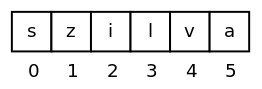

# Python - Bevezetés a Python programozásba

* **Szerző:** Sallai András
* Copyright (c) 2022, Sallai András
* Licenc: [CC Attribution-Share Alike 4.0 International](https://creativecommons.org/licenses/by-sa/4.0/)
* Web: [https://szit.hu](https://szit.hu)

## Tartalomjegyzék

* [Tartalomjegyzék](#tartalomjegyzék)
* [A Python bemutatása](#a-python-bemutatása)
* [Helló Világ](#helló-világ)
* [Megjegyzések](#megjegyzések)
* [Kivitel](#kivitel)
* [Gyakorló feladatok a kivitelhez](#gyakorló-feladatok-a-kivitelhez)
* [Escape szekvenciák](#escape-szekvenciák)
* [Típusok](#típusok)
* [Változóhasználat](#változóhasználat)
* [Formázott kimenet](#formázott-kimenet)
* [Matematikai eszközök](#matematikai-eszközök)
* [Véletlen szám](#véletlen-szám)
* [Operátorok](#operátorok)
* [Konvertálás](#konvertálás)
* [Bevitel](#bevitel)
* [Szekvenciális tevékenység](#szekvenciális-tevékenység)
* [Szelekció](#szelekció)
* [Karakterláncok kezelése](#karakterláncok-kezelése)
* [Lista](#lista)
* [Függvények](#függvények)
* [Fájlkezelés](#fájlkezelés)

## A Python bemutatása

A Python egy népszerű és sokoldalú programozási nyelv, amit használnak a tudományos adatfeldolgozásban, webfejlesztésben, automatizálásban, és még sok más területen. A Python nyelvet Guido van Rossum, holland programozó kezdte fejleszteni a Centrum Wiskunde & Informatica (CWI, Matematikai és Informatikai Központ) kutatóintézetben, 1989-ben.

A Python nagyon jó kezdők számára, mivel könnyen tanulható, olvasható és írható a kóddal dolgozunk.

## Helló Világ

hello.py:

```python
print("Helló Világ!")
```

Nyissunk egy könyvtárat a **Visual Studio Code** programmal, majd készítsünk egy **main.py** nevű fájlt. Tartalma a fenti kód legyen. Futtassuk a kódot.

A kód futtatása lehet terminálból:

```bash
python hello.py
```

A másik lehetőség, ha telepítjük a VSCode **Python** bővítményét. Ekkor megjelenik egy lejátszógomb, ha meg van nyitva egy .py kiterjesztésű fájl. Erre kattintva a program elindul.

### Elemezés

A program a képernyőre írja, hogy "Helló Világ!", idézőjelek nélkül. A programban az idézőjelek között adunk meg szöveget. A print utasítás egy függvény, ami paraméterként megadott szöveget kiírja a képernyőre. A paramétert mindig zárójelek () között adjuk meg. Később látni fogjuk, hogy a print() utasítással nem csak szöveget tudunk kiíratni.

A programozás nem olyan nehéz mint azt egy kezdő elsőre gondolja. Foglalkozni kell vele, a befektetett idő megtérül.

A program segítségével kapcsolatba lépünk a számítógéppel, aminek utasításokat tudunk megadni. Ehhez meg kell tanulnunk néhány utasítást és szabályt.

### Gyakorlatok a Helló Világ fejezethez

Gyakorlás szintaktikához:

* [https://www.w3schools.com/python/exercise.asp](https://www.w3schools.com/python/exercise.asp)

Keresse fel a webhelyet, majd írja be a megfelelő utasítást.

Készítsen egy **nevjegy** nevű könyvtárat. A könyvtárban hozzon létre egy main.py nevű fájlt. Írassa ki saját nevét, és annak a településnek a nevét ahol lakik. Mentse, el az állományt, majd futtassa parancssorból.

## Megjegyzések

Az utasításokat, mint a print(), egy állományba írjuk. Leírt utasítássorokat forráskódnak nevezzük. A forráskódba a fejlesztő időnként megjegyzéseket ír önmagának vagy másoknak a leírt utasításokkal kapcsolatban. Ezeket a megjegyzéseket a számítógép nem próbálja meg feldolgozni.

Egy soros megjegyzés:

```python
# egy soros megjegyzés
```

Példa:

```python
# ez az utasítás a "Helló Világ!" szöveget a képernyőre írja
print("Helló Világ!")
```

Az egysoros megjegyzések az utasítások után is írhatók:

```python
# Szám kiíratása
print(35) # a kimenet 35
```

### Gyakorlat a Megjegyzések fejezethez

Írjon programot, amely a képernyőre írja a 145 számot.

A program első soraiban megjegyzésbe írja saját nevét, a program készítésének dátumát.

A 145 számot kiírató sor előtt írja oda mit csinál az utasítás.

## Kivitel

Kivitel alatt a képernyőre írást értjük. Fentebb már láttuk, hogy a Python nyelvben erre a print() függvény az egyik lehetséges utasítás. Kiírathatunk vele többféle típusú adatot, számokat, szöveget stb.

A Python programban megkülönböztetjük az egész és a valós számokat.

Egész szám kiíratása:

```python
print(30)
```

Valós szám kiíratása:

```python
print(30.5)
```

Szöveget megadhatunk idézőjelek között és aposztrófok között:

```python
"valami szöveg"
'másik szöveg'
```

A print() függvénnyel kiírathatunk több adatot is:

```python
print(30, 35)
print(-30, 47, -5)
print('alma', 'körte')
```

Egymás után akár több print() függvény is írható.
Több adat esetén, azokat vesszővel tagoljuk. Szöveget idézőjel vagy aposztróf nélkül azonban nem lehet kiíratni.
Próbáljuk meg futtatni a következő hibás kódot:

```python
print(alma)
```

## Gyakorló feladatok a kivitelhez

1.)  Milyen típusú adat a következő: 0.5

* egész
* valós
* szöveg
* egyik sem

2.)  Milyen típusú adat a következő: '0.5'

* egész
* valós
* szöveg
* egyik sem

3.) Írj egy programot, mondat.py fájlba, ami kiírja a következő mondatot: A négyzet egy síkidom. A képernyőn a következő kell megjelenjen:

```cmd
A négyzet egy síkidom
```

4.) Írj egy programot, amely a következőket csinálja:

* Kiírja a A négyzet egy síkidom szöveget.
* Kiírja 35 számot a következő sorba.

5.) Adott a következő kód:

```python
print(45) # a kimenet 45
```

Az utasítás, melyik részét nem veszi figyelembe a számítógép?

* print(45)
* &num; a kimenet 45
* az előbbi mindkettő
* egyik sem

## Escape szekvenciák

Ha egy karaktert kiíratok, az megjelenik a képernyőn. Vegyük a "ringló" szót:

```python
print("ringló")
```

Mindegyes karakter kiíródik. Egyes karaktereknek speciális értelmet adhatunk. Vegyük szóból az "n" betűt. Speciális jelentést adhatunk a karakternek egy "\" karakterrel:

```python
print("ri\ngló")
```

Az "n" betű már nem íródik ki képernyőre. Helyette valami más történik. Az "ri" szó után a szövegkurzor a következő sorba ugrik. Másként szólva soremelés történik.

Ha egy karakternek ilyen speciális jelentést adunk, akkor escape szekvenciának hívjuk. Az alábbi táblázat escape szekvenciákat tartalmaz, amely használható Python nyelvben.

| Escape szekvencia | Jelentés |
|-------------------|----------|
| \\\\ | vissza-perjel megjelenítése |
| \\'  | aposztróf megjelenítése |
| \\"  | idézőjel megjelenítése |
| \a  | ASCII csengőhang |
| \b  | ASCII visszatörlés - Backspace (BS) |
| \f  | ASCII lapdobás (FF) |
| \n  | ASCII soremelés (LF) |
| \r  | ASCII kocsi vissza (CR) |
| \t  | ASCII vízszintes tabulátor (TAB) |
| \v  | ASCII függőleges tabulátor (VT) |
| \ooo | oktális érték |
| \xhh | hexadecimális érték |
| \uxxxx | karakter kiírása Unicode alapján |
| \Uxxxxxxxx | karakter kiírása Unicode alapján |
| \N{name} | karakter kiírása Unicode név alapján |

Példa a soremelésre:

```python
print("körbe\njár")
```

Tabulátorhasználat:

```python
print("körbe\tjár")
```

## Típusok

Pythonban használható típusok:

* egész - int
* valós - float
* karakterlánc - str
* logikai - bool
* None - NoneType

```python
# egész:
num1 = 30

# valós:
num2 = 35.1234

# karakterlánc:
name = 'Árpád'

# logikai típus
meleg_van = True

# None
valami = None
```

A típusok lekérdezhetők a type() függvénnyel:

```python
num = 30
print(type(num))
```

A kimenetben ilyen példákat láthatunk:

```cmd
<class 'int'>
```

## Változóhasználat

A memória egy helyét elnevezhetem és különböző típusú értékeket tárolhatok ezeken a helyeken. Az ilyen memóriára hivatkozást változónak nevezzük. Ha számot szeretnénk tárolni:

```python
szam = 30
nev = 'Pali'
```

A Python nyelvben a változókat használat előtt nem szükséges deklarálni, nem kell megadni milyen típust akarunk tárolni a memóriaterületen.

Ha egy kifejezésbe illesztem a változót, annak értéke behelyettesítődik a kifejezésbe:

```python
szam = 30
eredmeny = szam + 10
print(eredmeny)
```

Minden változónak van típusa. A típus attól függ, milyen típusú értéket teszünk a változóba.

Egész típusú változó

```python
num = 30
```

Valós tipusú változó:

```python
num = 30.12345
```

Karakterlánc típus:

```python
name = 'Pali'
```

Logikai típus:

```python
it_is_hot = True
```

### Nevesített állandó

A Python nyelv nem támogatja a nevesített állandókat. A 3.8 Python verzióban viszont bekerült egy olyan modul, amely segíti az állandó jelenlétét.

```python
from typing import Final

# Állandó létrehozása:
max: Final[float] = 150
```

A max változó ugyan felülírható, de a kódszerkesztő figyelmeztet hibára, ha telepítve van egy megfelelő linter:

* VSCode bővítmény: **Mypy Type Checker**

### Literális állandó

Tegyünk egy változóba egy számot:

```python
num = 30
```

Az értékadás jobboldalán a 30 egy állandó, úgynevezett literális állandó. Állandó mivel a program indulása után, annak leállásáig ezt a memóriaterületet nem lehet megváltoztatni. A programkódban bárhova leírunk egy értéket, az literális állandó.

A következő példában szintén a 30 egy literális állandó:

```python
num = num2 + 30
```

Számliterálisokat megadhatunk alúlvonással.

```python
num = 3_450_123
```

## Formázott kimenet

### Moduló használata

A kiírást formátum karakterlánccal formázhatjuk.

```python
num = 30
print('%d' % num)
```

A formátum karakterláncot, vagy formátum sztringet, tehetjük aposztrófok és idézőjelek közé is. A formátum string és a kiíratandó változó közé moduló jelet teszünk.

A formátum sztringben minden kiíratandó értékhez szükséges egy formátumkódra a formátum sztringen belül. A formátumkódot moduló karakterrel "%" kezdjük és egy betű karakterrel zárjuk. Ez a karakter a formátumkarakter. Egész számok esetén ez egy "d" betű, amit decimális egészekhez használhatunk.

Valós számok esetén a formátumkarakter "f" betű.

```python
num = 35.1234
print('%f' % num)
```

Szöveg esetén a formátumkarakter egy "s" betű.

```python
nev = 'Tibor'
print('%s' % nev)
```

### A format() függvény használata

Használjuk a format függvényt egy literális állandó kiíratására:

```python
print("{}".format(30))
```

Elemezzük a programot. A print() függvénynek valójában egyetlen paramétert adunk át, egy karakterláncot. Azonban a karakterláncon futtatunk egy format() függvényt, amelynek paramétere az érték amit ki kell írni.

A karakterláncot nevezzük formátum sztringnek, vagy formátum karakterláncnak, vagy formátum szövegnek. A formátum sztring formátum kódokat tartalmaz. Egy érték kiíratásához mindig szükség van egy formátumkódra. A formátumkód nyitó kapcsoszárójellel kezdődik és záró kapcsoszárójellel végződik. A következő példában már két értéket íratunk ki, így két formátumkód van a formátum stringben:

```python
print("{} {}".format(30, 35))
```

Három értékkel:

```python
print("{} {} {}".format(30, 35, 40))
```

Most használjuk a formátum sztringet arra, hogy magyarázatot és mértékegységet adjunk meg két szám esetén:

```python
print("Tömeg: {} kg Egységár: {} Ft".format(30, 35))
```

Ebben a formában a kiíratás még format() függvény nélkül is megoldható. Most nézzünk olyan eseteket, ahol már szükség vana format() függvényre. Szeretnénk 10 szélességben kiíratni egy számot:

```python
print("{:10}".format(30))
```

A kimenet ehhez hasonló:

```cmd
        30
```

Írjunk pipe karaktert a formátumkód előtt és után, a láthatóság javítása érdekében:

```python
print("|{:10}|".format(30))
```

```cmd
|        30|
```

Most adjunk meg 20 szélességet:

```python
print("|{:20}|".format(30))
```

```cmd
|                  30|
```

Írassuk ki négy számot egymás alatt 8 szélességben:

```python
print("|{:8}|".format(30))
print("|{:8}|".format(368))
print("|{:8}|".format(1272))
print("|{:8}|".format(97))
```

```cmd
|      30|
|     368|
|    1272|
|      97|
```

Nézzük meg egy valós szám kiíratását:

```python
print("{:10}".format(30.1234567))
```

A kimenet:

```cmd
30.1234567
```

Szabályozhatjuk a tizedesjegyek számát:

```python
print("{:10.2f}".format(30.1234567))
```

A kimenet:

```cmd
     30.12
```

Az egész szám 10 szélesen jelenik meg, kettő tizedesjegy jelenik meg. Az "f" nélkül lebegőpontos formában, pontosabban tudományos alakban jelenik meg a szám:

```python
print("{:10.2}".format(30.1234567))
```

A kimenet:

```cmd
     3e+01
```

Tizedes jegyek száma, szélesség nélkül is megadható:

```python
print("{:.2f}".format(30.1234567))
```

Kimenet:

```cmd
30.12
```

Több valós szám kiíratása:

```python
print("{:14.2f}".format(30.834))
print("{:14.2f}".format(368.12847))
print("{:14.2f}".format(1272.184))
print("{:14.2f}".format(97.9841234))
```

Kimenet:

```cmd
         30.83
        368.13
       1272.18
         97.98
```

Nézzük meg karakterlánc kiíratását:

```python
print("{:10}".format("alma"))
```

Kimenetben ezt látjuk:

```cmd
alma
```

Tíz szélesen írattuk ki, de ez nem látszik, mivel a tíz szélességen belül balra van a karakterlánc igazítva. Hogy lássuk, valóban 10 szélesen van kiírva, használjunk megint pipe karaktert:

```python
print("|{:10}|".format("alma"))
```

Kimenetben ezt látjuk:

```cmd
|alma      |
```

Most igazítsuk az alma szót jobbra:

```python
print("|{:>10}|".format("alma"))
```

Kimenetben ezt látjuk:

```cmd
|      alma|
```

Ehhez hasonlóan a számokat is igazíthatjuk balra:

```python
print("|{:<10}|".format(30))
```

Kimenetben ezt látjuk:

```cmd
|30        |
```

Az üres helyek kitöltése szöveg esetén:

```python
print("|{:_>10}|".format("alma"))
```

Kimenetben ezt látjuk:

```cmd
print("|{:_>10}|".format("alma"))
```

Számoknak szokás vezetőnullákat megadni:

```python
print("|{:010}|".format(35))
```

Kimenetben ezt látjuk:

```cmd
|0000000035|
```

Középre igazítás:

```python
print("|{:^10}|".format(35))
```

Kimenetben ezt látjuk:

```cmd
|    35    |
```

A formátumsztring is tárolható változóban:

```python
kod="|{:10}|"
print(kod.format(35))
```

Kimenetben ezt látjuk:

```cmd
|        35|
```

Ezredes tagolás:

```python
print("{:,}".format(35000000))
```

```cmd
35,000,000
```

Szélességgel együtt:

```python
print("{:20,}".format(35000000))
```

```cmd
          35,000,000
```

Előjel csak negatív számok esetén jelennek meg alapesetben. Pozitív számok esetén is megjeleníthetők:

```python
print("{:+}".format(35))
print("{:+10}".format(35))
```

Kimenet:

```cmd
+35
       +35
```

Sorrend megadása:

```python
kod = "{1} a szobába ment. Ekkor {1} egy számot mondott: {0}"
print(kod.format(27, "Kati"))
```

A kimenet:

```cmd
Kati a szobába ment. Ekkor Kati egy számot mondott: 27
```

Index és formázás együtt:

```python
print("{1:5} {0:5}".format(30, 35))
```

Kimenet:

```cmd
   35    30
```

Egész számok kiíratása, típus megadásával:

```python
print("{:d}".format(30))
```

```python
print("{:f}".format(30))
```

Kimenet:

```cmd
30.000000
```

Az előjel pozicionálása:

```python
print("{:=5d}".format(-30))
```

```cmd
-  30
```

A format() függvényről még több információ:

* [https://pyformat.info/](https://pyformat.info/)

## Matematikai eszközök

### Natív függvények

Néhány függvény Python nyelvben natívan rendelkezésre áll, vagyis nem szükséges importálni hozzá egyetlen modult sem. Ilyen a pow() függvény:

```python
print(pow(2, 8))
```

A példában a 2-nek vesszük a 8-dik hatványát.

A hatvány érték kiíratható a ** operátorral is:

```python
print(2**8)
```

Abszolút érték az abs() függvénnyel számítható:

```python
print(abs(-9))
```

Kerekítés:

```python
print(round(3.4))
print(round(3.5))
```

A round() függvény a kerekítés szabályait használva kerekít. A 3.4 lefelé, a 3.5 felfelé lesz kerekítve.

### A math modul

Importáljuk a math modult, majd használjuk az sqrt() függvényt:

```python
import math
print(math.sqrt(9))
```

A math modul is tartalmaz hatványozó függvényt:

```python
import math
print(math.pow(2,8))
```

Trigonometriai függvények:

```python
import math

szog = 1
rad = szog * math.pi / 180
print(sin(rad))
print(cos(rad))
print(tan(rad))
```

Kerekítő függvények

```python
import math

print(ceil(4.1))
print(floor(4.9))
```

Az egyes függvények statikusan is importálhatók:

```python
from math import sqrt

print(sqrt(9))
```

Több függvény importálása statikusan.

```python
from math import sqrt, sin, pi

print(sqrt(9))
print(1 * pi / 180)
```

Az összes függvény importálása:

```python
from math import *

print(sqrt(9))
print(1 * pi / 180
```

Szög konvertálása radiánba:

```python
import math

print(math.radians(1))
```

Radián konvertálása szöggé:

```python
import math

print(math.degrees(0.017453292519943295))
```

Hatványozás:

```python
import math

print(math.pow(2, 8))
```

A math.pow() lebegőpontos értékekhez megfelelő. A pow() és a ** operátor egész értékekhez.

## Véletlen szám

### Véletlen egész

```python
import random

print(random.randint(1,6))
```

1-től 6-ig kapunk egy számot. Ebben benne van az 1 és a 6 is.

## Operátorok

### Aritmetikai operátorok

| Operátor | Leírás |
|-|-|
| + | összeadás |
| - | kivonás |
| * | szorzás |
| / | valós osztás |
| // | egész osztás |
| % | maradékképzés (moduló) |
| ** | hatványozás  |

### Logikai operátorok

| Operátor | Leírás |
|-|-|
| not | tagadás |
| and | és művelet |
| or | vagy művelet |

### Relációs operátorok

| Operátor | Leírás |
|-|-|
| > | nagyobb mint |
| < | kisebb mint |
| >= | nagyobb vagy egyenlő |
| <= | kisebb vagy egyenlő |
| == | egyenlő |
| != | nem egyenlő |

### Precedencia

Egy precedencia táblával leírható, melyik operátor értékelődik ki előbb:

| Operátor | Leírás |
|-|-|
| () | zárójelek |
| ** | hatványozás |
| +x, -x, ~x | unary plusz és mínusz, bitenkénti nem |
| *, /, //, % | szorzás, osztás, egész osztás, maradék |
| +, - | összeadás, kivonás |
| <<, >> | bitmozgató shift operátorok |
| & | bitmozgató AND |
| ^ | bitmozgató XOR |
| &vert; | bitmozgató OR |

## Konvertálás

### Sztring valóssá

```python
szamStr = "343.34521"
szam = float(szamStr)
print("Szám: ", szam*2)
```

### Sztring egésszé

```python
szamStr = "343"
szam = int(szamStr)
print("Szám: ", szam*2)
```

```python
szamStr = "343.34521"
szam = int(float(szamStr))
print("Szám: ", szam*2)
```

### Egész sztringgé

```python
szam = 345
szamStr = str(szam)
print("Szám: ", szamStr + " db")
```

### Valós sztringgé

```python
szam = 324.12345
szamStr = str(szam)
print("Szám: ", szamStr + " kg")
```

## Bevitel

Kérjünk be egy nevet:

```python
nev = input("Név: ")
print("Üdv: ", nev)
```

Szám bekérése:

```python
szam = int(input("Szám: "))
print("Plusz kettő: ", szam + 2)
```

Valós szám bekérése:

```python
szam = float(input("Valós szám: "))
print("Plusz kettő: ", szam + 2)
```

## Szekvenciális tevékenység

Az utasításokat egymás után írjuk.

```txt
utasítás1
utasítás2
utasítás3
```

Az utasítások után tehetünk pontosvesszőt, de nem kötelező.

```txt
utasítás1
utasítás2;
utasítás3
```

Ha teszünk pontosvesszőt, akkor viszont több utasítás is írható egy sorba.

```txt
utasítás1; utasítás2; utasítás3
```

## Szelekció

### A for

Öt alma kiíratása:

```python
for i in range(0, 5):
    print("alma")
```

A számok kiíratása

```python
for i in range(0, 5):
    print(i)
```

### A while

```python
szam = -1
while szam != 0:
    szam = int(input("Szám: "))
```

Most adjuk össze a számokat 0 végjelig:

```python
osszeg = 0
szam = -1
while szam != 0:
    szam = int(input("Szám: "))
    osszeg = osszeg + szam
```

## Karakterláncok kezelése

### A chr() függvény

Az ASCII kódtáblában a kis "a" betű kódja: 97. A kód alapján megkaphatjuk a karaktert a chr() függvény segítségével.

```python
print(chr(97))
```

Most írassuk ki a "#" karaktert:

```python
print(chr(35))
```

A karakterből kideríthető a ASCII kód, illetve a Unicode decimális alakja.

```python
print(ord('a'))
```

Az eredmény: 97

```python
print(ord('€'))
```

### Konkatenálás

```python
nev = "Antal"
cselekves = " eszik"
mondat = nev + cselekves
```

### Hossz

```python
mondat = "Még nyílnak a völgyben"
print(len(mondat))
```

### Karakterlánc karakterenként

```python
szoveg = "szilva"
print(szoveg[0])
```




### Karakterlánc bejárása

```python
szoveg = "alma"
for karakter in szoveg:
    print(karakter)
```

```python
karakterlanc = "alma"
hossz = len(karakterlanc)
for i in range(1, hossz):
    print(karakterlanc[i])
```

### Karakterlánc szeletek

```python
kars = "szilva"
print(kars[2:5]) # 'ilv'
print(kars[:3])  # 'szi'
print(kars[3:len(kars)])  # 'lva'
```

```python
kars = "Mari, Kati, Lajos"
print(kars[6:])          # Kati, Lajos
print(kars[6:10])        # Kati
```

A szöveg megfordítására is használható:

```python
szoveg = "szilva"
print(szoveg[::-1])
```

### Darabolás

```python
tomb = szoveg.split()
```

```python
szoveg = "alma:körte:barack"
tomb = szoveg.split(":")
```

```python
szoveg = "alma:körte:barack"
elso, masodik, harmadik = szoveg.split(":")
```

Whitespace karakterek esetén a split() használható paraméter nélkül is:

```python
szoveg = "alma körte barack"
elso, masodik, harmadik = szoveg.split()
```

Újabb darabolás:

```python
dolgozo = 'Pont Ferenc:Szeged:384'
(nev, telepules, fizetes) = dolgozo.split(':')
```

### Tartalmazás

```python
sor = "Erre jött Ferenc"
if "Ferenc" in sor:
    print("Ferenc benne van")
```

### Keresés

A keresett szöveg indexét adja. Az indexelés 0-tól kezdődik.

```python
nevek = "Mari, Kati, Andi"
print(nevek.find('Kati'))     # 6
```

Ha nem található a keresett szöveg, az eredmény -1.

Az index ugyanezt csinálja, de ValueError kivételt dob, ha nem található a keresett szöveg.

```python
szoveg = 'Mari, Kati, Lajos'
 
try:
    print(szoveg.index('Kaati'))
except ValueError:
    print('A szöveg nem található!')
else:
    print('Találat')
```

### Új hivatkozás létrehozása

```python
kars = "szilva"
print(id(kars))       # 140087358978224
kars2 = kars[:]
print(id(kars2))      # 140087358978224
print(kars is kars2)  # True
```

Nem jött létre új karakterlánc, csak az elsőre egy hivatkozás.

### Karakterek osztályozása

Megnézzük, hogy számról, karakterekről vagy valami vegyeset tartalmaz egy karakterlánc.

Szám?

```python
szoveg = "45"
print(szoveg.isdigit())    # True
```

Csak szám és betű?

```python
szoveg = "45"
print(szoveg.isalpha())    # False
```

Csak kisbetűs?

```python
szoveg = "aLma"
print(szoveg.islower())    # False
```

Csak nagybetűs?

```python
szoveg = "ALMA"
print(szoveg.isupper())    # True
```

Cím? Attól cím valami, higy minden szó nagybetűvel kezdődik.

```python
szoveg = "Alma Körte"
print(szoveg.istitle())    # True
```

Whitespace karakterek?

```python
szoveg = "alma"
print(szoveg.isspace())    # False
```

Nyomtatható karakterek?

```python
szoveg = "alma"
print(szoveg.isprintable())    # True
```

### Csere

```python
szoveg = "alma"
print(szoveg.replace('lm', ''))    # aa
```

### Részszöveg megszámolása

```python
szoveg = 'Kati, Lajos, Mari, Lajos'
darab = szoveg.count('Lajos')
print(darab)
```

### Whitespace karakterek törlése

* strip()
* rstrip()
* lstrip()

```python
szoveg = "alma  "
print("|", szoveg.rstrip() ,"|")     # | alma |
```

### Tömb karaktersorozattá

```python
lista1 = ['a', 'b', 'c']
str1 = ''.join(lista1)

print(str1)
```

Szeparáljuk : karakterrel:

```python
lista1 = ['a', 'b', 'c']
str1 = ':'.join(lista1)
 
print(str1)
```

```python
lista1 = []
lista1.append('egy')
lista1.append('kettő')
lista1.append('három')
szoveg = ':'.join(lista1)
```

### Beépített függvények

```python
szoveg = "aLmA körte barack SZILVA"
print(szoveg.capitalize())     # Alma körte barack szilva
print(szoveg.lower())          # alma körte barack szilva
print(szoveg.upper())          # ALMA KÖRTE BARACK SZILVA
print(szoveg.title())          # Alma Körte Barack Szilva
print(szoveg.swapcase())       # AlMa KÖRTE BARACK szilva
```

A swpcase() függvény, minden megfordít. Ami kicsi volt legyen nagy, ami nagy volt legyen kicsi.

---

## Lista

### Kezdőértékek

```python
szamok = []
```

```python
szamok = [8, 5, 2, 9, 4, 7, 1]
print(szamok)
```

Bármely elemet átírhatunk:

```python
szamok = [8, 5, 2, 9, 4, 7, 1]
szamok[1] = 28
print(szamok)
```

Hivatkozás egy elemre:

```python
szamok = [8, 5, 2, 9, 4, 7, 1]
print("Első elem: ", szamok[0])
print("Második elem: ", szamok[1])
```

### Sorrend megfordítása

```python
szamok = [8, 5, 2, 9, 4, 7, 1]
print(szamok[::-1])
```

### Másolat

```python
szamok = [8, 5, 2, 9, 4, 7, 1]
masik = szamok[::]
print(masik is szamok)     # False  különböző listák
print(masik == szamok)     # True   értékeik megegyeznek
```

### Összefűzés

```python
listaEgy = [28, 17, 42]
listaKetto = [2, 8, 7]
listaHarom = listaEgy + listaKetto
print(listaHarom)   # [28, 17, 42, 2, 8, 7]
```

```python
lista1 = [28, 17, 42]
lista2 = [2, 8, 7]
for elem in lista2:
    lista1.append(elem)
print(lista1) # [28, 17, 42, 2, 8, 7]
```

Lista összefűzése az extend() függvénnyel

```python
lista1 = [28, 17, 42]
lista2 = [2, 8, 7]
lista1.extend(lista2)
print(lista1) # [28, 17, 42, 2, 8, 7]
```

### Méret lekérdezése

```python
lista1 = [28, 17, 42]
meret = len(lista1)
print(meret)    # 3
```

### Feltöltés számokkal

```python
lista1 = []
lista1.extend(range(1, 5))
print(lista1)   # [1, 2, 3, 4]
```

### Lista bejárása

```python
szamok = [5, 2, 7, 9, 3, 4]
for szam in szamok:
    print(szam, end=' ')   # 5 2 7 9 3 4
```

```python
nevek = ['Árpád', 'Mihály', 'Béla']
for nev in nevek:
    print(nev)
```

Bejárás indexel:

```python
nevek = ['Árpád', 'Mihály', 'Béla']
for index in range(len(nevek)):
    print(index, nevek[index])
```

### Lista tartalmazás

```python
nevek = ['Árpád', 'Mihály', 'Béla']

if 'Béla' in nevek:
    print('Van Béla')
```

### Elemek hozzáadása

```python
szamLista = []
szamLista.append(28)
szamLista.append(19)
print(szamLista)
```

### Elem beszúrása

```python
szamLista = [2, 8, 5, 1]
szamLista.insert(1, 34)
print(szamLista)  # [2, 34, 8, 5, 1]
```

```python
gyumolcsok = ['szilva', 'barack', 'körte']
gyumolcsok.insert(1, 'alma')
print(gyumolcsok) # ['szilva', 'alma', 'barack', 'körte']
```

### Elem törlése

```python
szamLista = [2, 8, 5, 1]
print(szamLista)    # [2, 8, 5, 1]
szamLista.remove(8)
print(szamLista)    # [2, 5, 1]
```

Utolsó elem törlése:

```python
szamLista = [2, 8, 5, 1]
szamLista.pop()
print(szamLista)  # [2, 8, 5]
```

Elkaphatjuk a törölt elemet:

```python
szamLista = [2, 8, 5, 1]
torolt = szamLista.pop()
print(szamLista)  # [2, 8, 5]
print(torolt)     # 1
```

Első elem törlése:

```python
szamLista.pop(0)
```

Az összes elem törlése:

```python
szamLista = [2, 8, 5, 1]
szamLista.clear()
print(szamLista)         # []
```

Törlés szeleteléssel:

```python
lista1 = [2, 8, 5, 1]
lista2 = lista1[1:-1]
print(lista2) # [8, 5]
```

Töröltük az első és az utolsó elemet a másolatból.

### Keresés listában

Index keresése:

```python
szamLista = [2, 8, 5, 1]
index = szamLista.index(5)
print(index)            # 2
```

### Lista másolása

A másolást nem végezhetjük el egyszerű értékadással, mert úgy csak egy újabb mutatót hozunk létre az eredeti listára.

```python
lista1 = [2, 8, 5, 1]
lista2 = lista1.copy()
lista3 = lista1[::]
lista4 = list(lista1)
```

### Rendezés

Rendezés a sort() függvénnyel:

```python
lista1 = [5, 1, 3, 4, 2]
lista1.sort()
print(lista1) # [1, 2, 3, 4, 5]
```

## Függvények

A függvények segítségével az utasításokat csoportosítjuk, elnevezzük, így azok újra hasznosíthatók és átláthatók lesznek.

A függvényt a def kulcsszóval kezdjük:

```python
def valami()
    pass
```

### Utasítások összefogása

A pass utasítást akkor használjuk, ha szeretnénk létrehozni a függvényt, de nem szeretnék egyelőre megvalósítani.

A legegyszerűbb használata az utasítások összfogása. Írjunk például egy függvényt, ami kiír egy névjegyet.

```python
def nevjegy():
    print('--------')
    print('Para Béla')
    print('Szeged')
    print('--------')

nevjegy()
```

A példa utolsó sorában hívjuk a függvényt.

### Paraméterek használata

```python
def szamDuplazo(szam):
    eredmeny = szam * 2
    print(eredmeny)

szamDuplazo(45)
```

A függvény paraméterként kap egy számot. A számot megduplázzuk, majd kiírjuk a képernyőre. Egy függvénynek vannak aktuális és formális paraméterei. A szam változó a függvény formális paramétere. A hívás helyén a 45 az aktuális paraméter. A példában szereplő "eredmeny" változó a függvény helyi (lokális) paramétere.

### Több paraméter

```python
def szorzas(szam1, szam2):
    szorzat = szam1 * szam2
    print(szorzat)
```

### Visszatérési érték

A függvényeknek lehetnek visszatérési értéke. A keletkezett értéket nem írjuk ki a függvényben, helyette visszaadjuk, amit hívás helyén elkaphatunk.

```python
def osszeado(szam1, szam2):
    osszeg = szam1 + szam2
    return osszeg

eredmeny = osszeado(30, 35)
print(eredmeny)
```

### Kulcsparaméterek használata

```python
def haromszogTerulet(alap=0, magassag=0):
    terulet = (alap*magassag)/2
    return terulet
 
print(haromszogTerulet(magassag=35, alap=30))
```

## Fájlkezelés

| Betű | Jelentés |
|-|-|
| r | Megnyitás olvasásra |
| a | Megnyitás hozzáfűzésre |
| w | Megnyitás írásra (felülírja a meglévőt) |

A fájlokat kezelhetjük szekvenciálisan vagy soronként. Az utóbbi a szöveges fájlok kezelése. Ez utóbbi fogjuk használni.

### Írás fájlba

```python
f = open('adat2.txt', 'w', encoding='utf-8')
 
f.write("Első")
f.write("Második")
 
f.close()
```

### Fájl olvasása

```python
fp = open('adat.txt', 'r' , encoding='utf-8')
 
lines = fp.readlines()
 
for line in lines:
    line = line.rstrip()
    print(line)
 
fp.close()
```

### Hozzűfűzés a fájlhoz

```Python
f = open('adat2.txt', 'a', encoding='utf-8')
 
f.write("alma")
 
f.close()
```

### Modulok

Legyen egy haromszog.py fájl:

```python
def szamitKerulet(a, b, c):
    return a + b + c
 
def szamitTerulet(alap, magassag):
    return (alap*magassag)/2
```

Használjuk egy main.py fájlban:

```python
import haromszog
 
print(haromszog.szamitKerulet(30, 35, 40))
```

Statikus használat:

```python
from haromszog import szamitKerulet
 
print(szamitKerulet(30, 35, 40))
```
