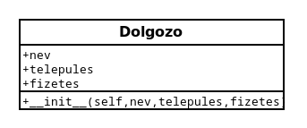

# Python - Python programozás objektum orientáltan

* **Szerző:** Sallai András
* Copyright (c) Sallai András, 2022
* Licenc: [CC Attribution-Share Alike 4.0 International](https://creativecommons.org/licenses/by-sa/4.0/)
* Web: [https://szit.hu](https://szit.hu)

## Tartalomjegyzék

* [Tartalomjegyzék](#tartalomjegyzék)
* [Osztályok](#osztályok)
* [Konstruktor](#konstruktor)
* [Az alkalmazás osztályban](#az-alkalmazás-osztályban)
* [Gyakorlat](#gyakorlat)

## Osztályok

Az osztályokat különböző típusú adatok tárolására alkalmas adatszerkezetekre használhatjuk. Az osztályt mindig a class kulcsszóval vezetjük be. Ha szeretnék egy dolgozó adatait tárolni, hozzunk létre osztályt.

A következő példában egy osztályt hozunk létre, amely egyelőre üres.

```python
class Dolgozo:
    pass
```

UML ábrán:


Az üres osztály létrehozásához a "pass" utasítást kell megadni, ami nem csinál semmit.

Szeretnénk tárolni nevet, települést, fizetést egy dolgozóról:

```python
class Dolgozo:
    nev = 'Névtelen'
    telepules = 'ismeretlen'
    fizetes = 0
```


Az így létrehozott változókat **adattagok**nak hívjuk, a továbbiakban így hivatkozunk rájuk.

Az osztály használata:

```python
class Dolgozo:
    nev = 'Névtelen'
    telepules = 'ismeretlen'
    fizetes = 0

# példány létrehozása
janos = Dolgozo()
print(janos.nev)

# felülírjuk a kezdőértéket:
janos.nev = 'Nagy János'
print(janos.nev)
```

## Konstruktor

Az osztályon belül létrehozhatók függvények is. Az osztályon belüli függvényeket **metódus**nak nevezzük, a továbbiakban így hivatkozunk rá. Van egy speciális metódus, amelynek a neve &#95;&#95;init&#95;&#95;. Az &#95;&#95;init&#95;&#95; metódust arra, használjuk, hogy kezdőértéket adjunk az adattagok számára. Ezt a metódust hívjuk konstruktornak. Az init szó előtt és után kettő darab alulvonás van.

```python
class Dolgozo:
    def __init__(self):
        self.nev = 'Névtelen'
        self.telepules = 'ismeretlen'
        self.fizetes = 0

# példány létrehozása
janos = Dolgozo()
```


A példányosításnál a Dolgozo() utasítás a konstruktor hívása. Konstruktor akkor is van, ha azt nem hozzuk létre; a háttérben automatikusan létrejön.

A self paraméter kötelező paraméter, ezen keresztül hivatkozhatunk az osztály adattagjaira. A self.nev a "nev" adattagra hivatkozik.

Ha a konstruktornak paraméteret is adunk, a példány létrehozása során, beállíthatjuk az adattagokat:

```python
class Dolgozo:
    def __init__(self, nev, telepules, fizetes):
        self.nev = nev
        self.telepules = telepules
        self.fizetes = fizetes

# példány létrehozása
janos = Dolgozo('Nagy János', 'Szolnok', 385)
# a nev adattag kiíratása
print(janos.nev)
```



Az &#95;&#95;init&#95;&#95; metódus paraméterei a self, nev, telepules és fizetes. Ezeket metódus formális paraméterei. Nézzük az egyik utasítást, ahol felhasználjuk a nev formális paramétert:

```python
self.nev = nev
```

Ebben az utasításban a self.nev az osztály adattagját jelenti. Az osztály "nev" adattagjának átadjuk azt az értéket, ami a "nev" formális paraméterben érkezik.

## Az alkalmazás osztályban

data.txt:

```txt
1:Nagy Géza:Szeged:389
2:Erős István:Szeged:392
3:Csep Ernő:Pécs:395
4:Ere Gábor:Szeged:392
```

main.py:

```python
class App:
  def __init__(self):
    self.filename = 'data.txt'

  def read_file(self):
    fp = open(self.filename, 'r')
    lines = fp.readlines()
    fp.close()
    for line in lines:
      line = line.rstrip()
      print(line)

app = App()
app.read_file()
```


## Gyakorlat

### 1 feladat

Készítsen osztályt, amiben egy jármű adatati tárolja. Egy Jarmu nevű osztályt hozzon létre egy jarmu.py nevű fájlban. Készítsen egy main.py fájlt, amiben használja a Jarmu osztályt.

Egy járműről a következőt kell tárolni:

* id
* márka
* üzemanyag
* év
* ár
* szín
* rendszám

### 2 feladat

Készítsen osztályt, amiben termékek adatait tárolja. Legyen az osztály neve Termek, és egy termek.py fájlba helyezze el.

Készítsen egy main.py fájlba, amiben használja az osztályt.

Kérje be egy termék adatatit. Tárolja egy objektumban, majd írja egy termek.txt fájlba.

Mit tartsunk nyilván?

* id
* név
* ár
* mennyiség
