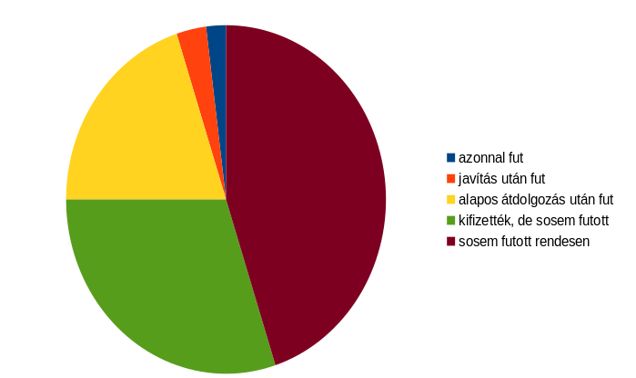
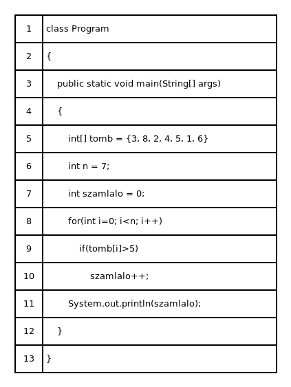

# Szoftvertesztelés

* **Szerző:** Sallai András
* Copyright (c) 2022, Sallai András
* Licenc: [CC Attribution-Share Alike 4.0 International](https://creativecommons.org/licenses/by-sa/4.0/)
* Web: [https://szit.hu](https://szit.hu)

## Tartalomjegyzék

* [Tartalomjegyzék](#tartalomjegyzék)
* [A szoftvertesztelés alapjai](#a-szoftvertesztelés-alapjai)
* [QA](#qa)
* [Gyakorlat](#gyakorlat)

## A szoftvertesztelés alapjai

### Fogalmak

* Verifikáció:
  * A terv vagy ami készül, megfelel a követelményeknek?
  * Dokumentumok, követelmények, kód ellenőrzése.
  * Unit tesztek, integrációs tesztek.
* Validáció:
  * Amit **elkészült** szoftver, megfelel az ügyfél elvárásainak?
  * Funkcionális tesztelés, elfogadási teszt, rendszer teszt stb.

#### Automatikus és kézi

* automatikus - szoftver végzi
* kézi - ember végzi

A kézi tesztelés során olyan hibákra is fény derülhet, amire a teszt szoftver írásakor nem gondoltunk.

#### Szisztematikus és ad-hoc

* szisztematikus - előre tervezett
* ad-hoc - nincs előre tervezve

#### Fekete és fehérdobozos

* fehér dobozos - a tesztelőnek rendelkezésre áll a kód
* fekete dobozos - a tesztelőnek nem áll rendelkezésre a kód

#### Típusok

* funkcionális tesztek - adott funkció működik?
* nem funkcionális tesztek - például teljesítmény, kinézet
* regressziós teszt - újratesztelés

Ha javítunk valamit egy szoftveren, az újratesztelést regressziós tesztelésnek hívjuk.

### Tesztpiramis


### A szoftverek életciklusa

* projekt elhatározása
* elemzés
* tervezés
* megvalósítás
* tesztelés
* terjesztés
* oktatás és támogatás
* karbantartás

A szoftver életciklusa egy verzión belül:

* pre-alfa
* alfa
* béta
* kiadásra jelölt - release candidate - RC
* kiadott - released

A változatok számmal megadása:

* 0.01
* 0.1
* 0.3
* ...
* 0.5
* 0.9
* 0.9.1
* 1.0 első kiadás
* 1.01 hibajavítás
* 2.0 második kiadás

A szoftverek sorsa:

* 2 % - azonnal fut
* 3 % - javítás után fut
* 20 % - alapos átdolgozás után futott
* 30 % - kifizették, de sosem futott
* 45 % - sosem futott rendesen



### Statisztikák

A megírt programkódokat mérjük, általában sorok alapján. Így alakult ki a LOC vagy SLOC mértékegység.

* Lines Of Code
* Source Lines Of Code

100 LOC, száz megírt kódsort jelent.

SI prefixumokat is szokás használni:

1000 LOC egyenlő 1 kLOC

Az üres sorokat és a megjegyzéseket nem számoljuk.

Példa a következő ábrán:



### A tesztelés szintjei

* egységteszt
* integrációs teszt
* rendszerteszt
* elfogadási teszt

Az első három tesztet az IT végzi. Az utolsó tesztet a megrendelő, illetve annak tesztelői.

Egyes szerzők a komponens tesztet írják az egységteszt helyére, ami jelenthet metódus vagy osztályt tesztet.

* komponensteszt - metódus, osztály (egység)
* integrációs teszt
* rendszerteszt
* elfogadási teszt

## QA

* Quality Assurance - minőségbiztosítás

A szoftverfejlesztés során a termékek és szolgáltatások minőségének folyamatos javítása, biztosítása a minőségbiztosítás. A cél a vásárlói elégedettség növelése. Gyakran használunk nemzetközi szabványokat, például ISO 9001.

## Gyakorlat

### Egységteszt példa

calculator.py:

```python
# A tesztelendő kód (calculator.py)
def add(a, b):
    return a + b
```

test_calculator.py:

```python
# A teszt kód (test_calculator.py)
import pytest
from calculator import add

def test_add():
    assert add(2, 4) == 6
    assert add(-1, 1) == 0
    assert add(0, 0) == 0
```

### Integrációs teszt példa

calculator.py:

```python
# A tesztelendő kód (calculator.py)
def subtract(a, b):
    return a - b

def calculate(a, b):
    return add(a, b), subtract(a, b)
```

test_calculator.py:

```python
# A teszt kód (test_calculator.py)
import pytest
from calculator import calculate

def test_calculate():
    result = calculate(3, 2)
    
    # add(3, 2) == 5 és subtract(3, 2) == 1
    assert result == (5, 1)  
```

### Kérdések

1.)
Mit jelenet a LOC mértékegység?

* A kifogható halak mérete
* A szilícium tartalom mértékegysége
* A kódsorok száma
* A helyi változók száma

2.)
Mi a verifikáció célja?

* Az ügyfél igényeinek teljesítése
* A kész tervek és dokumentációk helyességének ellenőrhzése
* A rendszer teljesítményének növelése
* A felhasználói élmény javítása

3.)
Melyik tesztelési forma kapcsolódik legikább a validációhoz?

* Unit teszt
* Rendszer teszt
* Kód ellenőrzés
* Integrációs teszt

4.)
A verifikáció során milyen tevékenységekre fókuszálunk?

* Az ügyfél visszajelzésének gyűjtésére
* A szoftver funkcionalitásának tesztelésére
* A fejlesztett termék követelményeknek való megfelelésére
* A felhasználói dokumentáció elkészítésére

5.)
Melyik eljárás nem a verifikáció része?

* Dokumentáció ellenőrzése
* Unit tesztelés
* Elfogadási tesztelés
* Kód review

6.)
A validáció fő célja a következő:

* A szoftver hibáinak javítása
* A rendszer teljesítményének tesztelése
* Az ügyfél elvárásainak való megfelelés biztosítása
* A létező funkciók optimalizálása

7.)
Mi a fő különbség a validáció és a verifikáció között?

* A verifikáció csak kód szinten történik, míg a validáció felhasználói szinten
* A verifikáció a fejlesztés utolsó szakasza, míg a validáció az első
* A verifikáció a termék helyességét ellenőrzi, míg a validáció az ügyfél igényeit
* Nincs különbség

8.)
Mi jellemző az automatikus tesztelésre?

* Az ember végzi a teszteket
* A szoftver végzi a teszteket
* Nincs szükség tervre
* Csak egyszer használható

9.)
Milyen előnnyel járhat a kézi tesztelés?

* Gyorsabb végrehajtás
* Kisebb költségek
* Olyan hibák azonosítása, amire a teszt szoftver írásakor nem gondoltunk
* Automatikus hibakeresés

10.)
Melyik jellemző a szisztematikus tesztelésre?

* A tesztelés során nincs megtervezett folyamat
* Az előre megtervezett tesztesetek végrehajtása
* A tesztelés kreatív megközelítést igényel
* Nincs dokumentáció

11.)
Melyik állítás helyes az ad-hoc tesztelésre?

* Automatikus tesztelést igényel
* A tesztelés nem tervezett, szabadon végzett
* Gyakran használják a teljesítmény optimalizálására
* Csak a kóddal kapcsolatos hibák keresésére összpontosít

12.)
Mit jelent a fehérdobozos tesztelés?

* a) A tesztelés a kód működésének és logikájának ismerete alapján történik
* b) A tesztelő nem ismeri a kódot
* c) Csak a külső felhasználói felületet tesztelik
* d) Az adatok csak a felhasználói szinten kerülnek megvizsgálásra

13.)
Mi a jellemző a fekete dobozos tesztelésre?

* a) A tesztelőnek ismernie kell a kódot
* b) A tesztelés a funkciók és a kimenetek tesztelésére összpontosít, nem a belső logikára
* c) Csak automatikus tesztelés során alkalmazzák
* d) A teszt végrehajtásához részletes dokumentáció szükséges

14.)
Mit jelent a release candidate? Válasszon.

* hosszú ideig támogatott kiadás
* kiadásra jelölt
* nem lesz továbbfejlesztve
* vizsgát kell tennie

15.)
Milyen tesztről beszélünk, ha újratesztelünk egy szoftvert?

* előtesztelés
* egyszer tesztelünk csak
* visszatérünk egy korábbi verziószámhoz
* regressziós

16.)
Mi a refaktorálás

* A kód újraírása.
* A kód tesztelése.
* A kód üres sorainak törlése.
* A programot elölről kezdjük.

17.)
Melyik teszttel szokás egy függvényt vizsgálni, ami egy számítást végez?

* átvételi
* rendszer
* egység
* kerekítés

18.)
Melyik assert utasítással hasonlítjuk össze az elvárt eredményt az aktuális eredménnyel, ha az egy szám?

* assertBear
* assertLarge
* assertEquals
* assertTrump

19.)
Mit használunk Java nyelvhez egységteszteléshez?

* GUnit
* AUnit
* CUnit
* JUnit

20.)
Mi a verifikáció?

* ami elkészült az megfelel az ügyfélnek?
* amit tervezünk az megfelel az ügyfélnek?
* az adatbázis vizsgálata
* ami készül, megfelel a követelményeknek?

21.)
Mi a validáció?

* ami elkészült az megfelel az ügyfélnek?
* amit tervezünk az megfelel a leírásokank?
* az adatbázis vizsgálata
* ami készült, az megfelel a követelményeknek?

22.)
Melyik szó ír le egy tesztelési típust?

* emberközpontú
* sebezhető
* figyelemfelkeltő
* kézi

23.)
Mi a fekete dobozos tesztelés?

* az eredményt fekete dobozban tároljuk
* az eredmény fekete dobozból kiolvasható
* a tesztelőnek nem áll rendelkezésre a forráskód
* a tesztelőnek rendelkezésre áll a forráskód

24.)
Mi a fehér dobozos tesztelés?

* az eredményt fehér dobozban tároljuk
* az eredmény fehér dobozból kiolvasható
* a tesztelőnek nem áll rendelkezésre a forráskód
* a tesztelőnek rendelkezésre áll a forráskód

25.)
Melyik funkcionális teszt?

* A weblapon megjelenik a "számít" gomb?
* A program mekkora bemenő adat esetén működésképtelen?
* A program kiszámítja a területet?
* Újra vizsgáljuk, látszik-e már a számít gomb.

26.)
Milyen tesztek helyezkednek el a tesztpiramis alján?

* GUI teszt
* integrációs teszt
* átvételi teszt
* egységteszt

27.)
A szoftverek életciklusát tekintve, melyik tevékenység van előbb?

* terjesztés
* karbantartás
* tervezés
* elemzés

28.)
A szoftverek életciklusát tekintve, melyik tevékenység van utolsó helyen?

* terjesztés
* karbantartás
* tervezés
* elemzés

29.)
Mi a LOC?

* A tesztelési sebesség mértékegysége.
* A program készítés sebességének mértékegysége.
* Programkód sorainak száma.
* A látható sorok száma.

30.)
Mit jelent az LTS? Válasszon.

* hosszú ideig támogatott kiadás
* kiadásra jelölt
* nem lesz továbbfejlesztve
* vizsgát kell tennie

31.)
Melyik tesztet csinálja az "ügyfél"?

* integrációs
* elfogadási
* rendszer
* egység

32.)
1 kLOC, az hány kódsor?

* 500
* 1000
* 2000
* 10000
