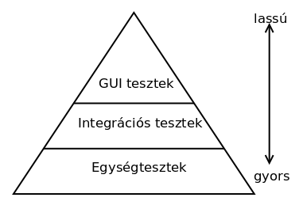

# Szoftvertesztelés

* **Szerző:** Sallai András
* Copyright (c) 2022, Sallai András
* Licenc: [CC Attribution-Share Alike 4.0 International](https://creativecommons.org/licenses/by-sa/4.0/)
* Web: [https://szit.hu](https://szit.hu)

## Tartalomjegyzék

* [Tartalomjegyzék](#tartalomjegyzék)
* [A szoftvertesztelés alapjai](#a-szoftvertesztelés-alapjai)
* [QA](#qa)
* [Gyakorlat](#gyakorlat)

## A szoftvertesztelés alapjai

### Fogalmak

* verifikáció: ami elkészült, az jól működik?
* validáció: amit készítünk, megfelel az ügyfél elvárásainak?

A validáció már a tervezési fázisban is használható.

#### Automatikus és kézi

* automatikus - szoftver végzi
* kézi - ember végzi

A kézi tesztelés során olyan hibákra is fény derülhet, amire a teszt szoftver írásakor nem gondoltunk.

#### Szisztematikus és ad-hoc

* szisztematikus - előre tervezett
* ad-hoc - nincs előre tervezve

#### Fekete és fehérdobozos

* fehér dobozos - a tesztelőnek rendelkezésre áll a kód
* fekete dobozos - a tesztelőnek nem áll rendelkezésre a kód

#### Típusok

* funkcionális tesztek - adott funkció működik?
* nem funkcionális teszek - például teljesítmény, kinézet
* regressziós teszt - újratesztelés

Ha javítunk valamit egy szoftveren, az újratesztelést regressziós tesztelésnek hívjuk.

### Tesztpiramis

### A szoftverek életciklusa

* projekt elhatározása
* elemzés
* tervezés
* megvalósítás
* tesztelés
* terjesztés
* oktatás és támogatás
* karbantartás

A szoftver életciklusa egy verzión belül:

* pre-alfa
* alfa
* béta
* kiadásra jelölt - release candidate - RC
* kiadott - released

A változatok számmal megadása:

* 0.01
* 0.1
* 0.3
* ...
* 0.5
* 0.9
* 0.9.1
* 1.0 első kiadás
* 1.01 hibajavítás
* 2.0 második kiadás

A szoftverek sorsa:

* 2 % - azonnal fut
* 3 % - javítás után fut
* 20 % - alapos átdolgozás után futott
* 30 % - kifizették, de sosem futott
* 45 % - sosem futott rendesen

### Statisztikák

A megírt programkódokat mérjük, általában sorok alapján. Így alakult ki a LOC vagy SLOC mértékegység.

* Lines Of Code
* Source Lines Of Code

100 LOC, száz megírt kódsort jelent.

SI prefixumokat is szokás használni:

1000 LOC egyenlő 1 kLOC

### A tesztelés szintjei

* egységteszt
* integrációs teszt
* rendszerteszt
* elfogadási teszt

Az első három tesztet az IT végzi. Az utolsó tesztet a megrendelő, illetve annak tesztelői.

## QA

* Quality Assurance - minőségbiztosítás

A szoftverfejlesztés során a termékek és szolgáltatások minőségének folyamatos javítása, biztosítása a minőségbiztosítás. A cél a vásárlói elégedettség növelése. Gyakran használunk nemzetközi szabványokat, például ISO 9001.

## Gyakorlat

### Kérdések

1.)
Mit jelenet a LOC mértékegység?

* A kifogható halak mérete
* A szilícium tartalom mértékegysége
* A kódsorok száma
* A helyi változók száma

2.)
Mit jelent a release candidate? Válasszon.

* hosszú ideig támogatott kiadás
* kiadásra jelölt
* nem lesz továbbfejlesztve
* vizsgát kell tennie

3.)
Milyen tesztről beszélünk, ha újratesztelünk egy szoftvert?

* előtesztelés
* egyszer tesztelünk csak
* visszatérünk egy korábbi verziószámhoz
* regressziós

4.)
Mi a refaktorálás

* A kód újraírása.
* A kód tesztelése.
* A kód üres sorainak törlése.
* A programot elölről kezdjük.

5.)
Melyik teszttel szokás egy függvényt vizsgálni, ami egy számítást végez?

* átvételi
* rendszer
* egység
* kerekítés

6.)
Melyik assert utasítással hasonlítjuk össze az elvárt eredményt az aktuális eredménnyel, ha az egy szám?

* assertBear
* assertLarge
* assertEquals
* assertTrump

7.)
Mit használunk Java nyelvhez egységteszteléshez?

* GUnit
* AUnit
* CUnit
* JUnit

8.)
Mi a verifikáció?

* ami elkészült az megfelel az ügyfélnek?
* amit tervezünk az megfelel az ügyfélnek?
* az adatbázis vizsgálata
* ami elkészült, az jól működik?

9.)
Mi a validáció?

* ami elkészült az megfelel az ügyfélnek?
* amit tervezünk az megfelel az ügyfélnek?
* az adatbázis vizsgálata
* ami elkészült, az jól működik?

10.)
Melyik tesztelési típus?

* emberközpontú
* sebezhető
* figyelemfelkeltő
* kézi

11.)
Mi a fekete dobozos tesztelés?

* az eredményt fekete dobozban tároljuk
* az eredmény fekete dobozból kiolvasható
* a tesztelőnek nem áll rendelkezésre a forráskód
* a tesztelőnek rendelkezésre áll a forráskód

12.)
Mi a fehér dobozos tesztelés?

* az eredményt fehér dobozban tároljuk
* az eredmény fehér dobozból kiolvasható
* a tesztelőnek nem áll rendelkezésre a forráskód
* a tesztelőnek rendelkezésre áll a forráskód

13.)
Melyik funkcionális teszt?

* A weblapon megjelenik-e a "számít gomb".
* A program mekkora bemenő adat esetén működésképtelen.
* A program kiszámítja a területet.
* Újra vizsgáljuk, látszik-e már a számít gomb.

14.)
Milyen tesztek helyezkednek el a tesztpiramis alján?

* GUI teszt
* integrációs teszt
* átvételi teszt
* egységteszt

15.)
A szoftverek életciklusát tekintve, melyik tevékenység van előbb?

* terjesztés
* karbantartás
* tervezés
* elemzés

16.)
A szoftverek életciklusát tekintve, melyik tevékenység van utolsó helyen?

* terjesztés
* karbantartás
* tervezés
* elemzés

17.)
Mi a LOC?

* A tesztelési sebesség mértékegysége.
* A program készítés sebességének mértékegysége.
* Programkód sorainak száma.
* A látható sorok száma.

18.)
Mit jelent az LTS? Válasszon.

* hosszú ideig támogatott kiadás
* kiadásra jelölt
* nem lesz továbbfejlesztve
* vizsgát kell tennie

19.)
Melyik tesztet csinálja az "ügyfél"?

* integrációs
* elfogadási
* rendszer
* egység

20.)
1 kLOC, az hány kódsor?

* 500
* 1000
* 2000
* 10000
