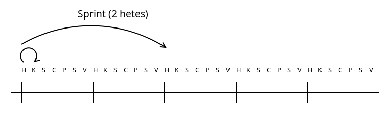

# Fejlesztési módszertanok

* **Szerző:** Sallai András
* Copyright (c) 2022, Sallai András
* Licenc: [CC Attribution-Share Alike 4.0 International](https://creativecommons.org/licenses/by-sa/4.0/)
* Web: [https://szit.hu](https://szit.hu)

## Tartalomjegyzék

* [Tartalomjegyzék](#tartalomjegyzék)
* [Módszertanok](#módszertanok)
* [Vízesés modell](#vízesés-modell)
* [V-modell](#v-modell)
* [Prototípus modell](#prototípus-modell)
* [Iteratív és inkrementális módszertanok](#iteratív-és-inkrementális-módszertanok)
* [Gyors alkalmazásfejlesztés - RAD](#gyors-alkalmazásfejlesztés---rad)
* [Agilis szoftverfejlesztés](#agilis-szoftverfejlesztés)
* [DevOps](#devops)
* [Extrém programozás](#extrém-programozás)
* [Lean szoftverfejlesztés](#lean-szoftverfejlesztés)
* [Gyakorlás](#gyakorlás)

## Módszertanok

A fejlesztési módszertanok meghatározzák, hogy az egyes szoftveréletciklusokat, mikor, milyen sorrendben jönnek egymás után.

* Vízesés modell
* V-modell
* Prototípus modell
* Inkrementális fejlesztés
* Gyors alkalmazás fejlesztés
* Agilis fejlesztés
* Extrém programozás

## Vízesés modell

Angolul Waterfall.

Meghatározzuk a követelményeket, tervezünk, fejlesztünk, tesztelünk és átadjuk a kész projektet.

## V-modell

A V-modell olyan mint a vízesés modell, de van egy másik felfelé mutató ága, ami tesztelésről szól.

## Prototípus modell

A vízesés modell kudarcai hozták életre a Prototípus modellt. A vízesés modellben, amikor elkészül a szoftver, általában mindig kiderül, hogy nem is erre gondolt a megrendelő.

A prototípus modellnél számtalan prototípust kap a megrendelő, mielőtt megkapja a kész terméket.

## Iteratív és inkrementális módszertanok

A szoftvert folyamatosan fejlesztjük és kiadjuk.

Fontos az egyszerűség és a működő szoftver létrehozása.

Elsőként egy vázlatos követelményrendszert állítunk össze. Osztályozzuk a szolgáltatásokat fontosság szerint. A fontosakat elkezdjük megvalósítani.

## Gyors alkalmazásfejlesztés - RAD

A RAD a Rapid Application Development rövidítése. Magyarul gyors alkalmazásfejlesztés.

Alapja:

* iterációk
* prototípus készítés
* gyors visszacsatolás
* kisebb hangsúly a konkrét tervezésen
* fejlesztés támogató IDE használata

Bírálata:

* futtatható program nagy méretű
* futtatható program lassú

## Agilis szoftverfejlesztés

A fejlesztők szorosan együttműködnek a megrendelőkkel. Folyamatosan egyeztetnek, hogy mire is van szükség. Minden folyamat ciklusban ismétlődik.

### Scrum

Az Agilis módszertanban is használt fejlesztési módszer. 3-9 fős fejlesztői csapatokkal dolgozunk, ebben általában 1 vagy 2 tesztelő van.

Szerepek:

* Scrum master - csapat összetartása
* vezető fejlesztő - operatív irányítás
* üzleti elemező - nem minden esetben van
* tesztmenedzser - folyamatok előrehaladására figyel
* product owner - a megrendelőtől egy ember
* projektmenedzser

Ciklusok:
  
* napi ciklus
* heti ciklus - sprint - lehet 1 vagy több hetes
* havi ciklus

#### Napi ciklus

A reggeli napindító megbeszélést állva kell tartani, amin csak a fejlesztők vesznek részt elsősorban, másodsorban a vezetőség is részt vehet. Ezt nevezik **daily standup** meetingnek.

Megbeszélendő:

* mivel foglalkoztam tegnap
* mivel szeretnék ma foglalkozni
* milyen problémákba ütköztem

A sprinteket mindig megelőzi egy Sprint Planning, ahol megbeszéljük mit fogunk csinálni a sprint alatt. A sprint végén végezzük a Sprint Review-t, ahol megbeszéljük mire jutottunk, mi működött, min kell változtatni.

A backlog-t a Product Owner írja. Leírja mit kell megvalósítani, ami felhasználói tevékenységeket, történeteket jelent.

A fejelsztők ehhez igazodva készítenek maguknak feladatlistát.

## DevOps

A fejlesztési és üzemeltetési folyamatokat integráljuk. Gyorsabb és hatékony szoftver szállítás.

Az automatikusa tesztek és a folyamatos integráció a hangsúlyosak.

## Extrém programozás

Angolul: Extreme Programming, röviden XP.

Jellemzők:

* párban programozás
* folyamatos integráció
* TDD

## Lean szoftverfejlesztés

A Lean elveket alkalmazza a szoftverfejlesztésben.

Jellemzők:

* tisztázzuk a követelményeket
* összedolgozás
* adjun ki kódot minél előbb
* dolgozzunk csapatban
* nézzük távolról az egészet
* döntsünk olyan későn amennyire csak lehet
* csökkentsük a felesleget
* folyamatosan tanuljunk

Plusz két ráadás:

* kommunikáció javítása
* megfelelő ember végezze a munkát

* [Lean módszer](https://szit.hu/doku.php?id=oktatas:programozas:fejlesztesi_modellek_es_modszertanok#lean_modszer)

## Gyakorlás

### Kérdések

1.)
Vízesés modell esetén, melyik az első három tevékenység?

* követelmények, tervezés, megvalósítás
* tesztelés, telepítés, karbantartás
* követelmények, rendszertesztelés, elfogadási teszt
* követelmények, kódolás, karbantartás

2.)
A V-modell bal oldali ága, hasonlít egy másik modellhez. Melyik az?

* Prototípus
* Vízesés
* RAD
* Agilis szoftverfejlesztés

3.)
Melyik fejlesztési módszert tartalmazza az Agilis
szoftverfejlesztés?

* Vízesés
* RAD
* Scrum
* RAID
