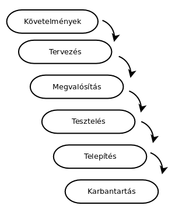
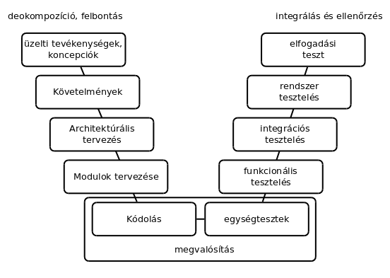
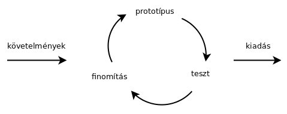

# Fejlesztési módszertanok

* **Szerző:** Sallai András
* Copyright (c) Sallai András, 2022
* Licenc: [CC Attribution-Share Alike 4.0 International](https://creativecommons.org/licenses/by-sa/4.0/)
* Web: [https://szit.hu](https://szit.hu)

## Módszertanok

A fejlesztési módszertanok meghatározzák, hogy az egyes szoftver életciklusokat, mikor, milyen sorrendben jönnek egymás után.

* Vízesés modell
* V-modell
* Prototípus modell
* Inkrementális fejlesztés
* Gyors alkalmazás fejlesztés
* Agilis fejlesztés
* Extrém programozás

## Vízessés modell

Meghatározzuk a követelményeket, tervezünk, fejlesztünk, tesztelünk és átadjuk a kész projektet.

## V-modell

A V-modell olyan mint a vízesés modell, de van egy másik felfelé mutató ága, ami tesztelésről szól.

## Prototípus modell

A vízesés modell kudarcai hozták életre a Prototípus modellt. A vízesés modellben, amikor elkészül a szoftver, általában mindig kiderül, hogy nem is erre gondolt a megrendelő.

A prototípus modellnél számtalan prototípust kap a megrendelő, mielőtt megkapja a kész terméket.

## Iteratív és inkrementális módszertanok

A szoftvert folyamatosan fejlesztjük és kiadjuk.

Fontos az egyszerűség és a működő szoftver létrehozása.

## Gyors alkalmazásfejlesztés - RAD

A RAD a Rapid Application Development rövidíétse. Magyarul gyors alkalmazásfejlesztés.

Alapja:

* iterációk
* prototípus készítés
* gyors visszacsatolás
* kisebb hangsúly a konkrét tervezésen
* fejlesztés támogató IDE használata

Bírálata:

* futtatható program nagy méretű
* futtatható program lassú

## Agilis szoftverfejlesztés

A fejlesztők szorosan együttműködnek a megrendelőkkel. Folyamatosan egyeztetnek, hogy mire is van szükség. Minden folyamat ciklusban ismétlődik.

### Scrum

Az Agilis módszertanban is használt fejlesztési módszer. 6-8 fős fejlesztői csapatokkal dolgozunk, ebben általában két tesztelő van.

Szerepek:

* Scrum master - csapat összetartása
* vezető fejlesztő - operatív irányítás
* üzleti elemező - nem minden esetben van
* tesztmenedzser - folyamatok előrehaladására figyel
* product owner
* projektmenedzser

Ciklusok:
  
* napi ciklus
* heti ciklus - sprint
* havi ciklus

#### Napi ciklus

A reggeli napindító megbeszélést állva kell tartani, amin csak a fejlesztők vesznek részt elsősorban, másodsorban a vezetőség is részt vehet. Ezt nevezik daily standup meetingnek.

Megbeszélendő:

* mivel foglalkoztam tegnap
* mivel szeretnék ma foglalkozni
* milyen problémákba ütkztem
