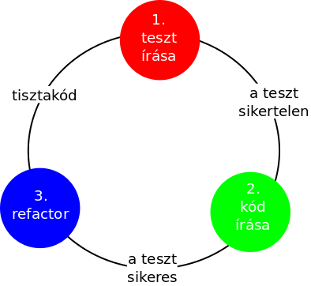

# Szoftvertesztelési módszerek

* **Szerző:** Sallai András
* Copyright (c) 2022, Sallai András
* Szerkesztve: 2022, 2023, 2024
* Licenc: [CC Attribution-Share Alike 4.0 International](https://creativecommons.org/licenses/by-sa/4.0/)
* Web: [https://szit.hu](https://szit.hu)

## Tartalomjegyzék

* [Tartalomjegyzék](#tartalomjegyzék)
* [Egységteszt](#egységteszt)
* [Integrációs teszt](#integrációs-teszt)
* [Rendszerteszt](#rendszerteszt)
* [Elfogadási teszt](#elfogadási-teszt)
* [Biztonsági teszt](#biztonsági-teszt)
* [Teljesítmény- és terhelés teszt](#teljesítmény--és-terhelés-teszt)
* [TDD](#tdd)

## Egységteszt

Egy függvény, metódus vagy egy komplett osztály tesztje.

## Integrációs teszt

A komponensek együttműködését teszteljük. Angolul **Integration Level Testing**, röviden **ILT**.

Megközelítések:

* Big-Bang - az összes modult összerakjuk
* Alulról felfelé - magasabb modullal teszteljük az alacsonyabb szintű modulokat
* Felülről lefelé - először a magas szintű modulok tesztelése
* Vegyes - alulról felfelé, felülről lefelé kombinálva

## Rendszerteszt

Angolul **System Level Testing**, röviden **SLT**.

Jellemzők:

* A teljes rendszert teszteljük.
* Funkcionális és nem-funkciónális tesztelés.
* Általában külső tesztelő csapat végzi.
* Általában fekete dobozos teszt.
* Lehet automatizált és kézi tesztelés is.

Mit vizsgálnak?

* A specifikációnak megfelel a program?

Például: Specifikáció szerint jelentést kell tudnia generálni valamiről a programnak. Ennek ellenőrzése.

### Eszközök

Automatizált tesztelés lehetséges eszközei:

* Puppeteer
* Selenium
* JUnit
* TestNG
* Robot Framework

Kézi tesztelés lehetséges eszközei:

* Tesztelési forgatókönyv
* Checklisták
* egyéb
  
### Teszt forgatókönyv példa

#### TC001

Teszteset azonosító: TC001

* Teszteset neve: Érvényes bejelentkezés
* Leírás: Érvényes felhasználónévvel bejelentkezünk a webes felületen.
* Előfeltételek:
  * A felhasználó rendelkezik hozzáféréssel.
  * A rendszer elérhető.

Lépések:

* Weblap megnyitása
* Jobb felső sarokban **Bejelentkezés** gombra kattintunk
* Felhasználónév beírása
* Jelszó beírása
* Kattintás a bejelentkezésre

Várt eredmény:

* Bejelentkezés OK, átiránytás történt a főoldalra.
* A bejelentkezhés gomb helyett a felhasználó neve látszik.
* A felhasználó hozzáfér a fiókjához, böngészhet a védett oldalon.

Utófeltételek:

* A felhasználó be van jelentkezve, és hozzáfér a fiókjához.

#### TC002

Teszteset azonosító: TC002

* Teszteset neve: Érvénytelen bejelentkezés
* Leírás: Érvénytelen felhasználónévvel bejelentkezünk a webes felületen.
* Előfeltételek:
  * A rendszer elérhető.

Lépések:

* Weblap megnyitása
* Jobb felső sarokban **Bejelentkezés** gombra kattintunk
* Felhasználónév beírása
* Helytelen jelszó beírása
* Kattintás a bejelentkezésre

Várt eredmény:

* A rendszer hibát ad.
* A felhasználó nem kerül bejelentkezésre.

## Elfogadási teszt

Angolul **User Acceptance Testing**, röviden **UAT**.

A rendszertesztelést követheti egy elfogadási teszt.

Vizsgáljuk, hogy a szoftver valóban képes elvégezni a neki szánt munkát. Kik végeznek ilyen munkát?

Kik végzik:

* megrendelő
* külső hivatásos tesztelők

Az UAT célja, hogy valóban készen áll a szoftver a használatra, az üzembe helyezésre.

Valós üzleti forgatókönyvet és folyamatok szerint tesztelnek, általában kéziteszteléssel.

## Biztonsági teszt

### Tesztelési módszertanok

* biztonsági vizsgálat
* sebezhetőség vizsgálat
* behatolásteszt
* etikus hackelés

#### Biztonsági vizsgálat

* Fehérdobozos teszt.
* Pl. valóban kötelező a betűk és számok használata a jelszavaknál?

#### Sebezhetőség vizsgálat

* Zöld dobozs teszt.
* Biztonsági rések mintáit keresi egy automatizált szoftver.
* Pl. Valamilyen bemenetre, érzékeny adatokat szolgáltat az alkalmazás.

#### Behatolásteszt

* Fekete dobozos teszt.
* A tesztelőnek nincs jogosultsága.
* Nehezen automatizálható.
* Kétféle:
  * Blue teaming (a tesztelő ismeri az infrastruktúrát)
  * Red teaming (a tesztelő nem ismeri az infrastruktúrát)

#### Etikus hackelés

* Előzetes ismeretek nélküli teszt.
* Akár pszichológiai manipulációval (social engineering).

### Tesztelési "szabványok"

* OWASP Web Security Testing Guide
  * [https://owasp.org/www-project-web-security-testing-guide/](https://owasp.org/www-project-web-security-testing-guide/)

* NIST SP 800-115
  * [https://csrc.nist.gov/publications/detail/sp/800-115/final](https://csrc.nist.gov/publications/detail/sp/800-115/final)

* ISO/IEC 27002
  * [https://www.iso.org/standard/75652.html](https://www.iso.org/standard/75652.html)

### Jellemző tevékenységek

Technikai áttekintés

* dokumentációk áttekintése
* napló átnézése
* szabályok átnézése
* hálózati forgalom figyelése
* fájlintegráció ellenőrzése

Célok felderítése

* hálózat felderítése
* portok és szolgáltatások azonosítása
* sebezhetőség vizsgálat
* vezeték nélküli hálózat felderítése
  * passzív szkennelés
  * aktív szkennelés
  * wifi eszköz helye
  * Bluetooth felderítése

Célok sebezhetősége

* jelszótörés
* penetrációs teszt
* pszichológiai manipuláció (social engineering)

Kockázatértékelés

* biztonsági fejlesztési szabályzat
* kockázatértékelés
* adatkezelés

### Szoftverek

* Wapiti
  * [https://wapiti-scanner.github.io/](https://wapiti-scanner.github.io/)

* dirb
  * [https://www.kali.org/tools/dirb/](https://www.kali.org/tools/dirb/)

## Teljesítmény- és terhelés teszt

A teljesítménytesztek a nem funkcionális tesztekhez tartoznak.

Teljesítmény:

* megbízhatóság
* erőforrás-használat
* méretezhetőség

Terhelésvizsgálat:

* többfelhasználós rendszereknél relevánsabb
* gyakran automatizált
* nagy dokumentum
* sok adat

Azt vizsgáljuk, mi az a mennyiség, amit a rendszer összeomlás nélkül tud még kezelni.

## TDD

A TDD a Test-driven development rövidítése. Magyarul tesztvezérelt fejlesztésnek hívjuk. A szoftverfejlesztést egy minimális teszt írásával kezdjük. Ezt követően annyit fejlesztünk, hogy a teszt teljesüljön. Refaktorálunk ha szükséges, majd ismételjük az elejétől. Fejlesztjük a tesztet minimálisan. Annyit fejlesztünk a kódon, hogy teljesítse a tesztet. Ha szükséges refaktorálunk. Ezt ismételjük.

Lépések:

* Készítünk egy tesztet
* Futtatjuk a teszteket
* Annyi kódot írunk, hogy teljesítse a tesztet
* Futtatjuk a teszteket
* Ha szükséges refaktorálunk

