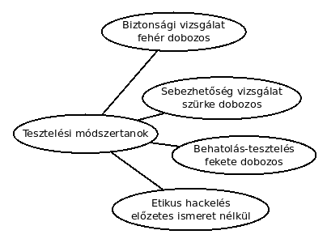

# Szoftvertesztelési módszertanok

* **Szerző:** Sallai András
* Copyright (c) Sallai András, 2022
* Licenc: [CC Attribution-Share Alike 4.0 International](https://creativecommons.org/licenses/by-sa/4.0/)
* Web: [https://szit.hu](https://szit.hu)

## Egységteszt

Egy függvény, metódus vagy egy komplett osztály tesztje.

## Integrációs teszt

A komponensek együttműködését teszteljük.

Megközelítések:

* Big-Bang - az összes mdoult összerakjuk
* Alulról felfelé - magasabb modullal teszteljük az alacsonyabb szintű modulokat
* Felülről lefelé - először a magasszintű modulok tesztelése
* Vegyes - alulról felfelé, felülről lefelé kombinálva

## Rendszerteszt

Általában külső tesztelő csapat végzi.

## Elfogadási teszt

A szoftver valóban képes elvégezni a neki szánt munkát. Kik végeznek ilyen munkát?

* megrendelő
* külső hivatásos tesztelők

## Biztonsági teszt

### Tesztelési módszertanok

* biztonsági vizsgálat
* sebezhetőség vizsgálat
* behatolásteszt
* etikus hackelés

#### Biztonsági vizsgálat

* Fehérdobozos teszt.
* Pl. valóban kötelező a betűk és számok használata a jelszavaknál?

#### Sebezhetőség vizsgálat

* Zöld dobozs teszt.
* Biztonsági rések mintáit keresi egy automatizált szoftver.
* Pl. Valamilyen bemenetre, érzékeny adatokat szolgáltat az alkalmazás.

#### Behatolásteszt

* Fekete dobozos teszt.
* A tesztelőnek nincs jogosultsága.
* Nehezn automatizálható.
* Kétféle:
  * Blue teaming (a tesztelő ismeri az infrastruktúrát)
  * Red teaming (a tesztelő nem ismeri az infrastruktúrát)

#### Etikus hackelés

* Előzetes ismeretek nélküli teszt.
* Akár pszichológiai manipulációval (social engineering)

### Tesztelési "szabványok"

* OWASP Web Security Testing Guide
  * [https://owasp.org/www-project-web-security-testing-guide/](https://owasp.org/www-project-web-security-testing-guide/)

* NIST SP 800-115
  * [https://csrc.nist.gov/publications/detail/sp/800-115/final](https://csrc.nist.gov/publications/detail/sp/800-115/final)

* ISO/IEC 27002
  * [https://www.iso.org/standard/75652.html](https://www.iso.org/standard/75652.html)

### Jellemző tevékenységek

Technikai áttekintés

* dokumentációk áttekintése
* napló átnézése
* szabályok átnézése
* hálózati forgalom figyelése
* fájlintegráció ellenőrzése

Célok felderítése

* hálózat felderítése
* portok és szolgáltatások azonosítása
* sebezhetőség vizsgálat
* vezeték nélküli hálózat felderítése
  * passzív szkennelés
  * aktív szkennelés
  * wifi eszköz helye
  * Bluetooth felderítése

Célok sebezhetősége

* jelszótörés
* penetrációs teszt
* pszichológiai manipuláció (social engineering)

Kockázatértékelés

* biztonsági fejlesztési szabályzat
* kockázatértékelés
* adatkezelés

### Szfotverek

* Wapiti
  * [https://wapiti-scanner.github.io/](https://wapiti-scanner.github.io/)

* dirb
  * [https://www.kali.org/tools/dirb/](https://www.kali.org/tools/dirb/)

## Teljesítmény- és terhelés teszt

## TDD
