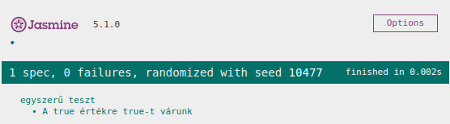

# Szoftvertesztelés - JavaScript tesztelés

* **Szerző:** Sallai András
* Copyright (c) 2023, Sallai András
* Licenc: [CC Attribution-Share Alike 4.0 International](https://creativecommons.org/licenses/by-sa/4.0/)
* Web: [https://szit.hu](https://szit.hu)

## Tartalomjegyzék

* [Tartalomjegyzék](#tartalomjegyzék)
* [Bevezetés](#bevezetés)
* [A Jasmine Browser Runner](#a-jasmine-browser-runner)
* [Szükséges](#szükséges)
* [Helló Világ](#helló-világ)
* [Ellentét](#ellentét)
* [Egyezések](#egyezések)
* [Függvény tesztelése](#függvény-tesztelése)
* [Hibakezelés tesztelése](#hibakezelés-tesztelése)
* [Véletlenszerű tesztek](#véletlenszerű-tesztek)
* [A tesztek helye](#a-tesztek-helye)
* [Alkalmazás készítése](#alkalmazás-készítése)

## Bevezetés

A JavaScript teszteléshez két fejezet van:

* 05_JavaScript_teszteles1.md
* 05_JavaScript_teszteles2.md

Ebből elég az egyiket ismerni. Ajánlott ez, a 2-s számozású. Ebben a fejezetben a Jasmine segítségével egységtesztek írását fogjuk megismerni.

A fejezet feldolgozásához feltételezzük HTML5, CSS, JavaScript és Node.js ismereteket.

## A Jasmine Browser Runner

A Jasmine egy nyílt forráskódú tesztelő keretrendszer JavaScript számára. Első változatát 2010-ben jelentette meg a Pivotal Labs (agilis szoftverfejlesztési tanácsadó cég). A Jasmine létrehozásakor a könnyen olvashatóság volt szem előtt.

A Jasmine Browser Runner lehetővé teszi a böngészőre szánt (ECMAScript) alkalmazások futtatását változtatás nélkül.

Jasmine licenc: MIT

## Szükséges

Telepítve kell legyen:

* Node.js
* VSCode

A VSCode helyett használhatunk más kódszerkesztőket is.

## Helló Világ

Készítsünk egy app01 könyvtárat, csináljunk belőle Node.js programot.

```bash
mkdir app01
cd app01
code .
```

Alakítsuk Node.js projektté:

```bash
npm init -y
```

Telepítsük a teszteléséhez a csomagokat:

```bash
npm install --save-dev jasmine-browser-runner jasmine-core
```

A telepítéshez az npm helyett használhatjuk a yarn vagy a pnpm parancsot is.

Készítsük elő az alkalmazást a tesztelésre:

```bash
npx jasmine-browser-runner init
```

Létrejön a projekt gyökérkönyvtárában:

```txt
spec/
  `-support/
      `-jasmine-browser.json
```

A spec/ könyvtárba fogjuk a teszteket elhelyezni, a spec/support/jasmine-browser.json állományban a Jasmine Browser Runner beállításai vanank.

A spec könyvtárban hozzuk létre test.spec.js néven egy állományt. Ebbe írjuk majd a tesztet:

```txt
spec/
  |-support/
  |   `-jasmine-browser.json
  `-test.spec.js
```

A test.spec.js fájl tartalma:

```javascript
describe('egyszerű teszt', () => {
    it('A true értékre true-t várunk', () => {
      expect(true).toBe(true)
    })  
})
```

A tesztek egy describe() és it() függvényekből állnak. Az it() függvényekből több is lehet és a describe() függvényen belül helyezzük el őket. Mindkét függvénynek két paramétere van, egy szöveg és egy függvény. A szövegben írjuk le, mit csinál a tesztünk, és egy
névtelenfüggvényben valósítjuk meg a teszeket.

Jelen utasításunk egy expect().toBe() láncolt függvényt tartalmaz, mindkettő paramétere true. Ez egy sikeres tesztet eredményez, a megadott leírással. Most futtatni fogjuk az egyetlen tesztünket, aminek sikerre kell futnia.

A package.json fájlban írjunk "test" nevű scriptet, amivel futtathatjuk a tesztet:

```json
{
  "name": "app01",
  "version": "1.0.0",
  "description": "",
  "main": "index.js",
  "scripts": {
    "test": "jasmine-browser-runner serve"
  },
  "keywords": [],
  "author": "",
  "license": "ISC",
  "devDependencies": {
    "jasmine-browser-runner": "^2.1.0",
    "jasmine-core": "^5.1.0"
  }
}
```

Futtassuk a tesztet:

```bash
npm test
```

A Jasmine egy HTTP szervert indít a 8888-as porton. A böngészőbe írjuk be:

```txt
http://localhost:8888
```

A kimenet a következő képen látható:



Most egészítsük ki a tesztünket, egy második teszttel, ami hibára fut:

```javascript
describe('egyszerű teszt', () => {
    it('A true értékre true-t várunk', () => {
      expect(true).toBe(true)
    })  
    it('A false értéket kapunk, de true-t várunk', () => {
      expect(false).toBe(true);
    })
})
```

Egy állományban több describe() függvény is lehet. Minden describe() függvény egy teszt blokkot alkot. A describe() függvény több it() függvényt tartalmazhat.

A tesztfájlokat .spec.js fájlba kell tenni alapértelmezetten.

## Ellentét

A .not betéttel az egyezések értelme megfordítható.

```javascript
describe('egyszerű teszt', () => {
    it('A false értéket várjuk a true ellentétjét', () => {
      expect(false).not.toBe(true);
    })
})
```

## Egyezések

Az alábbi táblázat mutatja milyen egyezéseket használhatunk Jasmine esetén:

| Egyezés | Leírás |
|-|-|
| toBe() | állítás vizsgálata |
| toBeNull()  | null vizsgálata |
| toBeUndefined() | nincs definiálva? |
| toBeDefined() | definiálva van? |
| toBeNaN() | a NaN vizsgálata (Not A Number) |
| toEqual() | egyenlőség vizsgálata |
| toBeFalsy() | A tulajdonság vagy az érték false |
| toBeTruthy() | A tulajdonság vagy az érték true |
| toMatch() | A karakterlánc egyezik egy szabályos kifejezésre. |
| toContain() | A karakterlánc vagy a tömb tartalmaz egy részt? |
| toBeLessThan() | Kisebb mint, matematikai összehasonlítás. |
| toBeGreaterThan() | Nagyobb mint, matematikai összehasonlítás. |
| toBeCloseTo() | Összehasonlítás, pontosság megadásával (második paraméter) |
| toThrow() | A függvény dob-e kivételt? |
| toThrowError() | Egy adott kivétel tesztelése |

Minden egyezésnél használható a .not "fordító".

## Függvény tesztelése

Most teszteljünk egy függvényt, ami összead két számot. Készítsünk az src könyvtárban egy app.js állományt, tartalma:

```javascript
function add(num1, num2) {
    return num1 + num2
}
```

Írjunk hozzá tesztet, app.spec.js nevű fájlba:

```javascript
describe('Az add() függvény tesztje', () => {
    it('A 30, 35 bemenetre 65', () => {
        let actual = add(30, 35)
        expect(actual).toEqual(65)
    })  
})
```

Ügyeljünk arra, hogy az app.spec.js fájl a spec könyvtárba legyen. Ha meg van a test.spec.js fájl is, állítsuk be, hogy ne fusson a benne lévő teszt. Ehhez tegyünk egy "x" karaktert a describe elé:

```javascript
xdescribe('egyszerű teszt', () => {
    it('A true értékre true-t várunk', () => {
      expect(true).toBe(true)
    })  
    it('A false értéket kapunk, de true-t várunk', () => {
      expect(false).not.toBe(true);
    })
})
```

Most futtassuk tesztet, ha az nem fut:

```bash
npm test
```

Ha fut, akkor csak frissítsük a böngészőt.

Az x használható az it() függvény előtt is:

```javascript
describe('egyszerű teszt', () => {
    it('A true értékre true-t várunk', () => {
      expect(true).toBe(true)
    })  
    xit('A false értéket kapunk, de true-t várunk', () => {
      expect(false).not.toBe(true);
    })
})
```

Ebben az esetben csak a második teszt nem fog futni.

Láthattuk, hogy a Jasmine alapértelmezetten az src könyvtárban keresi azokat az állományokat, ahol a tesztelendő függvényeink vannak. Ez megváltoztatható a spec/support/jasmine-browser.json fájlban, bár ez nem szokás.

## Hibakezelés tesztelése

A hibák esetén megkövetelhetjük, hogy egy függvény álljon le hibával, amit szintén teszetlhetünk.

Legyen a tesztelendő függvény a következő:

```javascript
function validInput(input) {
    if(input<1) {
        throw new Error('Hiba! 1-nél kisebb érték!')
    }
    let res = input.match(/^[0-9]+$/);
    return res;
}
```

A teszteléshez a toThrow() függvényt használjuk, miközben az expect() függvény kap egy névtelen függvényt, amiben meghívjuk a validInput() függvényt egy hibás értékkel.

```javascript
    it('Hiba megkövetelése, ha bemenet 1-nél kisebb.', () => {        
        expect(() => {
            validInput('-5')
        }).toThrow();
    });
```

### A hiba szövegének ellenőrzése

Lehetőségünk van a hibák szövegét is ellenőrizni.

Elsőként lássuk toThrowError() függvénnyel:

```javascript
    it('Hiba megkövetelése, ha bemenet 1-nél kisebb.', () => {        
        expect(() => {
            validInput('-5')
        }).toThrowError('Hiba! 0 vagy kisebb érték!');
    });
```

A teszt csak akkor teljesül, ha a leálláskor a "Hiba! 0 vagy kisebb érték!" szöveget kapjuk.

## Véletlenszerű tesztek

A teszteket alapértelmezetten véletlenszerű sorrendben veszi a futtató. Ez a viselkedés megváltoztatható a spec/supoort/jasmine-browser.json fájlban. Keressük meg az env:random tulajdonságot, majd állítsuk az értékét "false"-ra.

A tesztek futtatása regressziós teszt esetén jó ötlet. Fejlesztési időben, azonban jól jöhet, ha azok sorba futnak le.

## A tesztek helye

Alapértelmezetten a tesztek helye a **spec** könyvtárban van. A spec/support/jasmine-browser.json fájlban ez is megváltoztatható. Keressük meg a "specDir" tulajdonságot, és írjuk át például szokásos "test" névre.

A Jasmine innentől a projekt gyökérkönyvtárában található test nevű könyvtárban keresi a .spec.js kiterjesztésű fájlokat.

## Alkalmazás készítése

### Feladat

Oldjunk meg egy feladatot szit.hu webhelyről, amely adatokat kér be, számítást végez, majd az eredményt kiírja. A feladatok közül 0301-től 0400-ig jöhet szóba.

Legyen a 0312-s feladat. A projekt neve "tombsug".

Hozzuk létre a könyvtárat és indítsuk el a kódszerkesztőt:

```bash
mkdir tombsug
cd tombsug
code .
```

Hozzunk létre egy src könyvtárat a projekt forrásának.

```bash
mkdir src
```

Az alkalmazást Node.js projektként kezeljük, ezért:

```bash
npm init -y
```

Létrejön a package.json állomány a következő tartalommal:

```json
{
  "name": "tombsug",
  "version": "1.0.0",
  "description": "",
  "main": "index.js",
  "scripts": {
    "test": "echo \"Error: no test specified\" && exit 1"
  },
  "keywords": [],
  "author": "",
  "license": "ISC"
}
```

Fejlesztéshez a lite-server nevű szervert használjuk, telepítsük:

```bash
npm install --save-dev lite-server
```

A lite-server számára készítsünk egy kis konfigurációs fájlt, bs-config.json néven:

```json
{
    "server": ["src"],
    "port": 3000
}
```

A packages.json állományban írjunk egy "start" nevű scriptet, amivel indíthatjuk a lite-server-t:

```json
{
  "name": "tombsug",
  "version": "1.0.0",
  "description": "",
  "main": "index.js",
  "scripts": {
    "test": "echo \"Error: no test specified\" && exit 1",
    "start": "lite-server"
  },
  "keywords": [],
  "author": "",
  "license": "ISC",
  "devDependencies": {
    "lite-server": "^2.6.1"
  }
}
```

A Bootstrapet fogjuk használni. Telepítsük:

```bash
pnpm install bootstrap
```

Egészítsük ki a bs-config.json fájlt:

```json
{
    "server": [
        "src",
        "node_modules/bootstrap/dist/css",
        "node_modules/bootstrap/dist/js"
        ],
    "port": 3000
}
```

Készítsük el az alkalmazást az src könyvtárban:

```txt
src/
  |-app.js
  `-index.html
```

Az index.html tartalma:

```html

```

Az app.js fájlban két objektumot, 6 függvényt hozunk létre, és a
window objektumon futtatunk egy függvényt:

```javascript
const doc = {}
const state = {}

window.addEventListener()

function init() {}
function handleEvent() {}
function startCalc() {}
function tryStartCalc() {}
function calcRadius() {}
function inputOk() {}
```

Az app.js tartalma kidolgozva:

```JavaScript
const doc = {
    sideInput: document.querySelector('#side'),
    alphaInput: document.querySelector('#alpha'),
    radiusInput: document.querySelector('#radius'),
    calcButton: document.querySelector('#calcButton')
}

const state = {
    radius: null
}

window.addEventListener('load', () => {
    init()
})

function init() {
    handleEvent()
}

function handleEvent() {
    if(doc.calcButton) {
        doc.calcButton.addEventListener('click', () => {
            startCalc()
        })
    }
}

function startCalc() {
    try {
        tryStartCalc()
    }catch(err) {
        console.log(err.message)
        alert(err.message)
    }
}

function tryStartCalc() {
    let side = doc.sideInput.value;
    let alpha = doc.alphaInput.value;
    state.radius = calcRadius(side, alpha)
    doc.radiusInput.value = state.radius
}

function calcRadius(side, alpha) {
    if(!isValidInput(side)) {
        throw new Error('Hiba! Az oldal érték hibás!')
    }
    if(!isValidInput(alpha)) {
        throw new Error('Hiba! Az szög érték hibás!')
    }
    let rad = alpha * Math.PI / 180
    return 1.0/2.0 * side * Math.sin(rad)
}

function isValidInput(input) {
    inputStr = String(input)
    if(!inputStr.match(/^[0-9]+$/)) {
        return false
    }
    if(input <= 0) {
        return false
    }
    return true
}
```

### Tesztesetek felvétele

Szükségünk van tesztestekre. Vegyünk egy számológépet és nézzük meg, adott bemenetre mit kell kapnunk. Lehetséges tesztesetek:

| Oldal | Alfa szög | Sugár |
|-|-|-|
| 30 | 35 | 8.60364654526569 |
| 130 | 140 | 41.78119462962506 |
| 0 | 35 | Hiba |
| 30 | 0 | Hiba |

Ha megvannak a tesztesetek, jöehet a tesztek írása.

### Tesztelés

Tesztelhetünk ECMAScriptet és CommonJS scripteket.

* ECMAScript - Böngészőben futó JavaScript
* CommonJS - Szerveroldali Node.js alap JavaScript

Itt most böngészőben futó JavaScriptet fogunk tesztelni.

Teszteléshez telepítsük a szükséges Jasmine csomagokat:

```bash
npm install --save-dev jasmine-browser-runner jasmine-core
```

A telepítéshez az npm helyett használhatjuk a yarn vagy a pnpm parancsot is.

Készítsük elő az alkalmazást a tesztelésre:

```bash
npx jasmine-browser-runner init
```

A projekthez a következő könyvtárszerkezet adódik hozzá:

```txt
spec/
  `-support/
      `-jasmine-browser.json
```

A jasmine-browser.json fájl tartalmlazza a teszteléshez szükséges beállításokat. Tartalma:

```json
{
  "srcDir": "src",
  "srcFiles": [
    "**/*.js"
  ],
  "specDir": "spec",
  "specFiles": [
    "**/*[sS]pec.js"
  ],
  "helpers": [
    "helpers/**/*.js"
  ],
  "env": {
    "stopSpecOnExpectationFailure": false,
    "stopOnSpecFailure": false,
    "random": true
  },
  "browser": {
    "name": "firefox"
  }
}
```

A teszteket egy projekt gyökérkönyvtárában egy "test" nevű könyvtárba fogjuk tenni. Ezért javítsuk ki a "specDir" tulajdonságot:

```json
{
  "srcDir": "src",
  "srcFiles": [
    "**/*.js"
  ],
  "specDir": "test",
  "specFiles": [
    "**/*[sS]pec.js"
  ],
  "helpers": [
    "helpers/**/*.js"
  ],
  "env": {
    "stopSpecOnExpectationFailure": false,
    "stopOnSpecFailure": false,
    "random": false
  },
  "browser": {
    "name": "firefox"
  }
}
```

Esetleg állítsuk a "env":"random" tulajdonságot false értékre, így a tesztek sorba futnak le.

Hozzuk létre a "test" nevű könyvtárat:

```bash
mkdir test
```

Hozzuk létre a teszt állományt:

```txt
test/
  `-app.spec.js
```

Az app.spec.js tartalma:

```javascript
describe('A számítás tesztelése', () => {
    it('A 30, 35 bemenetre 8.60364654526569', () => {
        const expected = 8.60364654526569
        const actual = calcRadius(30, 35)
        expect(actual).toEqual(expected)
    })
    it('A 130, 140 bemenetre 41.78119462962506', () => {
        const expected = 41.78119462962506
        const actual = calcRadius(130, 140)
        expect(actual).toEqual(expected)
    })
    it('A 0, 35 bemenetre Hiba', () => {        
        expect(() => {
            calcRadius(0, 35)
        }).toThrow();
    })
    it('A 30, 0 bemenetre Hiba', () => {        
        expect(() => {
            calcRadius(30, 0)
        }).toThrow();
    })
})

describe('A bemenet ellenőrző függvény', () => {
    it('A 30 bemenetre true', () => {
        const expected = true
        const actual = isValidInput(30)
        expect(actual).toBe(expected)
    })
    it('Az 1 bemenetre true', () => {
        const expected = true
        const actual = isValidInput(1)
        expect(actual).toBe(expected)
    })
    it('A abc bemenetre false', () => {
        const expected = false
        const actual = isValidInput('abc')
        expect(actual).toBe(expected)
    })
    it('A 0 bemenetre false', () => {
        const expected = false
        const actual = isValidInput(0)
        expect(actual).toBe(expected)
    })
    it('A -4 bemenetre false', () => {
        const expected = false
        const actual = isValidInput(-4)
        expect(actual).toBe(expected)
    })
    it('A 35a bemenetre false', () => {
        const expected = false
        const actual = isValidInput('35a')
        expect(actual).toBe(expected)
    })
})
```

Futtassuk a tesztet:

```bash
npm test
```

Az alkalmazás forráskódja a GitHubon:

* [https://github.com/oktat/extombsug_jasmine2](https://github.com/oktat/extombsug_jasmine2)

Lásd még:

* [https://szit.hu/doku.php?id=oktatas:web:javascript:javascript_teszt:jasmine](https://szit.hu/doku.php?id=oktatas:web:javascript:javascript_teszt:jasmine)
