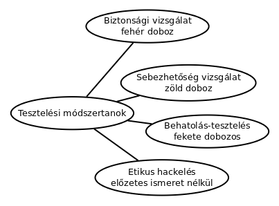
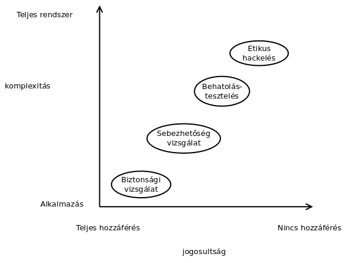

# A biztonság tesztelése

* **Szerző:** Sallai András
* Copyright (c) 2024, Sallai András
* Licenc: [CC Attribution-Share Alike 4.0 International](https://creativecommons.org/licenses/by-sa/4.0/)
* Web: [https://szit.hu](https://szit.hu)

## Tartalomjegyzék

* [Tartalomjegyzék](#tartalomjegyzék)
* [A biztonsági tesztelésről](#a-biztonsági-tesztelésről)
* [Tesztelési módszertanok](#tesztelési-módszertanok)
* [SQL Injection teszt](#sql-injection-teszt)
* [Lehetséges egyéb megoldások](#lehetséges-egyéb-megoldások)

## A biztonsági tesztelésről

A cél a szoftverek sérülékenységeinke feltárása, az érzékyen adatok megvédése.

## Tesztelési módszertanok

* biztonsági vizsgálat
* sebezhetőség vizsgálat
* behatolásteszt
* etikus hackelés





### Biztonsági vizsgálat

* Fehérdobozos teszt.
* Például: valóban kötelező a betűk és számok használata a jelszavaknál?

### Sebezhetőség vizsgálat

* Zöld dobozs teszt.
* Biztonsági rések mintáit keresi egy automatizált szoftver.
* Pl. Valamilyen bemenetre, érzékeny adatokat szolgáltat az alkalmazás.

### Behatolásteszt

* Fekete dobozos teszt.
* A tesztelőnek nincs jogosultsága.
* Nehezen automatizálható.
* Kétféle:
  * Blue teaming (a tesztelő ismeri az infrastruktúrát)
  * Red teaming (a tesztelő nem ismeri az infrastruktúrát)

### Etikus hackelés

* Előzetes ismeretek nélküli teszt.
* Akár pszichológiai manipulációval (social engineering).

## SQL Injection teszt

A Python requests könyvtárát fogjuk használni.

### PHP beléptető felület készítése

Egy egyszerű PHP beléptető felületet fogunk készíteni, amiben be és ki lehet kapcsolni a SQL Injection elleni védelmet:

#### Adatbázis

```sql
CREATE DATABASE test_db;

USE test_db;

CREATE TABLE users (
    id INT AUTO_INCREMENT PRIMARY KEY,
    username VARCHAR(50) NOT NULL UNIQUE,
    password VARCHAR(255) NOT NULL
);

INSERT INTO users (username, password) 
VALUES ('admin', PASSWORD('admin_password'));

INSERT INTO users (username, password) VALUES 
('user', PASSWORD('user_password'));

grant all 
on test_db.* 
to 'test_user'@'localhost' 
identified by 'test_password';
```

#### PHP kód

src/login.php:

```php
<?php
// Adatbázis kapcsolat adatai
$servername = "localhost";
$username = "test_user"; // az adatbázis felhasználóneve
$password = "test_password"; // az adatbázis jelszava
$dbname = "test_db";

// SQL injekció elleni védelem kapcsolója
define('USE_PREPARED_STATEMENTS', false);

// Kapcsolódás az adatbázishoz
$conn = new mysqli($servername, $username, $password, $dbname);

// Kapcsolat ellenőrzése
if ($conn->connect_error) {
    die("Kapcsolódási hiba: " . $conn->connect_error);
}

// Űrlap feldolgozása
if ($_SERVER["REQUEST_METHOD"] == "POST") {
    $input_username = $_POST['username'];
    $input_password = $_POST['password'];

    if (USE_PREPARED_STATEMENTS) {
        trigger_error("-------Védett----------");
        // SQL injekció ellen védett megoldás
        $stmt = $conn->prepare("SELECT * FROM users WHERE username = ? AND password = password(?)");
        $stmt->bind_param("ss", $input_username, $input_password);
        $stmt->execute();
        $result = $stmt->get_result();
        
    } else {
        // Nem védett megoldás (sebezhető SQL injekcióra)
        trigger_error("------Nem védett-----------");
        $sql = "SELECT * FROM users WHERE username = '$input_username' AND password = password('$input_password')";
        trigger_error($sql);
        $result = $conn->query($sql);
    }

    // Felhasználó ellenőrzése
    if ($result->num_rows > 0) {
        echo "Sikeres bejelentkezés!";
    } else {
        echo "Hibás felhasználónév vagy jelszó!";
    }
}
?>

<!DOCTYPE html>
<html lang="hu">
<head>
    <meta charset="UTF-8">
    <meta name="viewport" content="width=device-width, initial-scale=1.0">
    <title>Bejelentkezés</title>
</head>
<body>
    <h2>Bejelentkezés</h2>
    <form method="post">
        <label for="username">Felhasználónév:</label>
        <input type="text" name="username"><br><br>
        <label for="password">Jelszó:</label>
        <input type="password" name="password"><br><br>
        <input type="submit" value="Bejelentkezés">
    </form>
</body>
</html>
```

### Telepítés

```bash
pip install requests
```

### A tesztelés

Indítsuk el a fenti szervert.

```bash
php -S localhost:3000 -t src
```

Az src helyére a könyvtár neve, ahol van a login.php.

* localhost:3000/login.php

Egyszerű tesztkód:

```python
import requests

url = "http://localhost:3000/login.php"

payloads = [
    ("admin", "admin"),
    ("admin", "admin_password"),
    ("admin' -- ", ""),
    ("' OR '1'='1' or '1'='1", "")
]

for username, password in payloads:
  response = requests.post(
    url, 
    data={
        'username': username, 
        'password': password
        })

  # Ellenőrizzük a választ tartalmát:
  if "Sikeres bejelentkezés" in response.text:
    print(f"Sikeres támadás: {username} - {password}")
  elif "error" in response.text.lower():
    print(f"Hiba a támadás során: {username} - {password}")
  else:
    print(f"Nem működött   : {username} - {password}")

```

* [https://github.com/oktat/sql_injection_test.git](https://github.com/oktat/sql_injection_test.git)

### JavaFX beléptető felület

Töltsük le a következő projektet:

* [https://github.com/oktat/sql_injection_test_javafx.git](https://github.com/oktat/sql_injection_test_javafx.git)

Feladatok:

* Írjunk kéziteszt tervet SQL injekcióra.
* Végezük el a tesztelést.

## Lehetséges egyéb megoldások

Webes alkalmazások:

* [Wapiti](https://wapiti-scanner.github.io/)
* [dirb](https://www.kali.org/tools/dirb/)
* [ZAP -Zed Attack Proxy](https://www.zaproxy.org/)
* [Burp Suite](https://portswigger.net/burp/communitydownload)
* [Acunetix](https://www.acunetix.com/)

Mobil alkalmazások:

* [MobSF](https://github.com/MobSF/Mobile-Security-Framework-MobSF)
* [Qark](https://github.com/linkedin/qark)
* [Drozer](https://github.com/WithSecureLabs/drozer)

Asztali alkalmazásokhoz

* [SonaQube](https://www.sonarsource.com/products/sonarqube/)
* [Veracode](https://www.veracode.com/)
* [Checkmarx](https://checkmarx.com/)
