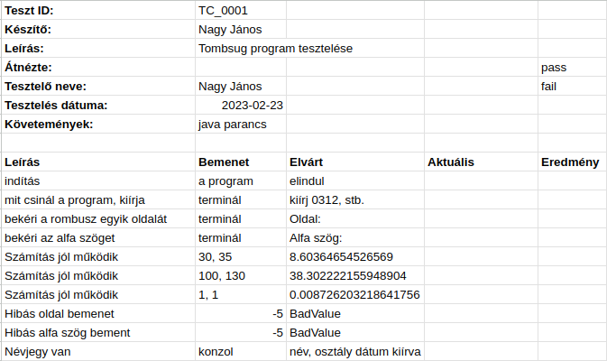
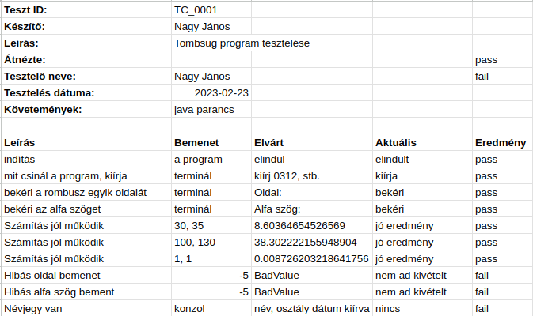

# Kézi tesztelés

* **Szerző:** Sallai András
* Copyright (c) 2023, Sallai András
* Licenc: [CC Attribution-Share Alike 4.0 International](https://creativecommons.org/licenses/by-sa/4.0/)
* Web: [https://szit.hu](https://szit.hu)

## A kézi tesztelésről

A kézi tesztelés az alkalmazás próbája egérrel, billentyűzettel, aminek az eredményét egy táblázatban rögzítjük.

### Táblázat

Tesztelésre kész:

Tesztelés után:

