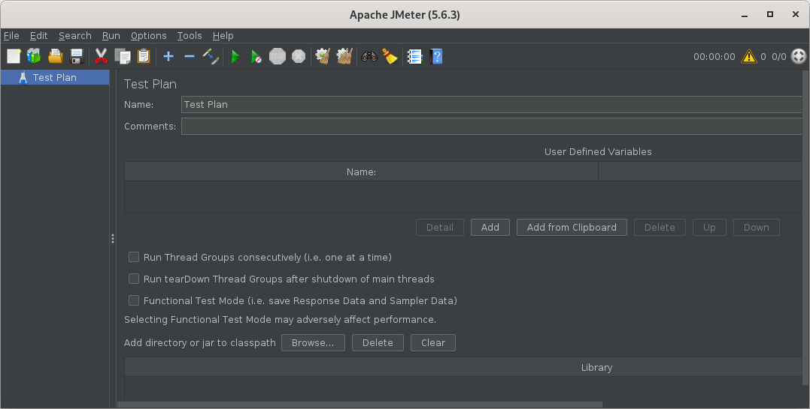
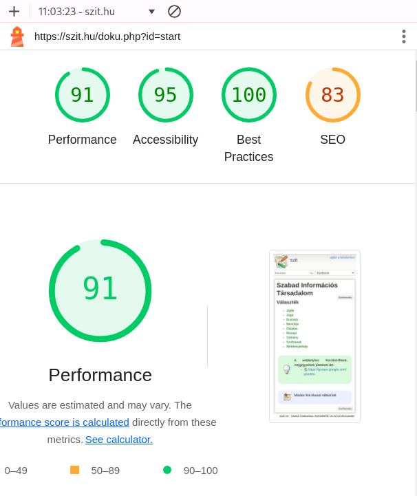

# Teljesítmény és terheléses tesztek

* **Szerző:** Sallai András
* Copyright (c) 2024, Sallai András
* Licenc: [CC Attribution-Share Alike 4.0 International](https://creativecommons.org/licenses/by-sa/4.0/)
* Web: [https://szit.hu](https://szit.hu)

## Tartalomjegyzék

* [Tartalomjegyzék](#tartalomjegyzék)
* [A terheléses tesztelésről](#a-terheléses-tesztelésről)
* [Terheléses tesztek szoftverei](#terheléses-tesztek-szoftverei)
* [Figyelmeztetés](#figyelmeztetés)
* [JMeter](#jmeter)
* [A Lighthouse](#a-lighthouse)
* [A PageSpeed Insights](#a-pagespeed-insights)

## A terheléses tesztelésről

A terheléses teszt során a renszerre vagy az alkalmazásra egy növekvő terhelést helyezünk, hogy megvizságljuk a viselekdését. Tesztelhetjük a hálózati terhelés, vagy a memóriafogyasztást,  vagy valamilyen konkrét célt. A teljesítménytesztek a **nem funkcionális** tesztekhez tartoznak.

Teljesítmény:

* megbízhatóság
* erőforrás-használat
* méretezhetőség

Terhelésvizsgálat:

* többfelhasználós rendszereknél relevánsabb
* gyakran automatizált
* nagy dokumentum
* sok adat

Azt vizsgáljuk, mi az a mennyiség, amit a rendszer összeomlás nélkül tud még kezelni.

## Terheléses tesztek szoftverei

* Apache JMeter
* k6
* Locust
* Gatling
* Leghthouse
* [WebPageTest](https://www.webpagetest.org/)
* Artillery
* BlazeMeter
* Siege
* LoadRunner
* JProfiler - Asztali alkalmazásokhoz

## Figyelmeztetés

Terheléses tesztnek csak a saját gépeinket, szerverinket tegyük ki! Mások gépeinek terhelése, bűncselekmény és feljelentést vonhat maga után.

## JMeter

A JMeter-ben teszterveket hozunk létre, azon belül szálcsoportokat (Thread Group). A szálcsoportok a minden tesztnek a kezdőpontjai.

### A JMeter beszerzése

Telepíthetjük csomagkezelővel:

```bash
choco install jmeter
```

Letölthetjük a legújabb binárist:

* apache-jmeter-x.y.z.zip

Bontsuk ki a becsomagolt fájlt, majd a bin könyvtárba keressük meg az indítóscripteket:

* jmeter.bat
* jmeter.sh

Windowson a jmeter.bat segítségével indítjuk.

### Szálak

Beállíthatjuk a szálak számát, és a lefutási időt.

* Number of Threads (users): 10
* Ramp-up period (second): 100

Ha szálak száma 10, a lefutási idő 100, akkor 10 másodpercentként indul egy szál.

### Vezérlők

Kétféle vezérlő van:

* Mintavevő
* Logikai

A mintavevő azt mondja a JMeter-nek, hogy küldjön kéréseket a szervernek, és várja a választ.

A logikai vezérlővel testreszabható, hogy a JMeter mikor küldjön kérést.

### Mintavevő vezérlő

A következő mintavevők állnak rendelkezésre.

* FTP kérés
* HTTP-kérés
* JDBC-kérés
* Java objektum kérés
* JMS kérés
* Junit teszt kérés
* LDAP teszt kérés
* E-mail kérés
* OS Process request
* TCP kérés

Minden mintavevőnek számtalan tulajdonsága van, de felvehetünk hozzá konfigurációs elemet is.

Ebben a leírásban a HTTP kérést fogjuk használni.

### Figyelők

A figyelők hozzáférést biztosítanak a tesztesetekről összegyűjtött információkhoz. Például:

* View Results Tree

### JMeter teszt gyakorlat

#### Tesztelendő szerver összeállítása

```bash
mkdir api
cd api
sin api
pnpm i
pnpm start
```

#### Első teszttervünk

A JMeter előre összeállított sablonját fogjuk használni.

Indítsuk el a JMeter-t. A File menüből válasszuk a "Templates..." lehetőséget.

* jmeter.bat
* File > Templates...
* Felül a legördülő listadobozból:
  * Simple HTTP request
* Válasszuk a [ Create ] gombot.
* Négy környezeti változót fogunk beállítani:
  * method: POST
  * body { "name": "Tibor", "city":"Pécs", "salary": 395 }
  * contentType: application/json
  * url: [http://localhost:8000/employees](http://localhost:8000/employees)
* Válasszuk újra a [ Create ] gombot
* Mentsük el a teszttervet.
* Futtassuk

A futtatáshoz találunk az eszköztáron egy lejátszógombot.



## A Lighthouse

A Google által fejlesztett eszköz, ami teljesítmény, SEO, hozzáférhetőségi és más szempontok alapján készít tesztet.

### A Lighthouse beszerzése

A Lighthouse Chrome bővítményként érhető el. Képes jelentéseket generálni. Több Lighthouse nevű bővímény is van. Nekünk arra van szükségünk, aminek a kiadó szervezete:

* developers.google.com/web

### A Lighthouse használata

* Nyissuk meg F12-vel a fejlesztői eszközt.
* Válasszuk a **Lighthhouse** fület
* Kattintsunk: (Analyze page load)



## A PageSpeed Insights

A PageSpeed Insights a weboldalak tesztelésére szánt alkalmazás:

* [https://pagespeed.web.dev/](https://pagespeed.web.dev/)

Az alkalmazás a következőket vizsgálja:

* elérés sebessége
* kisegítési lehetőségek
* bevált módszerek használata
* keresőoptimalizálás
