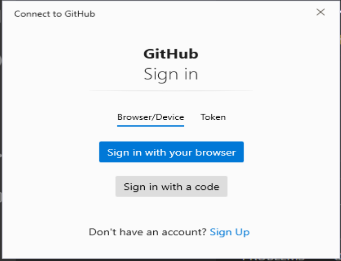
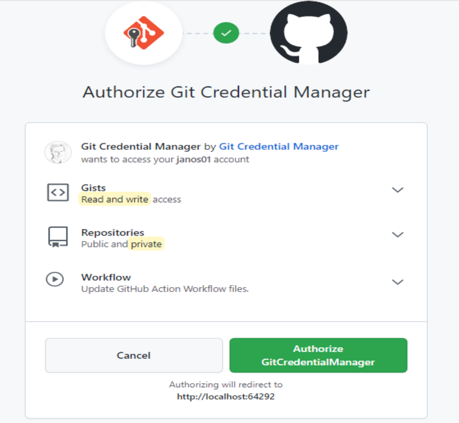
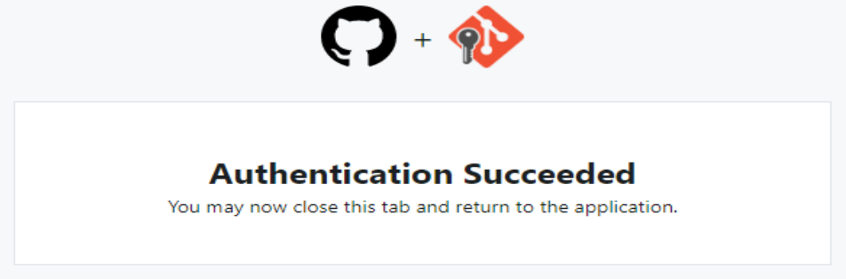
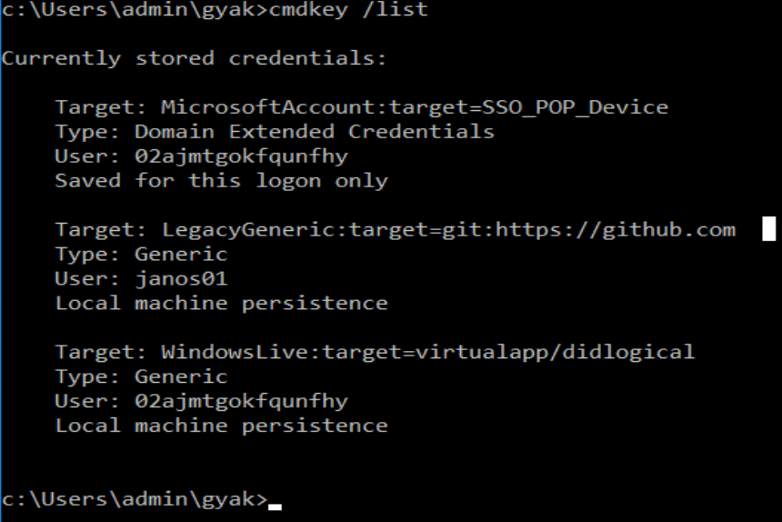
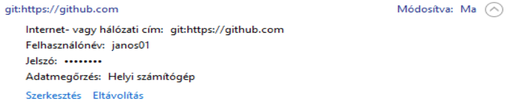

# Webprogramozás - Előkészítés

* **Szerző:** Sallai András
* Copyright (c) Sallai András, 2022
* Licenc: [CC Attribution-Share Alike 4.0 International](https://creativecommons.org/licenses/by-sa/4.0/)
* Web: [https://szit.hu](https://szit.hu)

## Chocolatey

Telepítse a Chocolatey csomagkezelőt. Továbbiakban ezt a csomagkezelőt használjuk.

A csomagkezelő weboldala:
[https://chocolatey.org/](https://chocolatey.org/)

Bővebb leírása:
[https://szit.hu/doku.php?id=oktatas:operacios_rendszerek:windows:csomagkezeles#chocolatey](https://szit.hu/doku.php?id=oktatas:operacios_rendszerek:windows:csomagkezeles#chocolatey)

A Chocolatey weboldalán található egy hosszú **Power Shell** paranancs, amivel telepíthető a program. Indítsunk egy PowerShell-t **rendszergazdaként**, így kiadva a parancsot.

A script másolata:

```PowerShell
Set-ExecutionPolicy Bypass -Scope Process -Force; [System.Net.ServicePointManager]::SecurityProtocol = [System.Net.ServicePointManager]::SecurityProtocol -bor 3072; iex ((New-Object System.Net.WebClient).DownloadString('https://community.chocolatey.org/install.ps1'))
```

Telepítés után kapunk egy choco nevű parancsot. Teszteljük:

```cmd
choco --version
```

Telepítés általánosan:

```cmd
choco install <csomagnév>
```

A telepítés során még rákérdez, hogy biztosan szeretnénk telepíteni a csomagot. Ekkor az összes ilyen kérdés elfogadása az "a" beírásával, majd egy "Enter" nyugtázással lehetséges. Ha telepítő parancsnak adunk egy -y kapcsolót, a kérdés elmarad és azonnal telepíti a megadott fájlt a Chocolatey.

```cmd
choco install <csomagnév> -y
```

Gyorskezdés:

```cmd
choco install nodejs -y
choco install vscode git  -y
choco install totalcommander -y
choco install googlechrome -y
choco install geany -y
choco install yarn -y
choco install insomnia-rest-api-client -y
```

A második sorban láthatjuk, hogy egyszerre több csomag is megadható, a példában a vscode és a git csomag is telepítésre kerül.

## Szükséges szoftverek

Parancssorban a következő paranancsokra van szükség (CLI):

* node
  * Chocolatey csomag: nodejs
  * Webhely: [https://nodejs.org/](https://nodejs.org/)
* npm
  * A NodeJS része
  * Chocolatey csomag: nodejs
  * Webhely: [https://nodejs.org/](https://nodejs.org/)
* git
  * Chocolatey: git
  * Webhely: [https://git-scm.com/](https://git-scm.com/)
* yarn
  * Chocolatey csomag: yarn
  * NPM csomag: yarn
  * Webhely: [https://yarnpkg.com/](https://yarnpkg.com/)

Szükséges GUI program:

* Total Commander
  * Chocolatey csomag: totalcommander
  * Webhely: [https://www.ghisler.com/](https://www.ghisler.com/)
* Visusal Studio Code
  * Chocolatey csomag: vscode
  * Webhely: [https://code.visualstudio.com/](https://code.visualstudio.com/)
* Geany
  * Chocolatey csomag: geany
  * Webhely: [https://www.geany.org/](https://www.geany.org/)
* Insomnia
  * Chocolatey csomag: insomnia-rest-api-client
  * Webhely: [https://insomnia.rest/](https://insomnia.rest/)

## NodeJS

A NodeJS egy JavaScript futtató környezet.

Telepítse a NodeJS rendszert. Letölthető a weboldalról is:

* [https://nodejs.org/](https://nodejs.org/)

Vagy használjuk a choco parancsot:

```cmd
choco install nodejs
```

Telepítés után lenni kell egy node, egy npm és egy npx parancsnak. Ellenőrizzük:

```cmd
node --version
npm --version
npx --version
```

Bővebben:

* [https://szit.hu/doku.php?id=oktatas:web:nodejs:telepites](https://szit.hu/doku.php?id=oktatas:web:nodejs:telepites)

## NodeJS projekt

Az alábbiakban elkészítünk egy NodeJS projektet, a jövőben mindig ilyen projektekkel fogunk dolgozni. Ilyen projekt az npm és a yarn paranccsal is létrehozható.

A tervek szerint a következő könyvtárszerkezetet hozzuk létre:

```txt
app01/
  |-node_modules/
  |-index.html
  |-package.json
  `-package-lock.json
```

Ebből nekünk, csak az index.html fájlt kell létrehozni, a
többit valamilyen parancs hozza létre.

Az **npm** és a **yarn** parancs a függőségeket a **node_modules/** könyvtárba tölti le. A **packages.json** fájlba íródik, be minden telepített csomag, amiről úgy beszélünk, hogy függőség, mivel ezt használtuk a munkánk során. Ha más használni akarja a projektünket, akkor megkapja az index.html és a package.json fájlt. Egy yarn vagy egy npm paranccsal telepíteni tudja ugyanazokat az csomagokat, amiket mi is használtunk.
A **package-lock.json** fájlban az npm parancs írja le, milyen csomagokat tettünk fel és szedtünk le, ezt általában nem nézegetjük.

Elkészítjük az első NodeJS alapú projektünket. A projekt könyvtárát most nekünk kell létrehozni. Legyen a neve app01. Ha elkészült lépjünk be a
könyvtárba.

```cmd
mkdir app01
cd app01
```

Csináljunk NodeJS projektet a könyvtárunkból:

```cmd
npm init -y
```

Kapunk egy package.json fájlt. Tartalma:

```json
{
  "name": "p0",
  "version": "1.0.0",
  "description": "",
  "main": "index.js",
  "scripts": {
    "test": "echo \"Error: no test specified\" && exit 1"
  },
  "keywords": [],
  "author": "",
  "license": "ISC"
}
```

A yarn parancs kevesebb tartalmat ír a fájlba:

```json
{
  "name": "app02",
  "version": "1.0.0",
  "main": "index.js",
  "license": "MIT"
}
```

A package.json fájl akár kézzel is elkészíthető, illetve szerkeszthető. Ha a "yarn init" vagy az "npm init" parancsot használjuk, ügyeljünk arra, hogy ne legyen **node_moduels** könyvtár.

A lite-server nevű csomagot fogjuk használni a fejlesztés során, webszervernek.

Telepítsük a lite-server nevű csomagot:

```cmd
npm install lite-server --save-dev
```

Ha van yarn parancsunk, a telepítés azzal is megoldható:

```cmd
yarn add lite-server --dev
```

A csomag telepszik a node_modules könyvtárba, sok függőségével együtt. Nézzünk bele a package.json fájlba, ahol láthatjuk, hogy bejegyzésre került.

A projekt könyvtárában készítsünk egy index.html fájlt. Indítsuk el a lite-servert:

```cmd
npx lite-server
```

Ügyeljünk arra, hogy a parancsot a projekt gyökérkönyvtárában indítsuk, és ott legyen az index.html állomány is.

A lite-server ilyen formán a projektünk része. A lite-server telepíthető globálisan is:

```cmd
npm install --global lite-server
```

Ebben az esetben, minden későbbi projektnek rendelkezésre áll. Indítás:

```cmd
lite-server
```

A **package-json** fájlba, bejegyezhetünk feladatokat, vagy más néven scripteket. Ezzel rövidíthetünk az indításon. Ha az npm paranccsal hoztuk létre a package.json fájlt, akkor lesz benne egy script "test" néven.

Írjunk egy feladatot (scriptet) **start** néven:

```json
  "scripts": {
    "test": "echo \"Error: no test specified\" && exit 1",
    "start": "lite-server"
  },
```

Vegyük észre a "test" sor végén a vesszőt. Mentsük el.

Most már, nekifoghatunk a projekt részét tartalmazó weboldal elkészítéséhez is.

Készítsünk egy weboldalt **index.html** néven, ha még nem létezik. Tartalma:

```html
<!DOCTYPE html>
<html lang="hu">
<head>
    <meta charset="UTF-8">
    <meta name="viewport"
    content="width=device-width, initial-scale=1.0">
    <title>Document</title>
</head>
<body>
    <h1>Valami</h1>
</body>
</html>
```

A projekt indításhoz, most használjuk a megírt scriptet.
Visual Studio Code terminálablakában, vagy parancssorban, a projekt gyökérkönyvtárában:

```cmd
npm start
```

Ha van yarn parancsunk, így is indíthatjuk:

```cmd
yarn start
```

A weboldal megnyílik az alapértelmezett böngészőben.

Végezzünk néhány javítást a weboldalon. Vegyünk fel, például egy "p" elemet, írjuk bele "Lorem ipsum dolor est amet" szöveget, mentsük és figyeljük a böngészőt.

A továbbikaban így fogunk weboldalakat készíteni.

## Git használata

### Bemutatkozás

Használat előtt, először mutatkozzunk be a git számára. Adjuk meg a teljes nevünket és az e-mail címünket. Ezt kétféle módon tehetjük meg:

* lokálisan, csak az adott projekt számára
* globálisan a felhasználói profilba (~/.gitconfig)

Ha csak a projekt számára mutatkozunk be, akkor minden új projektben meg kell ezt tennünk. Ha globálisan mutatkozunk be, osztott használatnál - amikor végeztünk - érdemes törölnünk a nevünket és az e-mail címünket.

A bemutatkozás, vagyis a név és e-mail cím beállítása:

```bash
git config --global user.name "Nagy János"
git config --global user.email "nagyj@zold.lan"
```

Osztott használat esetén adatink törlése:

```bash
git config --global --unset user.name
git config --global --unset user.email
```

### Bemutatkozás csak a projekt számára

Osztott használat esetén ez az ajánlott módszer.

A projekt könyvtárát fel kell készíteni a Git számára.

```bash
git init
```

Lokálisan, csak a projekt számára addig nem tudunk bemutatkozni, amíg nem hoztunk létre Git tárolót. Ezek után jöhet a bemutatkozás:

```bash
git config --local user.name "Nagy János"
git config --local user.email "nagyj@zold.lan"
```

Ha nem adunk meg kapcsolót, az alapértelmezés a --local, ezért használhatjuk így is:

```bash
git config user.name "Nagy János"
git config user.email "nagyj@zold.lan"
```

### A Git használata

Legyen egy app01 nevű projekt. Létrehozzuk a projekt könyvtárat, majd belépünk:

```cmd
mkdir app01
cd app01
```

Adjunk a projekthez git tárolót:

```cmd
git init
```

Keressük meg a projekt gyökérkönyvtárában a **.git** könyvtárat. Ez lesz a git tároló. Visual Studio Code alatt ez nem látszik, mivel **rejtett könyvtár**. Nézzük meg fájlkezelővel. Fájlkezelőben is csak akkor látszik, ha a rejtett fájlok láthatósága be van kapcsolva.

Hozzunk létre egy index.html fájlt, amit szeretnénk verziókövetni. Tegyük fel, hogy a projekt NodeJS projekt is egyben, vagyis van node_modules könyvtár is. Ennek a könyvtárnak a tartalmát sosem szeretnénk verziókövetni, ezért bele kell írni a **.gitignore** nevű fájlba. A .gitignore nevű fájlba azoknak a fájloknak és könyvtáraknak a nevét tesszük, amelyeket **nem szeretnénk verziókövetni**. Készítsük el a saját **.gitignore** nevű állományunkat, majd írjuk bele a **node_modules** könyvtár nevét.

```txt
node_modules/
```

Ellenőrizzük, hogy valóban ki van zárva a könyvtár:

```bash
git status -u
```

Ha nem látjuk a kimenetben  a node_modules könyvtárat, mehet verziókövetendő fájlok hozzáadása:

```bash
git add .
```

A pont hatására minden az aktuális könyvtárban lévő fájl verziókövetésre lesz jelölve. Vigyázzunk ezzel a paranccsal! Ha nincs megadva a **node_modules** könyvtár a **.gitignore** fájlban, vagy rosszul van megadva, a pont hatására az egész könyvtár tartalma tárolásra kerül feleslegesen. Ezért azt szokták ajánlani, hogy egyenként adjuk meg a követendő fájlokat a (.) pont használata helyett, a következő módon:

```bash
git add .gitignore
git add index.html
git add package.json
```

Így biztonságos, csak azok a fájlok lesznek követve, amiket megadtunk.

A tényleges tárolás a "git commit" paranccsal történik, ahol leírjuk milyen változásokat valósítottunk meg a projektben.

```bash
git commit -m "Kezdés"
```

A -m kapcsoló nélkül egy szövegszerkesztő nyílna meg, ahova beírhatjuk a commit szövegét. A -m kapcsoló után megadhatjuk ezt a szöveget. A -m kapcsoló nélkül csak akkor indítsuk "git commit" parancsot, ha van tapasztalatunk a **vi szövegszerkesztővel**, vagy beállítottunk más szövegszerkesztőt.

Az idézőjelben írjuk le, milyen változtatásokat végeztünk a projektünkben. Kezdésnek lehet "Init" vagy "Kezdés".

Használjuk a tájékozódáshoz a "git status" és a "git log" parancsot:

```bash
git status
```

Tárolt állapotok megtekintése:

```bash
git log
```

Ha a "git log" parancsnak egy képernyőnél hosszabb a kimenete, egy lapozó program indul el. Ebből a **Q** billentyű lenyomásával léphetünk ki.

Változtassunk valamit az index.html oldalon, majd nézzük meg újra a státuszt. Változtatások után, használjuk mindig a -u kapcsolót:

```bash
git status -u
```

Nézzük meg a létrehozott commitok naplóját:

```bash
git log
```

Használhatunk GUI felületet is a napló megtekintéséhez:

```bash
gitk
```

### GUI felületek

A gitk program megmutatja a tárolt változatok bejegyzéseit. Indítás:

```cmd
gitk
```

Indítsa el a programot egy projektben, és elemezze.

A git gui paranccsal egy GUI program indítható, amivel elvégezhetők a git műveletek. Indítás:

```cmd
git gui
```

Indítsa el a programot egy projektben, végezzen változtatásokat, az add és commit parancs helyett, használja a "git gui" parancsot gyakorlásként.

### Feltöltés GitHubra

A GitHub egy git szerver. Szabadon elérhető git szerver több is van az Interneten, és helyben magunk is készíthetünk egyet. Itt most a GitHub szerver webes felületét fogjuk használni.

A GitHub webes felületén létre kell hozni egy tárolót.

Másoljuk a tárolóban megjelenő "git remote" parancsot, majd hajtsuk végre a projekten belül. Például:

```bash
git remote add origin https://github.com/valaki/app01.git
```

Ezzel megmondtuk, hova fogunk feltölteni. Most jöhet a feltöltés:

```bash
git push origin master
```

Az első feltöltés során, ha azt Visual Studio Code-ban végezzük, az lehetőséget ad számunkra, hogy böngészőből azonosítsuk magunkat a github.com webhelyen. A következő képernyők jelennek meg:



Ha a "Sign in with your browser" lehetőséget választottuk, a következő képernyő jelenik meg:



Sikeres azonosítást a következő képernyő jelzi.



Térjünk vissza a Visual Studio Code-ba.

A git verziókövető rendszerről komplett tananyag:

* [https://szit.hu/doku.php?id=oktatas:programozas:verziokontroll:git](https://szit.hu/doku.php?id=oktatas:programozas:verziokontroll:git)

## Osztott használat

### Git bemutatkozás

```bash
git config --global user.name "Nagy János"
git config --global user.email "nagyj@zold.lan"
```

Osztott használat esetén, ha végeztünk a gép kikapcsolása előtt, ne felejtsük el adataink törlését:

```bash
git config --global --unset user.name
git config --global --unset user.email
```

### Windows kulcsok kezelése

#### Hitelesítő adatok parancssorból

A Visual Studo Code git push parancs hatására, a hitelesítéskezelőben bejegyzi a hitelesítő adatokat. Ez segítség lehet, ha újból használjuk a parancsot, nem kell folyton azonosítani magunkat. Osztott használat esetén, viszont ki kell jelentkeznünk, ha befejeztük a munkát.

Nézzük meg milyen hitelesítő kulcsok vannak:

```cmd
cmdkey /list
```



Keressük a kimenetben olyan sort, ahol github.com szerepel. Általában ilyen sort találunk:

```cmd
Target: LegacyGeneric:target=git:https://github.com
```

A terget= utáni részre van szükségünk. Esetünkben ez:

```txt
git:https://github.com
```

Tegyük a /delete kapcsoló után:

```cmd
cmdkey /delete git:https://github.com
```

A kiléptetés megtörtént.

#### GUI hitelesítő adatok

A törlés elvégezhető GUI felületen is. Ebben az esetben a következőt kell keresni:

* Windows rendszerbeli hitelesítő adatok

Itt is keressünk olyat, hogy github.com.
Kattintás után lesz "Eltávolítás" link.



#### Batch fájlok

A következő helyről letölthető néhány Batch fájl, ami segíti az osztott használatot:

* [https://github.com/oktat/githandler](https://github.com/oktat/githandler)

## Gyakorlás

### Gyakorló kérdések

1.)
Mire használható a Chocolatey?

* Fájlkezelő program
* Csomagkezelő program
* Szövegszerkesztő program
* Verziókezelő program

2.)
Adott a következő parancs: choco install yarn -y
Mit csinál a -y kapcsoló?

* Távoli letöltésre utasít
* Erőltetett letöltés
* Letiltja a számlálást.
* A kérdésekre automatikusan igen a válasz.

3.)
Mire való yarn parancs?

* Csomag és projekt kezelő
* Verziókezelés
* Könyvtárak kezelése fájlrendszeren
* Ez egy programozási nyelv

4.)
Mire való az npm parancs?

* Csomag és projekt kezelő
* Terelő program
* Verziókövető program
* Kivételkezelő program

5.)
Mire jó a git parancs?

* Csomagkezelés
* Könyvtárkezelő parancs
* Kézikönyvek megjelenítése
* Verziók követése

6.)
Mi a Total Commander? Válasszon.

* Kódszerkesztő
* Fejlesztői környezet
* Fájlkezelő
* Grafikai program

7.)
Milyen rendszer része az npm parancs.

* Angular
* NodeJS
* Insomnia
* Chocolatey

8.)
Mire való az Insomnia?

* Csomagkezelés
* REST API kliens
* Verziókezelés
* Fájlkezelés

9.)
Mire való a Geany?

* Kódszerkesztő
* Verziókezelő
* REST API kliens
* Csomagkezelő

10.)
Mire való az npx parancs?

* Verziók meghatározása
* A projektben telepített parancsok futtatása
* Globálisan telepített parancsok futtatása
* Könyvtárak létrehozása

11.)
Van egy NodeJS programunk pr.js néven. Hogyan tudjuk futtatni?

* node pr.js
* git pr.js
* rest pr.js
* npm pr.js

12.)
A NodeJS projekt függőségei milyen fájlban vannak leírva?

* dependencies.json
* index.json
* bs-config.json
* package.json

13.)
A projektbe telepített függőségek milyen könyvtárba töltődnek le?

* packages
* mods
* node_modules
* nodes

14.)
Mire jó a package-lock.json fájl?

* A futtatható feladatokat ide írjuk
* Az npm műveletek ide kerülnek
* A szerzők nevei kerülnek ide
* Az adatbázis elérése ide kerül

15.)
Mire való a package.json fájlban a scripts tulajdonság?

* Feladatok írása
* Függőségek leírása
* Verzió leírása
* A projekt neve

16.)
Mit csinál a --save-dev kapcsoló npm parancs estén?

* A függőség nem kötelező
* A függőséget fejlesztési időhöz köti
* A függőség feltöltésre kerül
* A függőség ideiglenes

17.)
Milyen licenc a ISC?

* nyílt forráskódú
* nincs ilyen nevezetes licenc
* zárt forráskódú
* adott napig használható ingyen

18.)
A yarn parancs milyen kapcsolóval jelöli a fejlesztési időben használt függőségeket?

* --dev
* --save-dev
* --save
* --devel

19.)
A yarn paranccsal hogyan telepíthető a bootstrap függőség?

* yarn install bootstrap
* yarn add bootstrap
* yarn dep bootstrap
* yarn in bootstrap

20.)
Milyen parancsablakba kell bemásolni a Chocolatey telepítő parancsát?

* bash
* powershell
* cmd
* zsh

21.)
Melyik parancssorhoz szükséges rendszergazdai jog:

* npm install yarn
* choco install yarn
* yarn add bootstrap
* dir

22.)
Milyen néven telepíthető Chocolatey csomagból a NodeJS?

* node
* nodejs
* node_javascript
* javascript

23.)
Milyen paranccsal kell beállítani a Git felhasználó nevét?

* git config user.name
* git user.name
* git name
* git config name

24.)
Milyen paranccsal kell beállítani a Git felhasználó emailcímét?

* email
* git config user.email
* git config email
* git email

25.)
Melyik kapcsolóval lehet megszüntetni a git config parancs után egy változó értékét?

* --notset
* --unset
* --clear
* --break

27.)
Hogyan lehet NodeJS projektet kezdeni?

* npm init -y
* git init -y
* choco init -y
* yarn add -y

28.)
Hogyan készítjük elő verziókezelését egy projektben?

* npm init -y
* git init
* mvn init
* git start

29.)
Mi annak a könyvtárnak a neve, amiben tárolásra kerülnek
a git verziókövetéssel tárolt pillanatképek?

* .git_repository
* .gitrepo
* .git
* .repository

30.)
Hogyan lehet a tarka.html fájlt stage állapotba tenni git verziókövetővel?

* add tarka.html
* npm add tarka.html
* git add tarka.html
* git commit tarka.html

31.)
Hogyan lehet git tároló állapotát lekérdezni?

* git face
* git commit
* git add
* git status

32.)
Hogyan tekinthetjük meg a tárolt változatok bejegyzéseit?

* git log
* git add
* npm commit
* git commit

33.)
Milyen paranccsal indítható a program, amivel megtekinthetők a tárolt változatok bejegyzései.

* git stat
* gitk
* git init
* git show

34.)
Ha távoli tárolóra akarunk git-tel feltölteni, hogyan adjuk meg a feltöltés url-jét?

* git push origin master
* git remote add origin <https://github.com/valaki/valami.git>
* git remote <https://github.com/valaki/valami.git>
* git add <https://github.com/valaki/valami.git>

35.)
Mire való a git gui parancs?

* Ilyen parancs nincs
* Grafikus felületen kezelhető a git tároló
* Grafikus felület létrehozása a projektben
* Csak grafikus felületű projekt rész követése

### Gyakorlatok

#### Gyakorlat 01

Feladatok:

* Készítsen egy projektet amiben egy weblapot készít.
* Bekezdésenként egy gyümölcs nevét írja a weblapra.
* Készítsen pillanatképet (commit), írja le mit adott hozzá.
* Készítsen újabb bekezdést, rakjon bele újabb gyümölcs nevet.
* Készítsen pillanatképet (commit), írja le mit adott hozzá.
* Ismételje még kétszer a bekezdések hozzáadását, újabb gyümölcsökkel.
* Legyen legalább 4 pillanatkép (commit) mentve.
