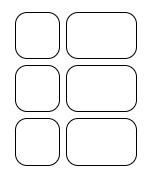
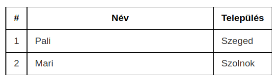
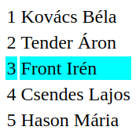
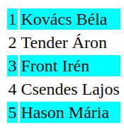
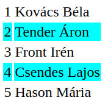

# Webprogramozás - CSS

* **Szerző:** Sallai András
* Copyright (c) Sallai András, 2022, 2023
* Licenc: [CC Attribution-Share Alike 4.0 International](https://creativecommons.org/licenses/by-sa/4.0/)
* Web: [https://szit.hu](https://szit.hu)

## Stíluslapok eredete

Stíluslap származhat szerzőtől, felhasználótól és böngészőtől:

* Szerzői - Webmester írja
* Felhasználói - A böngészőben beállítható saját CSS
* Kliens - böngészőnek is van saját stílusa

A stíluslapok ettől is lépcsőzetesek.

### A stílusok sorrendje

A stílusmeghatározásoknál fontosnak jelölhetünk egy-egy beállított tulajdonságot:

```css
.valami {
  background-color: blue !important;
}
```

Ez felülbírálhatja a mástól származó beállításokat.

De lássuk hogyan jár el a böngésző, milyen sorrendet állít fel ha több stílusmeghatározással találkozik:

I. Megkeresi az egyező deklarációkat és alkalmazza.

II. Második szinten a böngésző sorrendet állít fel fontosság és az eredet alapján:

1. böngésző stílus
2. a felhasználó normál stílusai
3. a fejlesztő normál stílusai
4. a fejlesztő fontos stílusai
5. a felhasználó fontos stílusai

III. A szelektorok specifikussága a következő szint.

```css
p.egy { background-color: blue; }
p { background-color: red; }
```

A kék szín érvényesül, mivel az osztály meadása specifikusabb.

IV. A sorrend az utolsó szint. Ami később van megadva, annak nagyobb a súlyozása.

## CSS - táblázatok

```css
.table_001 {
   border: 1px solid black;
   border-collapse: collapse;
}
.table_001 tr td {
   border: 1px solid black;
   padding: 10px;
}
```

A collapse hatására a táblázat cellái között megszűnik az üres hely.

Legyen egy táblázat:

```html
<table>
  <tr>
     <th>#</th>
     <th>Név</th>
  </tr>
  <tr>
     <td>1</td>
     <td>Pali</td>
  </tr>
  <tr>
     <td>2</td>
     <td>Mari</td>
  </tr>
</table>
```

Adjuk hozzá a következő CSS-t:

```css
.table {
  border: 1px solid white;
}
.table th, .table td{
  border: 1px solid white;
  background-color: navy;
  color: white;
}
```

Az eredmény a következő ábrán látható.


### Lekerekített táblaszegélyek

Ha táblázat celláinak szegélyét megjelenítjük, azok akár lekerekítve is megjelenhetnek.

```html
<table class="table">
  <tr>
     <th>#</th>
     <th>Név</th>
  </tr>
  <tr>
     <td>1</td>
     <td>Pali</td>
  </tr>
  <tr>
     <td>2</td>
     <td>Mari</td>
  </tr>
</table>
```

```css
.table {
  border-collapse: separate;
  border-spacing: 5px;
}
.table th, .table td{
  border: 1px solid black;
  background-color: nav;
  color: white;
  border-radius: 10px;
}
```

Az eredmény a következő ábrán:



### Táblázat méretezése

A táblázatok a tartalomhoz igazítják a méreteiket. A szélesség beállításával felülbírálhatjuk ezt a viselkedését.

```html
<table class="table">
  <tr>
     <th>#</th>
     <th style="width:70%">Név</th>
     <th>Település</th>
  </tr>
  <tr>
     <td>1</td>
     <td>Pali</td>
     <td>Szeged</td>
  </tr>
  <tr>
     <td>2</td>
     <td>Mari</td>
     <td>Szolnok</td>
  </tr>
</table>
```

```css
.table {
  border-collapse: collapse;
  width: 100%;
}
.table th, .table td{
  border: 1px solid black;

}
```



## nth-child

A nth-child ál-osztály lehetővé teszi ismétlődő elemek esetén adott számú elem külön formázását.

```html
<table>
  <tr>
    <td>1</td>
    <td>Kovács Béla</td>
  </tr>
  <tr>
    <td>2</td>
    <td>Tender Áron</td>
  </tr>
  <tr>
    <td>3</td>
    <td>Front Irén</td>
  </tr>
  <tr>
    <td>4</td>
    <td>Csendes Lajos</td>
  </tr>
  <tr>
    <td>5</td>
    <td>Hason Mária</td>
  </tr>
</table>
```

```css
tr:nth-child(3) {
    background-color: aqua;
}
```



Megadható paraméterek:

* tr:nth-child(odd) vagy tr:nth-child(2n+1)
* tr:nth-child(even) vagy tr:nth-child(2n)
* nth-child(7)
* nth-child(5n) - 5, 10, 15, stb.

```css
tr:nth-child(odd) {
    background-color: aqua;
}
```



```css
tr:nth-child(even) {
    background-color: aqua;
}
```



Több információ az nth-child alosztályról:

* [https://szit.hu/doku.php?id=oktatas:web:css:css_szelektorok#az_nth-child_al-osztaly](https://szit.hu/doku.php?id=oktatas:web:css:css_szelektorok#az_nth-child_al-osztaly)

### nth-child gyakorlat

1.) Készítsen egy 8 sorból 3 oszlopból álló táblázatot. A páros sorokat háttérszínét állítsa lightgray színre.

2.) Készítsen listát 10 elemmel. Minden harmadik elem számára állítson be piros szövegszínt.

3.) Készítsünk 20 darab div elemet, mindegyikben egy rövid mondattal. Állítsa be, hogy minden ötödik elem legyen formázva félkövér szöveggel, kezdve a másodiktól.

4.) Készítsen egy 8 elemből álló listát. Minden páratlan sorszámú gyermekelemet formázzon az ul listán blül aláhúzott szöveggel.

5.) Készítsen 16 darab p elemet rövid mondatokkal. Minden második és harmadik elemre állítson be dőlt szöveget.

## media query

```css
/* A szöveg alapértelmezett színe */
body {
  background-color: blue;
}
 
/* 900px vagy kisebb kijelző esetén */
@media screen and (max-width: 900px) {
  body {
    background-color: green;
  }
}
 
/* Képernyőn és 700px vagy annál kisebb kijelzőn */
@media screen and (max-width: 700px) {
  body {
    background-color: yellow;
  }
}
```

## Színek

A színek az RGB színtér használatával vagy nevekkel adhatók meg.

Szín névvel:

```css
p {
    background-color: olive;
}
```

Szín RGB kóddal, hexadecimálisan:

```css
p {
    background-color: #808000;
}
```

Szín RGB kóddal, decimálisan:

```css
p {
    background-color: rgb(128, 128, 0);
}
```

Szín átlátszatlansága:

```css
p {
    background-color: rgba(128, 128, 0, 1);
}
```

Rövidítés:

```css
p {
    background-color: #333;
}
```

Egyenértékű ezzel:

```css
p {
    background-color: #333333;
}
```

## Átlátszatlanság

Beállítás egy doboz számára:

```css
.doboz {
    opacity: 0.6;
}
```

Beállítás a doboz háttérszínének:

```css
.doboz {
   background-color:rgba(255, 0, 0, 0.3);
} 
```

Több információ:

* [https://szit.hu/doku.php?id=oktatas:web:css:css_nyelv#atlatszatlansag](https://szit.hu/doku.php?id=oktatas:web:css:css_nyelv#atlatszatlansag)

## Színátmenet

```css
.doboz {
  background-image: linear-gradient(navy, blue);
}
```

A színátmenetekről bővebben:

* [https://szit.hu/doku.php?id=oktatas:web:css:css3#szinatmenet](https://szit.hu/doku.php?id=oktatas:web:css:css3#szinatmenet)

## Dobozok árnyékolása

```css
.egy {
  box-shadow: 15px 15px 15px black;
}
```

## Körvonal

A körvonal olyan vonal, amelyet a doboz köré
húzunk, a szegélyen kívül. Egy elem
kiemelésére használható.

A következő tulajdonságok használhatók:

* outline-style
* outline-color
* outline-width
* outline-width
* outline-offset - milyen távol jelenjen meg
* outline

A körvonal az elemeken kívül rajzolódik,
így átfedhet más tartalmakat. A körvonal nem
része az elem méreteinek sem.

## Szöveg árnyék

```css
.egy {
  text-shadow: 5px 5px 5px black;
}
```

## Szegély lekerekítése

```css
.egy {
  border-radius: 15px;
}
```

## >, +, ~ szelektorok

* div > p
  * p elem, aminek szülője egy div
* div + p
  * az első p elem a div után
* div ~ p
  * az összes p elem, amit megelőz egy div

## Attribútum szelektorok

```html
<a>a elem</div>
<a target="_blank">a elem</div>
```

```css
a[target] {
    background-color: blueviolet;
}
```

## Előtte és utána

::before ::after

```html
<div class="egy">Első</div>
<div class="ketto">Második</div>
<div class="harom">Harmadik</div>
```

```css
.egy::before {
    content: "előtte";
    background-color: blueviolet;
}
```

```css
.egy::after {
    content: "utána";
    background-color: blueviolet;
}
```

## Flex doboz

```html
<div class="burkolo">
 
    <div class="egy">
        Lorem ipsum dolor sit amet.
    </div>
    <div class="egy">
        Lorem ipsum dolor sit amet.
    </div>
    <div class="egy">
        Lorem ipsum dolor sit amet.
    </div>
 
</div>
```

```css
.burkolo {
    display: flex;
}
 
.egy {
    padding: 10px;
    background-color: orange;
}
```

Több információ:

* [https://szit.hu/doku.php?id=oktatas:web:css:css_flex](https://szit.hu/doku.php?id=oktatas:web:css:css_flex)

## Grid dobozok

```html
<div class="grid">
    <div class="item">a</div>
    <div class="item">b</div>
    <div class="item">c</div>
    <div class="item">d</div>
    <div class="item">e</div>
</div>
```

```css
.grid {
    display: grid;
    grid-template-columns: 1fr 2fr;
    grid-template-rows: 50px 50px 50px;
    grid-gap: 30px;
}
 
.item {
    background-color: orange;
}
```

Az fr a Grid elrendezési lehetőséggel együtt
érkezett. Az fr a „fractional unit” rövidítése, ami töredék résznek fordítható. **1fr** a **rendelkezésre álló résznek az egyszerese**.

## CSS Átmenet, átalakítás és animáció

### Átalakítások

```css
#egy {
  background-color: navy;
  color: white;
  padding: 5px;
  position: absolute;
  top: 50px;
  transform: rotate(-90deg); 
}
```

A dobozt az óramutató járásával ellentétes irányba fordítja 90°-kal.

További transzformációk:

* [https://szit.hu/doku.php?id=oktatas:web:css:css3#transzformaciok](https://szit.hu/doku.php?id=oktatas:web:css:css3#transzformaciok)

### Átmenetek

Transition:

```html
<div class="egy"></div>
```

```css
.egy {
    width: 100px;
    height: 100px;
    background-color: navy;
    transition: width 2s, height 4s;
}
 
.egy:hover {
    width: 300px;
    height: 300px;    
}
```

### Animációk

```html
<div id="doboz1"></div>
```

```css
#doboz1 {
    background-color: blue;
    width: 10px;
    height: 150px;
    animation: anim1 10s;
}

@keyframes anim1 {
    from {
        height: 0;
    }
    to {
        height: 150px;
    }
}
```

Az animáció indítása JavaScript segítségével:

```html
<button id="startButton">Start</button>
<div id="doboz1"></div>
```

```css
#doboz1 {
    background-color: white;
    width: 10px;
    height: 150px;
}

@keyframes anim1 {
    from {
        height: 0;
    }
    to {
        height: 150px;
    }
}
```

```javascript
const doboz1 = document.querySelector("#doboz1");
const startButton = document.querySelector("#startButton");

startButton.addEventListener('click', () => {
    doboz1.style.backgroundColor = "blue";
    doboz1.style.animation = "anim1 10s";
});
```

Az animációról több információ:

* [https://szit.hu/doku.php?id=oktatas:web:css:css_animacio](https://szit.hu/doku.php?id=oktatas:web:css:css_animacio)

## CSS változók

```css
:root {
  --main-bg-color: navy;
}
.valami {
  background-color: var(--main-bg-color);
}
```

## CSS preprocessor

A preprocessor egy előfeldolgozó program, amely valamilyen szintaxis szerint írt CSS-t lefordít a böngészők által ismert CSS-re.

Céljuk az olvashatóbb, könnyebb karbantartás, plusz funkciók (beágyazás, keverés).

Az előfeldolgozó telepíthető a webszerverre vagy webes fejlesztés során használjuk.

Néhány népszerű előfeldolgozó:

* Sass
* LESS
* Stylus
* PostCSS

## A Sass

A **Sass** a **Syntactically Awesome Stylesheets** rövidítése. A Sass egy stíluskészítő scriptnyelv, fordítóval. Előfeldolgozó nyelvnek is mondjuk.

Webhely: [https://sass-lang.com/](https://sass-lang.com/)

Más előfeldolgozó nyelvek:

* LESS
* Stylus

A Sass két szintaxissal használható:

* behúzott szintaxis
* SCSS (Sassy CSS) szintaxis

A különbség a tagolásban van. A behúzott szintaxisnál a behúzásokból ered a tagolás, míg a SCSS esetén a {} kapcsos zárójelekből.

|  Szintaxis | Kiterjesztés |
|-|-|
| behúzott | .sass |
| SCSS (Sassy CSS) | .scss |

### Fordító

A NodeJS csomagkezelőjével telepíthető a fordító:

```cmd
npm install -g sass
```

Ellenőrizzük:

```cmd
sass --version
```

### Első Sass fájl

Készítsünk egy app.scss fájlt a következő tartalommal:

```scss
$primary-color: #333;
$background: skyblue;

body {
  color: $primary-color;
  background-color: $background;
}
```

Fordítás:

```cmd
sass app.scss app.css
```

Figyelhetjük a változásokat és a fordítás azonnal megtörténhet:

```cmd
sass --watch app.scss app.css
```

Ebben a rövid feladatban a változókat használtunk Sass nyelven.

## Fontok és ikonok

* [https://fonts.google.com/](https://fonts.google.com/)
* [https://fontawesome.com/](https://fontawesome.com/)

## Gyakorlás

### Kérdések

1.)
Kitől származhatnak stíluslapok? Több jó válasz is lehetséges.

* szerző
* jogi személyiség
* kliens
* felhasználó

2.)
Melyik stílusnak van nagyobb súlya? A később vagy az előbb beírt stíluslapnak?

* az előbb beírt, ha háttérformázásról van szó
* az előbb beírt, ha szövegformázásról van szó
* mindig az előbb beírt
* mindig az utóbb beírt

3.)
Hogyan kell egy táblázat cellái közötti helyet megszüntetni CSS-sel? Válasszon.

* border-collapse: collapse;
* border-spacing: none;
* border-spacing: collapse;
* border-collapse: yes;

4.)
Hogyan tudjuk beállítani a cellák közötti tér méretét?

* border-collapse: 30px;
* border-width: 30px;
* border-spacing: 30px;
* cell-spacing: 30px;

5.)
Hogyan állítjuk be "para" osztályba tartozó táblázat celláinak szegélyét lekerekítettre?

* .para { border-round: 5px; }
* .para { border-radius: 5px; }
* .para { border-rad: 5px; }
* .para { border-square: 5px; }

6.)
Mire jó az nth-child ál-osztály?

* Csak a háttérszín beállítására.
* Ismétlődő elemeknél n-dik elem kiválasztása.
* Egy elem ismétlése n-szer.
* A háttérszín szorzása n-szer.

7.)
Mire való a CSS-ben az rgba() függvényben a negyedik paraméter?

* Append, azaz hozzáfűzést állíthatunk be vele.
* A színek váltogatják egymást.
* A szín átlátszatlanságát állíthatjuk vele.
* Az elem tartalmának beállítása.

8.)
Mire való a CSS-ben az rgba() függvényben a harmadik paraméter?

* Az elem tartalmának beállítása.
* Az elem átlátszatlanságát állíthatjuk be.
* A kék szín arányát adhatjuk meg.
* A kiválasztott elem margójának mérete.

9.)
Hogyan állíthatom be a "deres" osztályba tartozó doboz átlátszatlanságát, 0.5 értékre?

* .deres { deres: 0.5 }
* .deres { color: 0.5 }
* .deres { dendrit: 0.5 }
* .deres { opacity: 0.5 }

10.)
Milyen kiterjesztése lehet egy Sass stílusfájlnak?

* .scss
* .ssas
* .sas
* .s

11.)
Melyik nem CSS előfeldolgozó?

* LESS
* Stylus
* Sass
* Permede

12.)
Melyik szintaxis használható Sass előfeldolgozóval?

* behúzott
* tömörített
* terheléses
* fontosabb elöl

13.)
Mi a CSS preprocessor?

* Egy CSS szerkesztő program.
* Egy CSS gyártó.
* Egy CSS futtató rendszer.
* Egy CSS előfeldolgozó.

14.)
Jelölje a helyes állítást:

* A CSS-ben nem használható változó.
* A CSS-ben csak akkor használható változó, ha előfeldolgozót használunk.
* A CSS-ben a var() függvénnyel hivatkozunk a változó tartalmára.
* A CSS-ben a get() függvénnyel hivatkozunk a változó tartalmára.

15.)
A -o-linear-gradient() függvény milyen böngészők számára használjuk:

* Internet Explorer
* Google Chrome
* Opera
* Firefox

### Gyakorló feladatok

#### Feladat 01

* Készítsen weblapot a csikos projektnévvel.
* Legyen az oldalnak egy 130 pixel magas fejléce.
* A fejléc háttérszíne legyen kék színű, színátmenettel.
