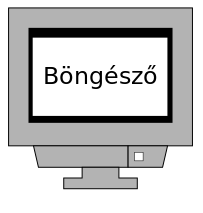
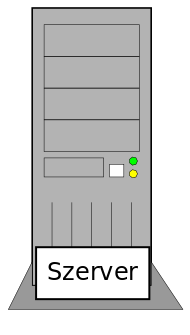
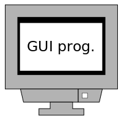

# Webprogramozás - JavaScript I

* **Szerző:** Sallai András
* Copyright (c) 2022, Sallai András
* Szerkesztve: 2022, 2023, 2024
* Licenc: [CC Attribution-Share Alike 4.0 International](https://creativecommons.org/licenses/by-sa/4.0/)
* Web: [https://szit.hu](https://szit.hu)

## Tartalomjegyzék

* [Tartalomjegyzék](#tartalomjegyzék)
* [A JavaScript nyelv](#a-javascript-nyelv)
* [Futtatás konzolon](#futtatás-konzolon)
* [Típusok](#típusok)
* [Változók](#változók)
* [Vezérlési szerkezetek](#vezérlési-szerkezetek)
* [Függvények](#függvények)
* [Szabályos kifejezések](#szabályos-kifejezések)
* [Objektumok és a DOM](#objektumok-és-a-dom)
* [A DOM elérése](#a-dom-elérése)
* [Elemek létrehozása a DOM-ban](#elemek-létrehozása-a-dom-ban)
* [Gyakorlat](#gyakorlat)
* [Linkek](#linkek)

## A JavaScript nyelv

1995-ben létrehoztak egy **Mocha** nevű nyelvet. Néha **Netscape Scripting Language** néven is említették. A C és Java nyelv is hatással volt rá, de azoktól független nyelv. A Mocha később **LiveScript**-re lett átnevezve, majd megint később lett **JavaScript**.

A Mocha óta a JavaScript sok változáson ment keresztül. Szintaktikája a Java nyelvhez hasonlóságot a JavaScript név felvétele idején kezdett mutatni.

### Történet

A JavaScriptet eredetileg csak böngészőben használtuk.



Később szerveroldalon is elkezdték használni.



Manapság GUI programokat is írunk JavaScriptben.



### ECMA szabvány

A JavaScript szabványt az ECMA szabványügyi szervezet tartja karban. Az ECMAScript szabványt a JavaScript (Netscape) és a JScript (Microsoft) nyelvek alapján hozták létre. A szabványosítást a Netscape vállalat kezdeményezte. Az első szabvány **1997**-ben jelent meg. 1998-ban és 1999-ben újabb verziója jelent meg a szabványnak. A következő, a negyedik szabványig hosszabb idő telt el, de nem készült el. Az ötödik szabvány 2011-ben jelent meg 5.1 verziószámmal. A hatódik szabvány 2016-ban jelent meg. Ettől a szabványtól évente jelent meg újabb [szabvány](https://www.ecma-international.org/publications-and-standards/standards/ecma-262/).

* 1 - 1997
* 2 - 1998
* 3 - 1999
* 4 - nem készült el
* 5 - 2009
* 5.1 - 2011
* 6 - 2015 - A class, let, const, for..of bevezetése
* 7 - 2016
* 8 - 2017
* 9 - 2018
* 10 - 2019
* 11 - 2020
* 12 - 2021
* 13 - 2022
* 14 - 2023

A szabványokra rövidítéssel szokás hivatkozni. Például:

| Verzió | Kiadás dátuma | Rövidítés |
|-|-|-|
| 6 | 2015 | ES6 |
| 7 | 2016 | ES7 |
| 8 | 2017 | ES8 |
| 9 | 2018 | ES9 |
| 10 | 2019 | ES10 |
| 11 | 2020 | ES11 |
| 12 | 2022 | ES12 |
| 13 | 2022 | ES13 |
| 14 | 2023 | ES14 |

## Futtatás konzolon

```javascript
console.log('működik');
```

Futtatás parancssorból node paranccsal:

```bash
node index.js
```

### JavaScript böngészőben

Készítenünk kell egy index.html nevű fájlt:

#### Inline

```html
<!DOCTYPE html>
<html lang="hu">
<head>
    <meta charset="utf-8">
    <title></title>
 
</head>
<body onload="alert('Helló Világ');">
 
</body>
</html>
```

#### Internal

```html
<!DOCTYPE html>
<html>
<head>
<title></title>
<script>
alert("Helló Világ");
</script>
 
</head>
<body>
 
</body>
</html>
```

#### External

```html
<!DOCTYPE html>
<html>
<head>
<title></title>
<script src="index.js"></script>
 
</head>
<body>
 
</body>
</html>
```

index.js fájl tartalma:

```javascript
alert("Helló Világ");
```

### A konzol a böngészőben

A böngészőkben a konzolt a fejlesztői felületen találjuk. A fejlesztői felületet általában a Ctrl+Shift+i billentyűkombinációval jeleníthetjük meg. Újabban az F12 is működik.

A böngésző konzoljára írás is:

```javascript
console.log('működik');
```

## Típusok

Elemi adattípusok:

* number
* string
* boolean
* null
* undefined

Összetett adattípusok:

* object
* function

A number típusban tárolhatók egész és valós számok egyaránt. Egész szám például:

```txt
30
```

Készítsünk egy index.js nevű fájlt a következő tartalommal:

```javascript
console.log(typeof 30);
```

Futtassuk a következő parancsot:

```cmd
node index.js
```

Valós szám:

```txt
35.7
```

Az index.js átírásával teszteljük valós szám vizsgálatát.

```javascript
console.log(typeof 35.7);
```

A string típusban karakterláncokat tárolhatunk:

```txt
"alma"
'körte'
`szilva`
```

Az index.js fájlban nézzük meg a karakterláncok típusát:

```javascript
console.log(typeof "alma");
```

A boolean típusok:

```txt
true
false
```

A null speciális mivel, azt jelenti nincs érték. Ennek típusa object. Az undefined is speciális és ez is a nem megadott értékre utal.

Az **object**, összetett adattípusok, vagyis több értéket is tartalmazhatnak. A JavaScriptben készíthetünk néhány típust, ami mind objektumként jelenik meg:

* object
* map
* set

```javascript
//object:
console.log(typeof {name: 'Pali', city: 'Pécs'});
```

A tömb, a map és a set is object típusként jelennek meg:

```javascript
console.log(typeof [2, 5, 3]);
console.log(typeof ['Pali', 'Tibi', 'Dani']);
```

A függvények function típusként jelennek meg:

```javascript
console.log(typeof function() {});
console.log(typeof (() => {}));
```

## Változók

A változókban eltárolhatjuk az értékeket. A változók bevezetésénél nem szükséges megadni a típust, csak a var vagy a let kulcsszót. A const is használható, de azzal állandót vezetünk be, nem változót. Ha a változót blokkon kívül vezetjük be, akkor a var-t szokás használni, ha blokkon belül vagyunk, használhatjuk a let kulcsszót.

```javascript
var a = 30;
var b = 'alma';
var c = "körte";
var d = `szilva`;
```

Változók blokkon belül:

```javascript
var csianl = () => {
    let a = 25;
}
```

Állandó:

```javascript
const a = document.getElementById('vmi');
const b = 25;
```

A typeof operátorral lekérdezhetők a változók típusai:

```javascript
var a = 30;
console.log(typeof a);
```

## Vezérlési szerkezetek

### Szelekció

#### Az if állítás

Az if utasítás lehetővé teszi utasítások végrehajtását feltételtől függően. Szintaktikája:

```javascript
if (feltétel) {
    // a szelekció törzse
}
```

Ha feltétel igaz, végrehajtódnak a ciklus törzs részébe írt utasítások. Ha feltétel hamis, nem történik semmit.

Egy konkrét példa:

```javascript
if (a > 5) {
    console.log('nagyobb');
}
```

Ha az "a" változó értéke nagyobb mint 5, akkor a konzolra íródik a 'nagyobb' szó.

Az előző programban, ha a feltétel hamis nem tettünk semmit. Ha szeretnénk hamis érték esetén is valamilyen tevékenységet végezni, írnunk kell egy úgynevezett "ellenben ágat", angolul else.

```javascript
if (a > 5) {
    console.log('nagyobb');
}else {
    console.log('kisebb');
}
```

A if() .. else if() szerkezettel többágú szelekció valósítható meg:

```javascript
if (num1 == 1) {
    console.log('egy');
}else if (num1 == 2) {
    console.log('kettő');
}else if (num1 == 3) {
    console.log('három')
}else {
    console.log('ismeretlen');
}
```

#### A switch utasítás

A JavaScript nyelv tartalmaz egy switch utasítást, amit többágú szelekcióra szoktunk használni. Egy változó tartalmát vizsgáljuk. Nézzük meg a következő példát:

```javascript
switch(num1) {
    case 1:
        console.log('egy');
        break;
    case 2:
        console.log('kettő');
        break;
    case 3:
        console.log('három');
        break;
    default:
        console.log('ismeretlen');
}
```

Ha num1 változóban "1" érték van, akkor az "egy" szó íródik a konzolra, ha "2" érték van benne, akkor "kettő" íródik a konzolra, és így tovább. Az egyes eseteket a "case" kulcsszó után kell írni. Ha az egyik esetnek sem felel meg a num1 változó, akkor a default utáni utasítások hajtódnak végre.

### Iteráció

#### A for ciklus

Növekményes ciklusokra a for() ciklus szokás használni. Növekményes ciklusok esetén általában tudjuk a ciklus hányszor fog ismétlődni.

A for ciklus fejrésze (zárójeles rész) 3 részbő áll. A három részt ";" pontosvesszővel választjuk el egymástól.

```txt
for( kezdőérték ; feltétel ; növekmény ) {
    //ciklus törzse, magja
}
```

Az iterációk számára általában szükség van egy ciklusváltozóra, amiben nyilvántartjuk éppen melyik ciklusnál járunk. Általában ez az "i" nevű változó szokott lenni. Ha ez már foglalt lenne, akkor leht "j". Ha az is fogalalt lehet a "k".

* Kezdőérték: a ciklus változó kezedeti értékének beállítása.
* Feltétel: a ciklus feltétele; meddig fusson.
* Növekmény: hogyan növeljük a ciklusváltozó értékét.

Lássunk egy ciklust, ami 5 ismétlést tartalmaz:

```javascript
for(let i=0; i<5; i++) {
    console.log(i);
}
```

#### Ciklus gyakorlat

Kiíratjuk a ciklusváltozó tartalmát, minden ciklusban.

Legyen egy példa, ahol a HTML oldalra hozunk létre újabb div elemeket.

index.html:

```html
<div id="doboz"></div>
//...
<script src="app.js"></script>
```

app.js:

```javascript
const doboz = document.querySelector('#doboz');
for(let i=0; i<5; i++) {
    const div = document.createElement('div');
    div.textContent = 'i: ' + i;
    doboz.append(div);
}
```

#### A while ciklus

A while ciklust akkor szokás használni, ha nem tudjuk hány ismétlésre van szükség.

A következő példában ugyan előre meg vannak adva tömb elemei, de tegyük fel, hogy nem tudjuk mekkora lesz ez.

```javascript
var numArray = [35, 22, 17, 48, 23];
var i=0;
while(i<numArray.length) {
    console.log(numArray[i]);
    i++;
}
```

#### While ciklus gyakorlat

Lássunk egy példát, ahol egy beviteli mezőben tetszőleges számú számot kérünk be a felhasználótól, vesszővel tagolva. Nem tudjuk a felhasználó hány számot fog beírni.

index.html:

```html
<div>
    <label for="nums">Számok vesszővel tagolva</label>
    <input type="text" id="nums">
</div>
<div>
    <button id="parseButton">Értelmezés</button>
</div>
```

app.js:

```javascript
const numsInput = document.querySelector('#nums');
const parseButton = document.querySelector('#parseButton');

parseButton.addEventListener('click', () => {
    startParse();
});

function startParse() {
    const nums = numsInput.value;
    const numArray = nums.split(',');
    const numsCount = numArray.length;
    let i = 0;
    while(i<numsCount) {
        console.log(numArray[i])
        i++;
    }
}
```

#### A do..while ciklus

A do..while ciklust olyan esetben hasznos, ha tudjuk, hogy a ciklus törzsét minimum egyszer biztosan végre kell hajtani.

Szintaxis:

```javascript
do {
    // a ciklus törzse
}while(feltétel)
```

#### A for in ciklus

A for in ciklust, objektumok esetén használhatjuk a kulcsok sorba vételére.

```javascript
for (key in object) {
    // A ciklus törzse, ami minden ciklusban lefut.
}
```

```javascript
const employee = {
    name: "Pali",
    city: "Szeged"
}
for (let key in employee) {
    console.log(employee[key]);
}
```

#### A for of ciklus

A for of ciklust, objektumokra nem használhatjuk. Tömbök bejárására találták ki.

```javascript
for (value of array1) {
    // A ciklus törzse, ami minden ciklusban lefut.
}
```

```javascript
const nums = [35, 27, 48, 12, 32]
for (let num of nums) {
    console.log(num);
}
```

## Függvények

### Névjegy

A függvényeket a "function" kulcsszóval vezetjük be. Ezt követi a függvény neve. A függvény törzse kapcsos zárójelek között, akár egyetlen sorban is szerepelhet.

```javascript
function nevjegy() {
    console.log('Nagy János');
}
```

A függvény neve meghatározható értékadással is:

```javascript
var nevjegy = function() {
    console.log('Nagy János');
}
```

Az egyenlőség jel jobb oldalán egy névtelen függvény van.

Névtelen függvényt másként is létrehozhatunk:

```javascript
var nevjegy = () => {
    console.log('Nagy János');
}
```

### Duplázó

Nézzünk egy olyan függvényt, ami paramétert fogad:

```javascript
function kiDupla(num) {
    console.log(num * 2);
}
```

Értékadással, ugyanaz:

```javascript
var kiDupla = function(num) {
    console.log(num * 2);
}
```

Lambda kifejezéssel:

```javascript
var kiDupla = (num) => {
    console.log(num * 2);
}
```

### Érték visszaadása

Az érték visszaadását a return utasítással határozzuk meg:

```javascript
var kerDupla = (num) => {
    eredmeny = num * 2;
    return eredmeny;
}
console.log(kerDupla(25))
```

## Szabályos kifejezések

A szabályos kifejezéseket perjel "/" karakterek közzé írjuk. Használható néhány függvényben. Például:

* replace()
* match()

Szóközök törlése:

```javascript
var noSpace = kar => {
    return kar.replace(/ /g, '')
}
```

További információk:

* [https://szit.hu/doku.php?id=oktatas:web:javascript:regex](https://szit.hu/doku.php?id=oktatas:web:javascript:regex)

## Objektumok és a DOM

A böngészőből elérhető néhány alapobjektum:

* window
* document
* console

A JavaScript így olyan környezetben fut, ahol eleve adott egy környezet, ami valójában a böngésző.

### A window

A window a böngészőablakot jelképezi. A window objektumon keresztül lekérdezhető a képernyőfelbontás, amiben/ahol a böngésző fut:

```javascript
console.log(window.screen.width)
console.log(window.screen.height)
```

A böngésző külső mérete, az ablak szegélyén kívül:

```javascript
console.log(window.outerHeight);
console.log(window.outerWidth);
```

A böngésző belső méretének lekérdezése, ahol weblap megjelenik.

```javascript
console.log(window.innerHeight);
console.log(window.innerWidth);
```

A Google Chrome 108-s verziója nem a tényleges méretet mutatja. Körülbelül 30%-kal kisebb méretet mutat. Firefoxban és Vivaldi böngészőkbe a valós méretek látszanak.

### A document

A document objektumon keresztül érhető el a weboldal, annak egyes részei.

A weboldal HTML elemekből épül fel. Az elemek egy hierarchiája egy fával ábrázolható. Ezt a hierarchikusan felépülő szerkezetet nevezzük DOM-nak. Angolul: Document Object Model.

A document objektumon keresztül elérhetjük a DOM egyes részeit.

```javascript
console.log(document.querySelector('.egy') )
```

### A console

A böngészők fejlesztői felületén elérhető rész. Általában F12 billentyűkombinációval nyitható meg a fejlesztői felület.

A console-ra a fejlesztő ír üzenetek saját maga számára, például a log() függvénnyel. Néhány függvény:

* log()
* error()
* warn()
* clear()

## A DOM elérése

### Egy elem elérése

Legyen egy egyszerű weblap:

```html
<div>
Lorem ipsum dolor sit amet.
<div>
```

Az első div elemre így hivatkozhatunk:

```javascript
document.querySelector('div');
```

Állítsunk be egy háttérszínt és egy szövegszínt:

```javascript
document.querySelector('div').style.backgroundColor = 'blue';
document.querySelector('div').style.color = 'white';
```

A rövidebb sorok érdekében egy állandóhoz szokás kötni a div elemet:

```javascript
const div = document.querySelector('div');
```

A szín beállítása ezek után:

```javascript
const div = document.querySelector('div');
div.style.backgroundColor = 'blue';
div.style.color = 'white';
```

Minden DOM elemnek van "style" tulajdonsága. A style-on keresztül hivatkozhatunk a CSS-ből már ismert tulajdonságokra. Ha egy tulajdonság a CSS-ben több részből áll és kötőjellel kötjük azokat egymáshoz, a JavaScriptben a részeket egybe kell írni, **lowerCamelCase** stílusban. Ahogy a példában láttuk háttérszínt beállítást. CSS-ben: background-color. JavaScriptben: backgroundColor. Az első szó mindig kisbetűs, a következő szavak nagybetűvel kezdődnek.

### Több elem elérése

```html
<div>
Lorem ipsum dolor sit amet.
<div>
<div>
Lorem ipsum dolor sit amet.
<div>
<div>
Lorem ipsum dolor sit amet.
<div>
```

A querySelector() függvény csak az első elemet éri el. Ha az összes elemet szeretnénk elérni, használjuk a querySelectorAll() függvényt. A querySelectorAll() egy tömböt ad vissza. Az első elem szövegméretének beállítása:

```javascript
const tomb = document.querySelectorAll('div');
tomb[0].style.fontSize = '20px';
```

Elemek bejárása:

```javascript
const tomb = document.querySelectorAll('div');
tomb.forEach(elem => {
    elem.style.backgroundColor = 'navy';
    elem.style.color = 'white';
    elem.style.padding = '5px';
})
```

### Osztályjelölők és azonosítók bejárása

```html
<div class="doboz">alma</div>
<div class="doboz">körte</div>
<div class="doboz">barac</div>

<button id="button1">Mehet</button>
```

```javascript
const divs = document.querySelectorAll('.doboz');
const button = document.querySelector('#button1');

button.addEventListener('click', () => {
    divs.forEach(div => {
        div.style.backgroundColor = 'yellow';
    });
});
```

### Űrlap bejárása

```html
<form>
    <input type="text">
    <input type="text">
    <input type="text">
    <button type="button">Mehet</button>
</form>
```

```javascript
const inputs = document.querySelectorAll('form input')
const button = document.querySelector('button')

button.addEventListener('click', () => {
    inputs.forEach(input => {
        console.log(input.value);
    })
})
```

## Elemek létrehozása a DOM-ban

Legyen egy ul elem, amiben li elemeket szeretnénk létrehozni:

```html
<ul id='lista'></ul>
```

```javascript
const lista = document.querySelector('#lista');
var li = document.createElement('li');
li.textContent = 'alma';
lista.append(li);
```

### Lista generálása

```javascript
const lista = document.querySelector('#lista');

const gyumolcsok = ['alma', 'körte', 'barack'];

gyumolcsok.forEach(gyumolcs => {
    var li = document.createElement('li');
    li.textContent = gyumolcs;
    lista.append(li);
});
```

### Hozzáadás listához

```javascript
const fruitList = document.querySelector('#fruitList');
const addButton = document.querySelector('#addButton');
var fruits = [];

addButton.addEventListener('click', () => {
    fruits.push('alma');
    fruitList.append(makeLi('alma'))
});

function makeLi(text) {
    var li = document.createElement('li');
    li.textContent = text;
    return li;
}
```

### Táblázat generálása

```html
<table id="empTable">
    <thead>
        <tr>
            <th>Név</th>
            <th>Település</th>
        </tr>
    </thead>
    <tbody></tbody>
</table>
```

```javascript
const tableBody = document.querySelector('#empTable tbody');
const addButton = document.querySelector('#addButton');
var employees = [
    { name: 'Pali', city: 'Szeged' },
    { name: 'Mari', city: 'Pécs' },
    { name: 'Kati', city: 'Szeged' }
];

employees.forEach(emp => {
    tableBody.append(makeRow(emp));
});

function makeRow(emp) {
    var tr = document.createElement('tr');
    var tdName = document.createElement('td');
    var tdCity = document.createElement('td');
    tdName.textContent = emp.name;
    tdCity.textContent = emp.city;
    tr.append(tdName);
    tr.append(tdCity);
    return tr;
}
```

## Gyakorlat

### Dolgozó adatai

```html
<!DOCTYPE html>
<html lang="hu">
<head>
    <meta charset="UTF-8">    
    <meta 
    name="viewport" 
    content="width=device-width, initial-scale=1.0">
    <title>Document</title>
</head>
<body>
    <h1>Dolgozó</h1>

    <label for="name">Név</label>
    <input type="text" id="name">
    <br>

    <label for="city">Település</label>
    <input type="text" id="city">
    <br>

    <label for="salary">Fizetés</label>
    <input type="text" id="salary">
    <br>

    <button id="addButton">Hozzáad</button>

    <script src="app.js"></script>
</body>
</html>
```

```javascript
'use strict';

const nameElem = document.querySelector('#name');
const cityElem = document.querySelector('#city');
const salaryElem = document.querySelector('#salary');
const addButton = document.querySelector('#addButton');

var dolgozo = {
    name: "névtelen",
    city: "ismeretelne",
    salary: 0
}

addButton.addEventListener('click', () => {
    console.log('működik');
    dolgozo.name = nameElem.value;
    dolgozo.city = cityElem.value;
    dolgozo.salary = Number(salaryElem.value);
    
    console.log(dolgozo.salary)
});
```

### Több dolgozó adata

```html
    <div class="container">
        <button id="startButton" 
        class="btn btn-primary mt-3">
            Start
        </button>
        <table class="table table-striped">
            <thead>
                <tr>
                    <th>Név</th>
                    <th>Település</th>
                    <th>Fizetés</th>
                </tr>
            </thead>
            <tbody id="tbody"></tbody>
        </table>
    </div>
```

```javascript
const tbody = document.querySelector("#tbody");
const startButton = document.querySelector("#startButton");

var employees = [
    { name: 'Erős Pál', city: 'Szeged', salary: 345 },
    { name: 'Lenge Irén', city: 'Szolnok', salary: 372 },
    { name: 'Teknős Béla', city: 'Szeged', salary: 397 },
    { name: 'Hentes Gábor', city: 'Szeged', salary: 323 }
];

startButton.addEventListener('click', () => {
    generateTable();
});

function generateTable() {
    employees.forEach(emp => {
        let tr = document.createElement('tr');
        let tdName = document.createElement('td');
        let tdCity = document.createElement('td');
        let tdSalary = document.createElement('td');
        tdName.textContent = emp.name;
        tdCity.textContent = emp.city;
        tdSalary.textContent = emp.salary;
        tbody.append(tr);
        tr.append(tdName);
        tr.append(tdCity);
        tr.append(tdSalary);
    });
}
```

### Törlés és szerkesztésgomb

```javascript
const tbody = document.querySelector("#tbody");
const addButton = document.querySelector("#addButton");

var employees = [
    { id: 1, name: 'Erős Pál', city: 'Szeged', salary: 345 },
    { id: 2, name: 'Lenge Irén', city: 'Szolnok', salary: 372 },
    { id: 3, name: 'Teknős Béla', city: 'Szeged', salary: 397 },
    { id: 4, name: 'Hentes Gábor', city: 'Szeged', salary: 323 }
];

addButton.addEventListener('click', () => {
   console.log('Hozzáadás árnyékeljárás') 
});

generateTable();

function generateTable() {
    employees.forEach(emp => {
        let tr = document.createElement('tr');
        let tdId = document.createElement('td');
        let tdName = document.createElement('td');
        let tdCity = document.createElement('td');
        let tdSalary = document.createElement('td');
        tdId.textContent = emp.id;
        tdName.textContent = emp.name;
        tdCity.textContent = emp.city;
        tdSalary.textContent = emp.salary;
        tbody.append(tr);
        tr.append(tdId);
        tr.append(tdName);
        tr.append(tdCity);
        tr.append(tdSalary);
        tr.append(generateDeleteCell(emp.id));
        tr.append(generateEditCell(emp));
    });
}

function generateDeleteCell(id) {
    let td = document.createElement('td');
    let delButton = document.createElement('button');
    delButton.textContent = 'Törlés';
    delButton.classList = 'btn btn-primary';
    delButton.addEventListener('click', deleteEvent);
    delButton.setAttribute('data-id', id);
    td.append(delButton);
    return td;
}

function deleteEvent(event) {
    let id = event.target.getAttribute('data-id');
    console.log(id);
}

function generateEditCell(emp) {
    let td = document.createElement('td');
    let delButton = document.createElement('button');
    delButton.textContent = 'Szerkesztés';
    delButton.classList = 'btn btn-primary';
    delButton.addEventListener('click', editEvent);
    delButton.setAttribute('data-id', emp.id);
    delButton.setAttribute('data-name', emp.name);
    delButton.setAttribute('data-city', emp.city);
    delButton.setAttribute('data-salary', emp.salary);
    td.append(delButton);
    return td;
}

function editEvent(event) {
    let id = event.target.getAttribute('data-id');
    let name = event.target.getAttribute('data-name');
    let city = event.target.getAttribute('data-city');
    let salary = event.target.getAttribute('data-salary');
    console.log(name);
}
```

## Linkek

* [https://www.geeksforgeeks.org/es6-classes/](https://www.geeksforgeeks.org/es6-classes/)
