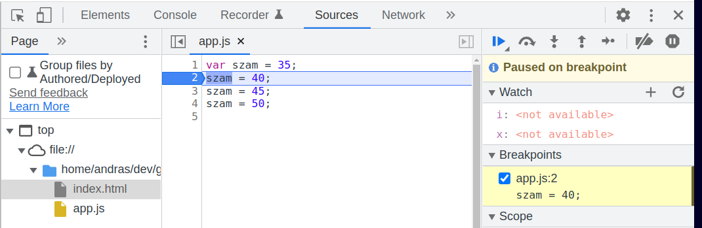

# Webprogramozás - JavaScript II

* **Szerző:** Sallai András
* Copyright (c) Sallai András, 2022
* Licenc: [CC Attribution-Share Alike 4.0 International](https://creativecommons.org/licenses/by-sa/4.0/)
* Web: [https://szit.hu](https://szit.hu)

## Tartalomjegyzék

* [Tartalomjegyzék](#tartalomjegyzék)
* [Objektumok és tömbök kezelése ES6](#objektumok-és-tömbök-kezelése-es6)
* [Hibakeresés JavaScriptben](#hibakeresés-javascriptben)
* [Szinkron futtatás](#szinkron-futtatás)
* [Promise](#promise)
* [JSON](#json)
* [REST API](#rest-api)
* [AJAX](#ajax)

## Objektumok és tömbök kezelése ES6

Az ES6 szabványban a JavaScript a class utasítással is bővült.
Létrehozhatunk osztályokat, ahogy azt az objektum orientált
nyelveknél azt megszoktuk.

```javascript
class Jarmu {
    constructor() {
        this.rendszam = 'ismeretlen';
        this.szin = 'ismeretlen';
        this.ar = 0;
    }
}

jarmu1 = new Jarmu();
jarmu1.rendszam = 'ABC-123';
console.log(jarmu1.rendszam);
```

### A for/of operátorok

Szintén az ES6 szabvánnyal került be for..of utasítás. A for..of ciklussal nem az indexet kapjuk egy sztring
vagy egy tömb esetén, hanem magát az értéket.

```javascript
let mondat = 'körte';

for(let ch of mondat) {
    console.log(ch);
}
```

```javascript
const nums = [32, 45, 18, 27];

for(const num of nums) {
    console.log(num);
}
```

## Hibakeresés JavaScriptben

A böngészők lehetővé teszik a hibakeresést a változók tartalmának megmutatásával.
Lássunk egy egyszerű JavaScript kódot:

```javascript
var szam = 35;
szam = 40;
szam = 45;
szam = 50;
```

A második sorba állítsunk be töréspontot egy kattintással. Az alábbi ábrán látható jelölés kerül a második sor elé.



A böngésző weblapján megjelenik egy léptetődoboz:


## Szinkron futtatás

A JavaScript kódok egymás után sorba futnak le, szinkronban.
Amíg az egyik le nem fut a következő várakozik.

```javascript
console.log('egy')
console.log('kettő')
console.log('három')
```

Néhány utasítás aszinkron módon fut le, vagyis nem sorba a többi kóddal. Ilyen a **setTimeout()** függvény. Lássunk egy kódot:

```javascript
function valami() {
    console.log('kettő')
}
console.log('egy');
setTimeout(valami, 5000);
console.log('három');
```

A futtatás eredménye:

```txt
egy
három
kettő
```

A három szót kiíró utasítás késleltetve hajtódik végre, aszinkron módon.

## Promise

A Promise segítségével aszinkron folyamatok eredményét várhatjuk és értékelhetjük.

Promise létrehozása:

```javascript
new Promise()
```

```javascript
var p = new Promise((resolve, reject) => {})
```

A Promise állapotai:

* pending - folyamatban van
* fulfilled - resolve - sikeres válasz
* rejected - sikertelen válasz

Tevékenység Promise-on belül:

```javascript
var p = new Promise((resolve, reject) => {
    let a = 30;
    if(a < 60) {
        resolve('Success');
    }else {
        reject('Failed');
    }
});
```

Használjuk a böngésző konzolját a futtatáshoz. Másoljuk be egyszerűen egy böngésző
konzoljára, majd nyomjunk **Enter**-t.

Most írjuk be a konzolba p-t majd nyomjunk Entert: **p<Enter>**

Az eredmény lekérdezése:

```javascript
p.then( res => {
    console.log('A then eredménye: ', res);
})
.catch(err => {
    console.log('A catch eredménye: ', err);
})
```

### A szállítás szimulációja

#### A Promise

Készítsünk egy Promise-t:

```javascript
const szallitas = new Promise((szallit, visszautasit) => {})
```

Másoljuk a böngésző konzoljára.

```console
szallitas
```

Ezt követően nyomjunk Entert: **Enter**

#### Szállítás

Most hívjuk meg a szallit() függvény, hogy sikerre fusson:

```javascript
const szallitas = new Promise((szallit, visszautasit) => {
    szallit();
});
```

Most futassuk sikertelenre:

```javascript
const szallitas = new Promise((szallit, visszautasit) => {
    visszautasit();
});
```

#### A szimuláció

```javascript
const szallitas = new Promise((szallit, visszautasit) => {
    const ran = Math.random();
    console.log(ran);
    if (ran > 0.5) {
        szallit();
    }
    visszautasit();
});
```

#### Késleltetés

```javascript
const szallitas = new Promise((szallitas, visszautasitas) => {
    setTimeout(()=> {
        const ran = Math.random();
        console.log(ran);
        if (ran > 0.5) {
            szallitas();
        }
        visszautasitas();
    }, 10000);
});
```

#### Az eredmény használata

```javascript
const szallitas = new Promise((szallit, visszautasit) => {
    setTimeout(()=> {
        const ran = Math.random();
        console.log(ran);
        if (ran > 0.5) {
            szallit();
        }
        visszautasit();
    }, 10000);
});

szallitas.then(() => {
    console.log('Szállítás történik');
})

szallitas.catch(() => {
    console.log('Hiba! Sikertelen szállítás!');
});
```

#### Használat függvényként

```javascript
const lekerSzallitas = () => {
    return new Promise((szallitas, visszautasitas) => {
        setTimeout(()=> {
            const ran = Math.random();
            console.log(ran);
            if (ran > 0.5) {
                szallitas();
            }
            visszautasitas();
        }, 10000);
    });
};

lekerSzallitas().then(() => {
    console.log('Szállítás történik');
});

lekerSzallitas().catch(() => {
    console.log('Hiba! Sikertelen szállítás!');
});
```

#### Vonatozás

```javascript
const lekerSzallitas = () => {
    return new Promise((szallitas, visszautasitas) => {
        setTimeout(()=> {
            const ran = Math.random();
            console.log(ran);
            if (ran > 0.5) {
                szallitas();
            }
            visszautasitas();
        }, 10000);
    });
};

lekerSzallitas().then(() => {
    console.log('Szállítás történik');
})
.catch(() => {
    console.log('Hiba! Sikertelen szállítás!');
});
```

#### Üzenetek Promise-ból

```javascript
const lekerSzallitas = () => {
    return new Promise((szallitas, visszautasitas) => {
        setTimeout(()=> {
            const ran = Math.random();
            console.log(ran);
            if (ran > 0.5) {
                szallitas('Siker');
            }
            visszautasitas('Hiba! A szállítás nem lehetséges');
        }, 10000);
    });
};

lekerSzallitas().then( res => {
    console.log(res);
})
.catch( res => {
    console.log(res);
});
```

Kövessük a témát a következő helyen:

## JSON

A **JSON** a **JavaScript Object Notation** rövidítése. Egy szabvány, amit adatok strukturálására szántak egy szöveges állományban.

Az RFC 4627 szabványban van leírva. A JSON állomány kiterjesztése:

* **.json**

MIME típusként:

* **application/json**

A JSON formátumot **Douglas Crockford** határozta meg és népszerűsítette.

```JSON
{
    "név": "Nagy János",
    "cím": {
        "település": "Szolnok",
        "közterület": "Fenyő utca 42."
    },
    "fizetés": 370
}
```

Ha készítettünk egy JSON struktúrát online is megvizsgálhatjuk érvényességét:

* [https://jsonlint.com/](https://jsonlint.com/)

Lásd még:

* [https://szit.hu/doku.php?id=oktatas:web:javascript:javascript_json](https://szit.hu/doku.php?id=oktatas:web:javascript:javascript_json)

## REST API

Szerveren létrehozott HTTP végpontok, amelyen keresztül elérhetők, kezelhetők egy adott adatbázis adatai.

A REST egy szoftverarchitektúra-stílus.

A REST alkalmazásnak következőnek kell megfeleljenek.

* kliens-szerver
* URL-n keresztül elérhető
* állapotmentes
* rétegelt rendszer
* gyorstárazható
* a szerver és a kliens között egységes interfész
* igényelt kód - a szervert kódot ad a kliensnek (JavaScript)

Lásd még:

* [https://szit.hu/doku.php?id=oktatas:web:rest_api:rest_api](https://szit.hu/doku.php?id=oktatas:web:rest_api:rest_api)

## AJAX

Az **AJAX** az **Asynchronous JavaScript and XML** rövidítése. AJAX esetén JavaScript segítségével hozunk el adatokat egy szerverről. Erre az **XMLHttpRequest** objektumot használjuk. Az adatok elhozhatók JSON, XML, HTML vagy szöveges formában.

A jelenlegi divat szerint REST API-t használunk, ahol a JSON a szokásos formátum.

Az ES6 szabványban megjelent a fetch() függvény, amit Promise alapon hoztak létre. A fetch függvénnyel is adatokat hozhatunk el szerverről JavaScript kóddal.

### JSON szerver

A json-server egy Node.js csomag, amivel helyettesítő a REST API szerver. Üzemeljük be a json-server-t.

Készítsünk Node.js projektet:

```cmd
mkdir api
cd api
npm init -y
```

Kapunk egy **package.json** fájlt. Keressük meg a scripts tulajdonságot, majd vegyünk fel egy újabb értéket:

```json
{
    "scripts": {
        "test": "echo \"Error: no test specified\" && exit 1",
        "start": "json-server --watch database.json"
    }
}
```

Telepítsük a json-server csomagot:

```cmd
npm install --save json-server
```

Készítsünk egy adatbázist:

```json
{
    "employees": [
        {
            "id": 1, 
            "name": "Csete Irén",
            "city": "Szeged",
            "salary": 342
        },
        { 
            "id": 2,
            "name": "Erős Áron",
            "city": "Szolnok",
            "salary": 395
        },
        { 
            "id": 3,
            "name": "Csont Ernő",
            "city": "Szeged",
            "salary": 348
        }
    ]
}
```

Indítsuk el a szervert:

```cmd
npm start
```

Szükségünk van egy REST API kliensre. Resen, Insomnia, Insomnium, Postman, httpie stb.

A httpie telepítése rendszergazdaként Chocolatey telepítésével:

```cmd
choco install httpie
```

Ellenőrizzük a httpie klienssel a REST API működését:

```cmd
http get http://localhost:8000/employees
```

Resen csomag használata:

```cmd
npm install --global resen
```

Ellenőrizzük a resen klienssel a REST API működését:

```cmd
res get http://localhost:8000/employees
```

### REST API elérése JavaScripttel

#### Az XMLHttpRequest használata

_app.js_:

```javascript
const url = 'http://localhost:3000/employees'
const xhr = new XMLHttpRequest()

xhr.open('GET', url, true)
xhr.onload = function() {
  if (xhr.status >= 200 && xhr.status < 300) {
    const employees = JSON.parse(xhr.responseText)
    console.log(employees)
  }else {
    console.error('Hiba! A lekérdezés sikertelen!')
    console.error('Státusz:', xhr.status)
  }
}

xhr.onerror = function() {
  console.error('Hálózati hiba!')
}

xhr.send()
```

#### A fetch használata

Írjunk egy JavaScript klienst:

```javascript
var host = 'http://localhost:8000/';
var endpoint = 'employees';
var url = host + endpoint;
fetch(url)
.then(response => response.json())
.then(result => console.log(result))
.catch(err => console.log(err));
```

Tegyük fel, hogy az src/app.js fájlba írtuk. A futtatás node paranccsal ekkor:

```cmd
node src/app.js
```

Az async és await használatával:

```javascript
(async () => {
    try {
        var host = 'http://localhost:8000/';
        var endpoint = 'employees';
        var url = host + endpoint;
        const response = await fetch(url);
        const result = await response.json();
        console.log(result);
    } catch (err) {
        console.log(err);
    }
})();
```

A fetch() függvényről lásd tovább:

* [https://szit.hu/doku.php?id=oktatas:web:javascript:javascript_fetch:egyszeru_lancolt](https://szit.hu/doku.php?id=oktatas:web:javascript:javascript_fetch:egyszeru_lancolt)
