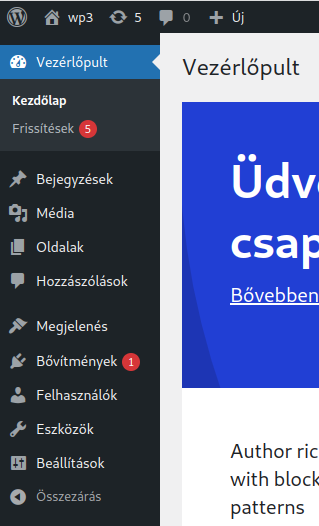

# Webprogramozás - CMS

* **Szerző:** Sallai András
* Copyright (c) Sallai András, 2022
* Licenc: [CC Attribution-Share Alike 4.0 International](https://creativecommons.org/licenses/by-sa/4.0/)
* Web: [https://szit.hu](https://szit.hu)

## Tartalomkezelő rendszerek

A CMS a Content Management System rövidítése, magyarul: Tatralomkezelő rendszer.

A CMS segítségével összeállíthatunk egy olyan webhelyet amely tartalma a webfejlesztéshez nem értő ember számára is kezelhető. Több mint 300 ilyen rendszer létezik.

A CMS renszerek általában a következőket nyújták:

* frissítés
* egyszerűen használható
* sablonok
* több felhasználó
* csoportkezelés
* tartalom kevés ismerettel kezelhető
* felhasználóbarát
* több nyelvű tartalom
* SEO eszközök
* hozzáférés szabályozása
* adatok tárolása és megosztása

Többféle célra létezik tartalomkezelő rendszer:

* blog
* híroldal
* kereskedelem
* vállalatirányítás
* közösségi portálok
* oktatás
* dokumentumkezelő

Néhány népszerű tartalomkezelő rendszer:

* WordPress (nyílt forráskód)
* Joomla! (nyílt forráskód)
* Drupal (nyílt forráskód)
* e107 (nyílt forráskód)
* Contao (nyílt forráskód)
* TYPO3 (nyílt forráskód; vállalatirányítás)
* Neos CMS (nyílt forráskód; vállalatirányítás)
* Grav (nyílt forráskód; fájlba ment)
* Bolt (nyílt forráskód)
* Pico (nyílt forráskód)
* Magnolie (Java alpú; biztonság terén jó; közösségi verziója nyílt)
* Liferay (nyílt forráskód)

## WordPress

A WordPress néhány perc alatt telepíthető varázsló segítségével. Kiterjedt közösség támogatja. Felhasználói felülete intuitív, a bővítmények egyszerűen telepíthetők.

Hátrányára írható a gyakori biztonsági frissítés, a beépülő modulok biztonsági hiányosságai.

Webhely: [https://hu.wordpress.org/](https://hu.wordpress.org/)

Kapcsolódó webhely: [https://wphu.org/](https://wphu.org/)

Kapunk egy ehhez hasonló fájlt:

* wordpress-6.1.1-hu_HU.zip

### Adatbázis

Létre kell hozni egy adatbázist. Legyen a példa kedvéért egy "ara" nevű adatbázis.

```sql
create database aranybt 
character set utf8
collate utf8_hungarian_ci;
```

```sql
grant all privileges
on ara.*
to ara@localhost
identified by 'titok';
```

### Webszerver

Használjuk a kipróbáláshoz az XAMPP-ot. A Wordpress-t csomagoljuk ki a következő helyre:

* C:\xampp\htdocs

A kicsomagolt könyvtárat átnevezhetjük például:

wp-re. A könyvtárszerkezet ekkor:

```txt
c:\
 `-xampp/
    `-htdocs/
        `-wp/
           |-wp-admin/
           |-wp-content/
           |-wp-includes/
           |-index.php
```

Indítsuk el az XAMPP Apache szerverét. A fenti esetben a wehelyet így érjük el:

```txt
http://localhost/wp/
```

Átirányítódik a setup.config.php fájlra:

```txt
http://localhost/wp/wp-admin/setup-config.php
```

Az alkalmazás itt tájékoztat, hogy szüksége van az adatbázisnévre, a felhasználónévre, jelszóra stb.

Az információkat a wp-config.php fájl létrehozásához használja. Nyomjuk meg a [Rajta!] gombot.

A következő űrlap jelenik meg:

```txt
Adatbázis neve       [         ]
Felhasználónév       [         ]
Jelszó               [         ]
Adatbázis kiszolgáló [localhost]
Tábla előtag         [wp_      ]

[ Küldés ]
```

### Információs

```txt
Honlap neve    [                  ]
Felhasználónév [                  ]
Jelszó         [BXE9&62a0GxEKDyg^e]
E-mail címe    [                  ]
Keresőmotor 
láthatóság     [ ] Gyenge jelszó engedélyezése

[WordPress telepítése]

```

### Az új WordPress



### A WordPress egységei

* Főoldal
* Bejegyzések (főoldalon)
* Többi oldal
* Hozzászólás
* Média
* Felhasználó
